# 29：计算汇总统计 📊


在本节课中，我们将要学习数据探索的第一步：如何计算和解读汇总统计量。汇总统计是描述数据集中变量特征的有效工具，尤其当数据集规模较大时，它比直接观察数据更为高效。

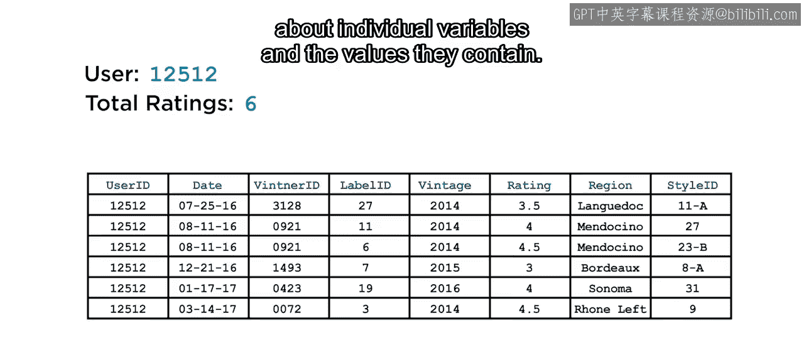

上一节我们介绍了数据探索的重要性，本节中我们来看看如何利用统计量来理解数据。

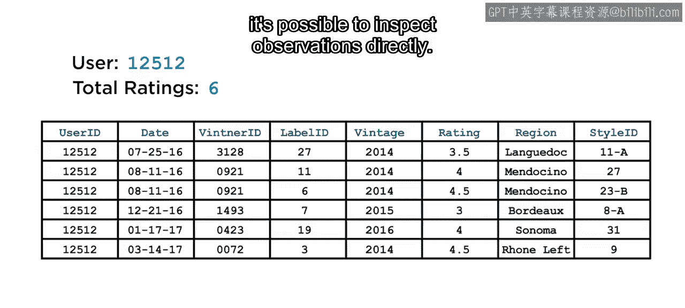

## 探索数据的第一步

探索数据时，第一步是了解各个变量及其包含的值。

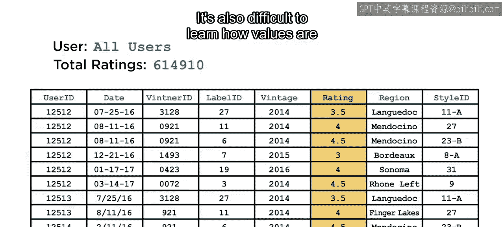

对于像下图所示的小型数据集，可以直接检查每个观测值。


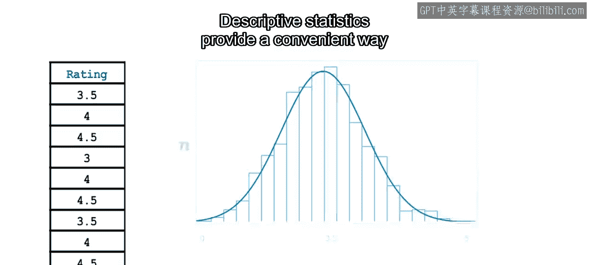

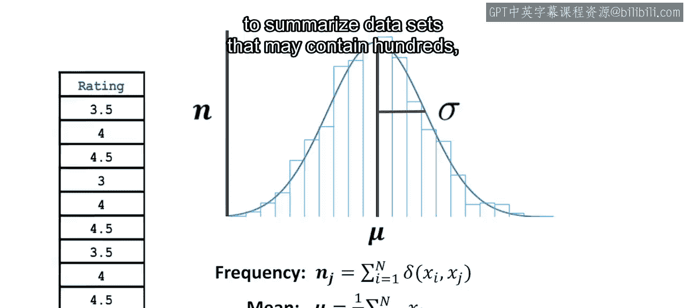

然而，对于更大的数据集，这种方法很快会变得不切实际。仅通过观察也很难了解数值的分布情况。


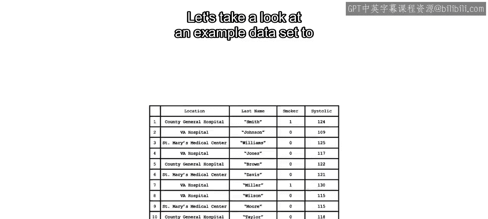

描述性统计提供了一种便捷的方法来总结可能包含数百、数千甚至数百万个值的数据集。

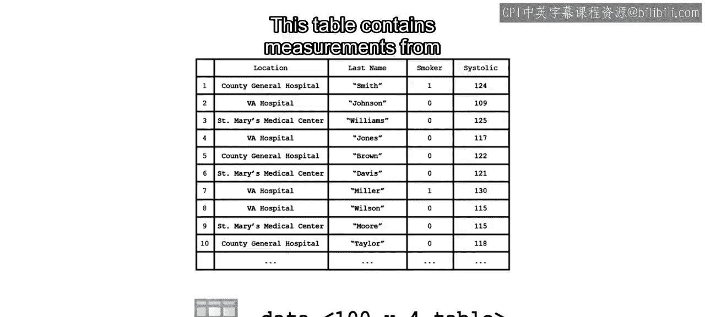

## 使用汇总统计描述数据

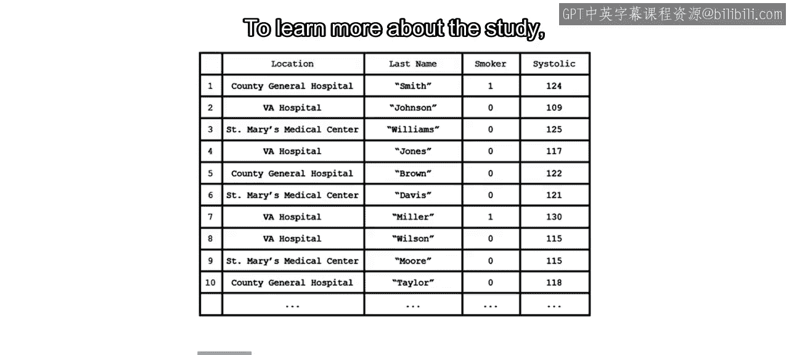

让我们通过一个示例数据集来了解如何使用统计量总结数据。


该表格包含了一项在多个地点进行的血压研究的测量数据。

为了更多地了解这项研究、参与者及其结果，你首先需要理解每个变量可能取哪些值，以及这些值是如何分布的。

你可以使用 `summary` 函数来快速获取每个变量的概览。`summary` 函数接受一个表格作为输入，并返回每个变量的名称、大小、数据类型以及关于其值的附加信息。

以下是 `summary` 函数的基本用法：
```matlab
summary(yourTable)
```

为每个变量显示的信息取决于其数据类型。例如，对于 `double` 类型的变量，会显示最小值、中位数和最大值。而对于分类变量和逻辑变量，则会显示频率计数。请注意，对于 `string` 类型的变量，不会提供额外的汇总信息，因为这种类型的汇总信息对于文本数据帮助不大。

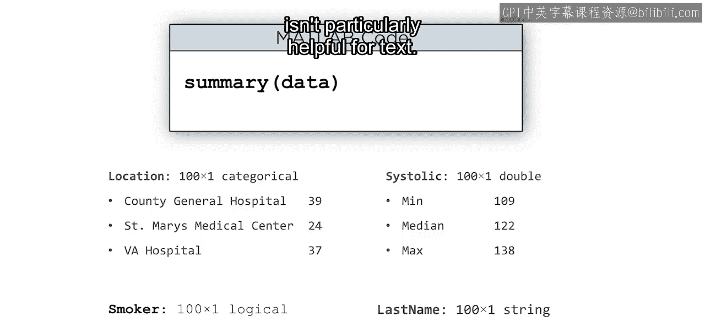


## 使用MATLAB描述性统计函数

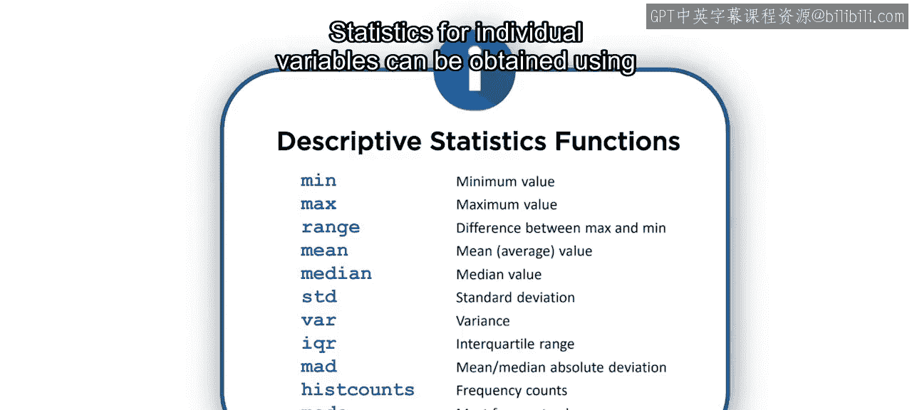

除了 `summary` 函数，还可以使用 MATLAB 中可用的描述性统计函数来获取单个变量的统计量。

例如，你可能想知道最常见的测试地点，这可以使用 `mode` 函数计算。


为了更好地理解血压读数，可以使用 `mean` 函数来查找平均值。然后使用 `std` 函数查看大多数值是接近平均值（对应较小的标准差），还是分散在更大的范围内（由较大的标准差表示）。

以下是计算平均值和标准差的公式与代码：
*   **平均值公式**：`mean = sum(values) / number_of_values`
*   **MATLAB代码**：`avgBP = mean(data.Systolic)`
*   **标准差公式**：`std = sqrt( sum( (values - mean)^2 ) / (number_of_values - 1) )`
*   **MATLAB代码**：`stdBP = std(data.Systolic)`

现在你已经掌握了描述此数据集中变量的必要工具。

## 处理缺失值

然而，你自己的数据有时可能包含缺失元素或 `NaN`（非数字）值。在计算某些统计量时，这些值会导致非数字结果。

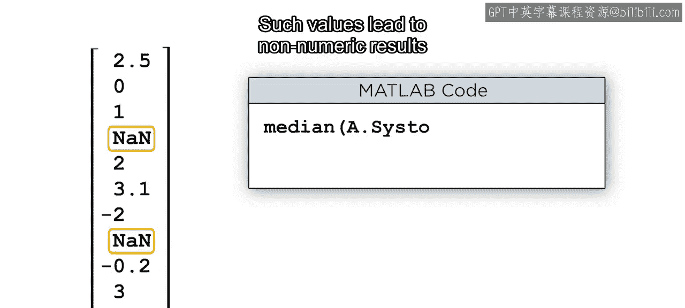

在这种情况下，调用这些函数时，可以包含 `‘omitnan’` 选项，以便在计算中仅包含数字元素。

以下是处理缺失值的代码示例：
```matlab
avgBP = mean(data.Systolic, ‘omitnan’)
stdBP = std(data.Systolic, ‘omitnan’)
```

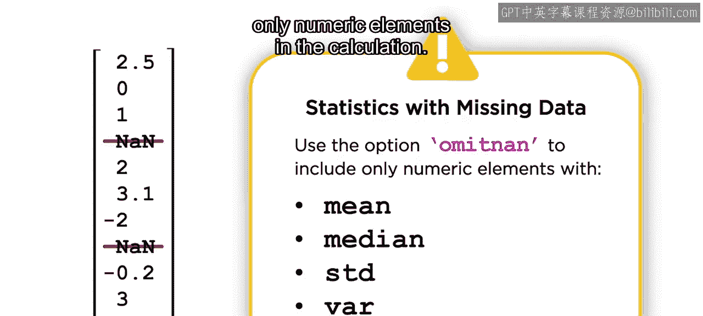


## 总结

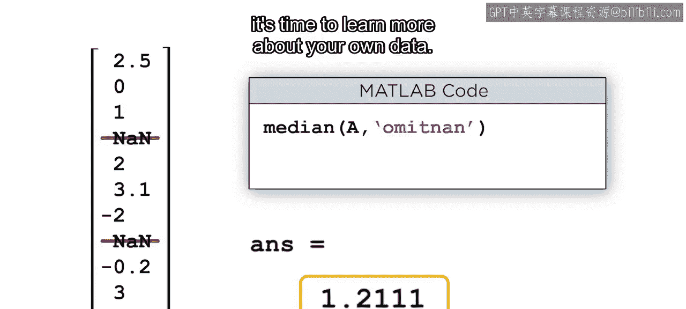

本节课中我们一起学习了数据探索的核心步骤——计算汇总统计。我们首先了解了直接观察数据的局限性，然后介绍了使用 `summary` 函数获取数据概览，以及使用 `mean`、`std`、`mode` 等函数计算具体统计量的方法。最后，我们还学习了如何处理数据中的缺失值，确保统计计算的准确性。现在，你已经知道如何使用 MATLAB 的描述性统计函数，是时候去深入了解你自己的数据了。