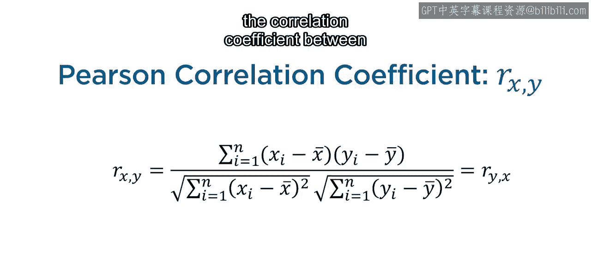
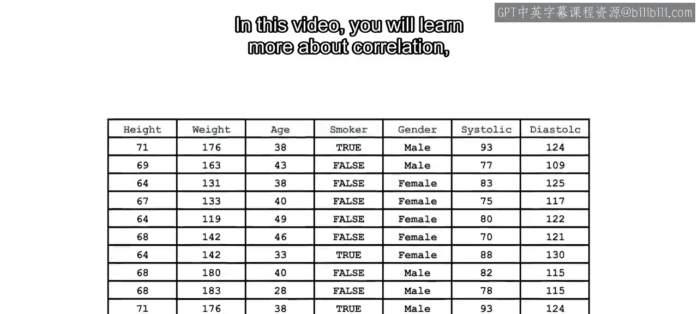
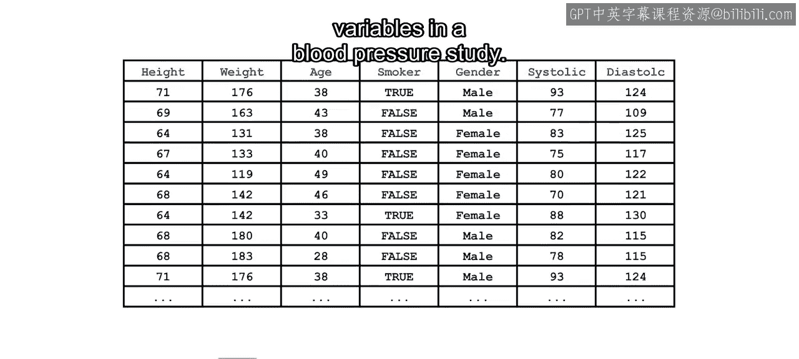
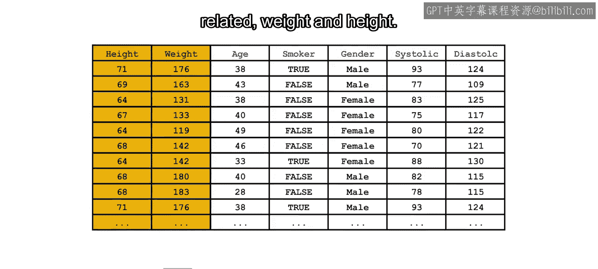
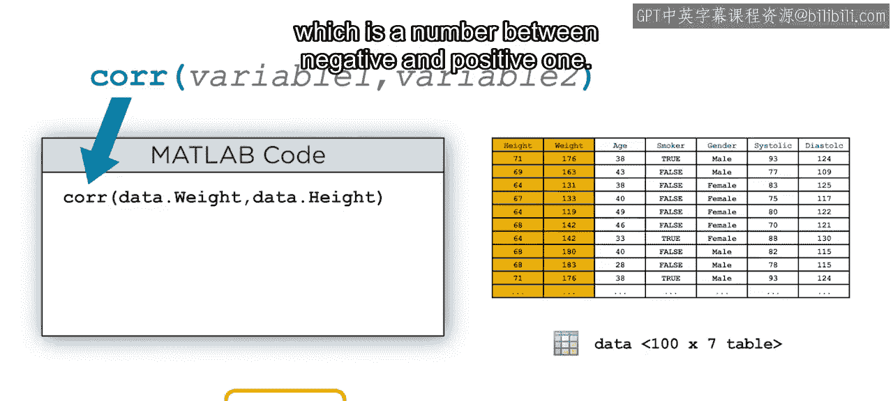
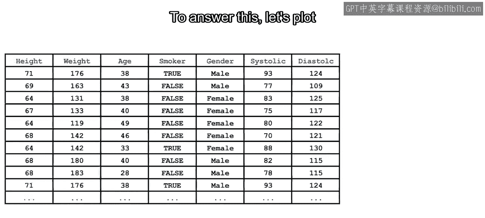
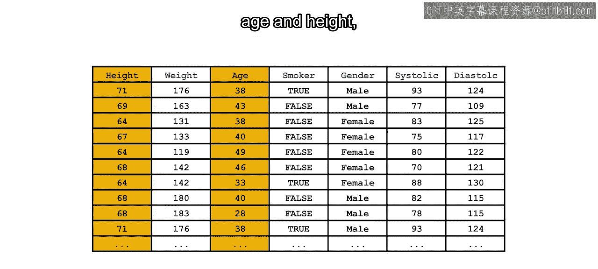
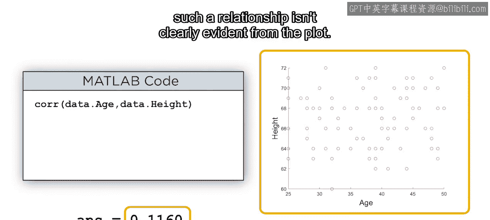
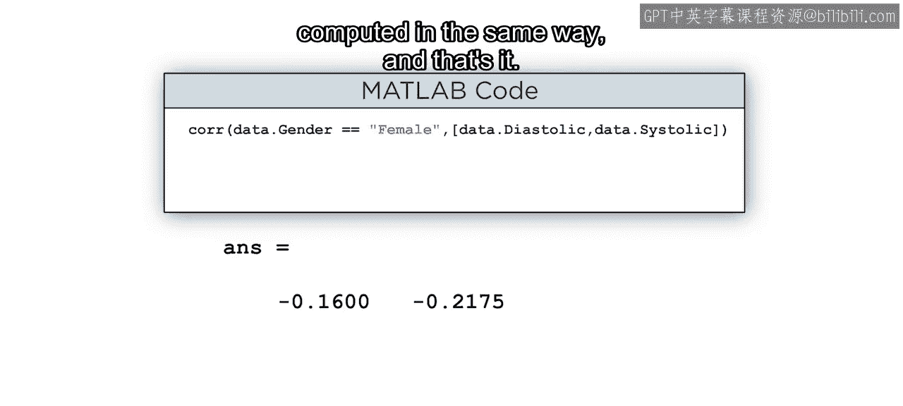

# 30：变量间相关性 🔍

在本节课中，我们将要学习如何量化评估数据集中的变量之间的关系，特别是通过计算相关系数来描述变量间的线性关联。

---

在对数据集中的单个变量有了充分理解之后，便可以开始寻找变量之间的关系。可视化图表有助于发现潜在的关系，但为了描述和比较这些关系，需要一种更定量的评估方法。其中一种方法是使用MATLAB计算两个变量之间的相关系数。

在本次视频中，我们将通过探索一项血压研究中的变量关系，来深入了解相关性。

---

### 理解相关系数

考虑两个预期相关的变量：体重和身高。

为了计算两个变量之间的相关性，可以使用 `corr` 函数。其输出结果是相关系数，这是一个介于 -1 和 +1 之间的数字。

相关系数的符号由变量是正相关还是负相关决定。正相关意味着一个变量的值增加时，另一个变量的对应值也倾向于增加。负相关则相反。当绘制体重与身高的关系图时，它们之间的正相关性是显而易见的。

了解了相关系数的符号后，其大小又说明了什么呢？

---

### 相关系数的大小与强度

为了回答这个问题，让我们绘制两个在成年人中可能无关的变量：年龄和身高。

然后计算它们的相关系数。虽然符号表明变量是正相关的，但从图中并不能清晰地看出这种关系。

这是因为系数的大小由相关性的强度决定。接近 -1 或 +1 的值表明变量之间存在强的线性关系。接近零的值则意味着关系较弱或根本没有关系。

比较两个图表，体重与身高之间更强的线性关系是明显的，而年龄与身高之间的类似关系则难以辨别。

需要注意的是，相关系数的大小与线性关系的斜率无关，只与数据点落在一条直线上的接近程度有关。例如，以下每个数据集的系数都是 +1 或 -1，尽管连接它们的直线斜率各不相同。

此外，小的相关系数仅表明线性关系较弱。强烈的非线性关系仍可能导致系数接近 0。

---

### 在MATLAB中应用相关性分析

现在我们已经学会了如何解释和计算相关系数，让我们用它来研究血压与年龄等其他变量之间的关系。

通过使用方括号将两个血压变量分组，可以同时计算与多个变量的相关性。这些变量之间似乎没有太多关系，这在图中得到了反映。

那么吸烟者与非吸烟者的血压情况如何呢？请注意，即使“吸烟者”是一个逻辑变量，`corr` 函数仍然可以计算其相关系数。输出结果指示了一个值得进一步探索的潜在关系。

血压与性别之间的相关性又如何呢？在将分类变量使用双等号运算符转换为逻辑值向量后，即可计算其相关系数。结果是血压与属于女性类别之间的相关性。其他类别的系数可以用同样的方式计算。

---

### 总结

本节课中，我们一起学习了如何利用相关系数来量化变量间的线性关系。我们探讨了相关系数的符号（正/负相关）和大小（关系强度）的含义，并演示了如何在MATLAB中使用 `corr` 函数进行计算。我们还了解到，相关系数仅衡量线性关系，对于非线性关系可能不敏感，并且可以应用于数值和分类变量。