# 31：访问数据子集 🎯

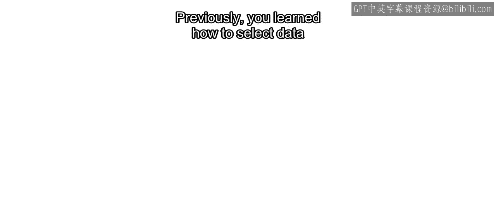

在本节课中，我们将学习如何访问和操作向量、矩阵及表格中的数据子集。我们将从基础的索引访问开始，逐步深入到如何根据条件筛选数据，以及如何替换数据集中的特定值。

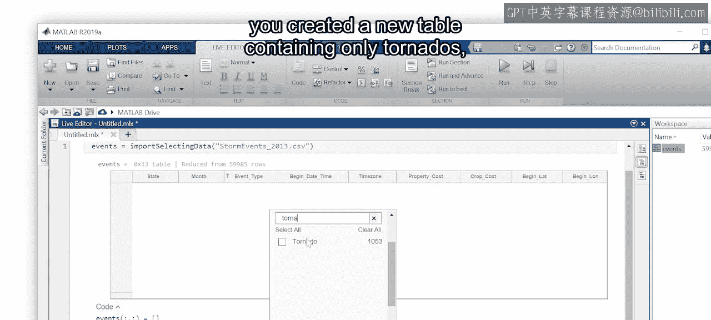

---

上一节我们介绍了如何在实时编辑器中通过交互方式选择数据。例如，通过点击事件类型变量，可以创建一个仅包含龙卷风数据的新表格。

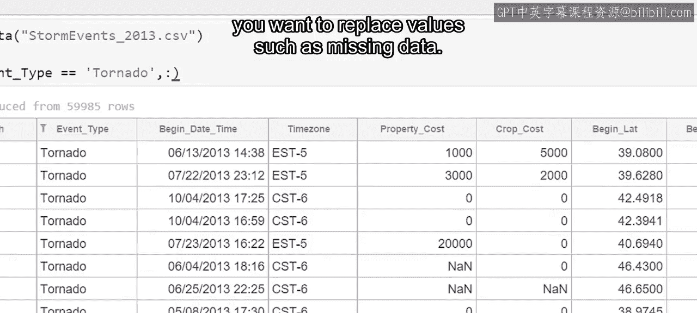

交互式工具通常是最好的起点，它们能预览选择结果并生成所需代码。然而，有些类型的选择无法通过交互方式完成。例如，如果你想替换缺失数据这类值，该怎么办？

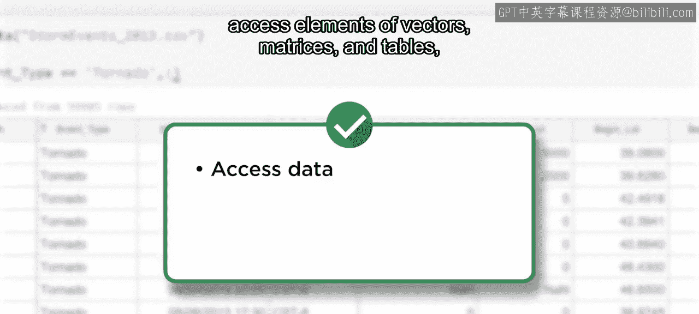

在本视频中，你将学习如何访问向量、矩阵和表格的元素。

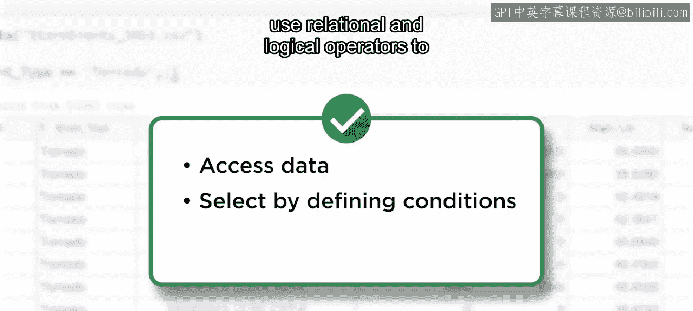

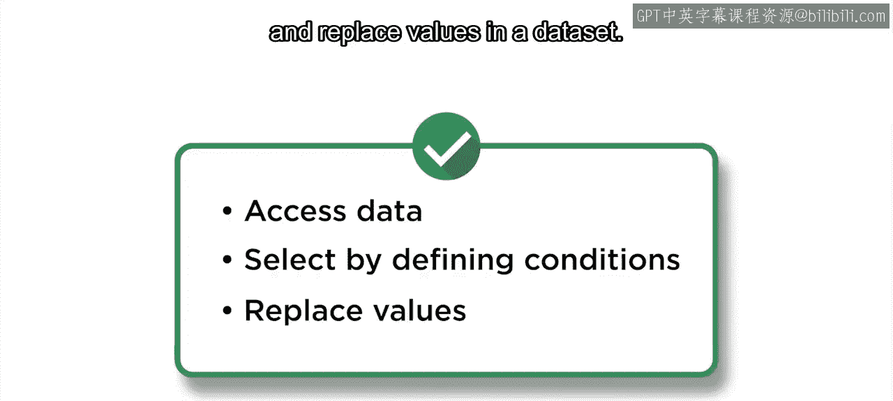

我们将使用关系和逻辑运算符，根据定义的条件来选择数据，并替换数据集中的值。

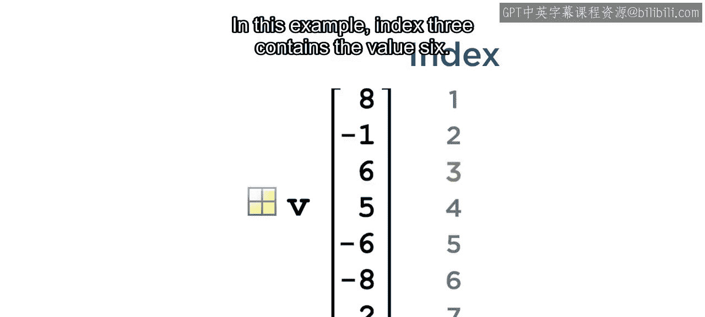

---

### 访问向量元素

让我们从向量开始。向量的元素按顺序编号，这个编号称为**索引**。例如，索引3可能包含值6。

要访问该元素，需键入变量名，并将索引括在括号内。例如：
```matlab
v = [1, 3, 6, 8, -2, -5];
element = v(3); % 返回 6
```
这里，新变量 `element` 的值为6。

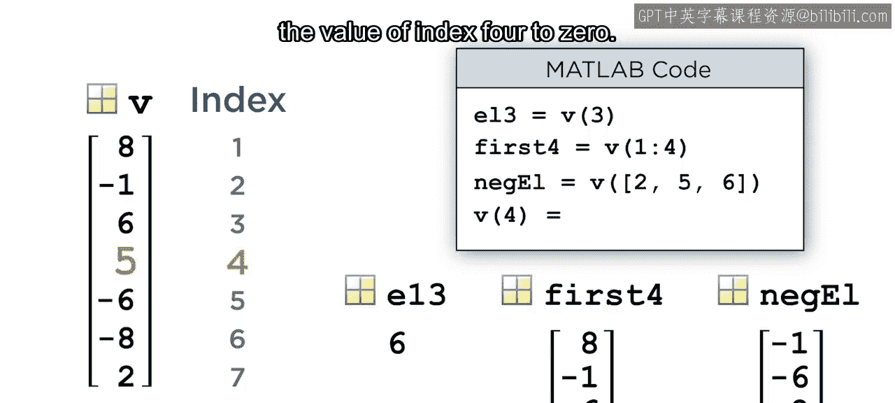

要访问多个元素，可以使用索引向量。以下命令返回向量的前四个元素：
```matlab
firstFour = v(1:4); % 返回 [1, 3, 6, 8]
```
而以下命令访问索引为2、5和6处的元素：
```matlab
selected = v([2, 5, 6]); % 返回 [3, -2, -5]
```
要更改现有变量的元素，需将变量放在等号左侧，并将要更改的元素放在括号内。例如，此命令将索引4的值更改为0：
```matlab
v(4) = 0; % v 变为 [1, 3, 6, 0, -2, -5]
```

---

### 访问矩阵与表格元素

现在我们已经了解了向量，但矩阵和表格有行和列。访问或更改值时，需要同时指定行索引和列索引。

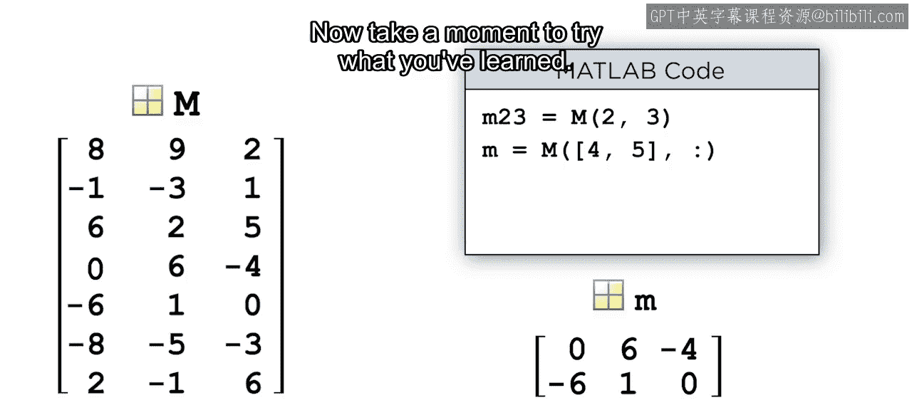

通过在行和列之间用逗号分隔来实现。例如，以下命令将第2行第3列的值赋给一个新变量：
```matlab
A = [1 2 3; 4 5 6; 7 8 9];
value = A(2, 3); % 返回 6
```
以下命令返回第4行和第5行的所有列：
```matlab
rows4and5 = A(4:5, :);
```
在处理矩阵和表格时，经常需要整行或整列数据。与其创建索引向量，可以使用一个快捷方式：使用冒号 `:` 来表示整行或整列。

现在，花点时间尝试一下你学到的内容。


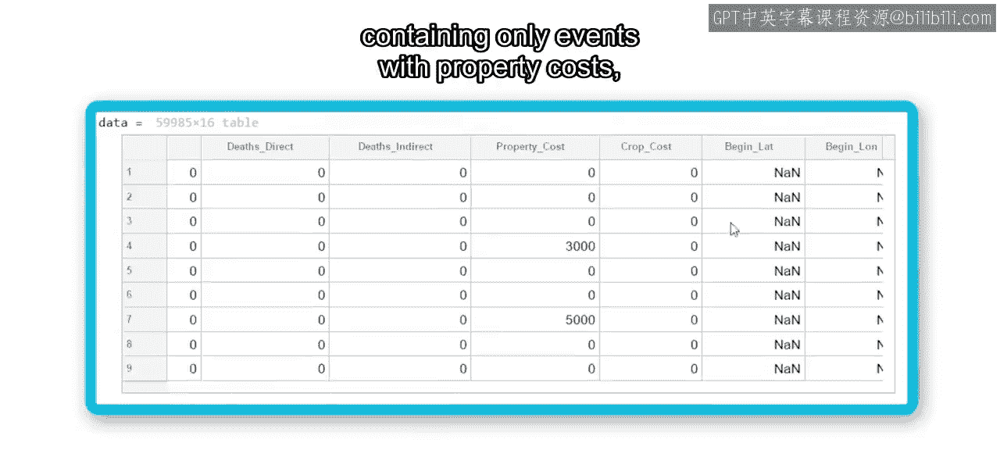

---

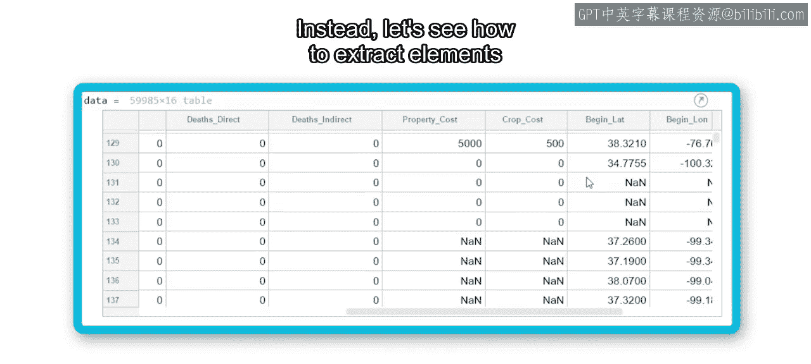

### 根据条件选择数据

以上介绍了如何通过索引访问向量、矩阵和表格的元素。那么，要创建一个仅包含造成财产损失事件的表格，难道需要手动浏览6万个观测值，并记下每个非零值的行索引吗？

开个玩笑，请永远不要尝试那样做。相反，让我们看看如何根据条件而非索引来提取元素。

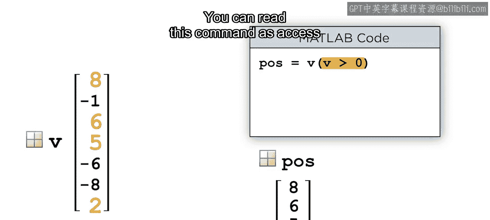


在解决大型表格的问题之前，让我们回到向量示例。假设你需要提取所有大于0的元素。

命令仍然使用变量名后跟括号。在括号内，指定一个条件来确定要选择哪些元素。你可以将此命令理解为：访问向量 `v` 中 `v > 0` 的元素。
```matlab
v = [1, 3, 6, 0, -2, -5];
positiveV = v(v > 0); % 返回 [1, 3, 6]
```

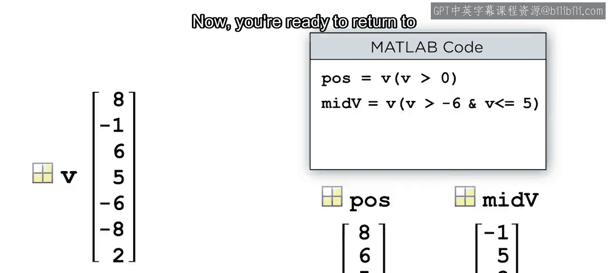

可以使用 `&`（与）和 `|`（或）运算符组合条件。例如，要获取 `v` 中大于-6且小于等于5的值，使用 `&` 运算符组合两个条件：
```matlab
conditionedV = v(v > -6 & v <= 5); % 返回 [1, 3, 0, -2, -5]
```
好的，现在你已经准备好回到天气数据并应用这些概念了。

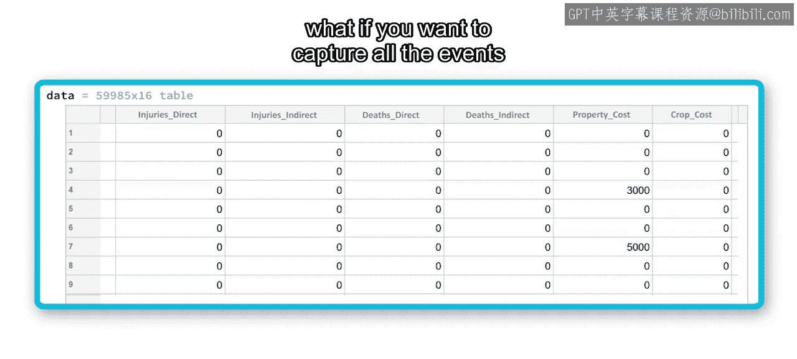

---

### 在表格数据中应用条件选择

数据集中区分了财产损失和作物损失。如果你想捕获所有造成任何损失的事件，该怎么办？

对两个变量使用交互式工具会生成如下代码。这段代码产生了一个表格，其中包含造成财产损失**和**作物损失的事件（注意是“与”的关系）。符合这些条件的事件只有649个。

要创建一个包含任何造成损失事件的新表格，你需要选择所有财产成本大于0**或**作物成本大于0的行。因为表格是二维的，你还需要指定要返回的列。这里，使用冒号 `:` 来返回所有列。
```matlab
% 假设 weatherData 是包含 ‘PropertyCost’ 和 ‘CropCost’ 列的表格
damageEvents = weatherData(weatherData.PropertyCost > 0 | weatherData.CropCost > 0, :);
```
完美，新表格捕获了所有造成损失的事件。请注意，当使用“或”条件时，包含的事件数量要多得多。

你可以看到，有些事件的财产或作物成本数据仍然缺失。处理缺失数据是本专业后续课程的一个重要概念。然而，由于造成损失的天气事件通常会被充分报告，缺失数据很可能意味着成本为零或接近零。

---

### 替换数据值

如何用定义的值替换缺失数据？

要为元素分配新值（而不是访问它），需要将你想要更改的变量放在等号左侧。在括号内，包含用于替换的元素或选择条件。在本例中，`ismissing` 函数将选择作物成本变量中所有缺失数据的元素。最后，在等号右侧添加替换值。

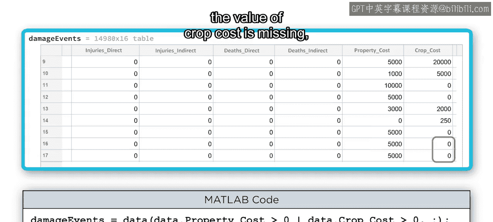

你可以将此命令理解为：对于变量 `CropCost` 中的所有元素，如果 `CropCost` 的值缺失，则将该元素替换为0。
```matlab
weatherData.CropCost(ismissing(weatherData.CropCost)) = 0;
```

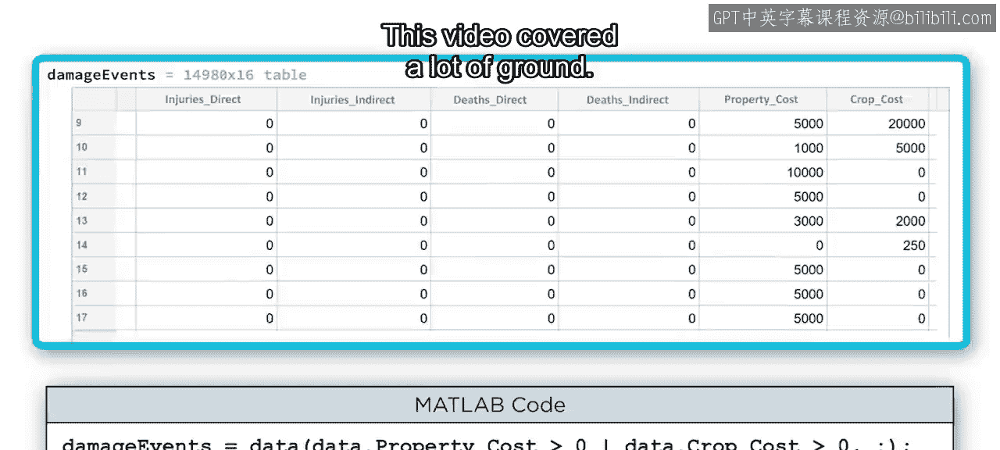

---

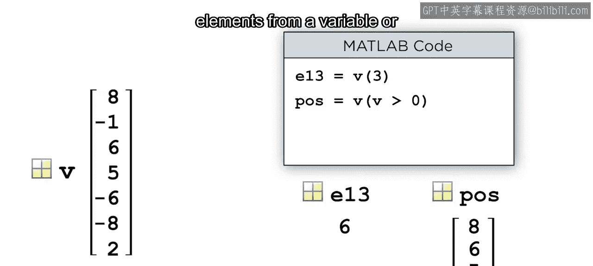

### 总结

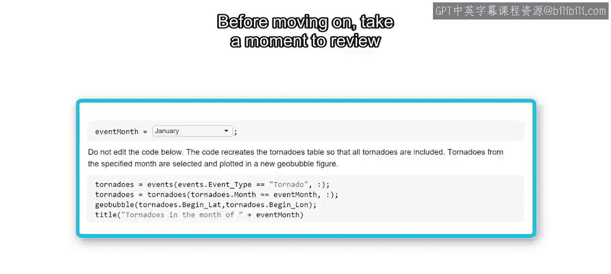

本节课涵盖了大量内容。你现在知道了如何访问向量、矩阵和表格的元素。你也可以定义条件，用于从变量中选择元素或替换变量中的元素。

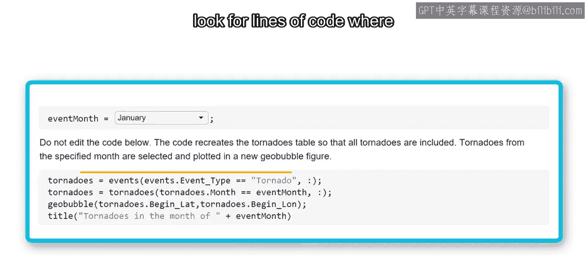


在继续之前，请花点时间回顾一下探索2013年龙卷风的实时脚本。寻找其中访问或修改数据的代码行，看看你是否能解读这些代码。