# 32：分类数据介绍 🎼


在本节课中，我们将要学习如何在MATLAB中处理分类数据。分类数据在日常生活和数据分析中无处不在，例如月份、事件类型等。掌握如何操作这类数据，对于数据探索和特征工程至关重要。

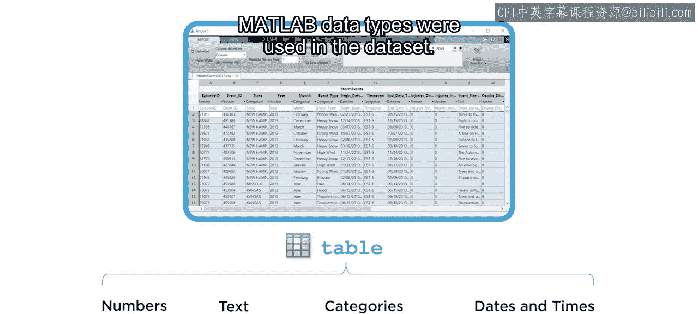

## 什么是分类数据？

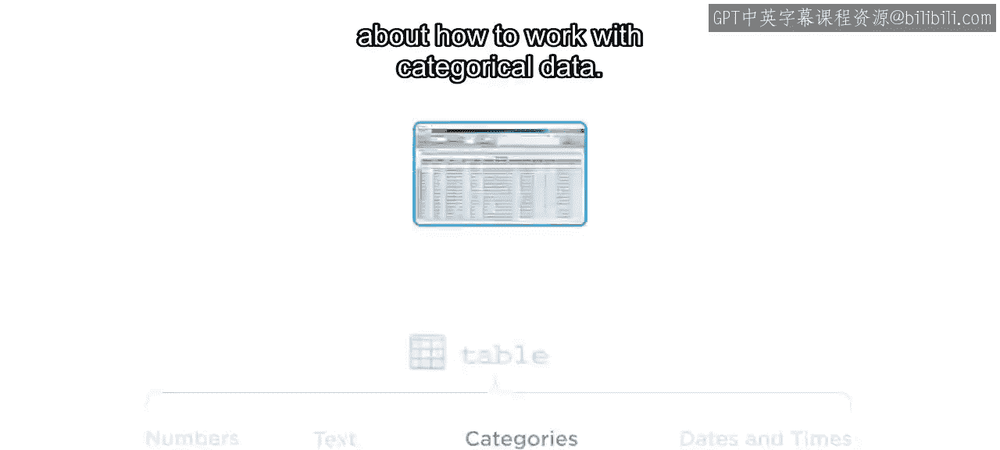

上一节我们介绍了MATLAB中的基本数据类型。本节中我们来看看什么是分类数据。

分类在日常生活中随处可见。当你醒来时，你的状态会从“睡眠”类别转变为“清醒”类别。你可以将整个人口划分为这两个组别。使用已知的标签（如“睡眠”、“清醒”）来表示这些状态，通常比使用数字更为方便。一个分类变量总是包含一个有限的、离散的类别集合。在这个例子中，只有两个类别：`asleep` 和 `awake`。

## 数据集中的分类变量

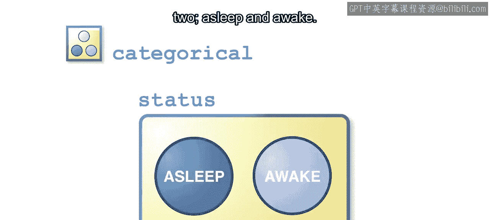

考虑之前导入的数据集。表格中的几个变量被作为分类变量导入。

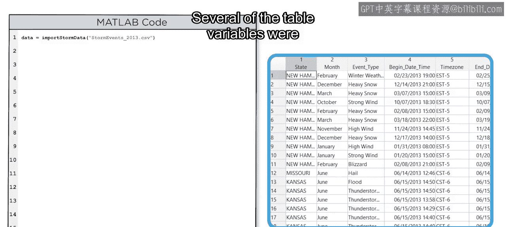

以下是数据集中包含分类变量的例子：
*   `state`（州）
*   `month`（月份）
*   `event type`（事件类型）

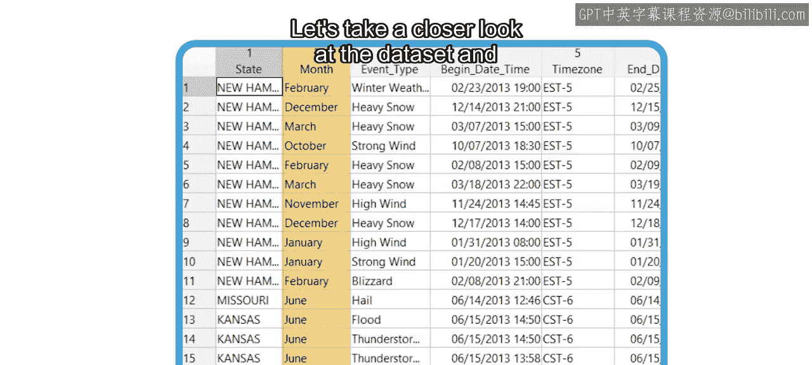

例如，`month` 中的每个值都将是十二个月份中的一个。让我们更仔细地查看数据，探索天气事件的季节性。

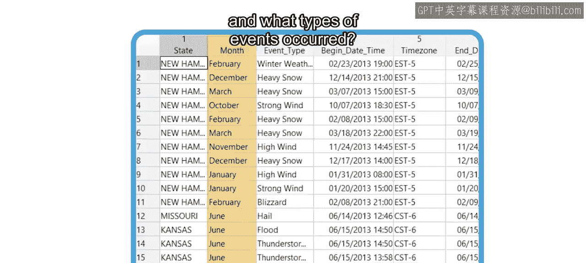

## 探索事件的季节性

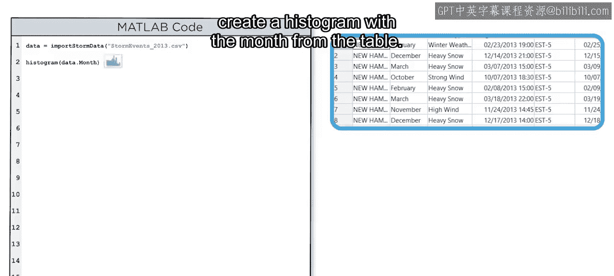

我们的目标是找出哪个月份发生的事件最多，以及发生了哪些类型的事件。

加载数据后，使用表格中的 `month` 变量创建一个直方图。

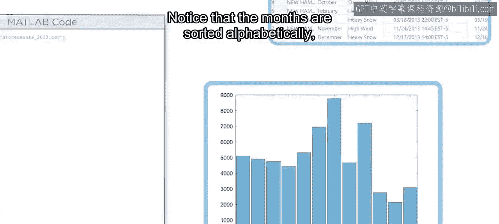

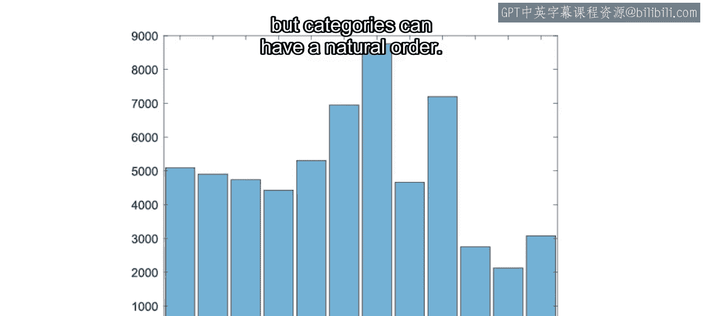

```matlab
histogram(data.month)
```

现在你可以看到按月份分组的事件数量。注意，月份默认按字母顺序排序。但类别可以有一个自然的顺序。为了看清季节性模式，你需要重新排序月份类别。

## 重新排序分类变量

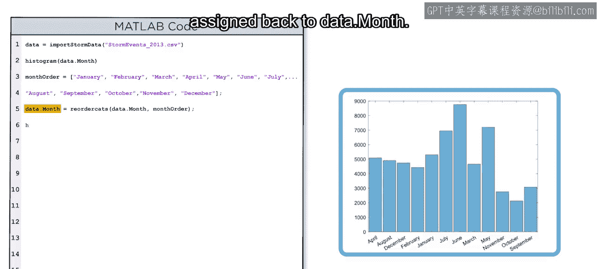

为此，首先创建一个字符串向量，其中包含按所需顺序排列的类别名称，然后调用 `reordercats` 函数。

```matlab
newOrder = ["Jan", "Feb", "Mar", "Apr", "May", "Jun", "Jul", "Aug", "Sep", "Oct", "Nov", "Dec"];
data.month = reordercats(data.month, newOrder);
```

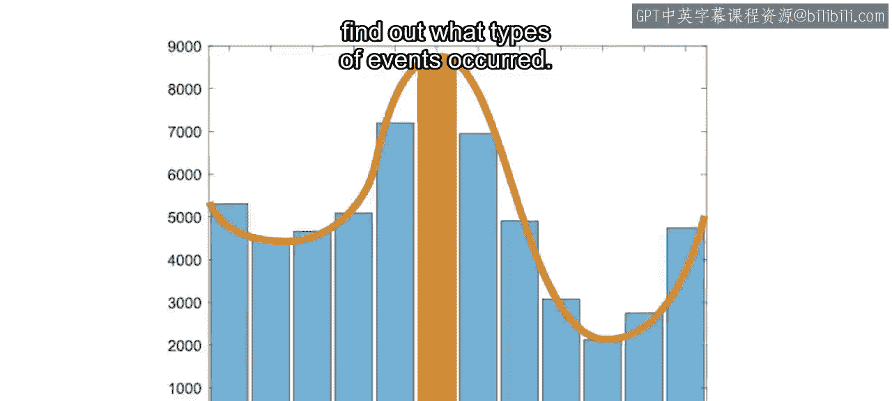

`reordercats` 的第一个输入是要重新排序的分类表格变量，第二个输入是定义顺序的向量。重新排序的结果被赋值回 `data.month`。

重新排序后的直方图现在反映了更改后的顺序，你可以清楚地看到季节性。最多的事件发生在夏季月份。那么在这些月份里发生了什么呢？

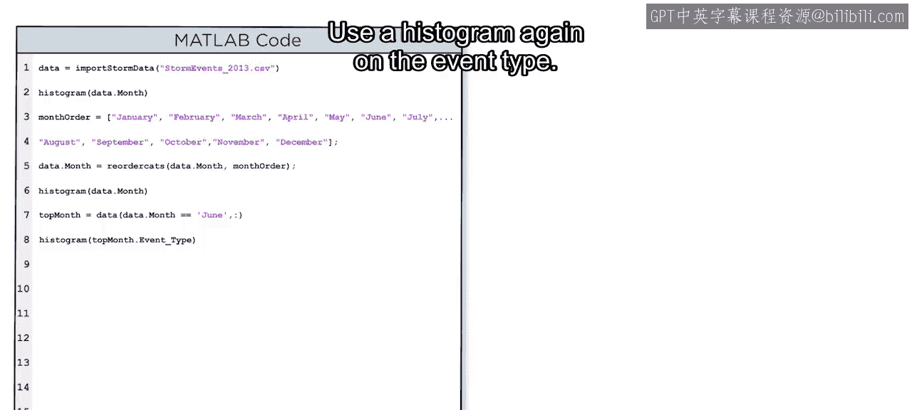

## 深入分析特定月份的数据

提取六月份的数据，并查看由分类数据类型表示的下一组数据——事件类型，以找出发生了哪些类型的事件。

通过点击表格并筛选 `month` 变量为“June”来选择六月的数据。复制生成的代码并粘贴到实时脚本中。然后重命名变量，以免覆盖原始数据集。

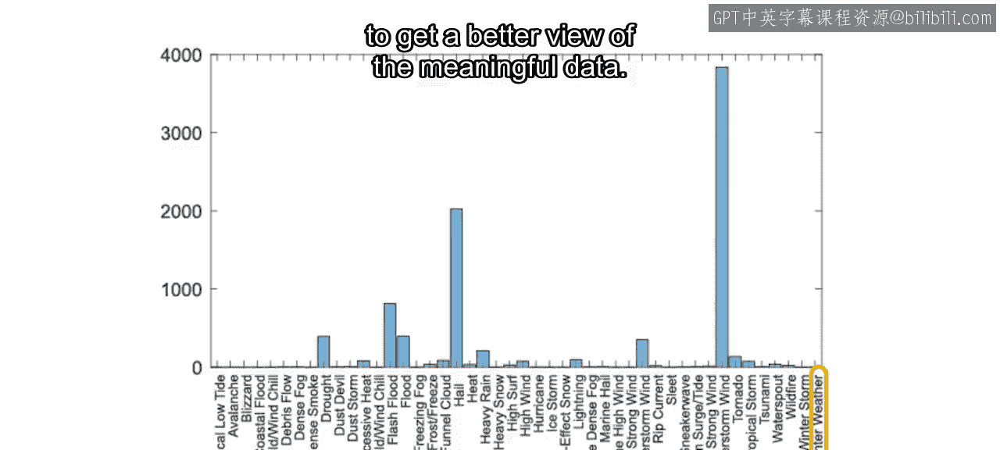

```matlab
data_June = data(data.month == ‘June‘, :);
```

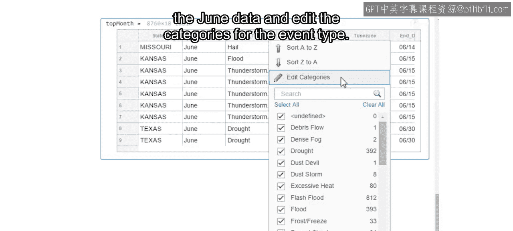

现在，让我们找出六月份发生了哪种天气事件。

## 分析特定月份的事件类型

再次在事件类型上使用直方图，它可以准确显示发生了多少次洪水或其他类型的事件。

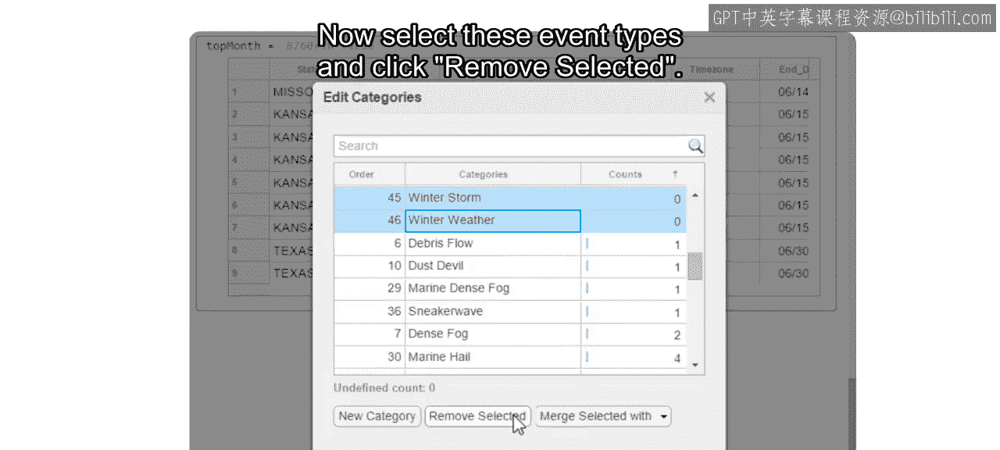

```matlab
histogram(data_June.eventType)
```

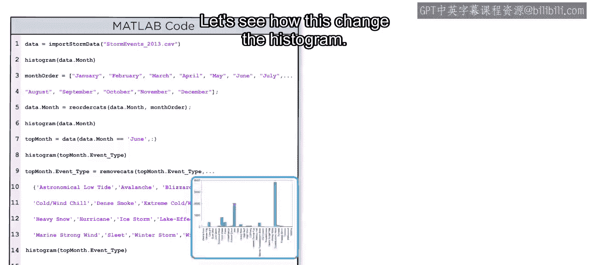

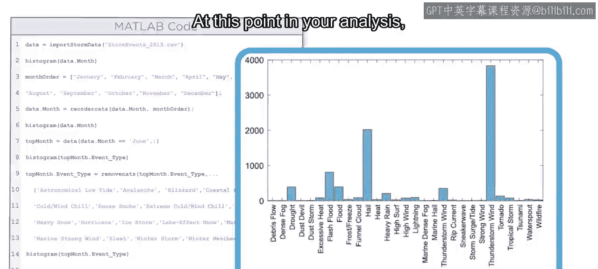

仔细观察，你会发现每个类别都被显示出来，包括那些事件数量为零的类别。例如，在北半球，你不会期望在六月发生冬季天气事件。因为类别太多，很难看清趋势。让我们移除未使用的类别，以便更好地查看有意义的数据。

选择包含六月数据的表格，并编辑 `eventType` 的类别。在这里，你可以看到它们的顺序、类别名称以及计数（代表每个事件发生了多少次）。通过点击 `Counts` 旁边的箭头按计数排序，所有计数为0的事件类型将首先列出。现在选择这些事件类型并点击“移除选定项”。然后点击“确定”，并将生成的代码复制到你的实时脚本中。

让我们看看这如何改变了直方图。现在你只看到了六月份实际发生的事件类型。

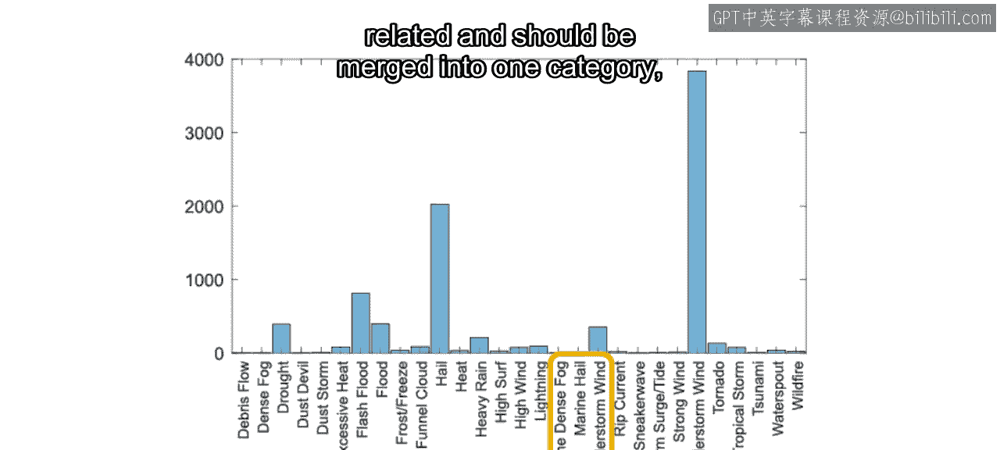

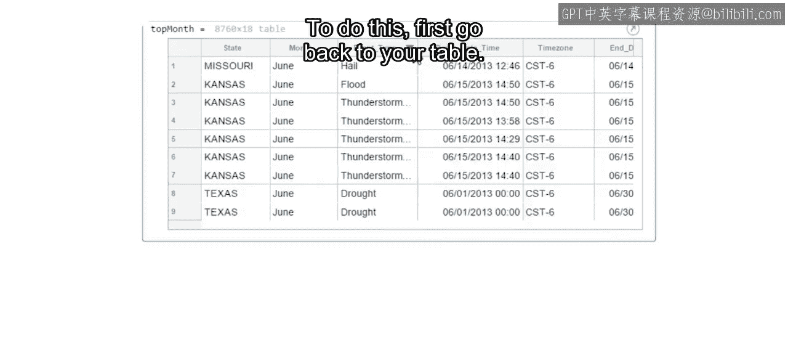

## 合并相关类别

在分析的这一点上，仔细查看你的类别是一个好主意。显示的类别是否准确地代表了你要回答的问题？记住，你正在识别发生的事件类型。有些事件类型密切相关，应该合并为一个类别，例如海洋事件。

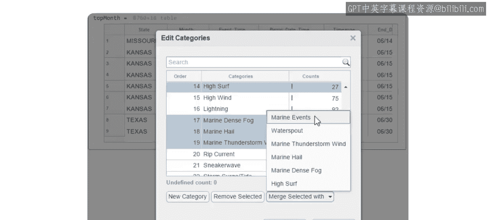

为此，首先回到你的表格。在那里，再次选择 `eventType` 来编辑类别。在这里，你添加一个新类别并将其命名为 `Marine Events`。接下来，将所有相关的海洋类型类别合并到新创建的 `Marine Events` 类别中。这个交互操作也会生成代码，你可以从中学习或直接复制到你的实时脚本中。

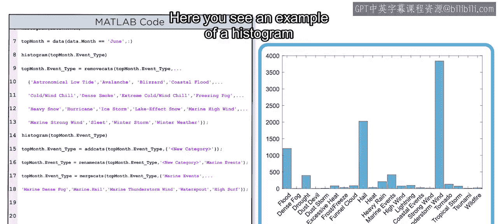

以下是合并额外类别后的直方图示例。对于这个数据集，`Thunderstorm Wind`（雷暴大风）是六月最常见的事件。你可以深入挖掘，回答关于雷暴地理分布的问题。

## 进一步分析与可视化

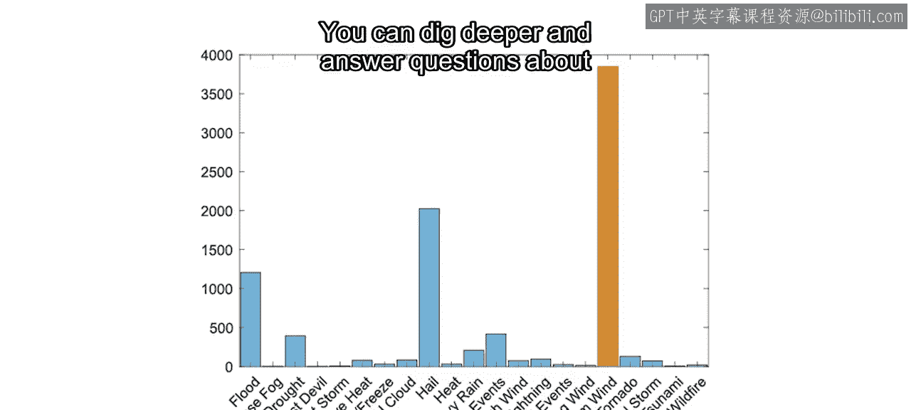

现在，你已经知道如何交互式地筛选 `eventType` 为 `Thunderstorm Wind`。使用生成的代码时，别忘了重命名变量，以免覆盖原始数据。

```matlab
data_June_Thunderstorm = data_June(data_June.eventType == ‘Thunderstorm Wind‘, :);
```

为了完成分析，使用包含六月雷暴的数据子集来可视化它们发生的位置。将子集的纬度和经度传递给 `geodensity` 函数，以查看风暴的分布。

```matlab
geodensityplot(data_June_Thunderstorm.latitude, data_June_Thunderstorm.longitude)
```

## 总结与展望

本节课中我们一起学习了如何使用分类数据。正如你所见，你可以使用类别来选择数据组，例如特定的月份或你感兴趣的事件类型。你也看到了从你的操作中自动生成的相应代码，这将帮助你学习相关函数并在以后将其重用于其他目的。利用这个机会，通过选择一个函数并按 `F1` 快速访问帮助，来了解更多关于你所用函数及其语法的信息。

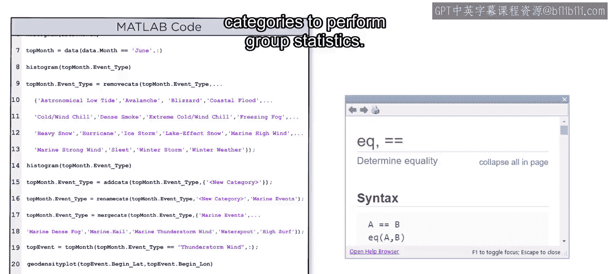

在接下来的视频中，你将迈出下一步，使用类别来执行分组统计。