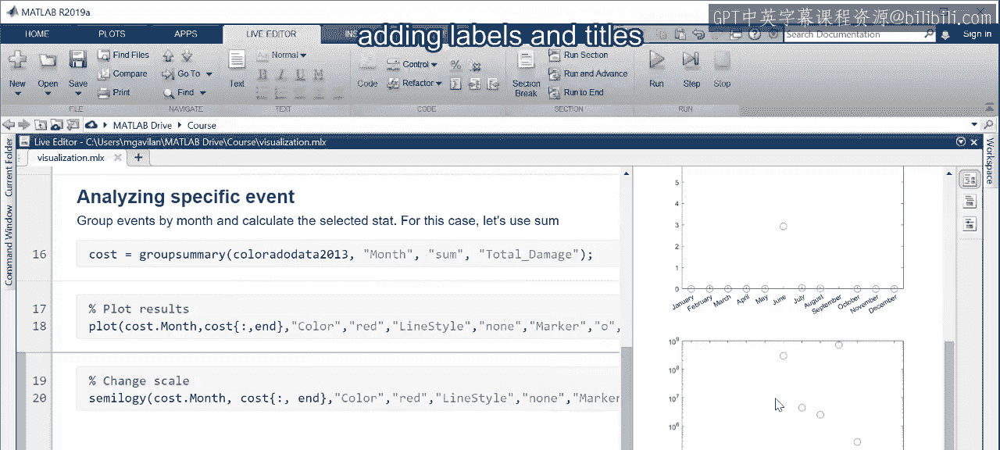
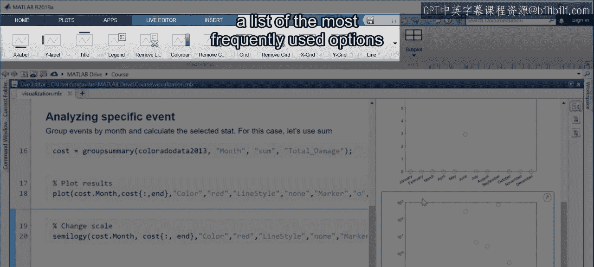
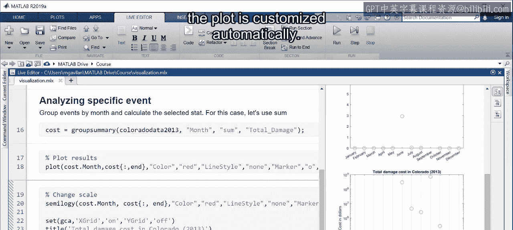
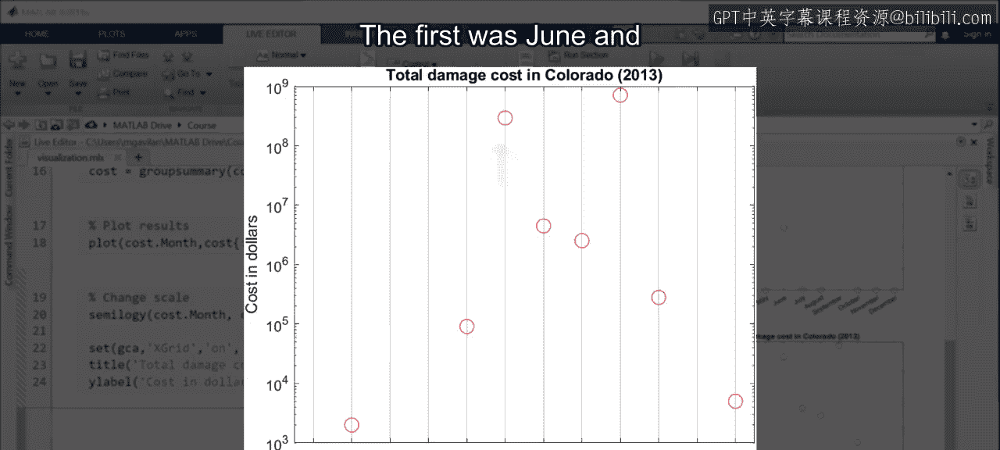
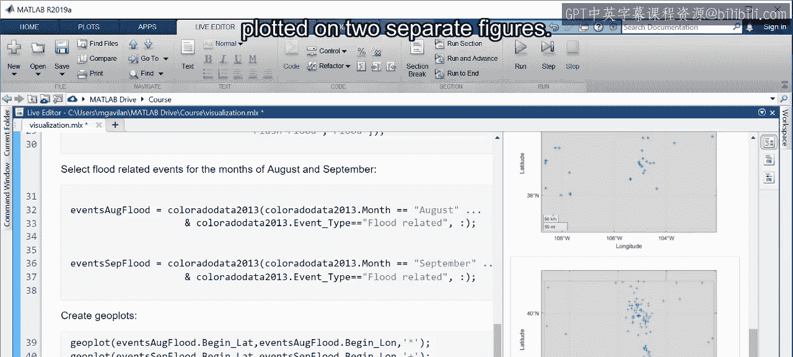
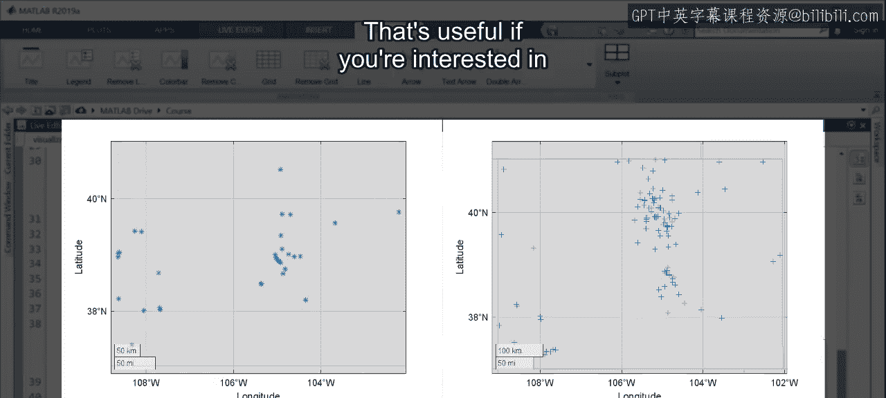
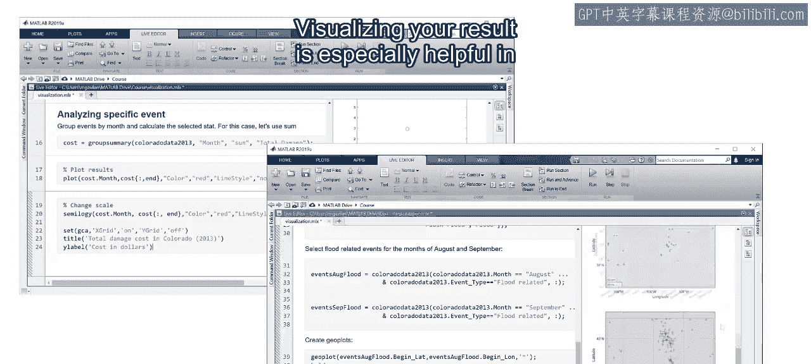

# 33：可视化结果 🎨

在本节课中，我们将学习如何利用MATLAB强大的可视化功能来理解分析结果，并向他人清晰地传达分析细节。我们将重点介绍如何自定义图表外观、添加注释，以及在同一图表中展示多个数据集。

## 概述

可视化是理解数据结果和向他人传达分析细节的有力工具。MATLAB提供了多种绘图函数，帮助您从数据中获得更多洞察。本节将指导您定制图表外观、添加标注，并学习在同一图表中展示多个数据集的方法。

## 探索特定事件：科罗拉多州洪水

我们一直在使用特定年份的气象数据。现在，让我们选取一个州，详细查看那里发生的主要天气事件。科罗拉多州在2013年9月发生了历史性的洪水，可视化将帮助我们深入了解这一事件。

在导入数据并计算总损失后，您可以按月对事件进行分组，并计算每个月的总损失成本。如果绘制总和与月份的关系图，默认的线型是蓝色实线，这暗示数据是连续的，尽管它实际上是离散的。对于此类数据，显示单独的数据点更为合适。

## 自定义图表外观

要更改图表样式，您需要向 `plot` 函数提供额外的参数。重新输入 `plot` 命令，您会看到关于绘制额外数据和提供绘图选项的建议。

以下是自定义图表的关键步骤：

*   **更改颜色**： 提供属性名称（如 `‘Color’`）后跟自定义值（如 `‘red’`）。
*   **移除线条**： 设置 `‘LineStyle’` 属性为 `‘none’`。
*   **更改标记**： 设置 `‘Marker’` 属性（例如 `‘o’` 代表圆圈）。
*   **调整标记大小**： 设置 `‘MarkerSize’` 属性。

运行命令后，您将看到更新后的图表。然而，当前图表暗示一年中只有两个月有非零损失成本，且Y轴数值范围很大。为了更好地观察数值变化，我们需要以不同的方式绘制这些值。

## 选择合适的图表类型

对于少数值远大于其他值的情况，您可以探索其他类型的图表。例如，可以对Y轴使用半对数坐标图。这样，您就能看到大多数值确实不为零。

`semi logy` 函数的可定制属性与 `plot` 函数相同，但您可以查看文档以获取完整的属性名称和值列表。

## 添加标签和标题

除了自定义外观，添加标签和标题可以使图表更易于解读。点击图表，在“图形”选项卡中会出现最常用的选项列表。展开视图后，您可以添加标题、坐标轴标签，并添加X轴网格线以便更容易识别每个点对应的月份。

请注意，每次自定义操作后，相应的代码都会出现在图表下方。记得点击“更新代码”，以便自动将新命令包含到您现有的代码中。下次运行脚本时，图表将自动应用这些自定义设置。

这个图表更清楚地表明，科罗拉多州有两个月在天气事件造成的损失成本方面非常严重：第一个是六月，第二个是发生洪水的九月。

## 在同一图表中比较多个数据集

为了更详细地检查受洪水影响的区域，我们可以查看洪水事件报告的地点。为了在上下文中理解这些事件，让我们比较九月和八月报告的洪水事件位置。

要实现这一点，首先将所有与洪水相关的事件合并到一个类别中，并确保使用相关月份的数据。运行代码生成地理位置可视化后，数据会绘制在两个独立的图形上。八月的洪水事件分散在全州，而九月的大部分洪水事件则集中在特定区域。

两个图表的坐标轴范围都根据数据自动缩放。如果您想通过在同一坐标轴上绘制它们来比较这两个数据集，可以使用 `hold` 命令。

在第一个 `plot` 命令后输入 `hold on`，表示后续的绘图应在同一坐标轴上进行。在最后一个 `plot` 命令后添加 `hold off`。再次点击运行，这次两个图表将出现在同一个图形中，并且X和Y轴的范围已调整为适应两个数据集。

多个数据集会自动以不同颜色绘制，但和之前一样，您可以自定义属性。图表准备好后，您还可以使用图例来区分数据集。点击图形，然后在“图形”选项卡中点击“图例”按钮。点击标签可以为其指定更具描述性的名称。图例中的键按绘图顺序从第一个到最后一个排列。完成后，使用“更新代码”生成包含这些更改的代码。

## 添加地理背景

您还可以更进一步，添加底图以包含地形信息。可以观察到，九月报告的大多数洪水事件都集中在这个山区系统附近。因此，该地区2013年科罗拉多州洪水事件也被称为“2013年科罗拉多州前岭洪水”。我们仅仅通过可视化数据就发现了这一联系。

## 总结

本节课中，我们一起学习了如何通过自定义可视化来洞察数据。您可以定制图表的众多属性，添加标题、标签等。当需要进行比较时，您还可以在同一图表中包含多个数据集。可视化结果在探索阶段尤其有用，并且在您开始向他人传达结果时也至关重要。