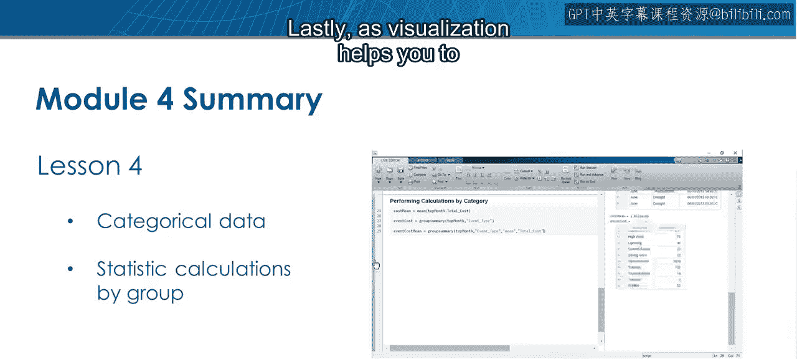
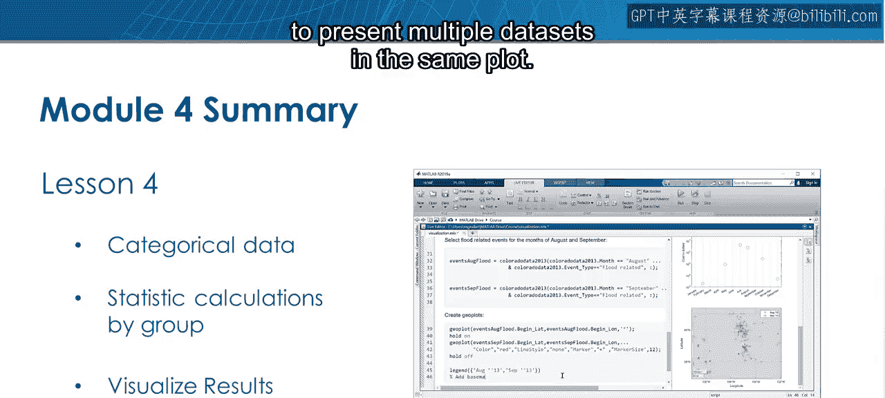
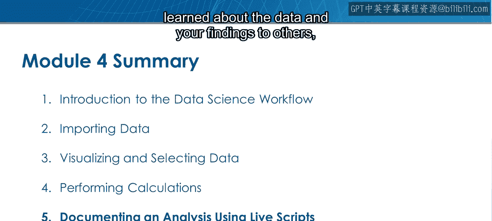
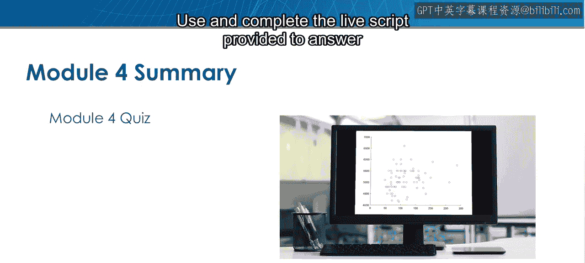
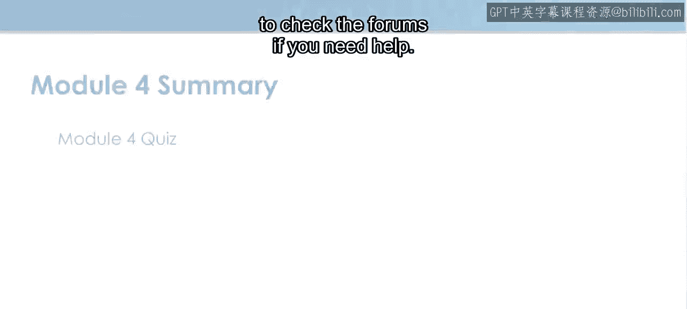

模块4：执行计算总结

在本节课中，我们将回顾模块四“执行计算”的核心内容。您已经学习了如何使用MATLAB对数据进行基础运算、统计分析、关系探索以及可视化呈现。

🎼 模块四总结

您已经完成了模块四的学习。接下来是模块测验。

让我们回顾一下您在本模块中学到的知识。

**基础运算与函数**

您首先学习了在MATLAB中对标量和向量执行基础运算。

接下来，您学习了如何使用MATLAB函数，这些函数能帮助您完成多种任务。

**数据描述与关系探索**

然后，您学习了如何使用MATLAB中的描述性统计函数来深入了解数据中包含的值。

在充分理解数据后，您开始通过使用相关系数来寻找变量之间的关系。

**数据索引与条件操作**

您学习了如何访问向量、矩阵和表格中的元素。

同时也看到了如何在选择或替换变量中的元素时应用条件。

**分类数据与分组统计**

您了解了分类数据，以及如何执行分组统计计算，以描述组间差异并进一步检测变量之间的关系。

**数据可视化**

最后，由于可视化有助于向他人传达分析的细节，您学习了如何自定义图形以及如何在同一个图形中呈现多个数据集。

**总结与展望**

现在您已经知道如何使用MATLAB对数据执行基础计算和分析。事实上，您可以复现前面提供的实时脚本中展示的许多计算和可视化。

您已准备好开始向他人展示您关于数据的所有发现，这将在下一个模块中涉及。

**模块测验**

现在是时候通过参加模块四测验来测试您的技能了。

请遵循测验页面上的设置说明，以便在MATLAB中访问所需的文件。

使用并完成提供的实时脚本来回答问题，如果需要帮助，请记得查看论坛。

本节课中，我们一起回顾了使用MATLAB进行数据计算与分析的全过程，从基础操作到高级可视化，为后续的数据呈现与沟通打下了坚实基础。