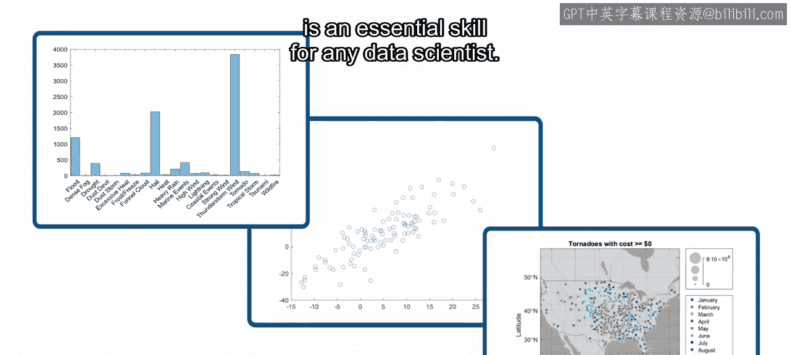

第35章：记录你的工作 📝

在本节课中，我们将学习如何使用实时脚本（Live Scripts）来记录和分享你的数据科学项目。

记录工作是任何数据科学项目的重要组成部分。首先，它允许你复用自己过去的工作。你经常遇到的新数据集，其格式可能与你之前处理过的数据相似。或者，你可能会在新的数据上复用旧的模型。因此，重新发明轮子通常没有必要。通过记录你做了什么、为什么这么做、哪些方法有效以及哪些无效，更新旧代码的过程会变得容易得多，并且可以避免重复犯错。

其次，你的文档将使他人能够复现你的结果并复用你的代码，甚至可以将你的解决方案部署为自动化系统。正如你可能已经知道的，理解他人的代码可能非常具有挑战性。为同事提供关于你的代码和方法论的描述，将使他们的工作轻松许多。

最后，通过记录你的分析，你不仅可以向同事提供指标、模型和可视化结果，还能让他们对你的结果和结论的可靠性充满信心。特别是，制作有意义的可视化图表和清晰的摘要，以帮助非技术背景的同事理解你的结果，是每位数据科学家必备的核心技能。

在实时脚本中包含交互式元素，可以让你的同事即使不懂编程，也能探索和扩展你的工作。正如你所见，实时脚本能帮助你记录自己的工作，并创建丰富的交互式演示文稿与他人分享。现在，让我们开始学习如何有效地传达你的结果。

本节课中，我们一起学习了记录数据科学工作的重要性，以及使用MATLAB实时脚本进行记录和分享的核心优势。