# 36：创建直播脚本 📝

在本节课中，我们将学习如何在MATLAB中创建“直播脚本”。直播脚本允许你将代码、分析结果和文字说明整合到一个交互式文档中，非常适合用于记录分析过程、创建报告或与他人分享你的工作。

## 概述

直播脚本由文本块和代码块组合而成。文本块用于添加格式化的文字、图片、公式和超链接，而代码块则包含可执行的MATLAB代码和注释。通过结合这两者，你可以创建一个既能运行分析又能清晰解释分析步骤的动态文档。

## 创建新直播脚本

首先，你需要创建一个新的直播脚本。在MATLAB的“主页”选项卡中，点击“新建直播脚本”。这将打开一个空白的直播脚本编辑器。

你会注意到界面发生了变化，出现了新的“直播编辑器”选项卡。工具条上的许多图标都提供了创建脚本所需的功能，你可以将鼠标悬停在图标上查看其功能说明。

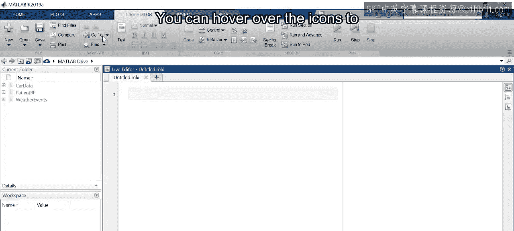

## 设置工作环境

在开始创建脚本之前，请确保设置正确的当前文件夹。我们将使用2013年的风暴事件数据以及之前创建的数据导入函数，因此请将包含这些文件的文件夹设置为当前文件夹。

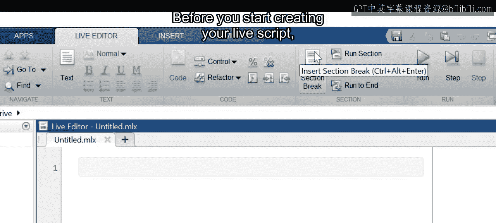

## 加载与探索数据

现在，可以开始加载数据了。将加载数据的代码添加到直播脚本的代码块中，然后点击“运行”。

由于我们在代码行末尾没有添加分号，变量的预览将显示在右侧的输出窗格中。

我们还没有一个具体的问题要回答，所以让我们先探索数据集，寻找值得深入研究的点。

热力图是可视化两个变量之间潜在关系的绝佳方式。让我们看看按月份划分的事件类型分布。点击“运行”以执行代码并查看输出。

默认情况下，结果会显示在右侧的单独窗格中，但你也可以选择将其改为内联显示。要更改此设置，请点击“视图”选项卡，然后选择“内联输出”。输出位置可以随时更改，并且会应用于文档中的所有输出。你可以尝试一下，看看更喜欢哪种视图。

## 添加分析与注释

在分析数据时，你可以开始添加你的想法和发现，这样任何查看直播脚本的人都能理解你所做的工作。

文本块可以通过将光标置于所需位置并点击“文本”来添加。你可以更改文本的格式来创建标题、副标题和列表。让我们也将标题居中。

## 使用分节功能

你还可以将代码分成多个节，然后单独运行某一节的代码。这在开发和测试代码时特别有用。

在这里，前几行代码加载并准备用于分析的数据。加载数据需要时间，但只需要执行一次。通过在“将月份按顺序排列”这行代码之后插入一个分节符，你可以更高效地迭代分析代码。

要插入分节符，请将光标定位，然后在工具条中点击“分节符”。

通过清除所有输出，然后逐节运行代码来测试这个功能。点击“视图”选项卡，选择“清除所有输出”。然后将光标放在第一节，点击“运行节”。注意，代码运行后，左侧的蓝色条会变成实心。

现在将光标放在第二节。注意左侧的条是条纹状的，表示此节中的代码尚未运行。点击“运行节”再次显示热力图。

## 优化可视化

这张热力图包含大量数据，可能难以查看和解读。你可以通过调整输出显示面板的宽度来将其放大。

如果仍然难以看清，你可以将热力图在新图形窗口中打开：将鼠标悬停在热力图上，当坐标轴工具栏出现时，点击“在图形窗口中打开”。

## 深入分析数据

这很有趣。夏季月份发生了大量的冰雹事件。同期也有许多雷暴大风事件。也许这两类事件是相关的。

这两类事件都有纬度和经度值，因此你可以创建地理密度图来查看事件是否集中在相同的地点。

添加显示冰雹事件的代码并点击“运行节”。这些事件似乎主要集中在美国中部。

现在加入雷暴大风的代码并重新运行该节。在地图上没有明显的关联，因为这些事件似乎主要集中在美国东部。

## 记录发现

这是一个更新直播脚本、总结你发现的好时机。你可以添加一个注释，说明你为何查看这些事件以及观察到了什么。

下一步可能是查看特定州的数据。让我们为此创建一个新节。你可以重用之前的代码，并在逻辑索引中添加第二个条件，以选择发生在单个州（例如德克萨斯州）的事件。更改完成后，点击“运行节”。

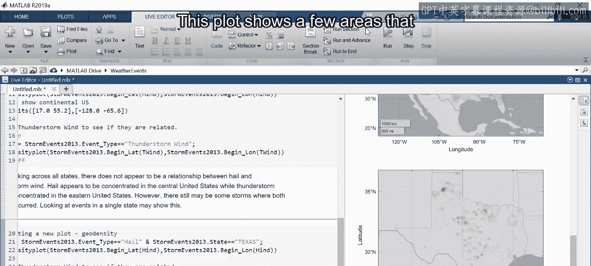

## 聚焦特定区域

这张图显示了一些值得进一步研究的区域。例如，阿马里洛周围的这个集群。

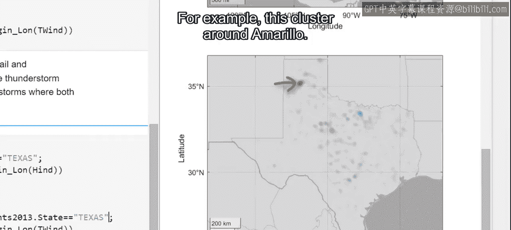

但是如何只选择这些事件呢？

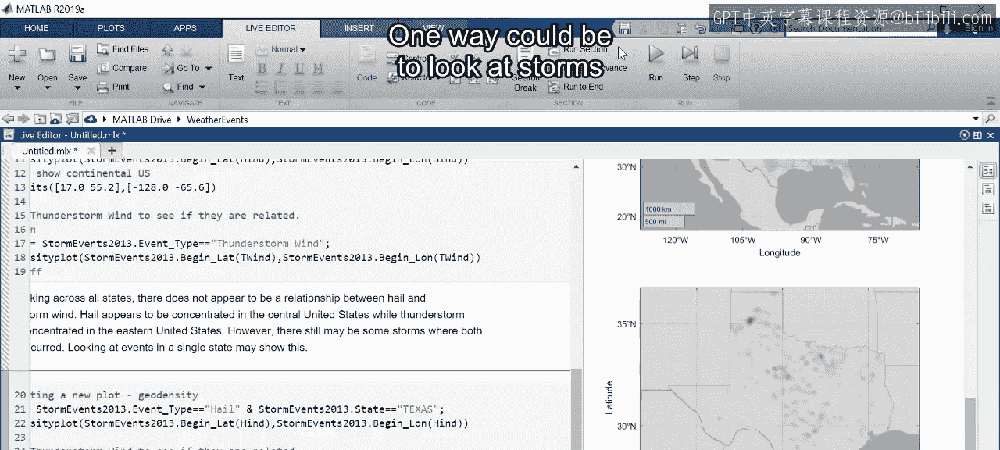

一种方法是查看距离阿马里洛特定距离内的风暴。你可以使用**哈弗辛公式**，利用数据中包含的纬度和经度值来计算这个距离。

许多人可能不熟悉这个公式。你可以将公式添加到直播脚本中，并包含一个指向参考页面的超链接。

公式通过“插入”选项卡添加到文本块中。首先，放置光标。然后展开公式图标下方的菜单并选择“公式”。将打开一个新选项卡，其中包含可帮助你使用预定义符号和结构交互式构建公式的选项。

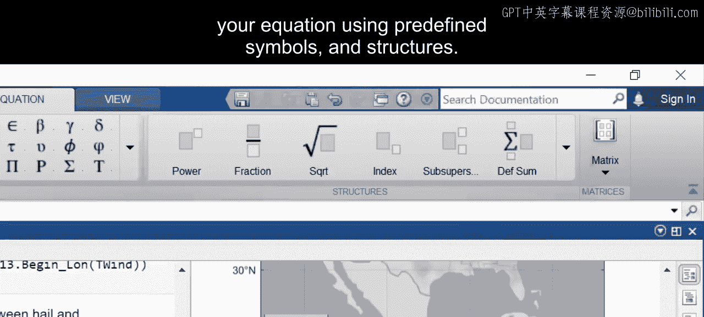

例如，这个结构允许你添加正弦平方项。你还可以通过将一个结构嵌套在另一个内部来组合结构，比如在分数周围加上括号。这个符号将添加点以表示乘法。完成后，点击公式编辑器外部即可退出。

要添加超链接，请高亮显示文本，点击“插入”选项卡上的“超链接”，然后粘贴URL。

## 应用公式筛选数据

你可以将计算出的距离作为新变量添加到表中，并使用条件表达式来选择所需的事件。在这里，你正在检查距离德克萨斯州阿马里洛8公里（约5英里）以内的事件。

选择数据后，你可以按任意方式将其可视化。由于你对事件彼此间的时间关系感兴趣，可以考虑显示一个表格，或者也许另一张热力图。

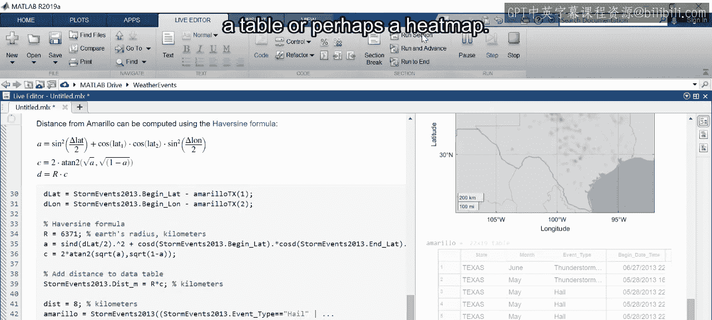

在这里你可以看到，在5月28日，发生了多次冰雹和雷暴大风事件。

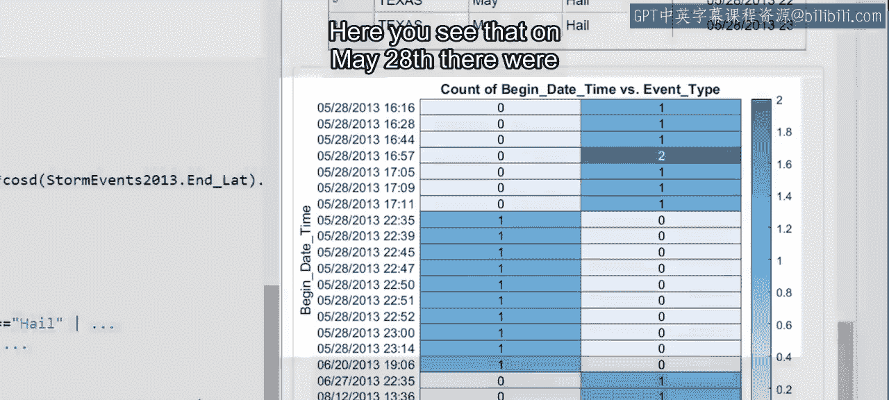

大风事件首先被记录，时间跨度为一小时。大约五小时后开始，在40分钟的时间跨度内记录了多次冰雹事件。

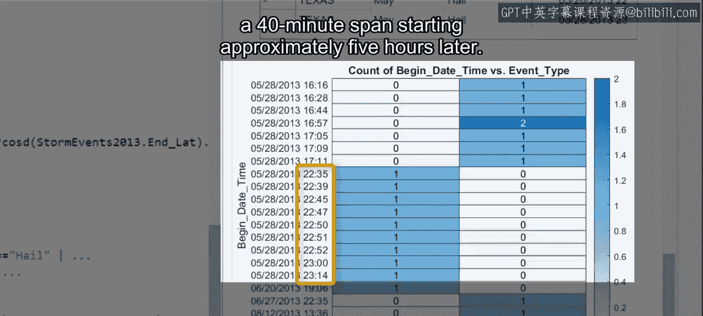

你可以检查其他城市和州，但在这一点上，你可以总结你的发现。

## 最终整理与分享

在最终确定文本并按需组织直播脚本后，你就可以准备与他人分享了。请务必保存最终版本。

请注意，如果展开“保存”菜单，你可以选择将直播脚本导出为各种常见文件格式。

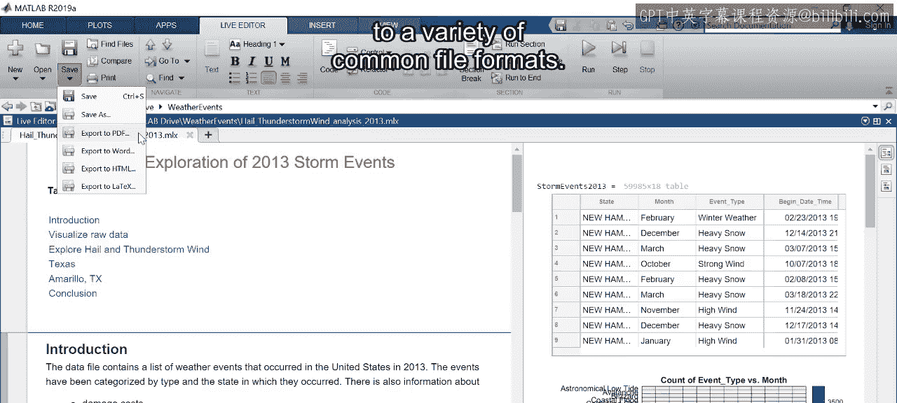

例如，选择PDF将创建一个包含文本、代码和输出的新文档，任何人都可以查看。

## 总结

本节课中我们一起学习了如何创建和使用MATLAB直播脚本。总结如下：
*   直播脚本让你能将可运行的代码与格式化的文本结合起来。
*   你可以添加格式以创建报告并与他人分享。
*   导出为多种格式的能力使你能够将分析分发给无法访问MATLAB的人。

现在，你已经准备好学习如何通过控件使你的脚本具有交互性。

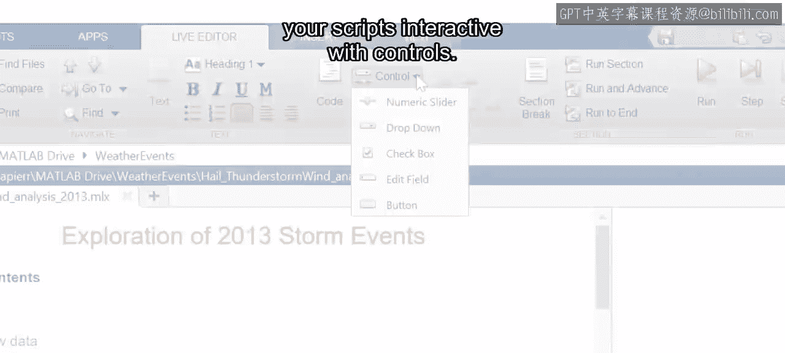

