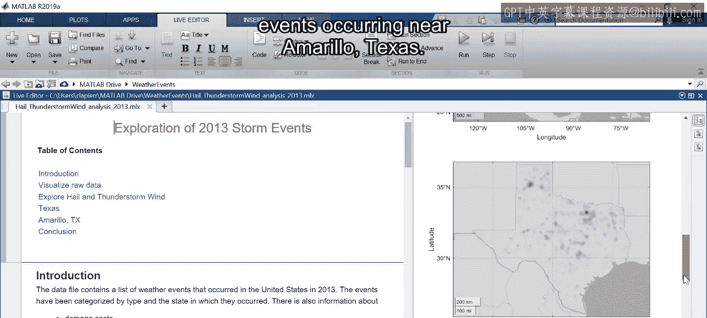
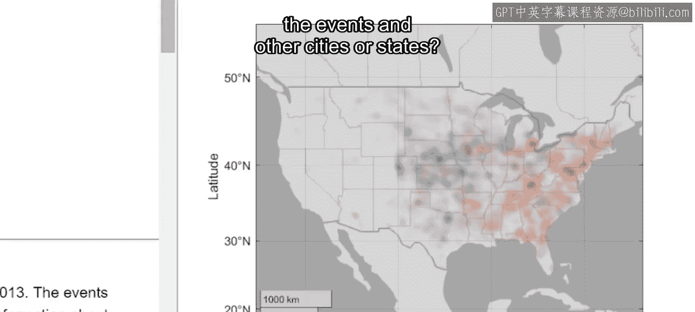
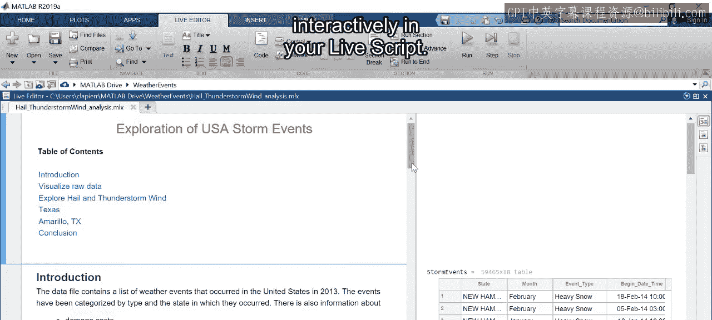
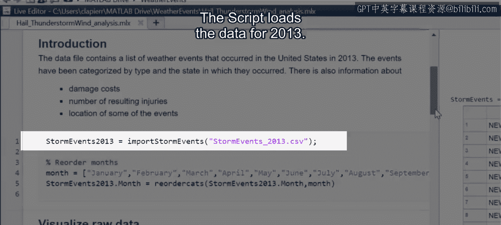
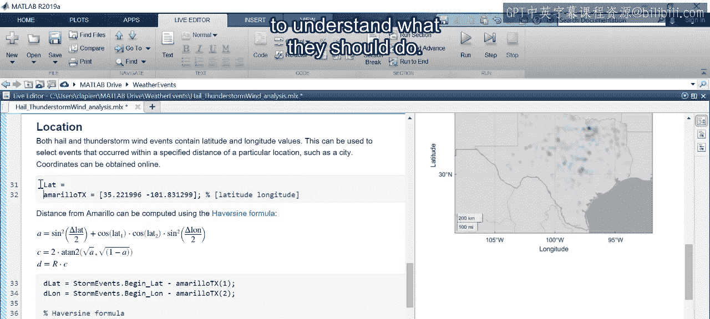
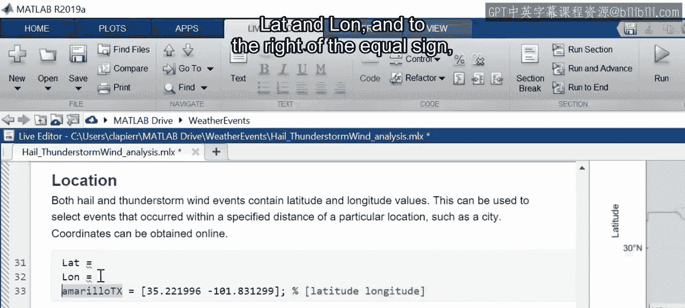

# 37：为直播脚本添加交互式控件 🎛️



在本节课中，我们将学习如何为MATLAB Live Script添加交互式控件，使数据分析过程更加灵活和高效。通过将硬编码的变量替换为控件，用户无需修改代码即可快速探索不同的数据子集和分析参数。

## 概述：为何需要交互式控件？



让我们回顾一下之前用于分析2013年冰雹和雷暴风数据的直播脚本。该数据集包含近6万个条目，但脚本仅分析了德克萨斯州阿马里洛附近的少数事件。



如果用户想探索其他城市或州的事件，或者想调查其他事件类型，该怎么办？通过添加交互式控件，我们可以让他人无需重写代码就能快速探索数据差异，从而使分析更具交互性。



## 为数据文件选择添加下拉菜单

上一节我们介绍了交互式控件的概念，本节中我们来看看如何具体实现。一个典型的应用场景是在代码的第一行加载数据集。原脚本加载的是2013年的数据。分析者可能希望在其他年份的数据上运行相同的分析。

通过将硬编码的文件名替换为交互式控件，只需点击几下即可探索其他年份的数据。

以下是可添加到直播脚本中的几种控件类型。您可以通过点击“Live Editor”选项卡并展开“Control”菜单来查看可用选项。

*   **下拉菜单**：最适合用于选择要加载的数据文件。

现在，让我们将当前文件名复制到剪贴板，以便将其添加到控件选项中。然后删除原名称，并在其位置添加一个下拉菜单。此时会弹出控件配置菜单。

以下是配置下拉菜单的步骤：

1.  在“Item Labels”下，列出用户将看到的选项标签。
2.  在“Item Values”下，列出每个标签对应的实际值。
3.  标签和对应的值可以不同，因此使用年份作为标签、使用完整的文件名作为值是可行的。
4.  为2013年和2014年添加条目。

默认情况下，与控件交互会自动运行其所在的代码段。您可以在配置菜单底部将默认行为更改为其他可用选项。

由此可见，分节符对于控制执行哪些代码非常重要。在考虑代码中何处插入分节符时，请思考在选择后希望发生什么。在本例中，我们选择“Run all sections”。配置完成后，点击菜单外部即可返回直播脚本。

通过选择“2014”来测试控件。结果应该与2013年类似。下拉菜单使得切换数据文件变得非常容易。

## 使用编辑字段控件输入位置信息

第二个下拉菜单也可用于从预定义列表中选择事件类型或州。然而，有些变量的选择范围更开放。例如，在探索过程中，您可能希望查看德克萨斯州阿马里洛以外地区的事件。





您可以使用**编辑字段控件**来捕获任何位置的纬度和经度。虽然用户可以直接修改代码，但在此处添加控件可以使用户更清楚地知道应在脚本的何处进行修改。

让我们修改代码，使其更易于用户理解他们应该做什么。

首先，创建两个新变量：`lat` 和 `lon`。

```matlab
lat = [在此处添加编辑字段控件];
lon = [在此处添加编辑字段控件];
```

在等号右侧，放置一个编辑字段控件。变量将被赋值为输入到编辑字段中的任何值。

由于纬度和经度变量是数值型的，请将“Data Type”设置为“double”。对于“Execution”选项，请考虑用户在此处的操作。每当城市更改时，这两个值都必须更新，因此在一个编辑字段被修改后运行脚本的任何部分都是没有意义的。由于用户可以按任何顺序更新字段，因此在此场景下，“Do nothing”可能是最佳选择。

完成每个控件的配置后，点击外部返回直播脚本。您可以通过输入阿马里洛的纬度和经度值来预填充编辑字段。

请记住，这些坐标用于计算每个天气事件与城市之间的距离。

## 使用数值滑块调整分析距离

目前，直播脚本硬编码为选择距离城市8公里（或5英里）以内的事件。这个距离是任意选择的。用户可能希望修改此值，而**数值滑块**提供了一种简单的方法。

删除当前分配给变量 `D` 的值，并从控件菜单中将其替换为数值滑块。

控件配置菜单允许您设置滑块的最小值、最大值和增量。您应该使用能引导用户获得有意义结果的数值。

例如，您可能想将最小值设置为零，但指定零距离将导致没有事件被选中。因此，让我们使用最小值为5公里，最大值为100公里，步长为5公里。

对于“Execution”，选择“Current section to End”。这样，当用户调整滑块时，他们将看到更新的结果，这很可能是他们想要的。对于滑块，您还可以决定何时触发代码执行：是在滑块活动时，还是在用户停止使用它之后。本部分中的一些绘图需要几秒钟才能生成，因此最好在选定最终值后运行代码，所以请选择“Value changed”。

现在让我们测试一下。返回直播脚本并调整滑块。也许100公里作为最大值太高了，热图会因此变得难以阅读。不过这很容易修复，您可以通过右键单击滑块并选择“Configure Control”来修改控件。让我们将最大值改为50。

现在将滑块设置为10公里，使热图结果与2013年的结果具有可比性。

## 总结与展望

在本节课中，我们一起学习了如何为MATLAB Live Script添加交互式控件。添加控件使天气数据分析更快、更容易。以前，您必须找到所需的代码行并手动更新值。现在，这些位置非常突出，并且控件会帮助您选择合适的值。此外，您可以在进行更改时自动重新运行代码段，从而进一步简化数据探索。


现在您已掌握了创建自己的直播脚本所需的技能。在本模块结束时，您将创建自己的脚本。请思考如何利用交互式控件快速探索数据并找到问题的答案。