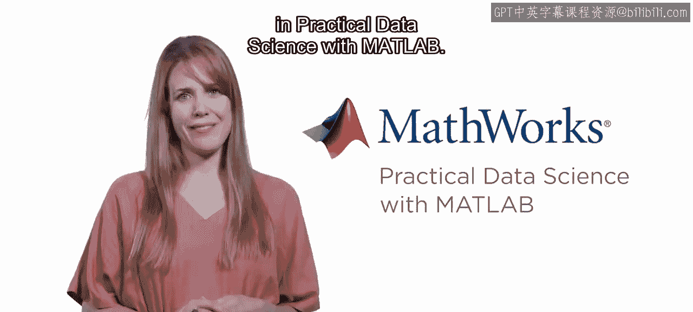
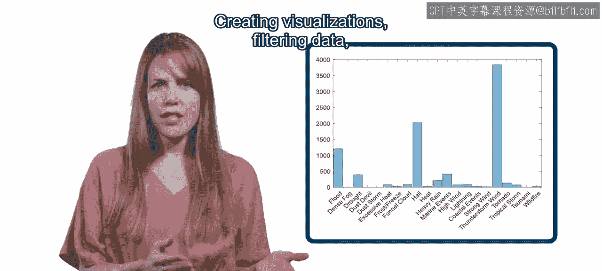
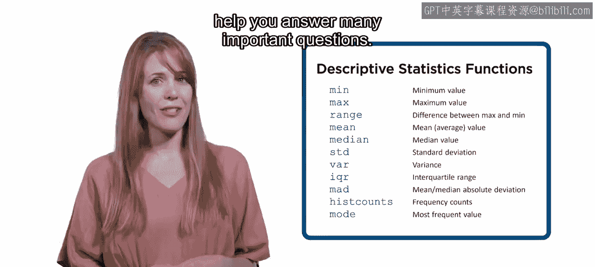
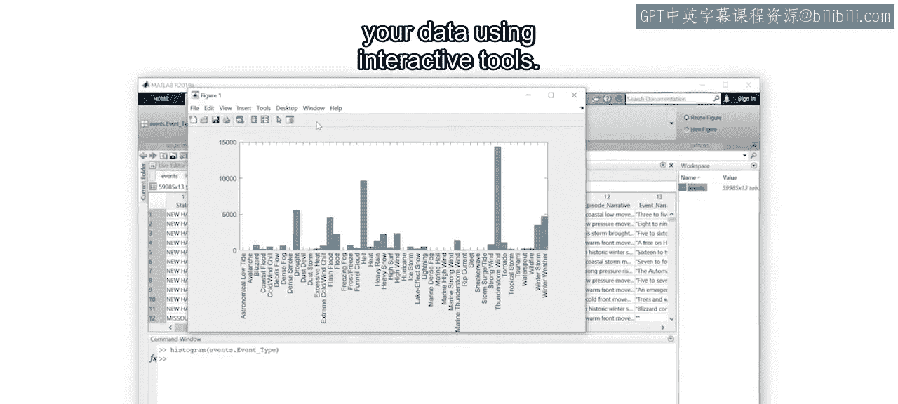
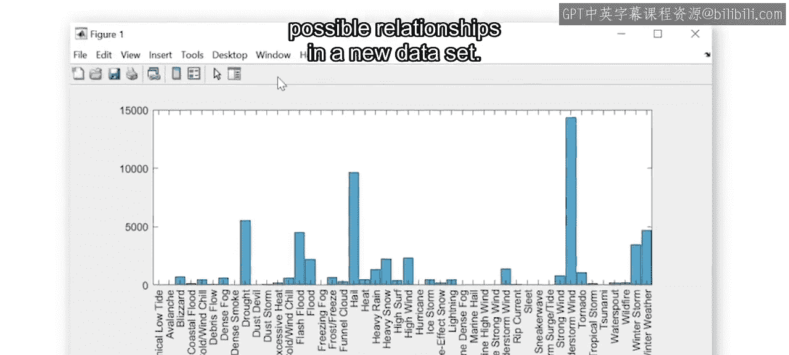
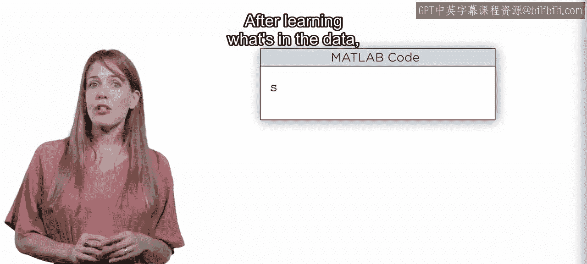
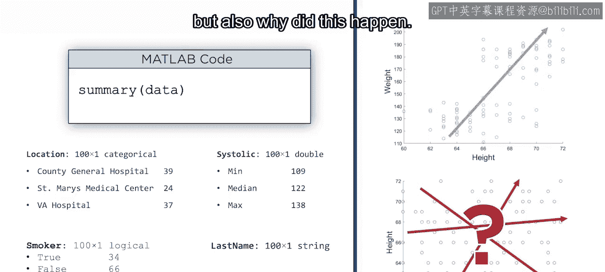
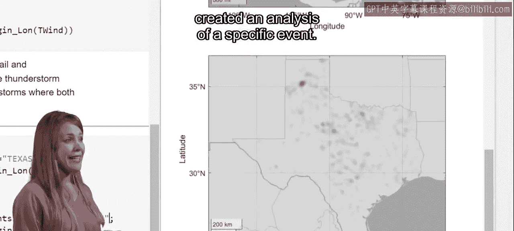
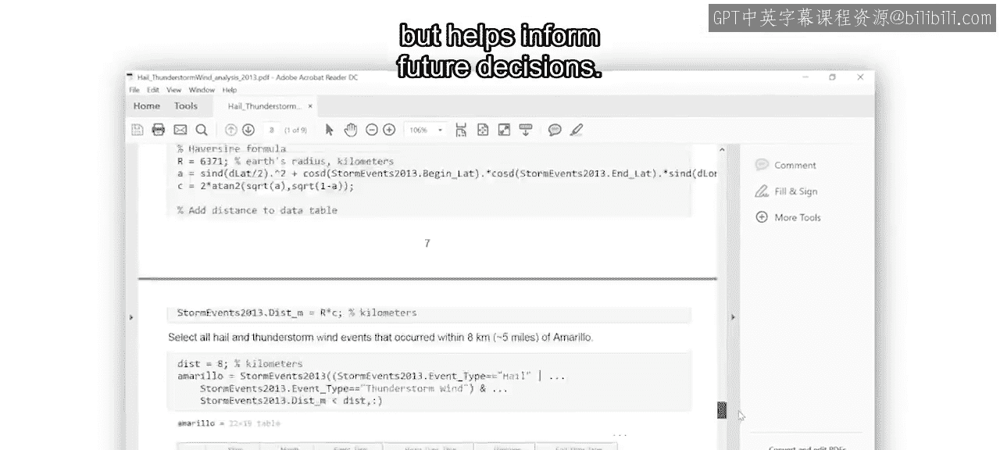
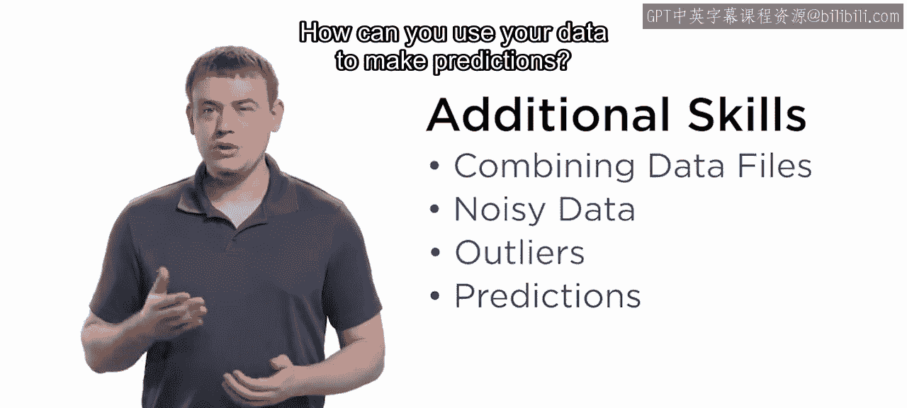

# 39：探索性数据分析总结 🎯

在本节课中，我们将总结第一门课程的核心内容，回顾如何使用MATLAB进行探索性数据分析，并展望下一阶段的学习目标。

---

恭喜你完成了MATLAB实用数据科学的第一门课程。快速探索大量数据的能力是一项重要技能。创建可视化图表、筛选数据以及计算分组统计量，将帮助你回答许多关键问题。

在展望第二门课程之前，让我们先回顾一下到目前为止所学的内容。

你现在已经能够处理一个新的数据集，并回答“发生了什么？”这个问题。

为了做到这一点，你遵循了几个步骤。以下是完成探索性数据分析的关键流程：

1.  **导入数据**：首先，你使用MATLAB的导入工具将数据导入工作区。该工具允许你交互式地选择数据导入方式，并能在未来自动化此过程。这听起来可能很简单，但没有数据，任何分析都无法开始。
2.  **探索与可视化**：接下来，你学习了如何使用交互式工具创建可视化图表和筛选数据。这是开始探索新数据集并寻找潜在关系的方法。与导入过程一样，重复这些步骤所需的代码会被自动捕获，从而加速未来的分析。
3.  **计算与分析**：在了解数据内容后，你接着学习了如何计算统计量并寻找变量之间的相关性。此时，你不仅能回答“发生了什么”，还能开始探究“为什么会发生”。
4.  **整合与呈现**：最后，你将所有概念整合在一起，对特定事件创建了一个完整的分析。你的最终分析不仅仅是文本、代码和图表的堆砌，它讲述了一个关于“发生了什么”的故事，有助于为未来的决策提供信息。

那么，第二门课程将包含哪些内容呢？让我们听听将带领你学习第二门课程的Adam的介绍。

感谢Aaron。你已经取得了很大成就，但在许多数据科学应用中还需要额外的技能。

例如，如果你需要合并多个数据文件该怎么办？如何处理有噪声的数据和异常值？如何利用你的数据进行预测？

请加入我们的专项课程第二门课，我们将涵盖这些主题以及更多内容。

---

**总结**

本节课中，我们一起学习了探索性数据分析的完整流程。你掌握了从数据导入、交互式探索、统计分析到最终报告呈现的核心技能。这些技能是回答“发生了什么”和“为什么会发生”的基础。在下一门课程中，我们将在此基础上，学习处理更复杂的数据挑战，例如数据整合、清洗和预测建模。