# 1：课程概述 🎯

在本节课中，我们将要学习MathWorks《实用数据科学与MATLAB》专项课程的总体介绍。我们将了解数据科学的重要性、MATLAB工具的优势以及整个专项课程的学习路径。

---

你可能听说过数据科学正在彻底改变医疗保健、汽车、消费电子等众多领域。实际上，几乎每个行业都受到了影响。如果你正在考虑学习这个专项课程，你很可能已经看到了数据科学在你自身领域的潜力。

无论你身处哪个领域，掌握扎实的数据科学技能都能让你脱颖而出，并帮助你将原始数据转化为有意义的结果。这就是MathWorks创建《实用数据科学与MATLAB》专项课程的原因。完成这个专项课程将赋予你快速取得实际成果所需的技能和信心。

在整个专项课程中，你将使用MATLAB。

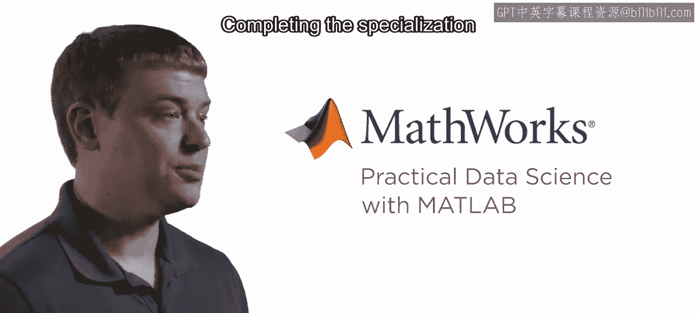

MATLAB是数百万工程与科学专业人士的首选工具，它提供了完成数据科学任务所需的能力。MATLAB使用熟悉的数学符号，并附带图形化应用程序，帮助你快速迭代常见的分析任务。这些应用程序减少了进行有意义的数据科学工作所需的时间，并帮助你立即开始处理数据。

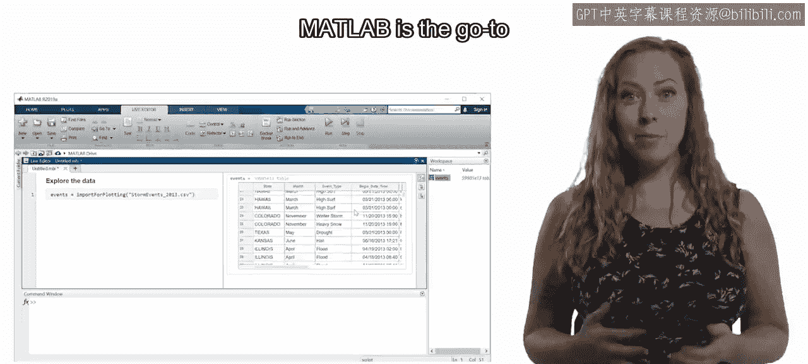
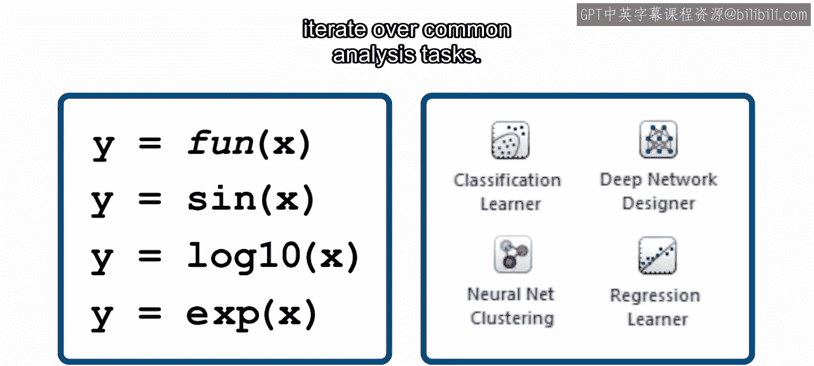
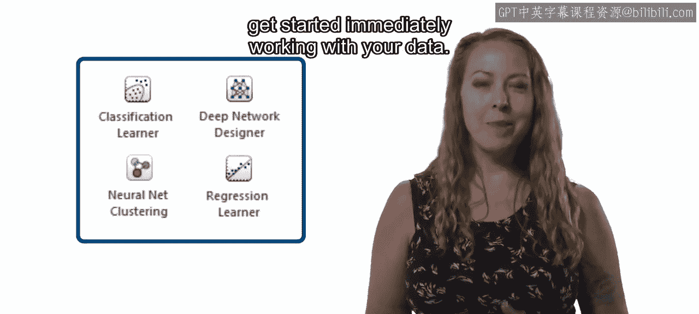

你了解你的领域，也了解你的数据。借助正确的工具和一些实践，你可以构建能够基于数据中的模式进行准确预测的模型。这类技术对于任何希望保持竞争力的公司都至关重要。

完成这个专项课程后，你将能够使用你的数据构建预测模型。这是当今雇主最需要的高需求职业技能之一。

---

## 课程一：数据探索 📊

在四门课程专项的第一门课程中，你将学习如何使用MATLAB中可用的图形化工具来探索数据。你将生成可视化图表并执行常见的统计分析。

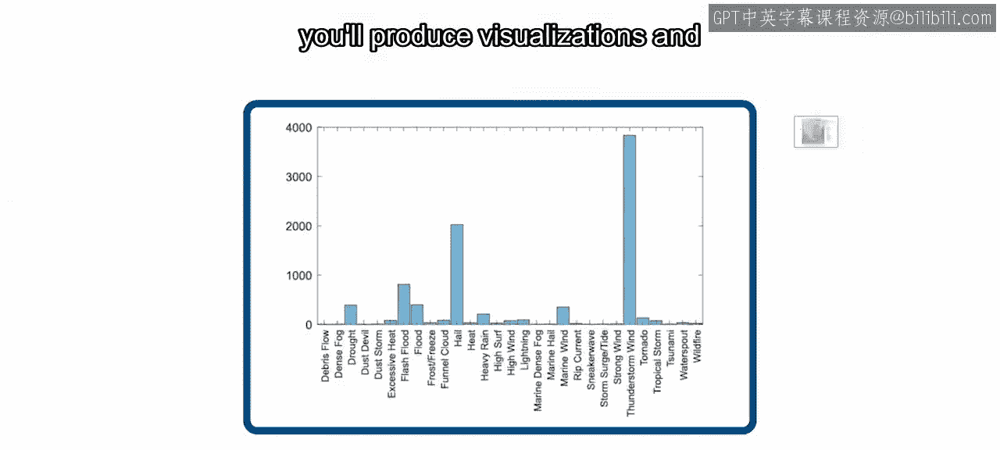

这门课程旨在成为所有技能水平学习者的入门点。图形化工具使你能够快速尝试不同的技术和可视化方法。

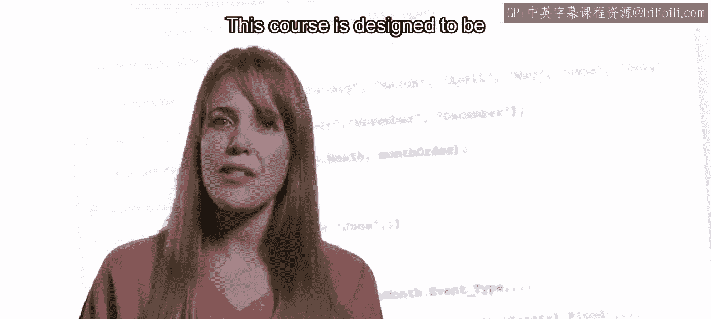

你所执行操作对应的代码会显示在屏幕上，帮助你学习MATLAB语言并开始自己编写完整的脚本。

---

## 课程二：数据预处理与特征工程 🔧

上一节我们介绍了数据探索，本节中我们来看看如何为建模做准备。在第二门课程中，你将在基础上更进一步，增加为后续探索和建模而对数据进行预处理的关键技能。

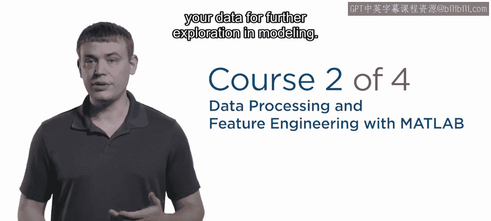

完成这门课程将使你能够整合来自不同来源的数据，去除不需要的干扰（如异常值和缺失数据点），并开始构建用于分类和回归的基本模型。

这门课程还探讨了你可能会遇到的特定数据类型。

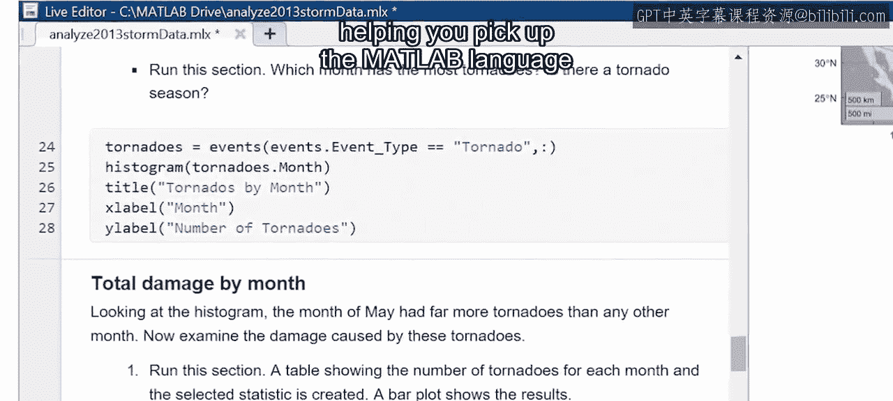

以下是几种常见的数据类型：
*   音频信号
*   图像
*   文本

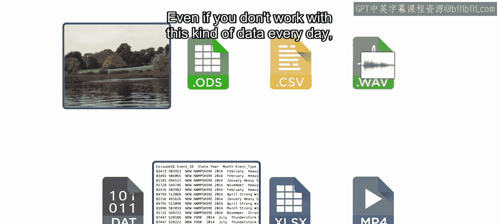

即使你并非每天处理这类数据，当需要时，你仍然有机会应用相关的概念和应用程序。

---

## 课程三：机器学习建模 🤖

当你进入第三门课程时，你将准备好开始使用MATLAB应用程序构建机器学习模型。你将尝试多种不同的建模技术和参数。

当你找到喜欢的组合时，你将构建一个模型并用它进行预测。与任何新技能一样，数据科学成功的关键在于实践。

---

## 课程四：毕业项目 🏆

专项课程的最终毕业项目涵盖了完整的数据科学工作流程。

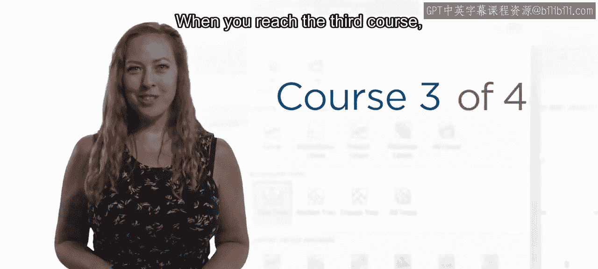
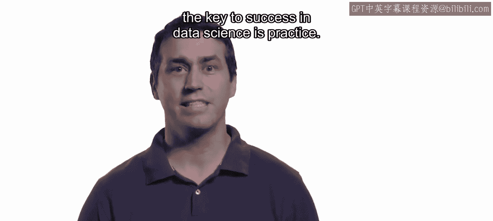

你将应用专项课程中所有课程学到的技能来构建一个预测模型。

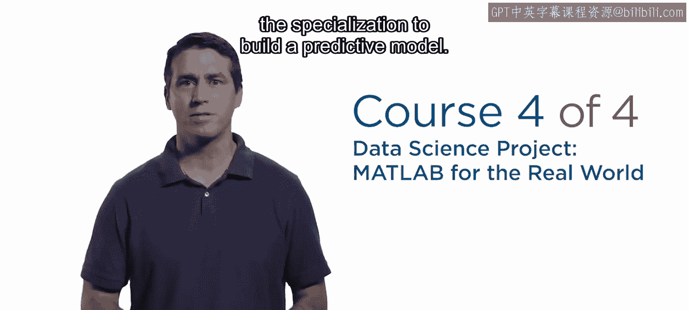

你将与同伴合作评估模型，更重要的是，从他们独特的视角中学习。

---

准备好开始构建实用的数据科学技能，以便在你的组织和行业中发挥作用了吗？很好，让我们开始吧。

---

本节课中我们一起学习了《实用数据科学与MATLAB》专项课程的概览。我们了解了数据科学的广泛应用价值、MATLAB作为工具的直观与高效特性，以及从数据探索、预处理、机器学习建模到最终毕业项目的完整学习路径。这个专项课程旨在通过实践，帮助你快速掌握将数据转化为洞察和预测模型的关键技能。