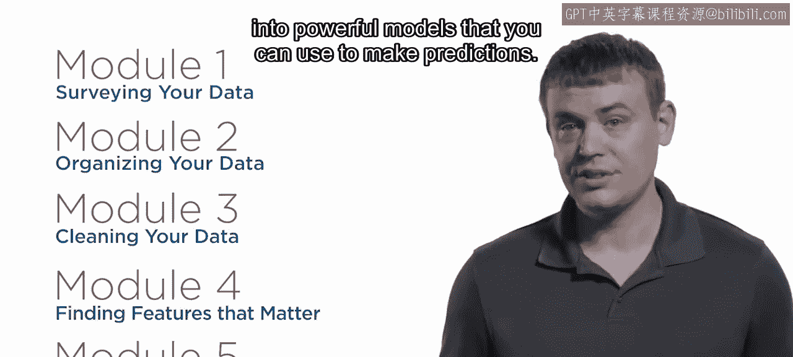
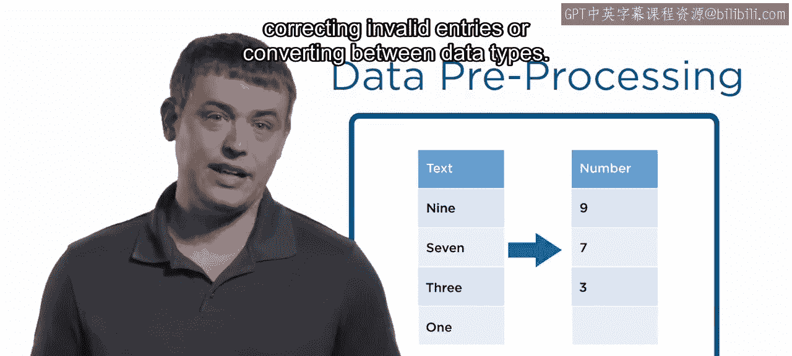
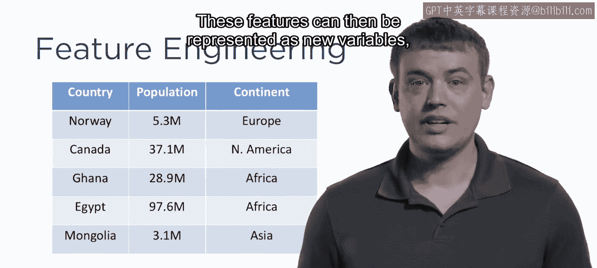
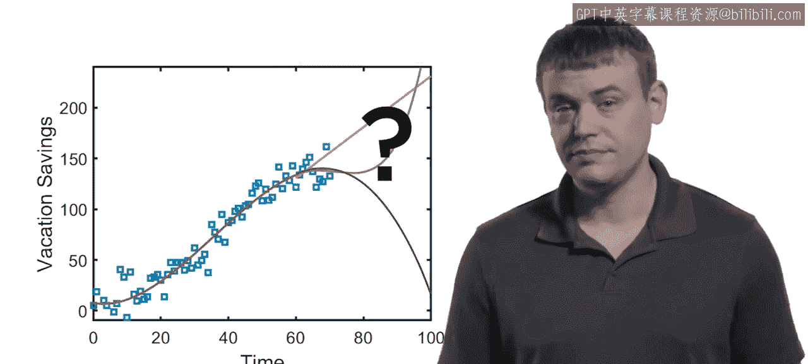
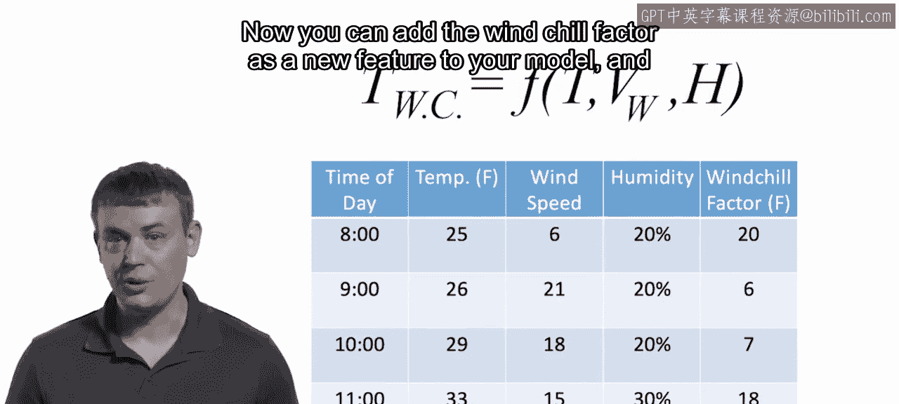
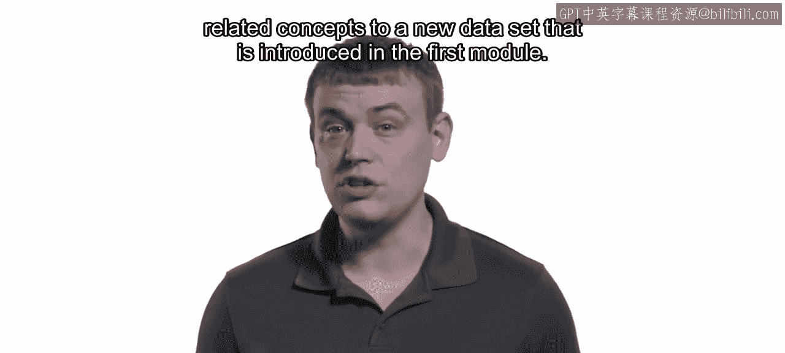

1：数据处理和特征工程概述 🎼

在本节课中，我们将要学习数据科学工作流程中的两个核心环节：数据处理与特征工程。我们将了解如何将原始数据转化为可用于构建预测模型的有组织形式，并探讨如何利用领域知识从数据中提取更有价值的特征。

大家好，我是Adam Philian，欢迎来到本课程。在接下来的五个模块中，你将学习如何将原始数据转化为强大的预测模型。

首先，你需要将原始数据转化为有组织且可用的形式，这个过程被称为**数据预处理**。这包括一系列任务。

以下是数据预处理可能涉及的任务：
*   整合多个数据源。
*   修正无效条目。
*   在不同数据类型之间进行转换。

例如，假设你正在全球范围内追踪一种疾病。你很可能会从每个受影响的国家收集多个数据集。每个数据集都有自己的报告方法、诊断程序、测量标准，甚至可能使用不同的语言。在开始寻找全球趋势之前，你需要进行大量的数据预处理工作。

上一节我们介绍了数据预处理，本节中我们来看看数据准备好之后的下一步。

数据准备就绪后，就可以开始**特征工程**的过程。这涉及利用你的领域知识，在数据中寻找有用的特性或特征。这些特征随后可以表示为新的变量，用于预测模型。

如果你不熟悉预测建模，可以考虑以下例子。你是否曾制作过预算电子表格，以帮助你了解何时能攒够钱支付一笔大额开销，比如一次豪华度假？那么你已经有过一些构建预测模型的体验了。

在数据科学中，**模型**是对数据的数学描述，它使你能够预测系统将如何行为，从而根据数据做出明智的决策。

让我们从头到尾走一遍这个流程的示例。想象你是一位气象学家，负责在你所在的地区发布极端低温预警。

你首先需要组织和清理数据，其中包括过去几十年的天气读数。

在此基础上，你可以构建一个温度波动的**回归模型**，用于预测未来的温度。如果你的模型预测将出现极端寒冷天气，那么你就发布预警。但是，你能做得更好吗？

事实证明，实际温度并不是决定室外体感寒冷的唯一因素。一个更好的衡量标准，也是特征工程的一个例子，是**风寒指数**。气象学家使用一个结合了实测温度、风速和湿度的公式来计算风寒指数。

公式示例：`风寒指数 = f(温度, 风速, 湿度)`

现在，你可以将风寒指数作为一个新特征添加到你的模型中，从而更好地决定是否发布寒冷天气预警。

尽管特征工程听起来可能很复杂，但正如你所见，你可能已经熟悉了这个概念。在本课程的最后一个模块中，你将把特征工程技能应用到一些常见的数据类型上。

以下是常见的数据类型示例：
*   图像
*   文本
*   音频或其他信号

在整个课程中，你将把预处理、特征工程及相关概念应用到一个新的数据集上，该数据集将在第一个模块中引入。

如果你有任何问题或有用的技巧要与同伴分享，请别忘了使用讨论区。

让我们开始吧。

本节课中我们一起学习了数据预处理和特征工程的基本概念。数据预处理是将杂乱原始数据整理规范化的必要步骤，而特征工程则是利用专业知识创造更有预测力的新变量，两者共同为构建有效的预测模型打下坚实基础。