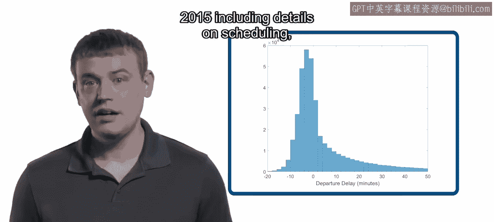
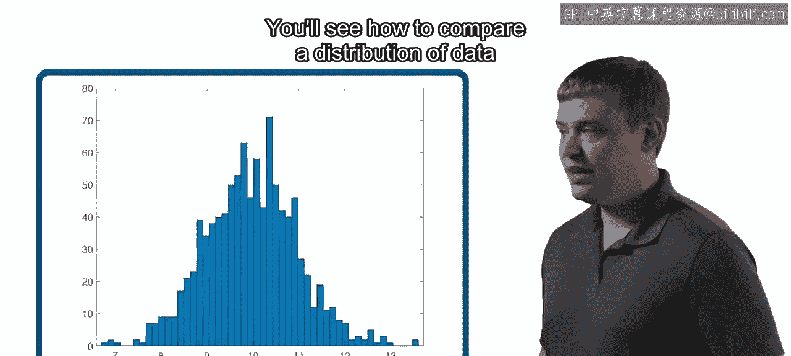
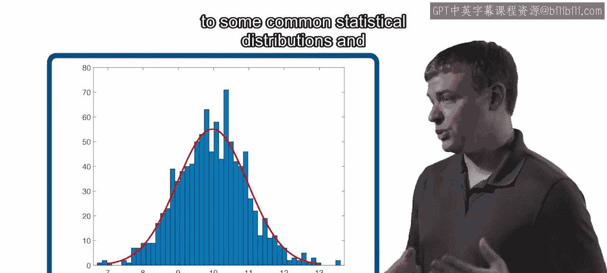
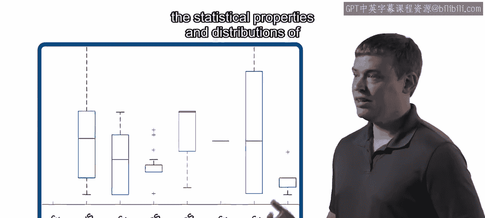
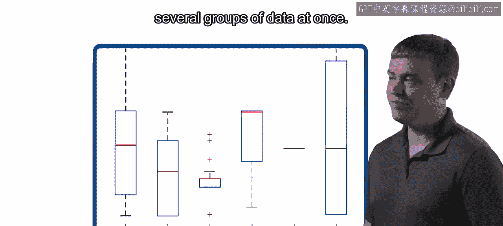
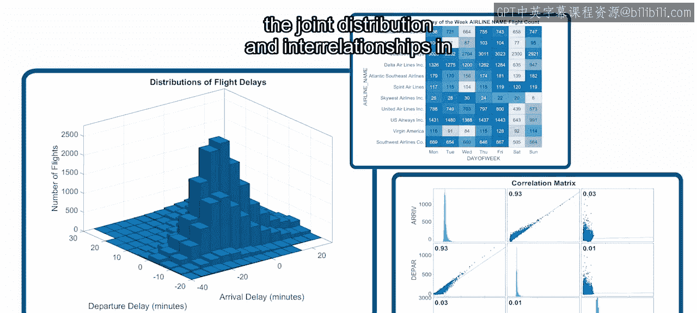

模块1：数据探索与分析介绍 🎼

在本模块中，我们将学习数据科学流程中的第一步：数据探索与分析。我们将回顾探索性数据分析的核心概念，并使用一个关于2015年美国国内航班的新数据集进行实践。这个数据集包含了航班调度、飞机、机场以及飞行结果等详细信息。

首先，我们将从回顾探索性数据分析开始。你将探索并可视化这个新的数据集。

上一节我们介绍了数据探索的初步工作，本节中我们将深入分析数据的统计特性与分布。你将学习如何计算和解读数据的统计属性。

了解了数据的基本统计特性后，接下来我们看看如何将数据的分布与常见的统计分布进行比较。这有助于我们理解数据是否符合某些理论模型。

除了与理论分布比较，我们还需要一种方法来同时比较多组数据的统计特性和分布。以下是实现这一目标的有效工具：

*   你将学习使用箱线图来图形化地一次性比较多组数据的统计特性和分布。

最后，我们将分析多维数据中的联合分布与相互关系。以下是本部分将涉及的内容：

*   你将使用多种额外的可视化技术来分析多维数据中的联合分布与相互关系。

让我们开始吧。

本节课中我们一起学习了探索性数据分析的完整流程，包括数据集的初步探索、统计特性分析、分布比较以及多维数据关系的可视化。这些技能是进行有效特征工程和机器学习建模的重要基础。