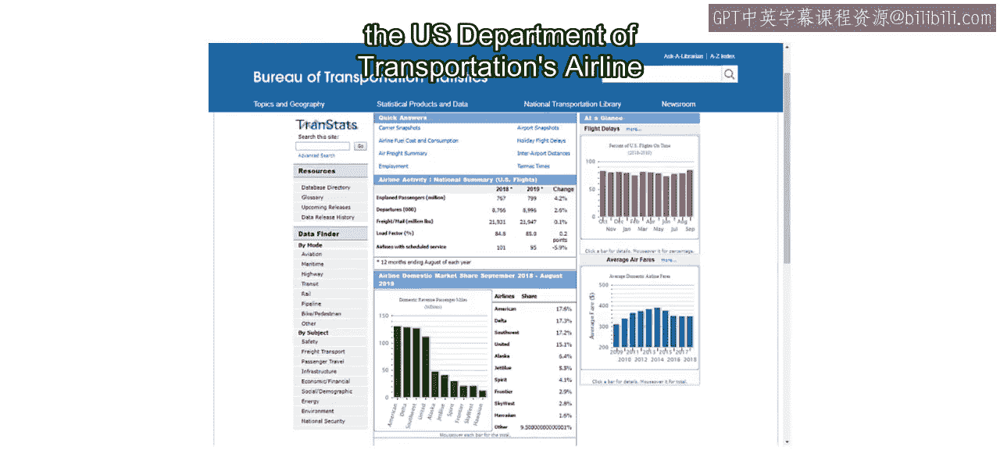
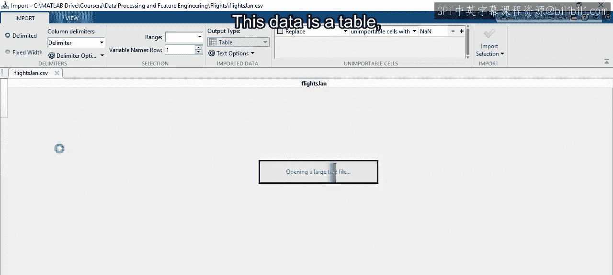
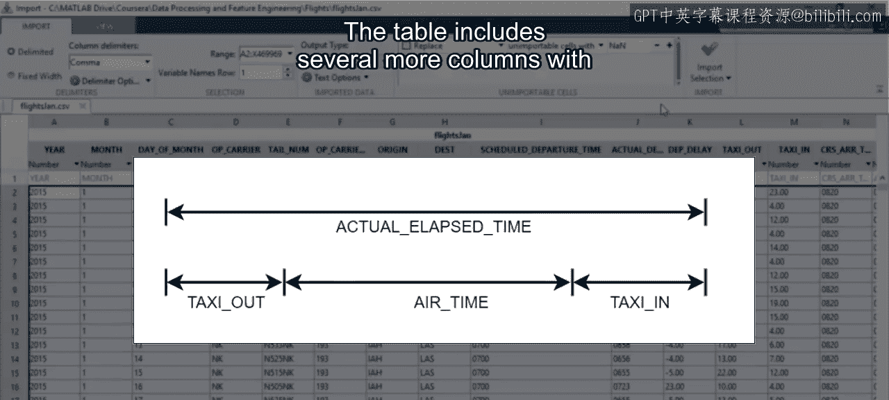
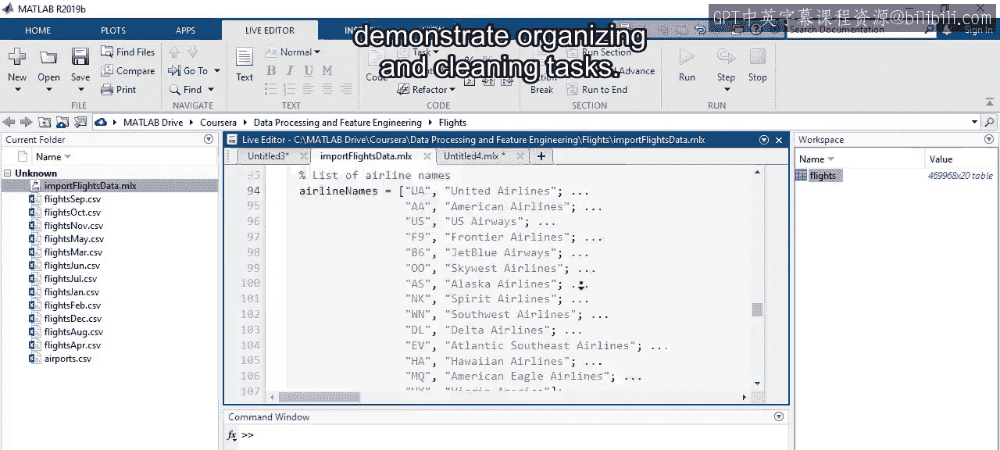

# 4：航班数据集简介 🛫

在本节课中，我们将要学习本课程将使用的主要数据集——美国交通部的航班准点性能数据集。我们将了解其结构、内容以及如何导入和初步处理数据。

现在你已经下载了课程文件并设置好了环境，让我们来看看本课程将使用的主要数据集。

你获得的是美国交通部航班准点性能数据集中2015年的数据。

从现在开始，我们将其简称为航班数据集。

这个数据集记录了2015年全年美国所有国内商业航班的信息。

这包含了超过580万次航班。这类数据在现实世界中有许多应用。例如，航空公司可以利用这些数据来减少延误和取消，在繁忙时段和节假日分配资源，或者识别增加新航班的机会。

让我们开始查看原始数据，以了解其中包含的内容。首先，导航到包含数据的文件夹。这里有12个以“Flights”为前缀的文件，包含了2015年全年的所有数据。

这些文件按月分割，因此 `FlightsJan.csv` 记录了1月份的航班。

还有一个名为 `Airports.csv` 的文件，其中包含美国机场的信息，如名称、城市、州，以及经纬度坐标。稍后，你将看到如何将这些信息与航班数据结合，以描述航班的去向。

使用导入工具打开文件 `FlightsJan.csv`。

这些数据是一个表格，顶部有多个列，列名是变量名。表格中的每一行代表一次单独航班的记录，而每一列则是关于该航班的不同信息片段。

以下是数据集中包含的主要信息类别：

*   **日期信息**：航班日期由前三列指定：`Year`、`Month` 和 `DayofMonth`。
*   **航班标识信息**：例如 `Airline`（航空公司）、`TailNum`（尾号）和 `FlightNum`（航班号）。尾号是分配给每架飞机的唯一ID，类似于车牌号。
*   **机场信息**：`Origin`（起飞机场）和 `Dest`（目的地机场）列。这里的值是三个字母的代码，可用于在机场文件中查找信息。
*   **时间信息**：一系列关于航班起飞和到达时间的列。在两种情况下，都有计划时间和实际时间的记录。

计划时间变量带有前缀 `CRS`，代表计算机预订系统。这个缩写含义不直观，但请记住你可以在导入工具中更改变量名。例如，你可以将变量名 `CRSDepTime` 更改为更具描述性的 `ScheduledDepartureTime`。同样，`DepTime` 列可以更改为 `ActualDepartureTime`。使用描述性变量名是良好的实践。

计划时间和实际时间之间的差异体现在 `DepDelay`（起飞延误）列中。这里的值是两者之间的分钟差。**公式**：`DepDelay = ActualDepartureTime - ScheduledDepartureTime`。正数意味着航班晚点（在计划时间之后起飞），而负数意味着航班提前（在计划时间之前起飞）。

还有其他列的单位也是分钟，例如 `TaxiOut`（滑出时间）、`AirTime`（空中飞行时间）和 `TaxiIn`（滑入时间）。它们分别代表飞机离开登机口后起飞所需的时间、在空中飞行的时间以及降落后到达到达登机口所需的时间。当你将这三个值相加时，就得到了 `ActualElapsedTime`（实际经过时间）列中的值。

表格还包括其他几列有趣的信息，例如 `Cancelled`（取消航班）。请查看本视频后的阅读材料，了解每列的描述。

让我们关注时间变量列，这些列起初可能难以解读。你可以看到起飞时间是有四位数字的数字，有些以0开头。这是航班起飞的一天中的时间，使用24小时制。例如，数字 `0804` 指的是上午8:04。像 `2245` 这样的大数字，指的是晚上10:45。这可能看起来令人困惑，但别担心，在未来的课程中，你将看到如何将此类值转换为 `datetime` 值，这将使分析变得容易得多。

当你准备好导入数据时，回想一下，你可以使用导入工具自动生成一个函数，使你能够轻松重复导入过程。尝试选择几列并生成一个函数。这将在编辑器中打开一个函数文件，你可以保存该函数并重用它来导入任何航班文件。

向此导入函数添加代码会非常有帮助，这样你就不必一遍又一遍地重复某些任务。例如，如果你确定某些缺失行应该用特定值替换，你可以将该代码添加到此函数中。然后，每次你将数据加载到MATLAB时，这段添加的代码都会运行。

事实上，已经为你提供了这样一个函数。打开课程文件中名为 `importFlightsData` 的函数。你可能认出来，这个函数的顶部是由导入工具生成的代码。下面是为了各种清理任务（例如创建 `datetime` 变量）而添加的额外代码行。如果你现在不理解代码，请不要担心，到本课程结束时，你应该能够回到这个函数并理解各个步骤是如何工作的。

通过打开一个实时脚本并使用 `importFlightsData` 来导入 `FlightsJan.csv` 文件，亲自尝试这个函数。你现在应该在工作区中有一个新表格。让我们通过在变量编辑器中打开表格来查看其值。

这个表格与你刚才看到的原始数据相似，但有一些重要区别。你可能会注意到 `Year`、`Month` 和 `DayofMonth` 列已被移除。这是因为这些信息现在已被合并到 `datetime` 变量中。此外，正如你之前看到的，几个变量已被重命名以更具描述性。四个 `datetime` 变量现在被命名为 `ScheduledDepartureTime`、`ActualDepartureTime`、`ScheduledArrivalTime` 和 `ActualArrivalTime`。有几列也重新排序了。例如，`AirTime` 被移到了 `TaxiOut` 和 `TaxiIn` 之间。

但不要让别人做出的选择说服你他们已经找到了准备数据集的最佳方法，其中很多可能取决于个人偏好。随着你了解更多关于组织和清理数据的知识，你应该尝试定制自己的导入函数。这是处理复杂数据集的绝佳实践。

显然，航班数据是复杂的。它是混乱的，就像大多数现实世界的数据一样。当发现数据的另一个特性时，`importFlightsData` 中的额外清理代码不得不多次修订。但正是因为这种混乱，这个数据集提供了许多绝佳的机会来演示组织和清理任务。

在本节课中，我们一起学习了本课程的核心数据集——2015年美国航班数据集。我们了解了其庞大的规模、现实应用、数据结构（包含日期、航班标识、机场、时间、延误等列），并初步探索了如何使用导入工具和预定义的 `importFlightsData` 函数来加载和初步清理数据。到本课程结束时，你将能够为你自己的混乱数据文件做好准备，用于建模和可视化。