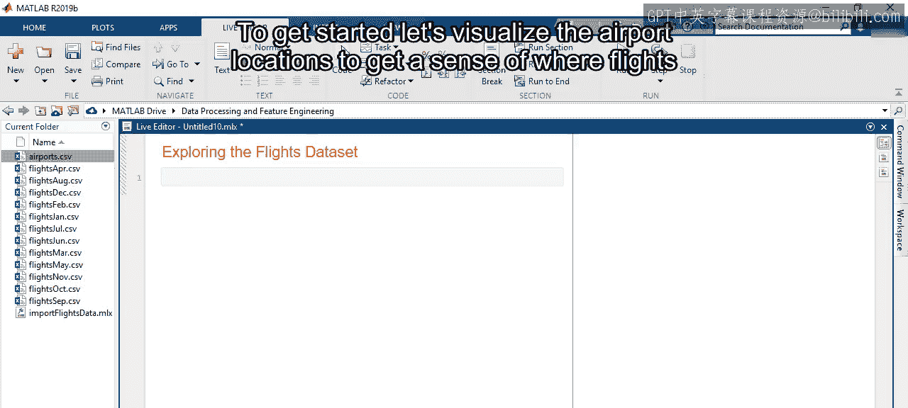
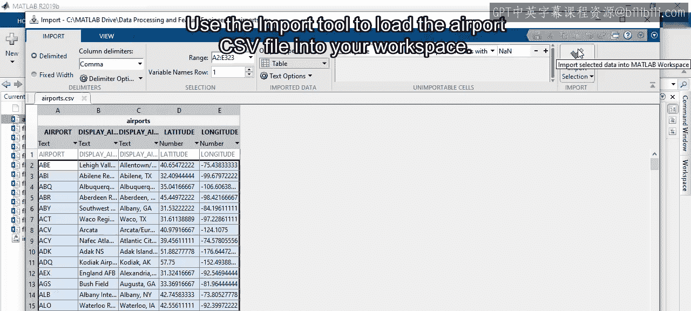
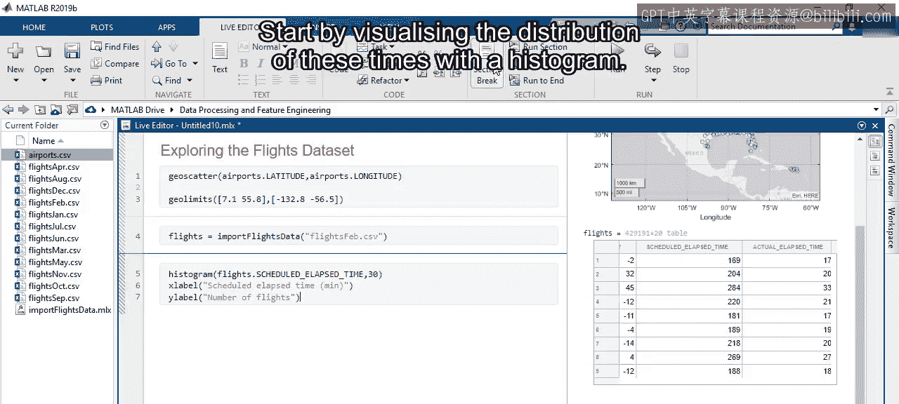
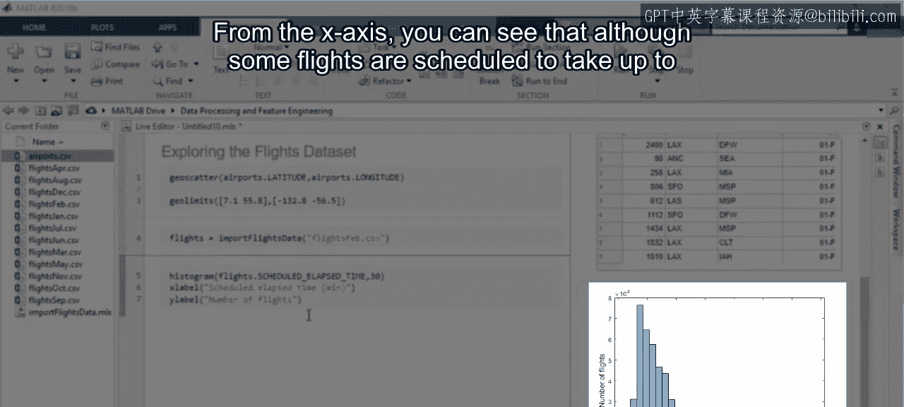
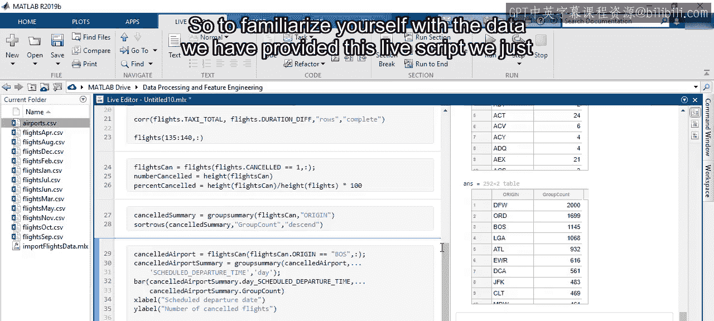

# 5：探索航班数据集

在本节课中，我们将学习如何运用探索性数据分析（EDA）的方法来研究一个航班数据集。我们将从数据导入和可视化开始，逐步分析航班时长、延误原因以及航班取消情况，并在这个过程中练习使用MATLAB的相关函数。

## 数据导入与机场位置可视化

上一节我们介绍了探索性数据分析的基本概念，本节中我们来看看如何将其应用于一个具体的航班数据集。

首先，我们需要将包含机场信息的CSV文件导入工作区。使用导入工具可以完成此操作。

由于数据中包含了纬度和经度信息，我们可以使用 `geoscatter` 函数将它们绘制在地图上。

从图中可以看到，美国及其领土范围内分布着322个商业机场。你可以使用坐标轴工具栏来放大查看特定区域，例如美国本土。

对应的代码会自动生成，点击“更新代码”即可将其添加到脚本中。

## 分析航班时长分布

在任何一天，这些机场之间都有成千上万的航班。有些是短途航班，如波士顿和纽约市之间；有些则横跨整个美国。那么，短途航班和长途航班哪个更常见呢？

为了找出答案，首先需要使用之前介绍的自定义导入函数导入其中一个航班CSV文件。我们加载二月份的数据。在数据表中可以看到所有变量。

`ScheduledElapsedTime` 变量表示航班预计的飞行时长（分钟）。我们可以从绘制这些时间的直方图开始分析。

从X轴可以看出，虽然有些航班计划飞行时间长达800分钟，但大多数航班的计划时间都少于200分钟。

因此，短途航班显然更为常见。

## 比较计划与实际飞行时间

那么，与计划时间相比，航班实际飞行了多久呢？这个信息包含在 `ActualElapsedTime` 变量中。

为了计算两者的差异，我们可以用实际时间减去计划时间，并将结果作为新列添加到表中。计算公式如下：

`DurationDifference = ActualElapsedTime - ScheduledElapsedTime`

结果为负值表示航班实际用时少于计划时间。

接下来，创建一个直方图来可视化这个差异。看起来大多数航班都按计划时间准确执行，但有些航班比预期多花了200多分钟。这是为什么呢？

## 探究延误原因

也许那些航班在空中花费了更多时间。为了调查是否存在相关性，可以绘制空中飞行时间与时长差异的散点图。

😊，这两个变量之间似乎没有任何关系。那还可能是什么原因呢？

实际上，总飞行时间是滑出时间、空中时间和滑入时间的总和。那么，总滑行时间与时长差异的关系图是怎样的呢？

可以看到这些变量之间存在关系。你可以通过计算相关系数来量化这种关系的强度。在MATLAB中，可以使用 `corr` 函数：

`correlation = corr(TotalTaxiTime, DurationDifference, ‘Rows’, ‘complete’)`

最初的计算结果 `NaN` 意味着这些变量包含缺失值。可以通过指定选项仅考虑完整的行来忽略缺失值。

看起来存在相当强的相关性，这表明计划与实际飞行时间之间的差异很大程度上受到滑行时间的影响。

## 分析航班取消情况

好了，我们回答了一个问题，但在这个过程中又发现了一些新问题。例如，`NaN` 条目何时出现？查看航班表可以发现，每个航班都有计划起飞时间，但有些没有实际起飞时间。那些计划起飞但实际未起飞的航班被归类为“取消”。当这种情况发生时，航班表中的 `Cancelled` 变量被赋值为1。

为了更方便地探索这组数据，将所有被取消的航班提取到一个新表中。数据显示，2015年2月共有20,517个航班被取消，这几乎是该月国内航班的5%，是全年其他月份取消率的四倍多。

没有人喜欢听到航班被取消的消息，因此让我们来确定取消发生的时间和地点，以便更好地理解这个问题。

航班取消是普遍现象，还是在特定机场更为普遍？你可以使用 `groupsummary` 函数按机场计算取消的航班数量。

为了找出取消次数最多的机场，可以按降序对结果进行排序。通过查看结果表可以发现，只有少数机场的取消次数超过1000次，大多数机场的取消次数少于100次。这可能是因为大型机场的取消数量本身就更高。

如果是这样，对于一个给定的机场，每天的取消数量应该是相当稳定的。MathWorks总部位于波士顿附近，其机场代码是BOS，让我们检查一下那里的情况。

接下来，再次使用 `groupsummary` 函数，按起飞日期对数据进行分组。然后使用条形图绘制每天的取消数量。

看起来取消数量并不是恒定的。相反，大多数取消只发生在三天内。事实证明，2015年2月是波士顿有史以来破纪录的一个月，降雪量接近两米。你可以在上一门课程使用的风暴事件数据中找到这些风暴的详细信息。

如果你想接受额外的挑战，可以尝试使用风暴事件数据来解释其他机场的航班取消情况。

## 总结与后续探索

本次对航班数据集的探索揭示了许多信息，也引发了更多问题。在本课程的大部分互动中，你都将使用这些数据。

为了让你熟悉数据，我们提供了刚刚创建的实时脚本，以便你可以继续自行探索。例如，你可能想看看非冬季月份的取消百分比如何变化。如果你发现了任何有趣的现象，欢迎在课程论坛中分享。

在本节课中，我们一起学习了如何导入和可视化航班数据，分析了航班时长的分布，探究了实际与计划时间差异的原因，并深入研究了航班取消的模式。通过实践，你掌握了使用MATLAB进行探索性数据分析的基本工作流程。