6：描述分布 📊

在本节课中，我们将要学习如何描述数据的分布。除了计算均值、标准差等汇总统计量，理解数据的分布形状对于得出正确结论至关重要。我们将探讨对称分布与偏态分布的区别，并学习四分位距和箱线图等实用工具。

汇总统计量是快速了解数据的有效方法。

但像均值和标准差这样的统计量只能反映数据的一部分信息。

例如，一个新的观测值取值为1或6的可能性有多大？

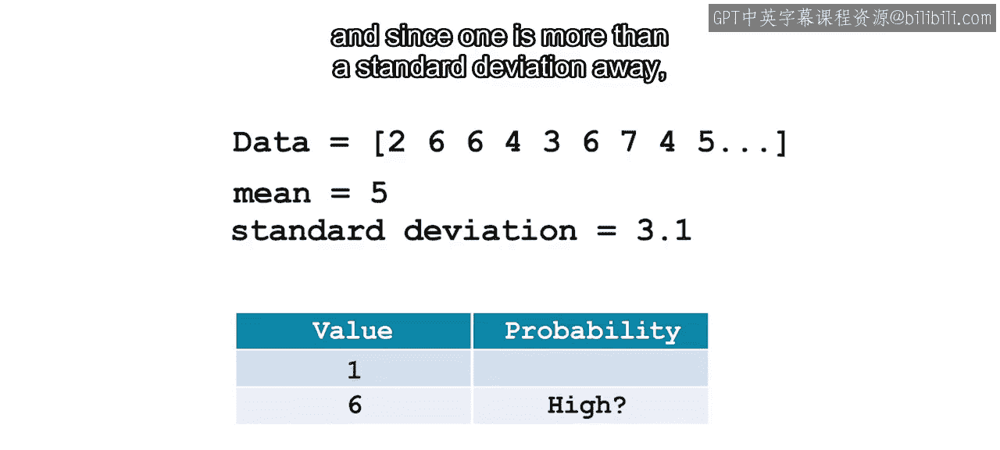

你可能会猜测，由于6接近均值，它出现的概率很高。

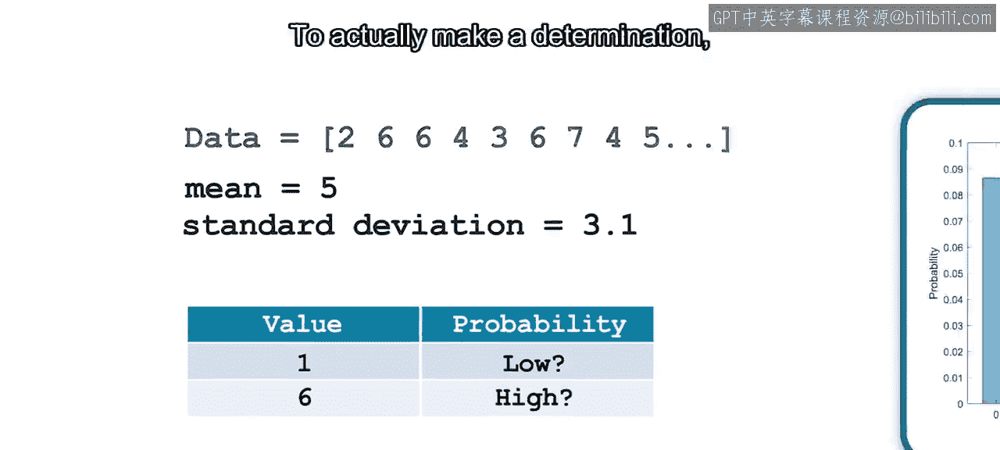

而由于1距离均值超过一个标准差，其出现的概率则低得多。

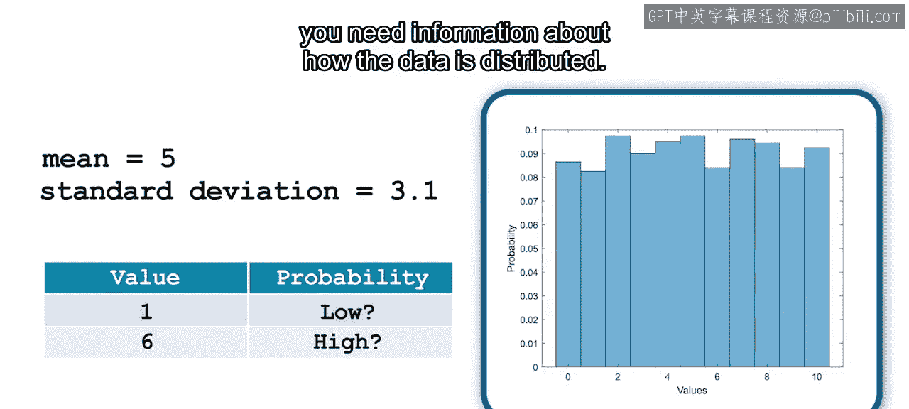

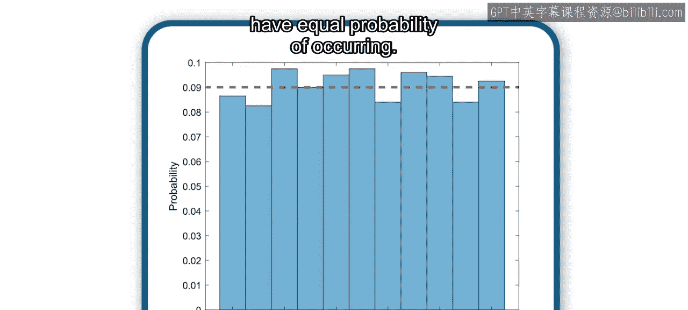

为了真正做出判断，你需要了解数据是如何分布的。

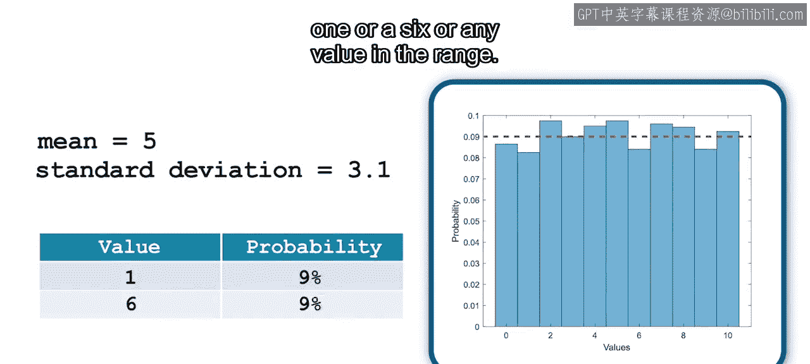

完成此任务的常用可视化工具是直方图。

现在你可以看到，数据呈均匀分布，即所有可能值出现的概率相等。

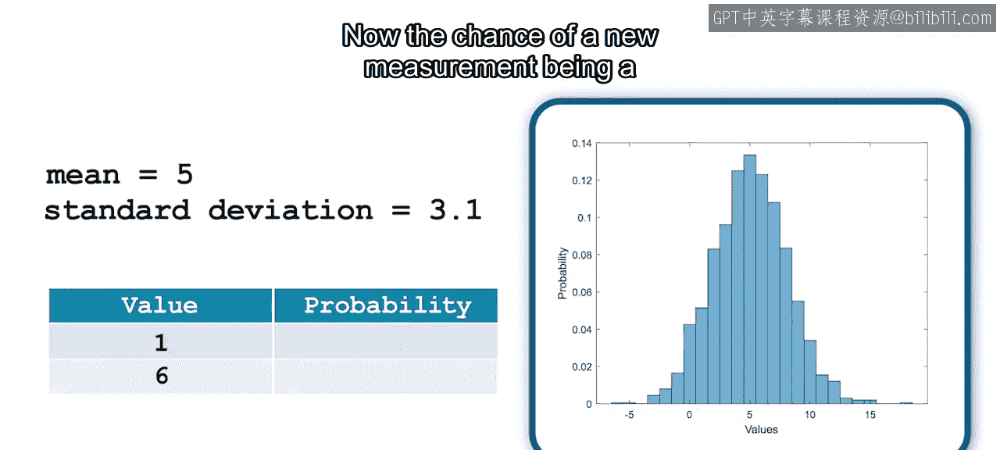

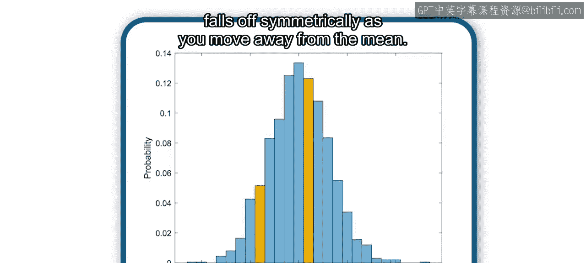

因此，一个新的观测值取值为1、6或该范围内的任何值的概率是相等的。

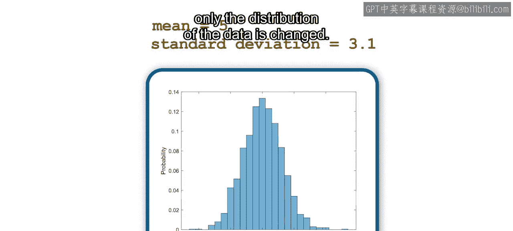

但如果数据呈正态分布呢？现在，一个新的测量值为1的概率远低于为6的概率。

概率在均值附近较高，并随着远离均值而对称地下降。

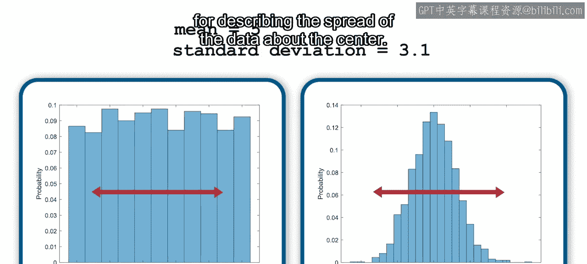

请注意，数据的均值和标准差没有改变，改变的只是数据的分布。

均匀分布和正态分布都关于其均值对称。因此，均值和中位数大致相等。同时，标准差是描述数据围绕中心离散程度的有用度量。

但正如你在航班数据中已经看到的，许多分布并不对称，而是向左或向右偏斜。以下两个数据集具有与之前相同的均值和标准差。

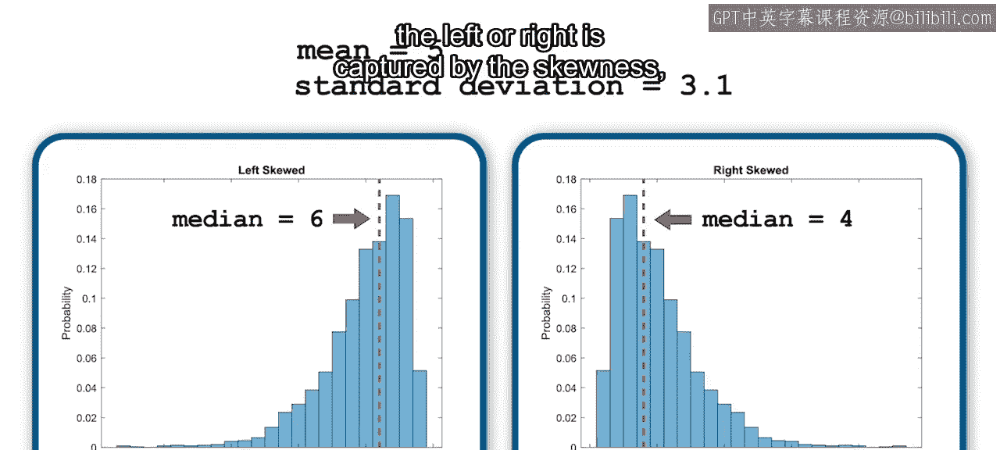

左偏分布具有小于或位于中位数左侧的均值。

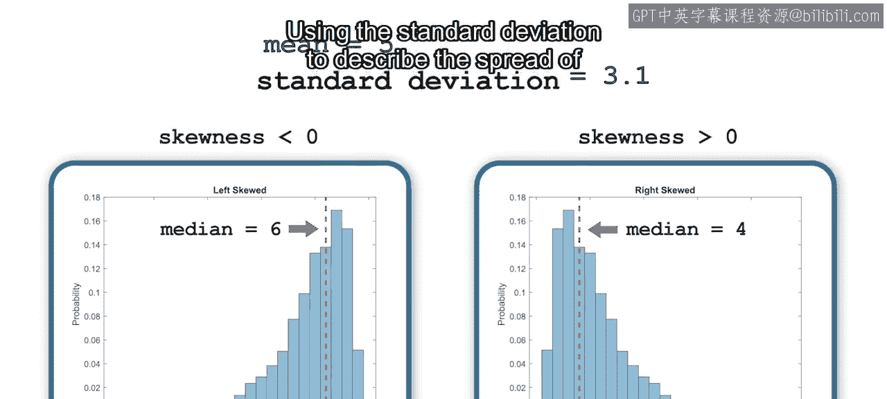

右偏分布具有大于或位于中位数右侧的均值。换句话说，偏斜的方向是数据稀少的方向。数据向左或向右偏移的程度由偏度来捕捉。

对于左偏数据，偏度小于零；对于右偏数据，偏度大于零。

对于偏态分布，使用标准差来描述观测值的离散程度就不那么有用了。

例如，在这个右偏数据中，观测值小于均值的概率为51%，大于均值的概率为35%，等于均值的概率为14%。

描述对称和非对称分布的一个有用度量是四分位距，简称IQR。

四分位距是中间50%的观测值范围。要找到IQR，首先对观测值进行排序，然后找到中位数。

由于中位数是观测值的中间点，它将数据分成两半。

然后找到下半部分的中间值，这个值就是第一四分位数，或Q1。

上半部分的中间值是第三四分位数，或Q3。

IQR是Q3与Q1之间的差值。观察右偏直方图，你能识别出第一和第三四分位数的位置吗？

直方图非常适合观察分布的形状，但可能难以找到中间50%的观测值，特别是对于高度偏斜的数据。

箱线图是另一种有用的可视化工具，用于查看数据是如何分布的。

这个箱线图是垂直方向的，意味着数据集中的值现在位于Y轴上。

箱线图中的箱子包含了IQR，如图所示。

箱子内部的线代表数据的中位数。

图的须线延伸到数据中不被视为异常值的最小值和最大值。

异常值则单独绘制，从而展示数据的完整范围。如你所见，异常值是远离分布中心的观测值，将在后续模块中详细介绍。

因为箱线图的主要特征是四分位距，所以更容易识别分布的中间50%。

你还可以通过观察中位数是否更接近某个四分位数，以及箱子两侧须线的长度来识别偏度。

此外，由于箱线图是一种紧凑的可视化方式，它对于比较分布非常有用。

让我们看看本视频中检查的所有四个数据集的箱线图。

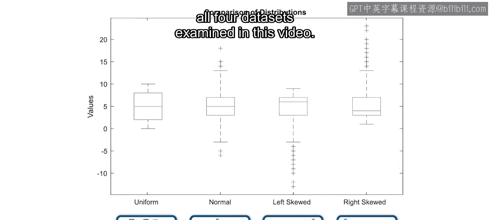

请记住，每个数据集都具有相同的均值和标准差。

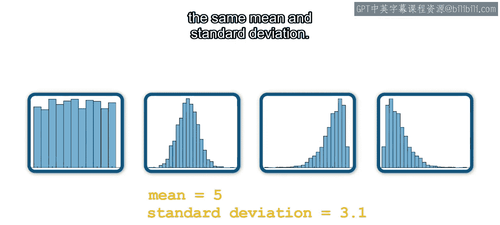

你可以清楚地看到均匀分布和正态分布是对称的。

你还可以看到偏态数据集的中位数如何更接近某个四分位数值。

本节课中我们一起学习了描述数据分布的核心知识。除了计算汇总统计量，在从数据中得出结论之前，检查分布的形状至关重要。

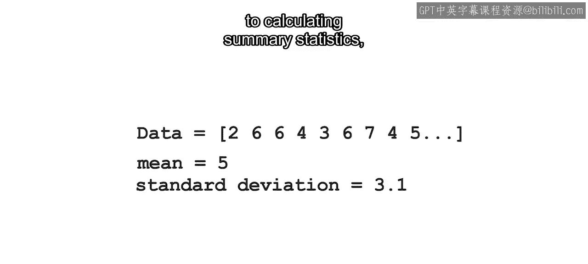

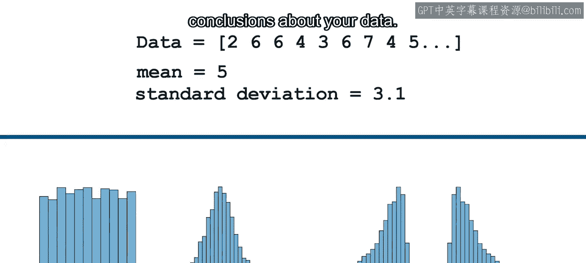

数据常常是偏斜的，这使得识别分布中心变得困难。

四分位距是一个有用的度量，因为它定义了中间50%观测值的范围。

箱线图通过突出显示数据的IQR和中位数，帮助你可视化分布的中心。

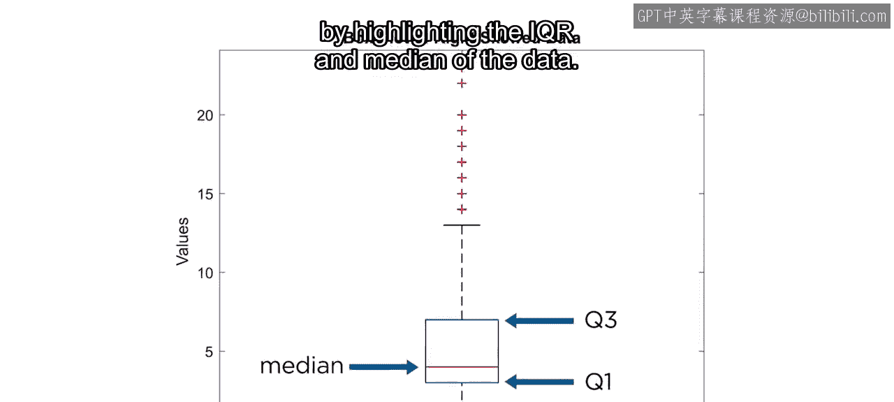

现在你已经熟悉了描述分布的基础知识，接下来的视频将向你展示如何在MATLAB中应用这些概念。

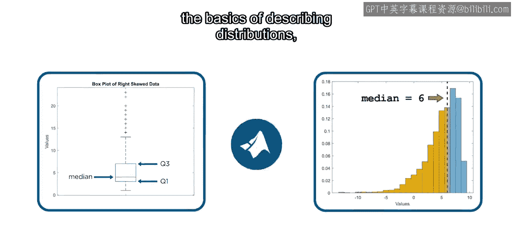

