# 7：分布示例

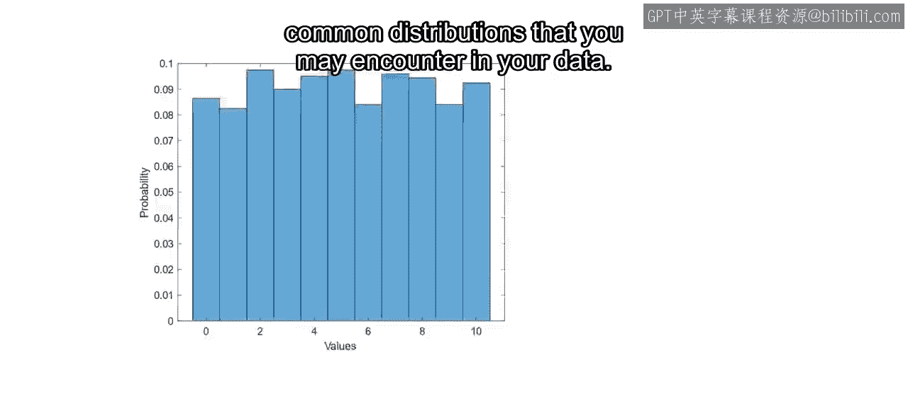

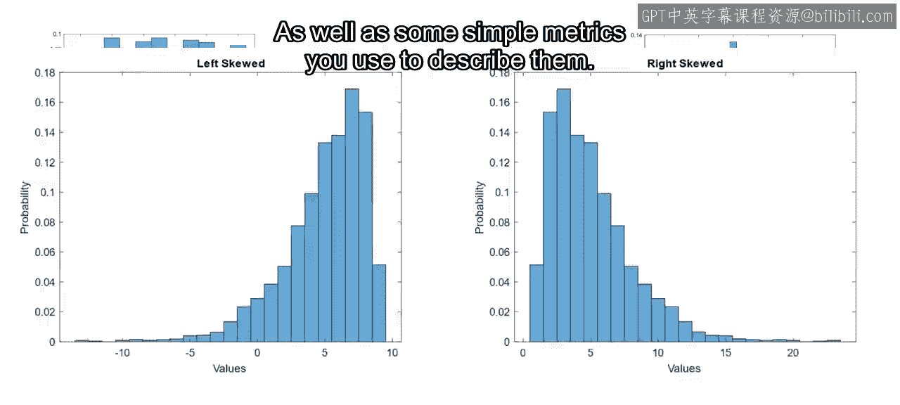

在本节课中，我们将通过几个具体的例子，学习如何可视化数据分布并计算描述性统计量。你将有机会学习如何解读这些函数提供的输出结果。

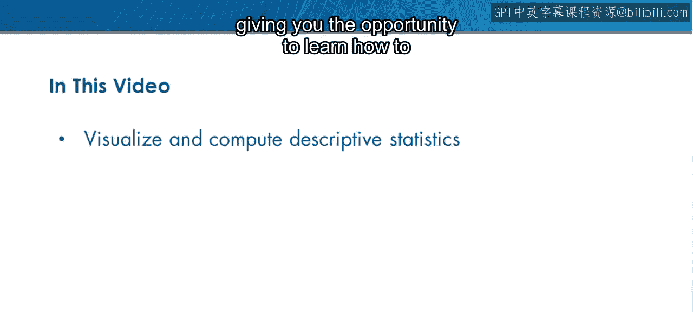

上一节我们介绍了数据中常见的分布类型以及一些用于描述它们的简单指标。本节中我们来看看几个具体的分布示例。

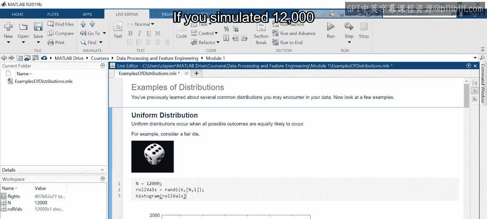

## 均匀分布示例

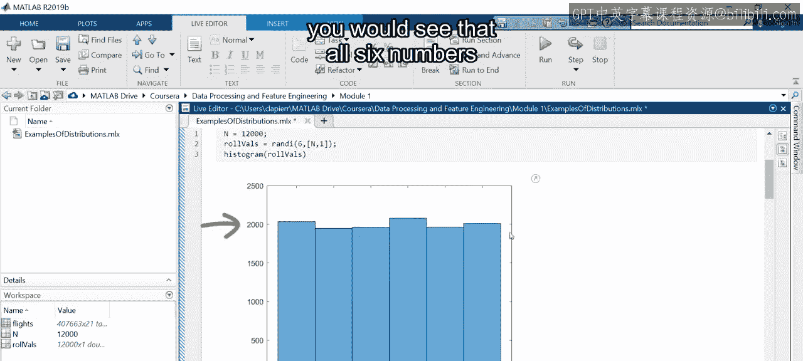

让我们从观察均匀分布开始。当所有可能的结果出现的可能性都相等时，就会发生均匀分布。

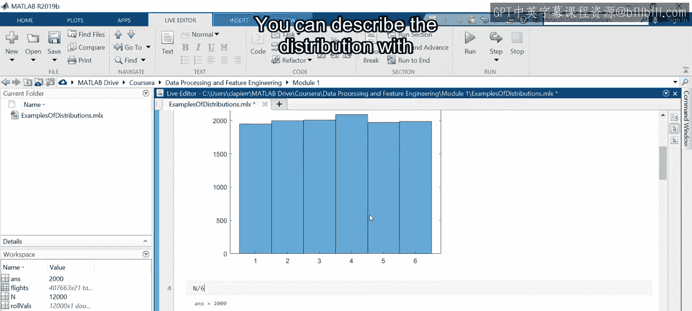

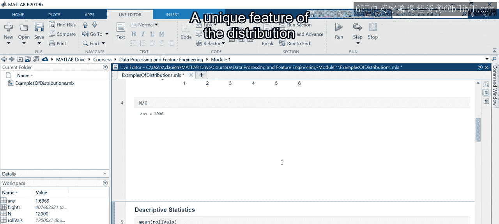

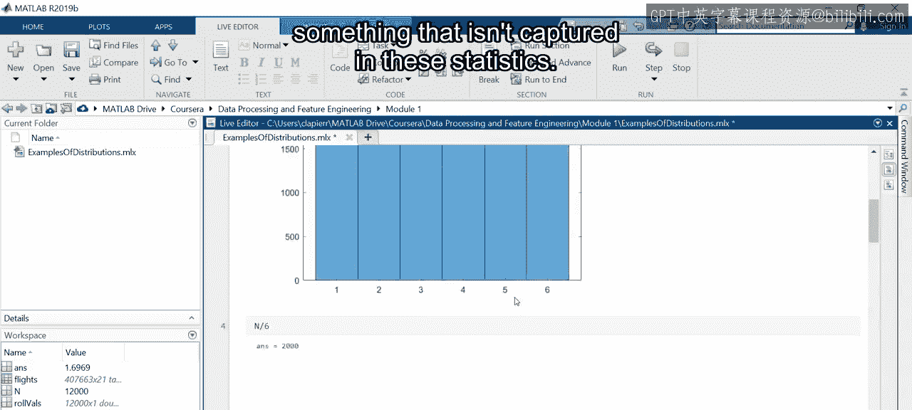

例如，考虑一个公平的六面骰子，其六个面分别标有数字1到6。如果你模拟了12,000次投掷，并创建结果的直方图，你会看到所有六个数字出现的次数都大约为2000次。

你可以用从观测值计算出的两个统计量来描述这个分布：**均值**用于指示中心位置，**标准差**用于描述离散程度。

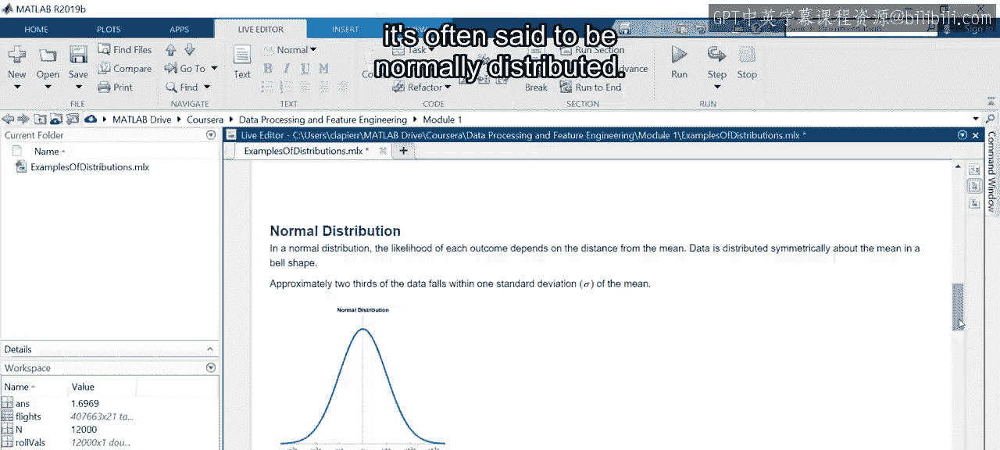

均匀分布的一个独特特征是它呈矩形，这个特征无法通过上述统计量捕捉到。

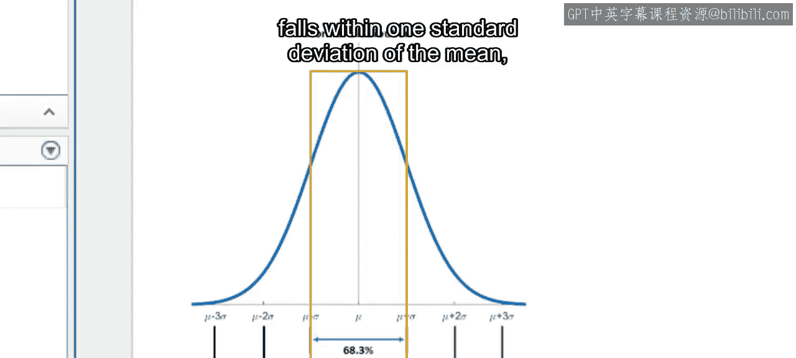

## 正态分布与偏态分布

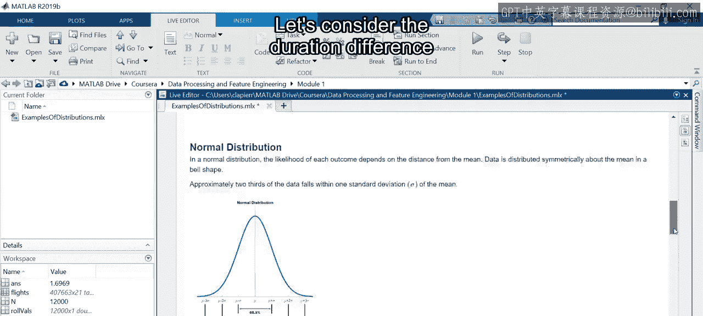

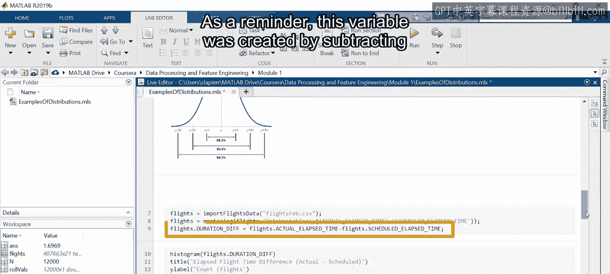

在大多数数据集中，结果出现的概率随着其与均值距离的增加而减小，导致分布呈现出明显的峰值。当数据关于均值对称分布且呈钟形时，通常被称为正态分布。

均值和标准差提供了对分布形状的洞察。大约三分之二的数据落在均值的一个标准差范围内，而几乎100%的数据落在三个标准差范围内。

让我们考虑之前创建的“时长差”变量。作为提醒，这个变量是通过从实际飞行时间中减去计划飞行时间得到的。

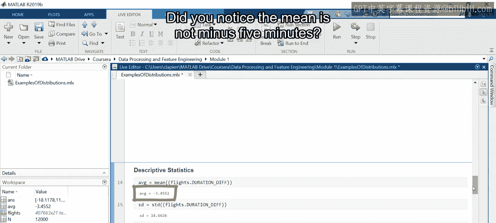

通过创建直方图，你可以看到分布似乎关于峰值（-5分钟）对称。这意味着航班最有可能比计划时间少用5分钟。然而，知道峰值差异并不能告诉你其他值出现的可能性有多大。为此，你需要分布的均值和标准差。通过计算均值的一个标准差范围内的值，你可以确定大约68%的航班的时长范围。

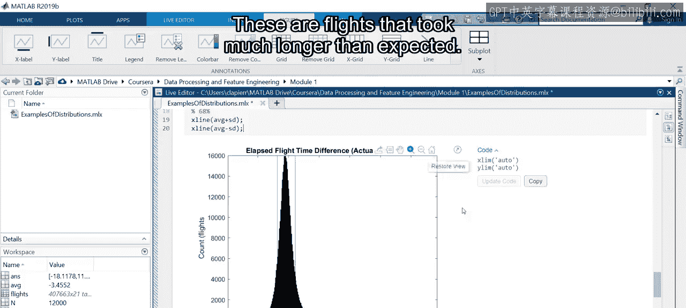

你是否注意到均值不是-5分钟？为什么？你是否注意到X轴延伸到了200？这是因为右侧有一些数据点，除非你放大，否则看不到。这些是比预期时间长很多的航班。

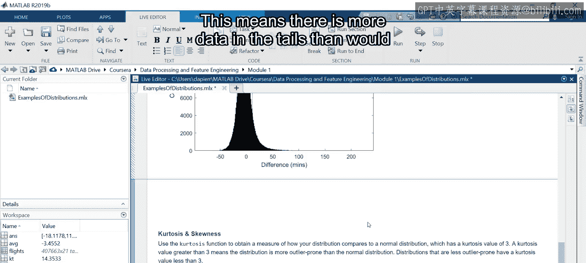

使用**峰度**函数来获取你的分布与正态分布（峰度值为3）的比较度量。这里的峰度值约为14，这意味着尾部数据比数据呈正态分布时预期的要多。

然而，峰度并不能告诉你数据在两个尾部之间是如何分布的。为此，使用**偏度**函数。通常，大于+1或小于-1的值被归类为显著偏斜。这里的正值表明该分布是右偏的。因此，尽管乍一看时长差似乎是正态分布，但实际上它是偏斜的。

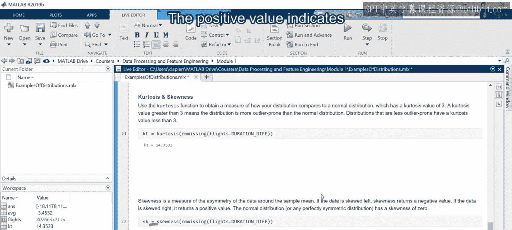

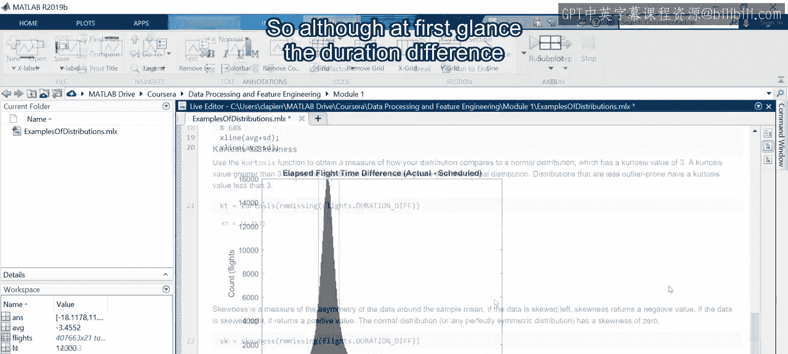

在直方图中很难看到这一点，因为那些较长航班的计数非常低。因此，每当你遇到长尾分布时，请使用偏度函数来检查你的分布是否偏斜。

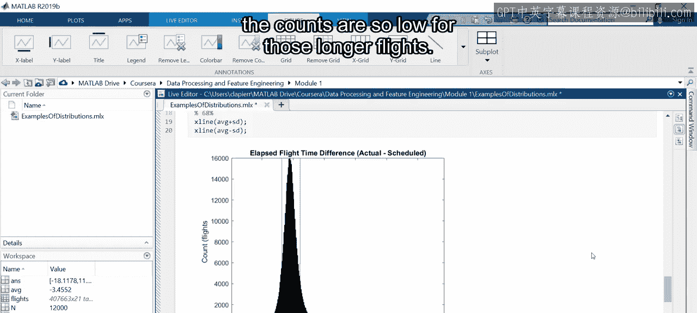

## 箱线图的应用

有时，你感兴趣的是数据及其尾部。一种常用于检查此类数据的可视化方法是箱线图。

在箱线图中，水平红线是时长差的中位数（-5）。箱子显示了四分位距的范围。须的长度可以自定义，但默认情况下，它们延伸到小于箱子高度1.5倍的最后一个数据点。所有须外的数据点都被视为异常值，并被单独绘制出来。正是这些异常值之前很难看到。

当你比较多个数据集时，箱线图的真正威力就显现出来了。例如，如果你想看看在10个最繁忙机场的时长差是什么样子呢？你可以通过将分组变量指定为箱线图函数的第二个输入，在单个图形中创建多个箱线图。

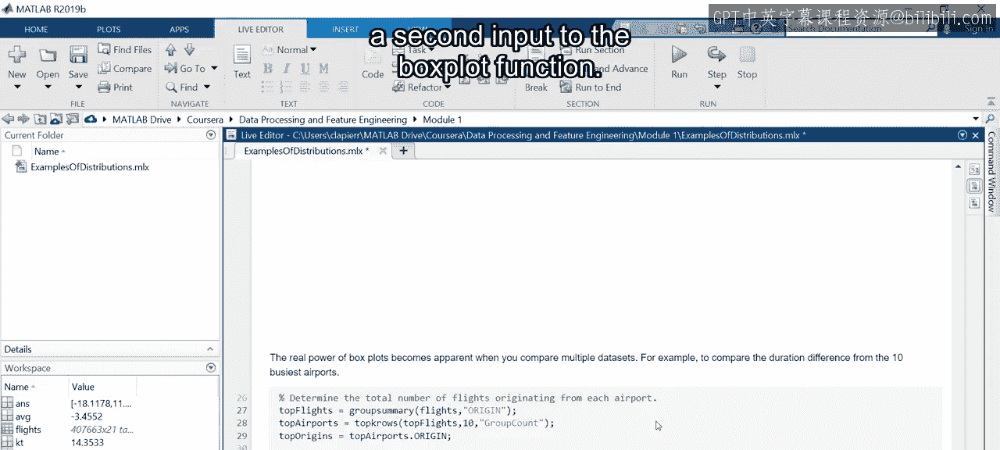

现在，一目了然，你可以看到所有10个机场的中位数和四分位距是相似的。此外，尾部数据的分布使你能够更容易地比较每个机场的异常值数量。

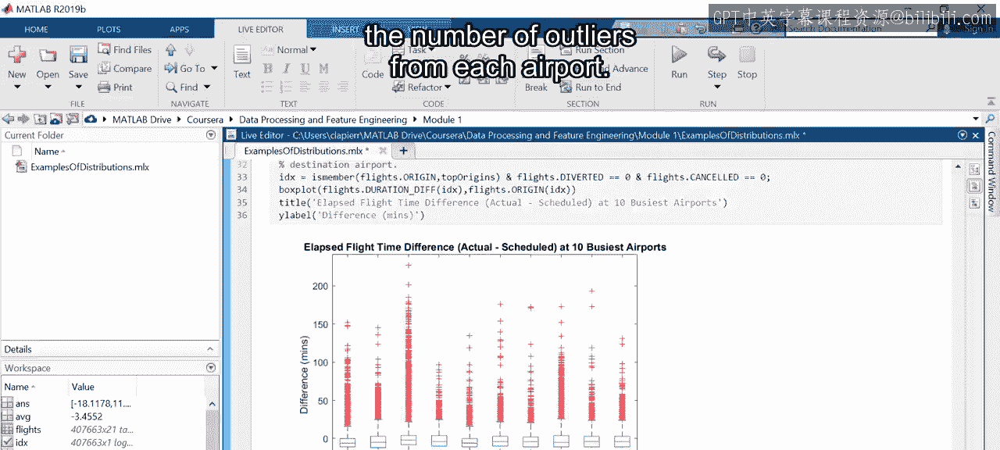

## 总结

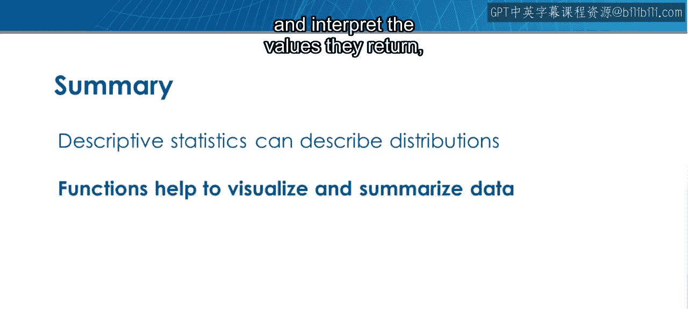

本节课中我们一起学习了如何通过描述性统计量来描述分布。MATLAB提供了内置函数来可视化和总结你的数据。了解如何使用这些函数以及如何解读它们返回的值，有助于你快速分析大量数据。