8：可视化多维数据 📊

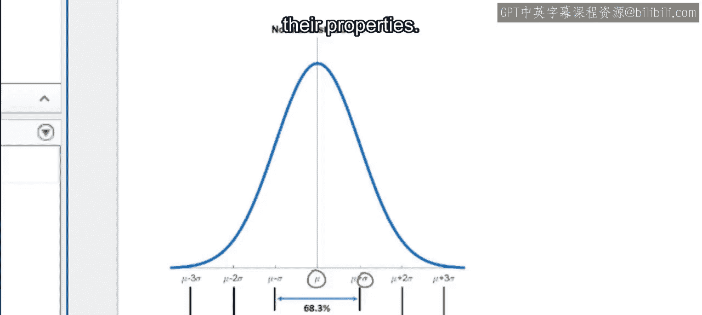

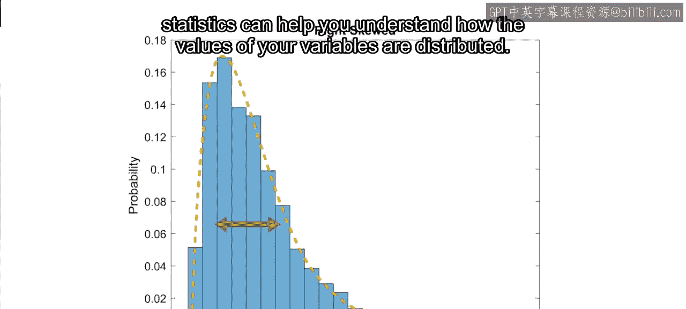

在本节课中，我们将学习如何可视化多维数据。我们将探索多种图表类型，包括二维直方图、分箱散点图、散点直方图和热力图，并了解如何通过分组变量或颜色变量为图表增添信息。最后，我们将介绍两种处理高维数据的方法：绘图矩阵和平行坐标图。

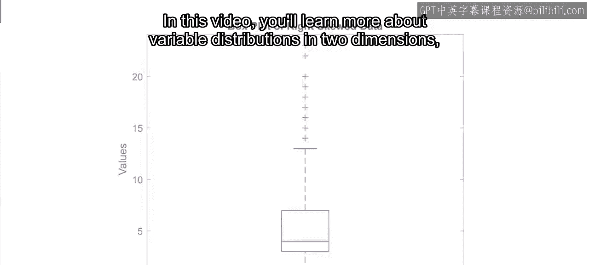

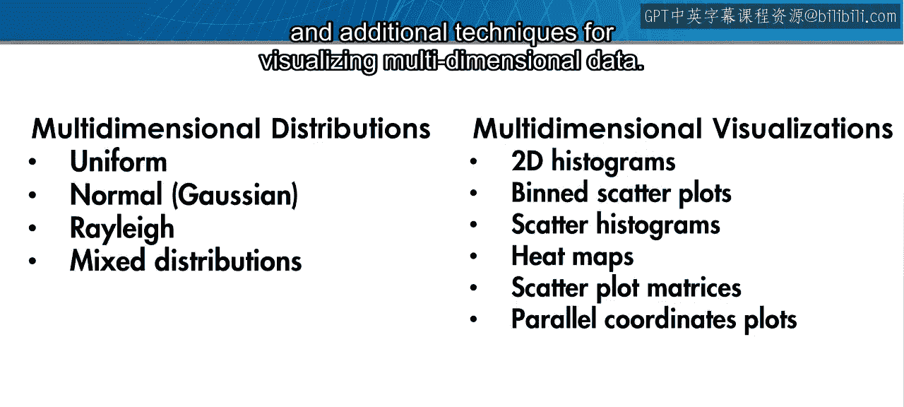

---

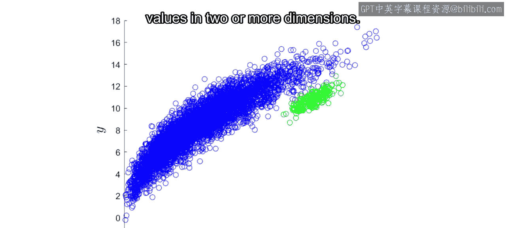

上一节我们介绍了常见的分布类型及其属性，也看到了直方图、箱线图和统计量如何帮助我们理解单个变量的值分布。

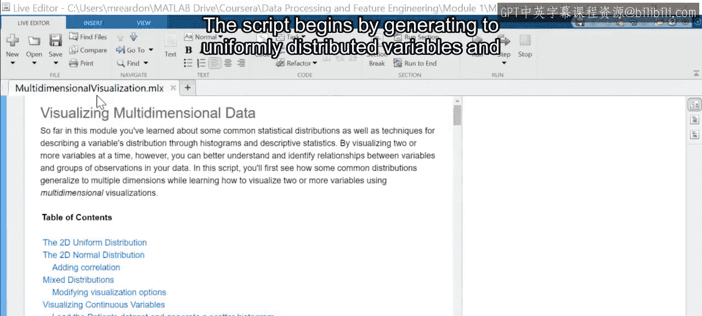

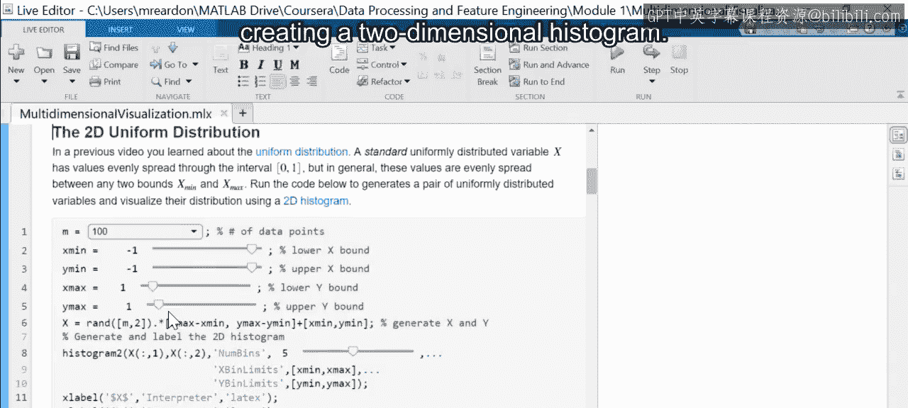

本节中，我们将学习二维变量分布的更多知识，以及可视化多维数据的其他技术。

这些可视化方法可以帮助我们识别变量之间的关系，这些关系可以被预测模型捕捉；或者识别观测值之间的关系，这些关系在二维或更多维度上表现为数据值的聚类。

为了跟随学习，请使用课程代码文件中名为 `multidimensional_visualization` 的脚本。该脚本首先生成两个均匀分布的变量，并创建一个二维直方图。

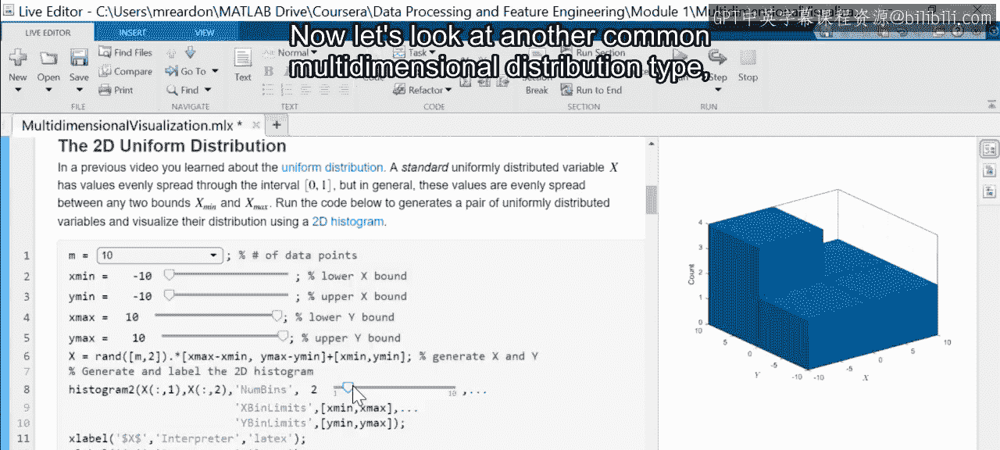

`histogram2` 函数用于将变量范围划分为矩形分箱，计算落入每个分箱的值的数量，并使用高度对应分箱计数的条形图来绘制结果。

你可以使用控件来改变每个变量的边界或数据集的大小，并观察这些变化如何反映在直方图中。请注意，当观测数量减少时，由于随机噪声，可能难以识别变量的分布。在这种情况下，调整直方图的属性（如分箱宽度或数量）会有所帮助。

现在，让我们看看另一种常见的多维分布类型：多元正态分布。

此部分的代码生成两个正态分布的变量，并使用分箱散点图进行可视化。`binscatter` 函数以与 `histogram2` 相同的方式对变量值进行分箱，但它不是用条形高度来表示分箱计数，而是用颜色深浅来表示，颜色越深表示计数越高。

使用控件改变每个变量的均值和标准差，可以清楚地看到分布的中心可以移动，其椭圆形可以被拉伸。然而，分布仍然在 X 和 Y 方向上保持对称，类似于之前展示的均匀分布变量。在这两种情况下，变量被称为**独立**的。也就是说，一个变量的值与另一个变量的对应值无关。然而，通过选择非零的相关系数，你可以在变量之间引入线性关系。

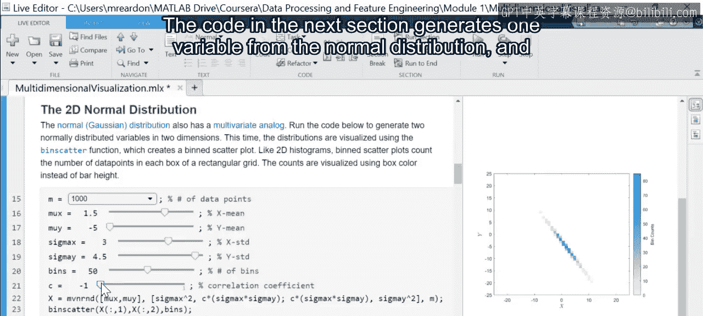

请注意，与二维直方图相比，分箱散点图的俯视图更容易辨别此类关系。

虽然两个变量可能由相同的分布描述，但它们也可能属于不同的分布。

下一部分的代码生成一个来自正态分布的变量和另一个来自瑞利分布的变量。这次使用散点直方图来可视化变量，它结合了散点图和每个变量的独立直方图。

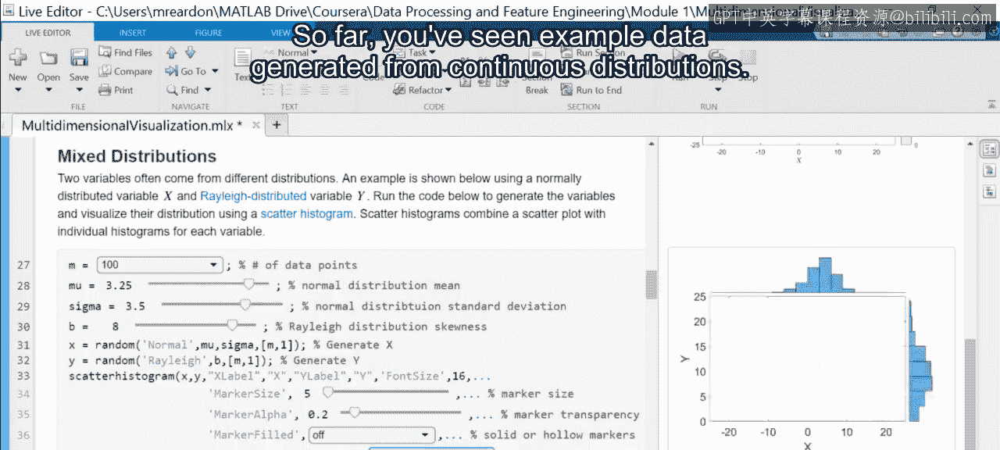

有了独立的直方图，比分箱散点图更容易确定每个变量的单独分布。

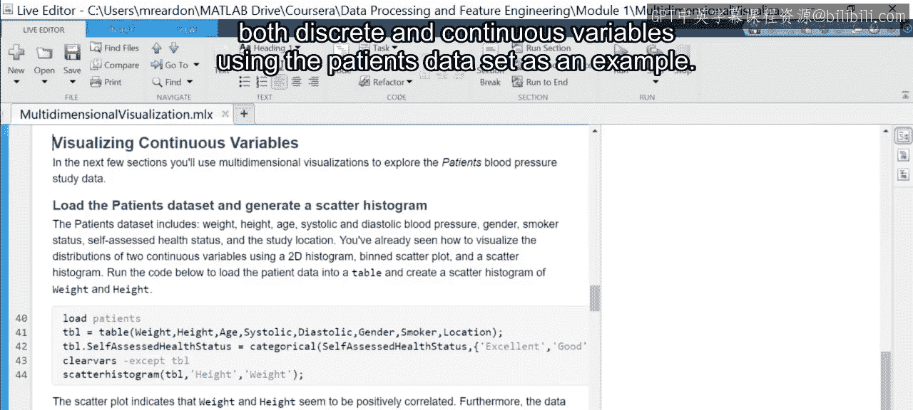

你可以使用控件修改正态变量的均值和标准差，以及控制瑞利变量偏度的参数 `B`。通常，更改其他显示选项（如标记大小或标记填充属性）可以帮助清理较大数据集的散点图。你也可以更改直方图属性，如分箱宽度和数量或直方图显示样式。例如，`smooth` 样式选项对于小型或嘈杂的数据集可能效果更好。

到目前为止，我们看到了从连续分布生成的示例数据。在本节中，你将看到如何使用患者数据集作为示例，来可视化同时包含离散变量和连续变量的数据集。

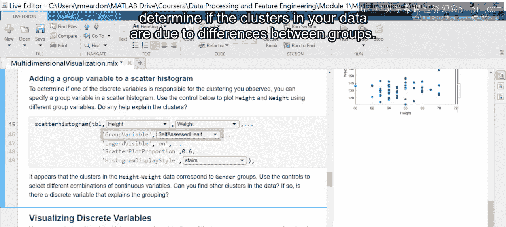

这两个变量之间的正相关关系有一个明显的物理原因，但这两个聚类的原因是什么？通过添加一个离散变量作为分组变量，可以帮助确定数据中的聚类是否是由于组间差异造成的。

例如，现在很明显，身高和体重值的聚类很可能与患者的性别有关。

接下来，让我们看看如何使用热力图来可视化两个离散变量，如吸烟状况和健康自评。热力图是分箱散点图的离散类比，其中每个值的组合由网格上的一个彩色矩形表示，颜色由属于该子组的观测数量决定。

热力图也可以通过指定一个颜色变量和一个用作颜色方法的统计量，来汇总连续变量的值。然后，每个矩形的颜色强度由应用于每个子组的统计量值决定。

例如，自评健康为“优秀”的吸烟者的收缩压中位数为 129.5，而自评健康为“优秀”的非吸烟者的中位数则低 10 点。

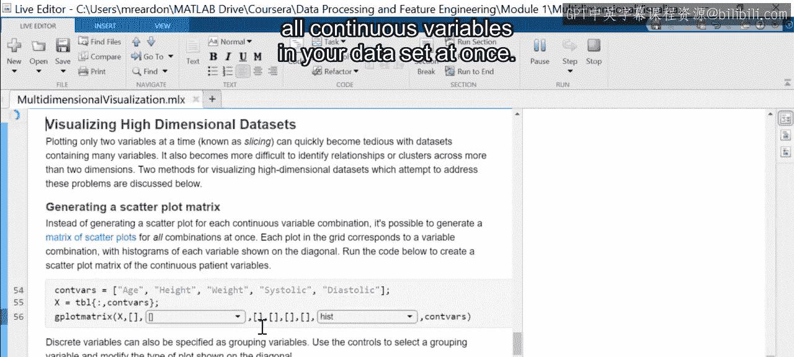

之前的可视化方法使我们能够同时可视化两个变量，并可能添加第三个变量作为分组或颜色变量。但是，如何一次查看整个数据集呢？让我们看看一些可视化高维数据集的方法。

`gplotmatrix` 函数允许你一次性为数据集中的所有连续变量创建散点图和直方图。每个变量组合的散点图排列在一个网格中，每个变量的直方图显示在对角线上。

散点图矩阵使你能够快速查看同一图形中的所有变量对（称为切片），这可以快速概述每个变量的分布情况以及两个变量之间的关系。可以添加离散变量作为分组变量，以便搜索观察到的任何聚类的潜在原因，或识别因组而异的变量分布和关系。

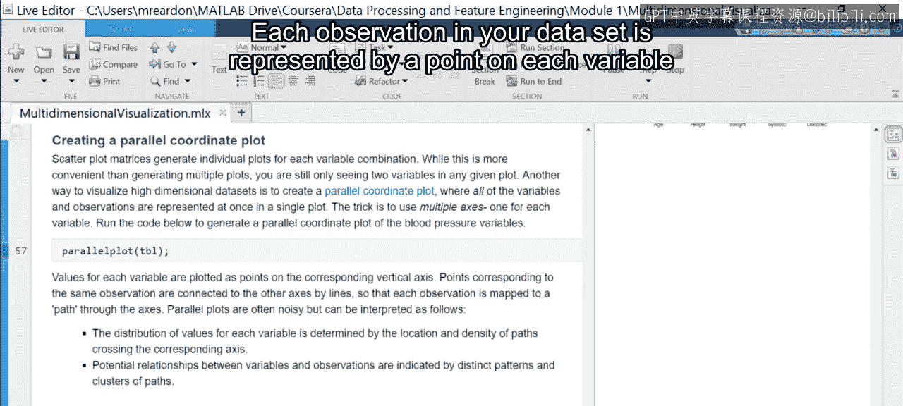

虽然绘图矩阵通过多个图表提供高维数据集的信息，但平行坐标图通过包含多个坐标轴（每个变量一个）使你能够在同一图表中查看所有变量。数据集中的每个观测值由每个变量轴上的一个点表示，其位置由该变量的值决定。然后用线段连接这些点，为每个观测值形成一条单独的路径。

每个变量的值分布可以通过路径的相对密度以及它们穿过每个轴的值来推断。变量之间的关系和观测值的聚类由路径的聚类表示。

正如你所看到的，平行坐标图一次传达大量信息，因此可能难以解释。然而，通过使用可用的选项，可以提高图表的清晰度。例如，通过将离散变量作为分组变量包含进来，我们可以看到血压变量按吸烟者聚类，而体重、年龄和身高则没有。还提供了归一化选项，以确保变量轴具有相似的尺度。其他绘图选项，如线宽和透明度，可以进行调整，以减少较大或高度聚类的数据集的杂乱。

---

**总结**

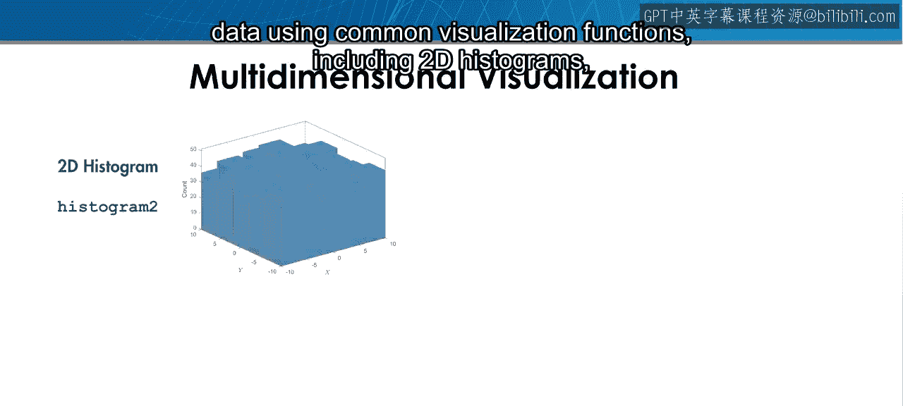

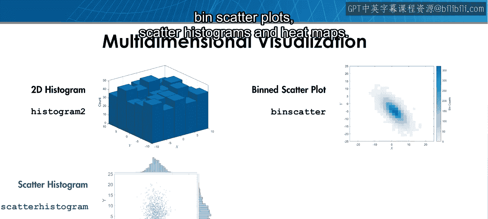

在本节课中，我们学习了如何使用常见的可视化函数来可视化多维数据，包括：
*   二维直方图
*   分箱散点图
*   散点直方图
*   热力图

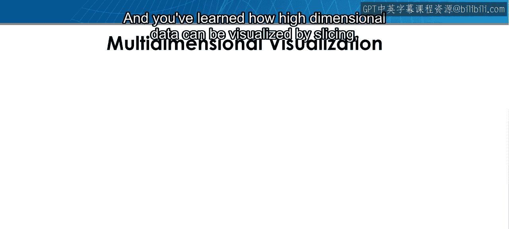

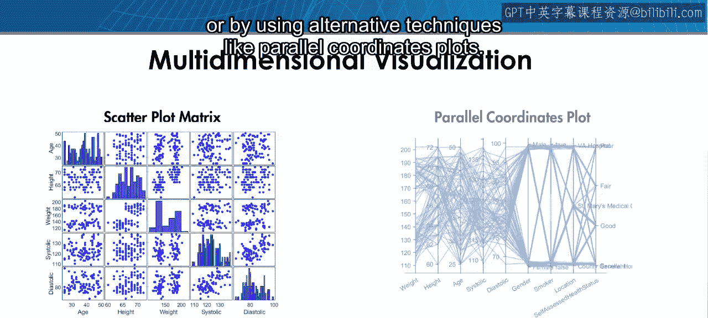

我们还学习了如何通过切片或使用平行坐标图等替代技术来可视化高维数据。

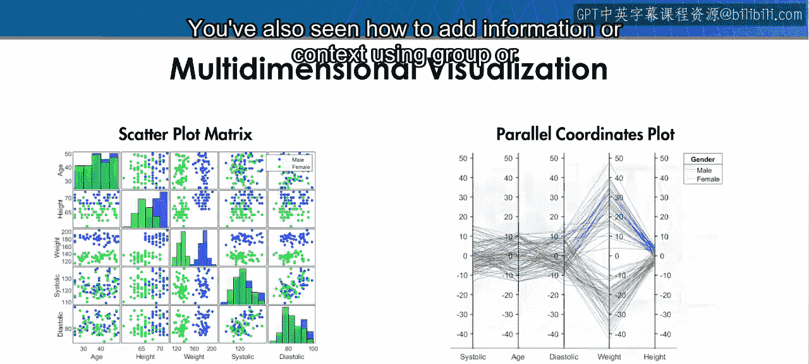

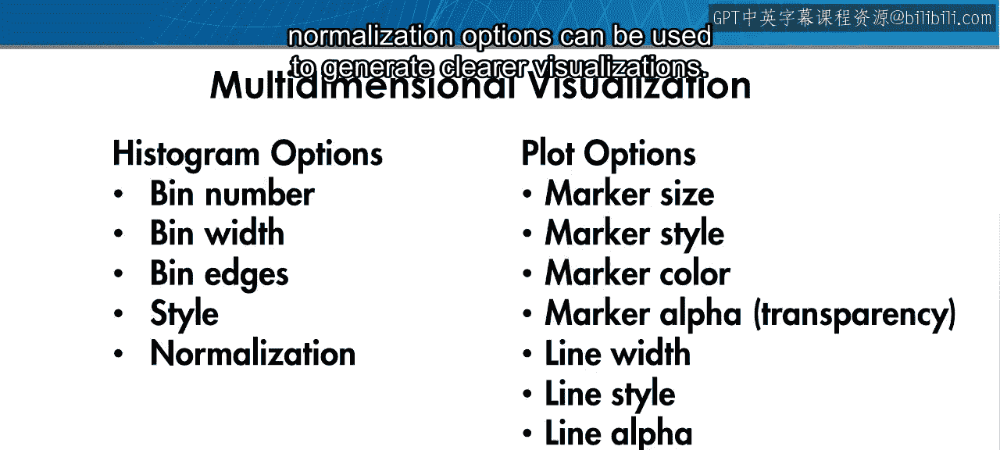

此外，我们看到了如何使用分组或颜色变量来添加信息或上下文，以及如何使用直方图、绘图和归一化选项来生成更清晰的可视化。

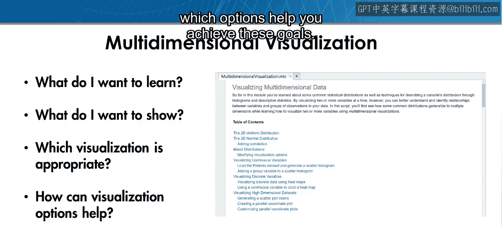

现在，是时候让你自己去探索这些可视化了。当你运行脚本时，请思考你想从每个可视化中学到什么，你想向他人传达什么，以及哪些选项能帮助你实现这些目标。