模块1：数据探索总结 🎯

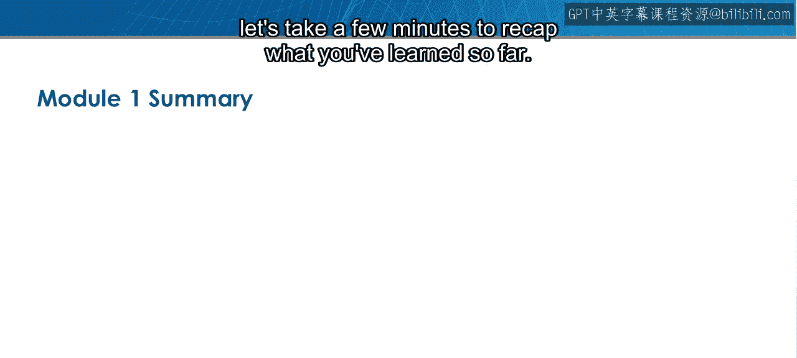

在本节课中，我们将回顾并总结模块1“数据探索”阶段所学习的关键概念与技能。您已经完成了对2015年美国国内商业航班数据集的初步探索，并掌握了多种数据描述与可视化技术。

---

恭喜您完成模块1的学习。在进入测验之前，让我们花几分钟时间回顾一下到目前为止所学的内容。

您在本模块开始时，首先接触了一个新的数据集，其中包含了2015年美国所有国内商业航班的信息。这个数据集将在整个课程中持续使用。

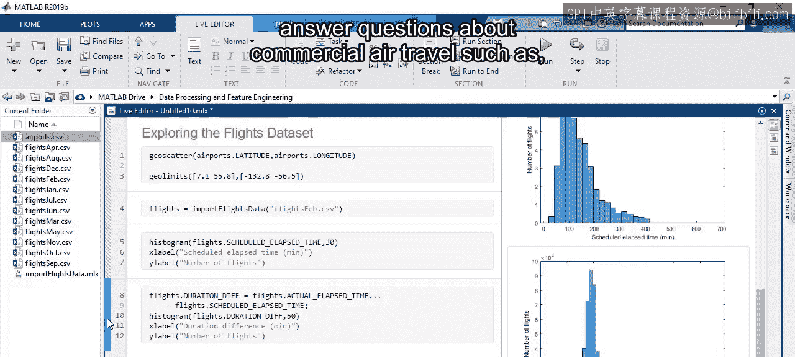

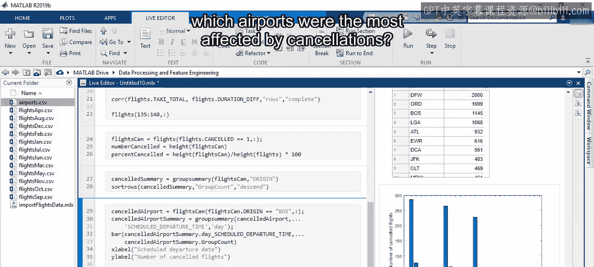

导入数据后，您应用了在专项课程早期学到的技术来探索和可视化数据内容。您练习了操作数据以调查趋势并回答关于商业航空旅行的问题，例如哪些机场受航班取消的影响最大。

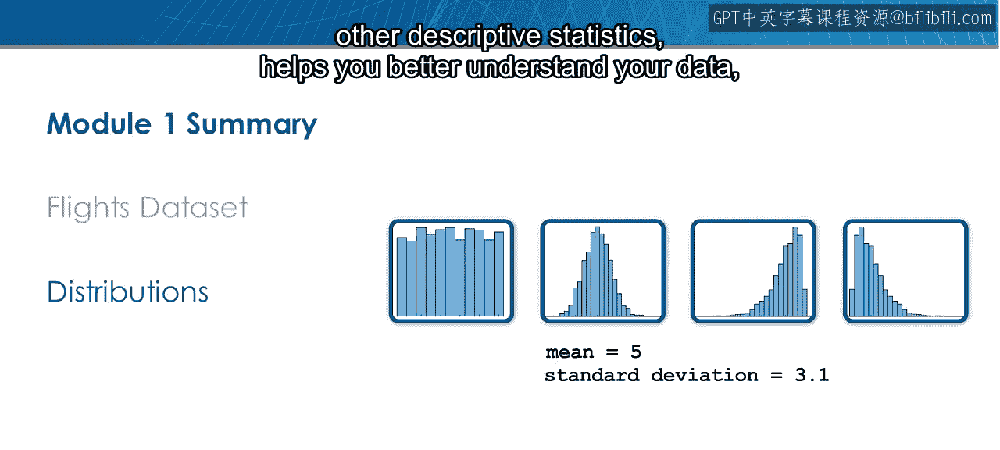

了解观测值的分布情况，而不仅仅是它们的平均值或其他描述性统计量，有助于您更好地理解数据。

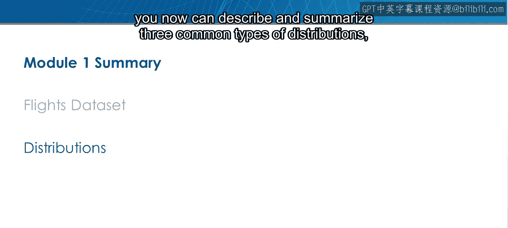

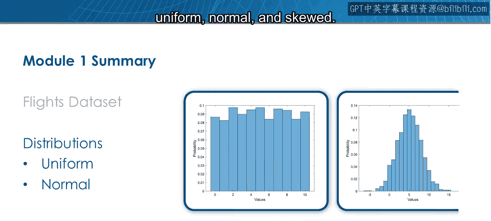

您现在可以描述和总结三种常见的分布类型：**均匀分布**、**正态分布**和**偏态分布**。

通常很难判断偏态分布的中心在哪里，但比较数据组时需要这个信息。

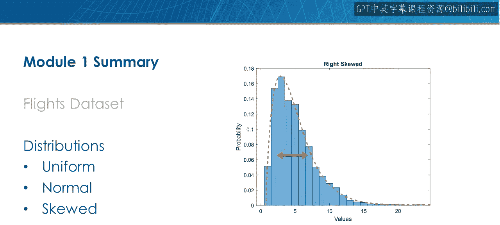

**四分位距**是衡量分布中心的一个稳健指标，因为它识别了中间50%的观测值。您使用**箱线图**来可视化四分位距，并在单个图中比较不同数据组的分布。

当然，并非所有数据都能在二维空间中查看。您在本模块的最后探索了多维数据的可视化技术。

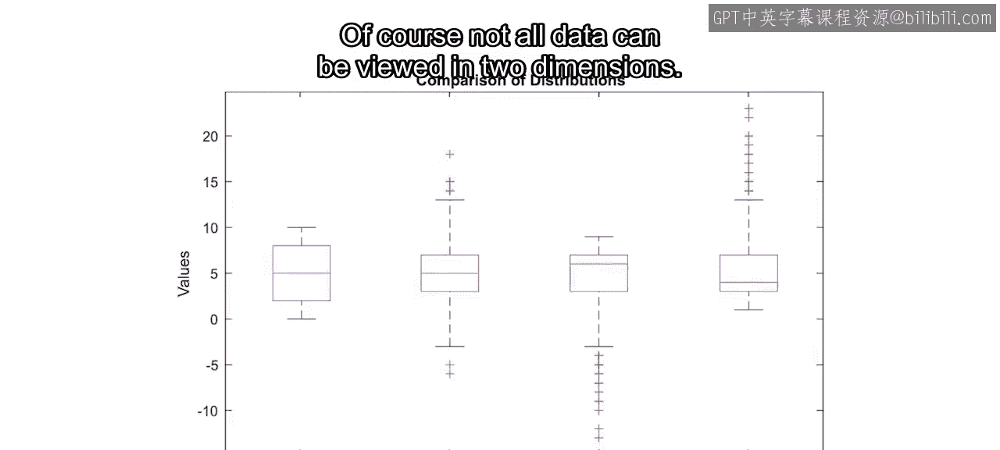

您使用了**二维直方图**、**分箱散点图**、**散点直方图**和**热力图**来同时可视化两个变量。

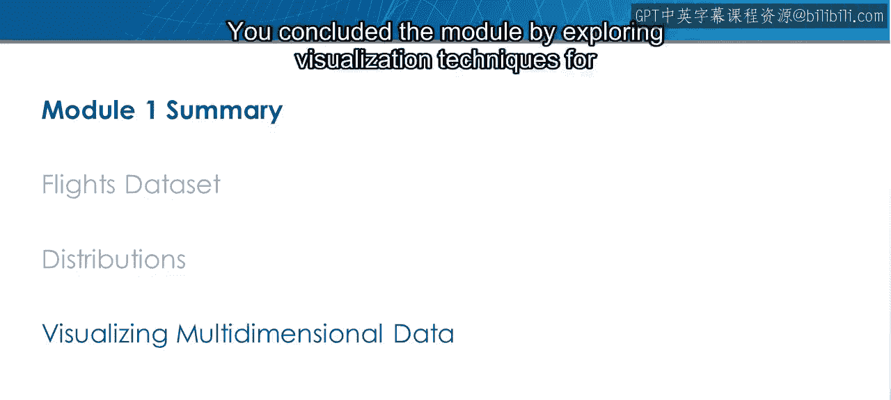

您还学习了如何使用**散点图矩阵**和**平行坐标图**来可视化高维数据。

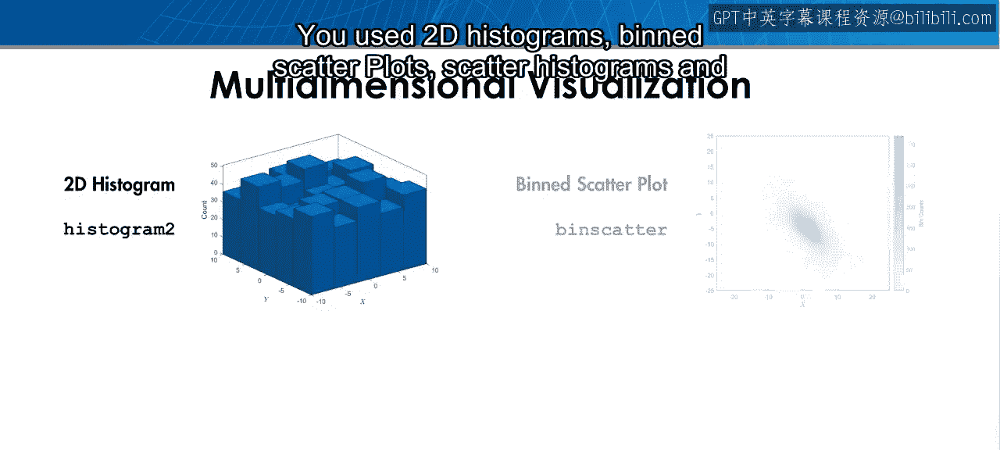

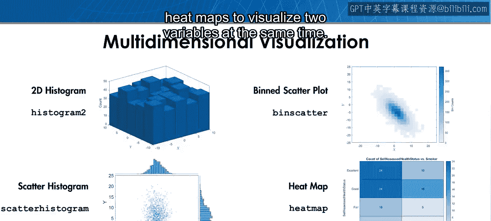

通过将离散变量指定为**分组变量**，您能够使用颜色来识别数据中各组之间的趋势和差异。

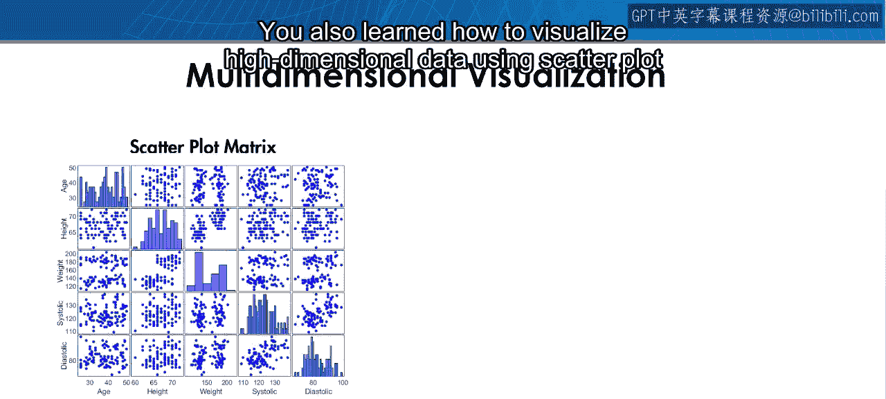

在进行诸如识别异常值等数据清洗任务时，以及在评估特征以去除冗余或无关信息时，您将应用这些技能。

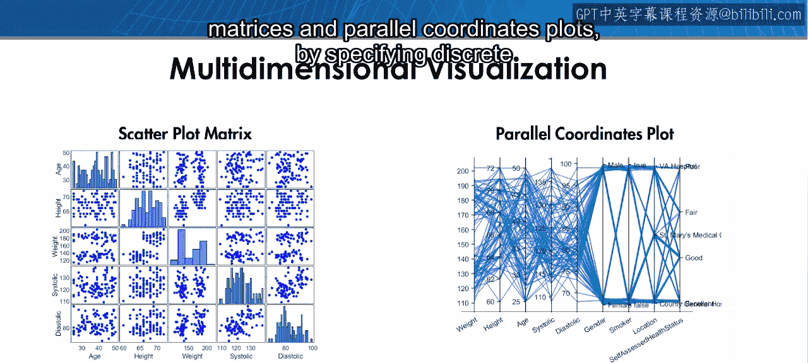

现在是时候通过完成模块1的测验来检验您的知识了。如果遇到困难，请回顾相关课程或在论坛中提问。

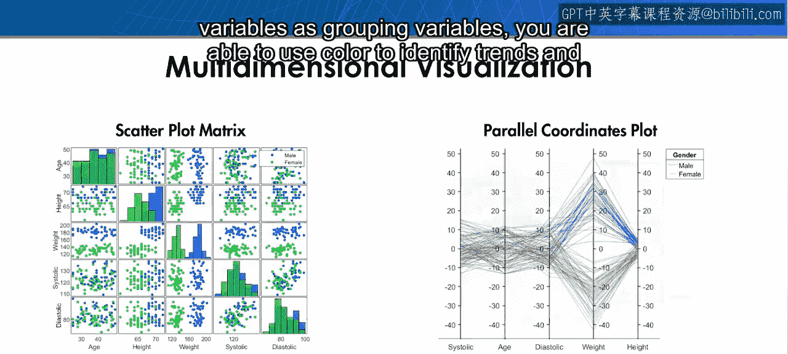

祝您好运。

---

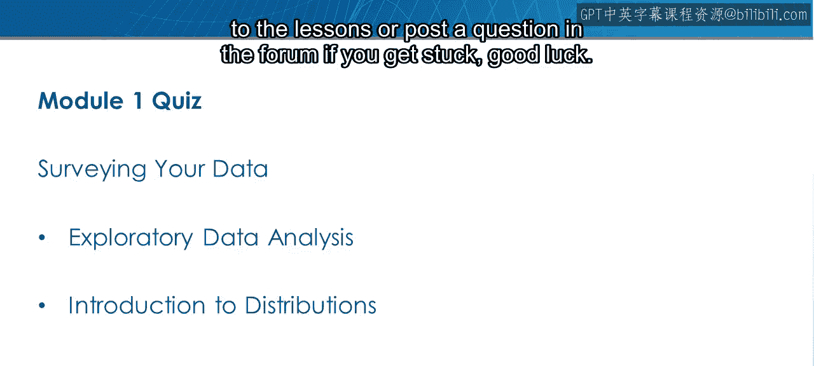

本节课中，我们一起学习了数据探索的核心步骤：从导入和初步了解数据集，到运用统计方法（如分布分析和四分位距）描述数据，再到利用多种可视化工具（如箱线图、热力图、散点图矩阵等）从不同维度揭示数据中的模式、趋势和组间差异。这些技能是进行有效数据清洗和特征工程的重要基础。