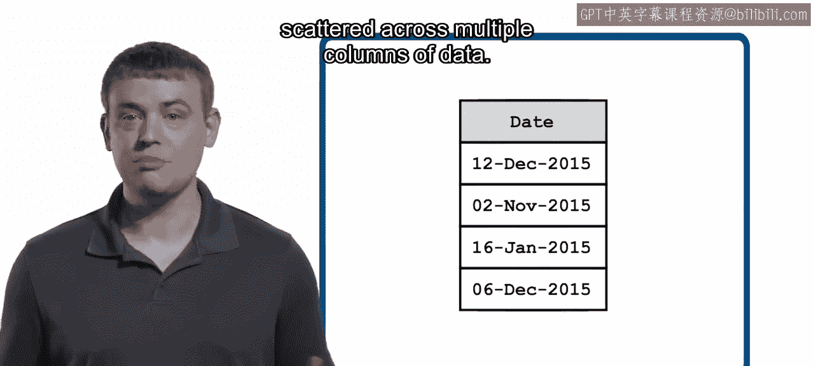
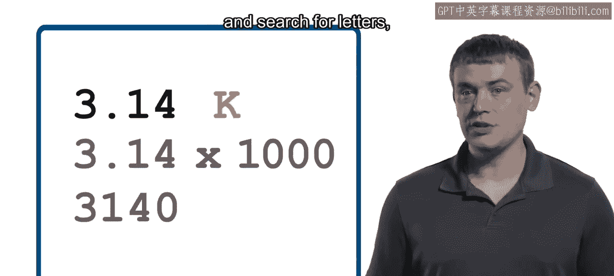
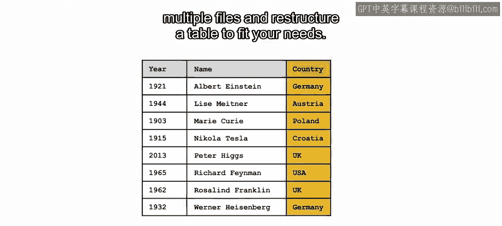
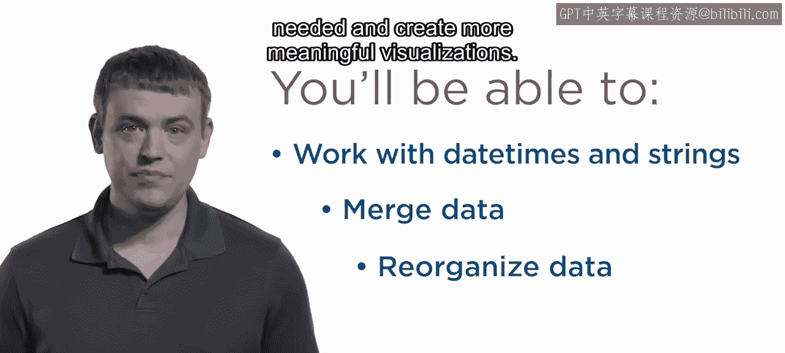

模块2：整理数据介绍

在本模块中，我们将学习如何处理不同类型的数据变量，包括日期时间与字符串，并掌握合并多源数据以及重组数据表的核心技能，为后续分析和可视化做好准备。

上一节我们完成了初步的数据探索，本节中我们来看看如何开始处理不同类型的变量。

整理数据与合并来自多个来源的数据，是数据准备阶段的关键步骤。在本模块中，你将深入学习两种重要的变量类型：日期时间与字符串。

你已经了解如何使用日期时间变量来表示日历与一天中具体时间的组合信息。

在本模块中，你将进一步学习如何处理日期时间值，并掌握如何从分散在数据表多个列中的信息来构建它们。

你也已经知道字符串变量可以将数据表示为文本。

在这里，你将学习如何操作字符串变量，并在文本中搜索字母。

关键词或短语。接下来，你将学习如何合并来自多个文件的数据。

并重组数据表以满足你的分析需求。你将练习使用这些技术来准备数据，以便进行更深入的分析和创建富有洞察力的可视化图表。

通过本模块的学习，你将能够有效地处理日期时间与字符串变量。

合并来自多个来源的数据。根据需要重组和整理数据。

并创建更具意义的可视化图表。

本节课中我们一起学习了数据整理模块的核心目标，即掌握处理日期时间、字符串变量，以及合并与重组数据的技能，为后续的数据分析和可视化奠定坚实基础。