# 11：处理字符串 🎼


在本节课中，我们将学习如何在MATLAB中操作字符串，以及在字符串内部搜索特定文本。我们将通过一个实际案例，将包含字母缩写的财产损失数据转换为纯数值，并探索如何利用文本描述（如风暴叙事）来筛选和分析数据。

之前，我们已经创建了字符串并导入了文本数据，但尚未对其进行深入操作。本节视频将介绍如何操作字符串，以及如何在字符串内部搜索文本。

如果你学习过探索性数据分析课程，可能还记得数据文件中包含用于报告损失的两个相似变量：`damage property`（财产损失）和`property cost`（财产成本）。这两个变量记录成本的方式不同：`damage property`使用字母表示数量级，而`property cost`则是完整的数字。实际上，原始文件只包含带字母的变量。


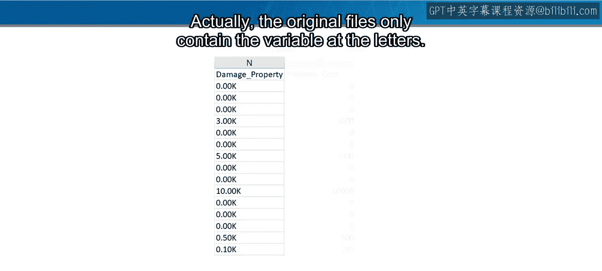

数值变量是通过操作文本创建的。现在，你将看到将字符串转换为数值所采取的步骤。


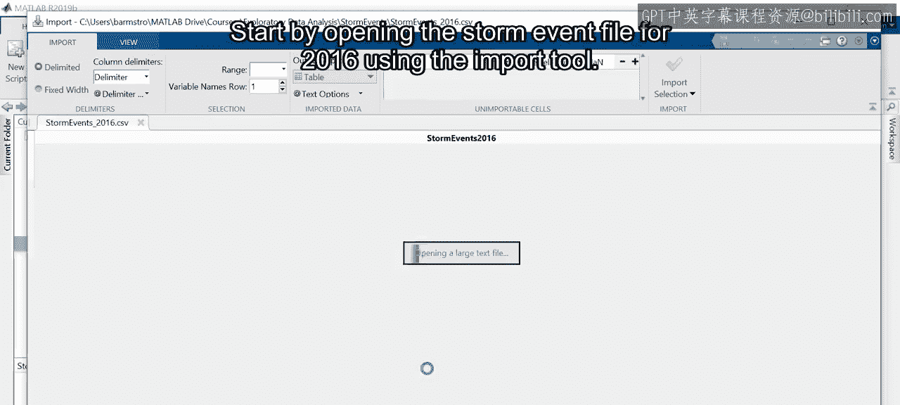

## 导入与初步检查

首先，使用导入工具打开2016年的风暴事件文件。


请注意，`property damage`（财产损失）被设置为以数字形式导入。当你将鼠标悬停在单元格上时，会发现只有数据的数字部分会被导入。也就是说，字母将被丢弃。例如，“2000K”将变成“2”。这显然不是我们想要的结果。

我们需要将其更改为文本格式，并计划在导入后进行修复。此外，`episode narrative`（事件叙事）被检测为分类变量。这是因为每个事件由众多子事件组成，所以事件叙事的内容会重复。然而，这是一个描述风暴的自由文本。分类变量代表一组离散的唯一值。为了分析叙事的内容，我们需要字符串，而不是离散的类别。因此，这个变量也需要更改为文本。为了简化操作，我将删除此任务不需要的变量，并创建一个实时脚本来导入数据。运行脚本并预览表格。

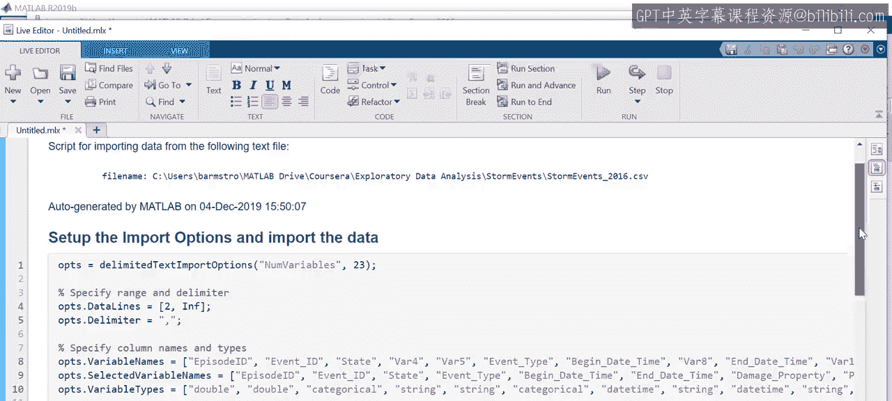

## 转换财产损失数据


我们的目标是将`damaged property`（财产损失）转换为与`property cost`（财产成本）匹配的数值变量。滚动浏览表格，你会发现字母“K”用于表示1000。所有值都是以千美元为单位报告的吗？我不想滚动浏览50000个事件来找出答案。

相反，请注意非缺失条目由数字和小数点后跟一个字母组成。因此，移除每个条目的数字部分将只留下字母。这可以通过`erase`函数实现。`erase`函数的第一个输入是你想要从中擦除文本的变量。

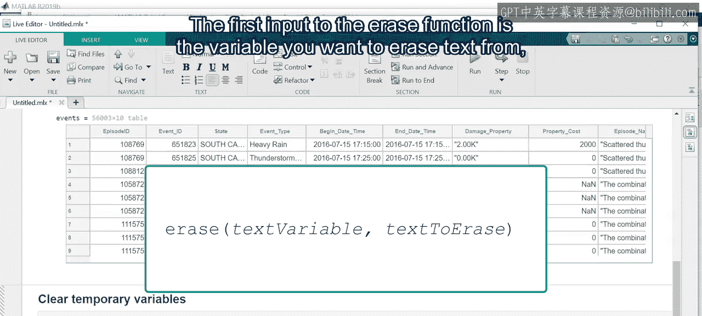

第二个输入是要擦除的文本。所以我们需要为第二个输入创建一个字符串数组。首先，创建一个存储为文本的每个数字的字符串数组，然后将点字符的字符串表示形式添加到该数组中。

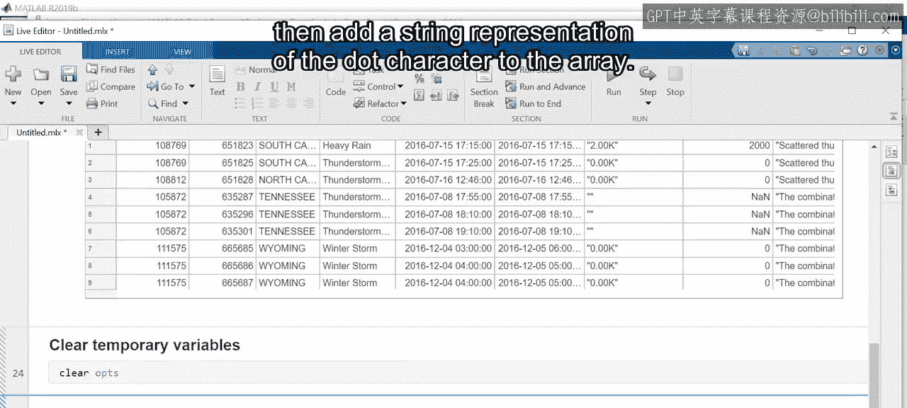


目前，我们只是试图找出唯一的字母，而不是实际修改变量。因此，让我们将表格中的内容复制到一个新变量中。现在，我们可以使用`erase`函数从`damaged property`字符串值中删除所有出现的数字和小数点。

很好，此时你只剩下字母。使用`unique`函数来识别数据中存在的不同值。


```matlab
unique_letters = unique(letters_only);
```

你可以看到，除了“K”，还使用“M”表示百万，“B”表示十亿，而你无需手动查找它们。但是，如何将条目转换为正确的数值呢？

让我们进行一个小测试。创建一个值为`2.5e6`的文本变量（这是MATLAB中的科学计数法），看看将其转换为`double`类型时会发生什么。它成功了。

像“5.00K”这样的字符串可以表示为“5.00e3”而不改变其含义，而字符串“5.00e3”可以直接转换为数值。

让我们使用`replace`函数将字母“K”、“M”和“B”替换为它们在科学计数法中的等效值。`replace`函数的第一个输入是你想要替换文本的字符串变量。第二个输入是要被替换的文本，第三个输入是相应的替换文本。

```matlab
% 示例：替换字母为科学计数法
str = "5.00K";
str_replaced = replace(str, "K", "e3");
numeric_value = str2double(str_replaced);
```

因此，这个命令将表格中的原始文本值替换为相应的数值。

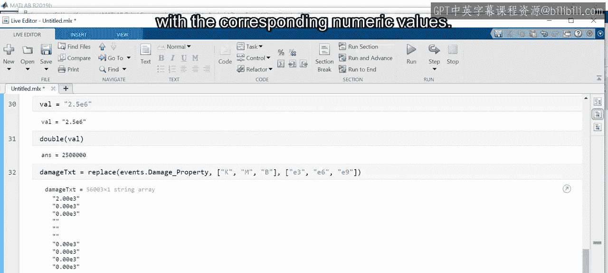

滚动浏览表格，比较新的`damaged property`值与`property cost`值，以确认替换成功。请记住，原始数据不包含数值。像这样的预处理步骤在分析之前通常是必要的。将预处理步骤添加到你的导入文件中是一个好主意，就像我们对航班数据所做的那样。

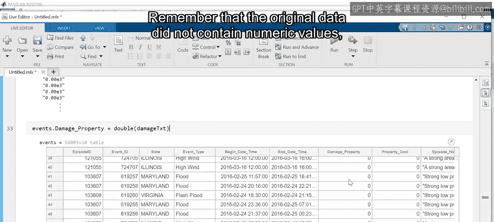
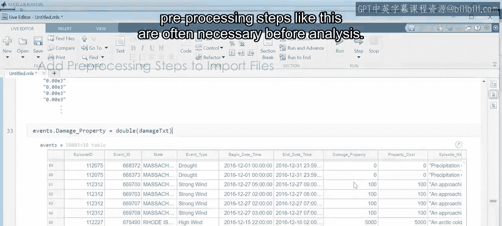
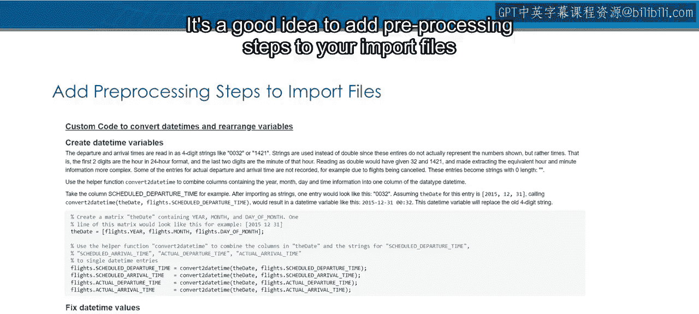


## 探索文本叙事数据

财产损失文本以特定方式结构化，因此你对所有条目都有预期。

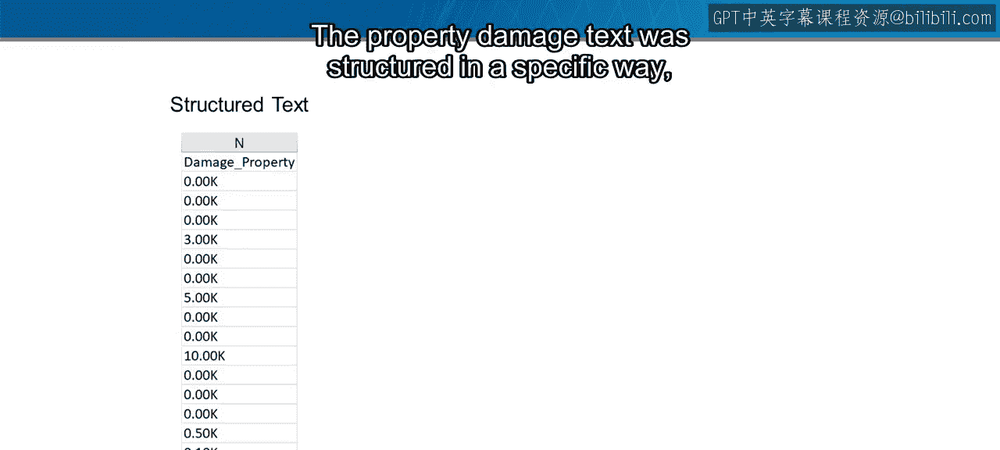


另一方面，`episode narrative`（事件叙事）是对风暴的描述。虽然有撰写叙事的指南，但确切的文本很大程度上取决于记录者个人。那么，这段文本有用吗？


回想一下，大型风暴被记录为许多事件。也许事件叙事可以用来查找与单个大型风暴相关的事件。


为了测试这一点，让我们通过对表格排序来找到造成最多财产损失的事件，然后查看其叙事。

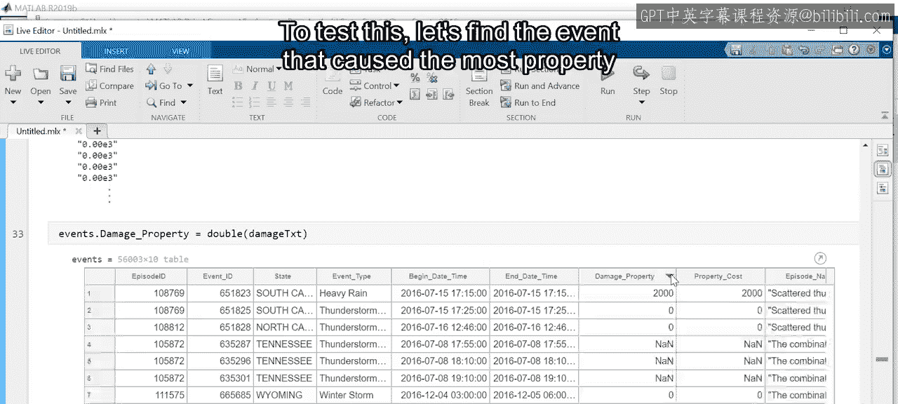
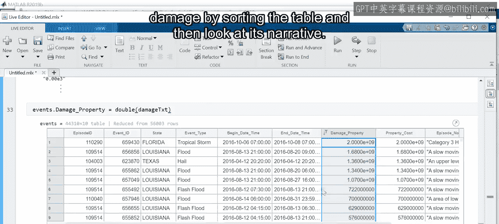


嗯。😊，飓风马修造成了重大损失。飓风不是孤立的事件，因此可以安全地假设表格中有许多与飓风马修相关的条目。


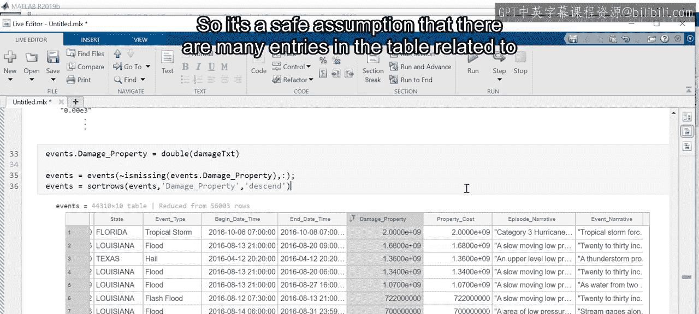

你可以使用`contains`函数在字符串变量中搜索特定文本。此命令返回一个逻辑向量，如果事件叙事包含字符串“Matthew”，则对应位置为`true`。


```matlab
contains_matthew = contains(T.episode_narrative, "Matthew");
```

然后，使用`contains`函数的输出来创建一个新表格，其中仅包含出现“Matthew”的事件。

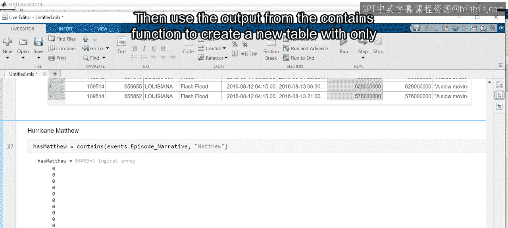

```matlab
matthew_events = T(contains_matthew, :);
```


你可以看到有599个这样的事件。它们都与飓风有关吗？你只知道文本中有“Matthew”这个词，但不知道上下文。因此，继续探索数据并在可能时使用其他来源来确认你的工作非常重要。例如，查看日期范围，你可能会发现一些需要进一步调查的异常值。

## 总结与扩展

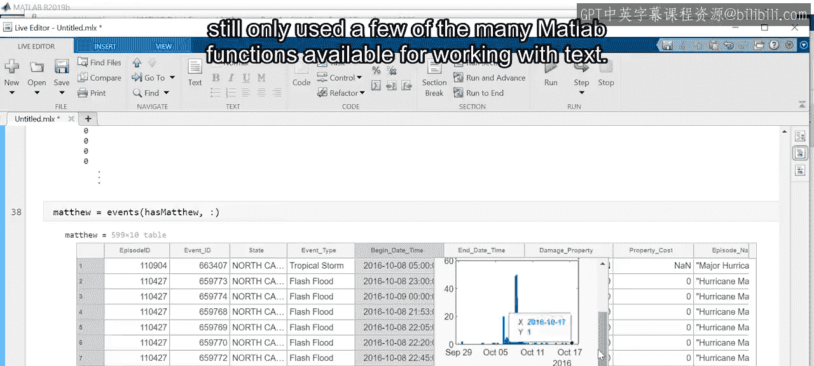

本视频涵盖了很多内容，但仍然只使用了MATLAB中可用于处理文本的众多函数中的一小部分。

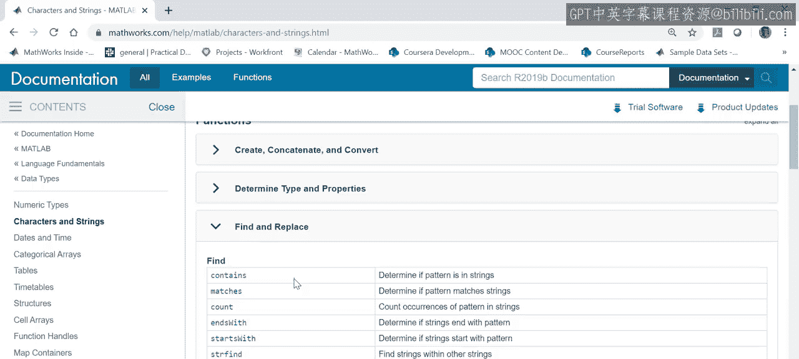


访问文档以了解更多关于用于各种任务（如修改或查找字符串）的函数。


总之，文本变量可以容纳多种类型的数据，并且有许多不同的处理方式。如果你的数据无法整齐地导入MATLAB，将其作为文本导入以进行进一步处理是一个好方法。许多函数可用于处理字符串变量。

在本节课中，我们一起学习了如何操作字符串以及在字符串内部搜索文本。在本课程的后面部分，你将扩展这些概念，将特征工程应用于文本数据。为了练习，请尝试为我们刚刚对`damaged crops`变量所做的过程重复一遍，或者如果你住在美国，请在叙事中搜索你居住地附近的事件。

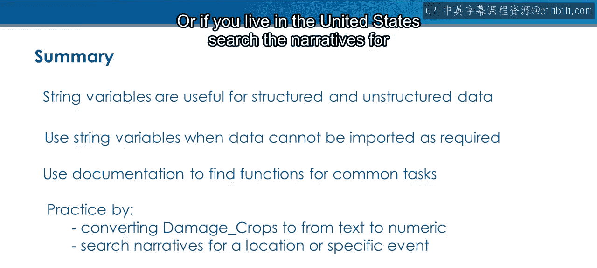

