# 12：处理日期和时间 📅

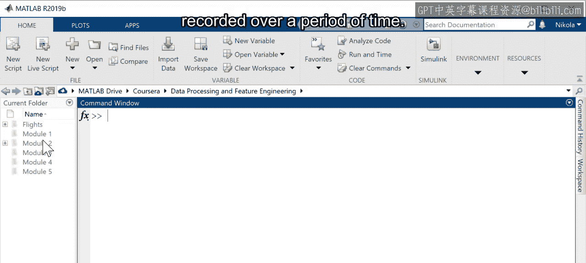

在本节课中，我们将学习如何处理数据集中常见的日期和时间信息。许多数据集记录了随时间推移的观测值，这些数据不仅包含观测结果，还记录了观测发生的具体日期或时间。我们将学习如何从分散的变量中创建统一的日期时间变量，并利用它们进行计算。

## 从多个变量创建日期时间变量

上一节我们介绍了数据集中日期时间信息的重要性。本节中我们来看看如何将分散存储的日期和时间部分组合成一个统一的变量。

有时，日期和时间信息并非记录在单个变量中，而是分散在多个变量里。以下是一个包含传感器数据以及年、月、日、时、分、秒多个列的数据集示例。

假设我们需要计算两次读数之间的时间间隔，这需要一个包含完整日期时间信息的单一变量。

首先，查看每一列的数据类型。在本例中，所有列都是数值型。

使用 `datetime` 函数，将代表年、月、日、时、分、秒的六个变量转换为一个 `datetime` 变量。通过将结果赋值给表格中的一个新变量，可以将组合后的日期时间信息与数据一同保存。

```matlab
% 假设 year, month, day, hour, minute, second 是表格中的变量名
T.DateTime = datetime(T.year, T.month, T.day, T.hour, T.minute, T.second);
```

## 处理混合数据类型的日期时间信息

如果部分变量不是数值型，该如何处理？例如，一个数据集包含年、月、日的数值列，但时间信息存储在一个字符串列中。

创建 `datetime` 变量要求所有输入具有相同的数据类型（数值型或字符串型）。由于时间变量值包含冒号，无法直接转换为数值。

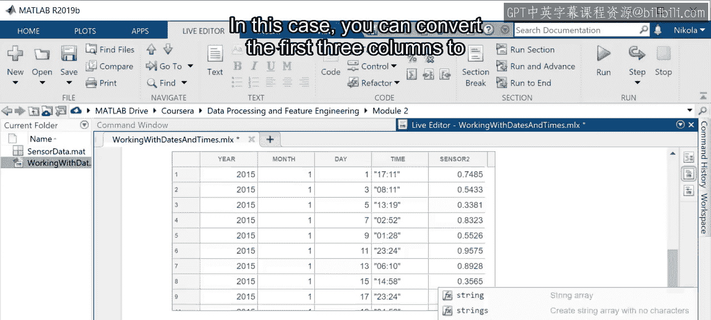

在这种情况下，可以先将前三个数值列转换为字符串，然后构造自己的日期字符串。

以下是处理步骤：
1.  将年、月、日数值列转换为字符串。
2.  使用字符串拼接，构造一个用短横线分隔的年-月-日字符串。
3.  将时间字符串拼接上去。
4.  使用 `datetime` 函数，并指定输入格式选项，将完整的日期时间字符串转换为 `datetime` 变量。

```matlab
% 假设 Year, Month, Day 是数值列， TimeString 是时间字符串列
dateString = string(T.Year) + "-" + string(T.Month) + "-" + string(T.Day) + " " + T.TimeString;
T.DateTime = datetime(dateString, 'InputFormat', 'yyyy-MM-dd HH:mm:ss');
```

转换完成后，日期时间的显示格式可能与输入时不同。`datetime` 变量有一个 `Format` 属性，用于控制其显示方式，同时保留所有原始信息。可以通过设置此属性来改变显示格式。

```matlab
T.DateTime.Format = 'dd-MMM-yyyy HH:mm:ss';
```

## 使用日期时间变量进行计算

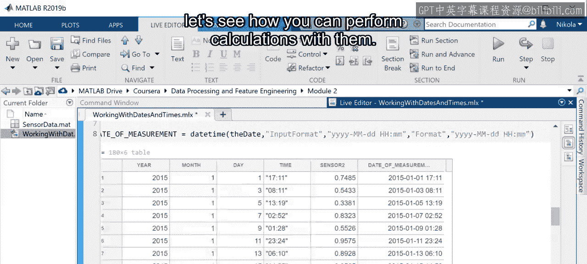

现在我们已经知道如何创建日期时间变量，接下来看看如何用它们进行计算。

假设有两个变量描述两个时间点，例如同一天晚上8点的航班起飞时间和晚上11点的到达时间。

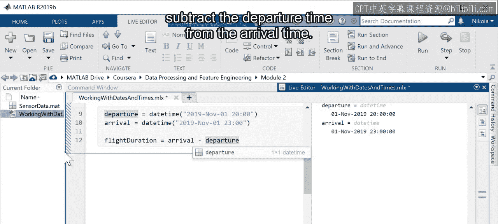

要计算飞行时长，只需用到达时间减去起飞时间。

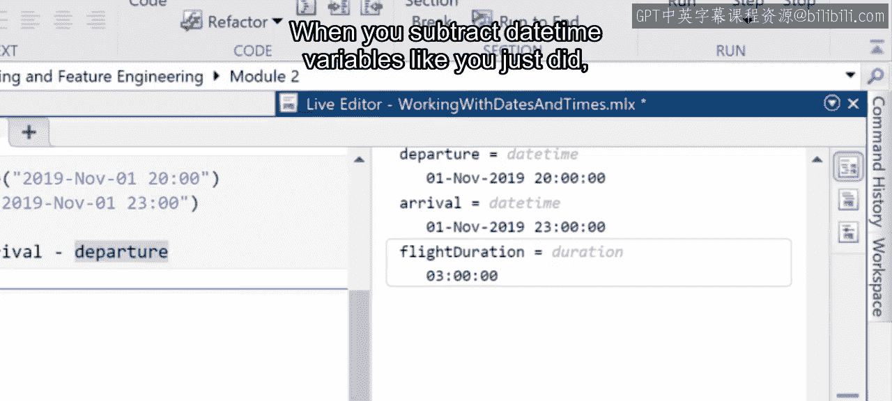

```matlab
departure = datetime('2023-10-27 20:00:00');
arrival = datetime('2023-10-27 23:00:00');
flightDuration = arrival - departure;
```

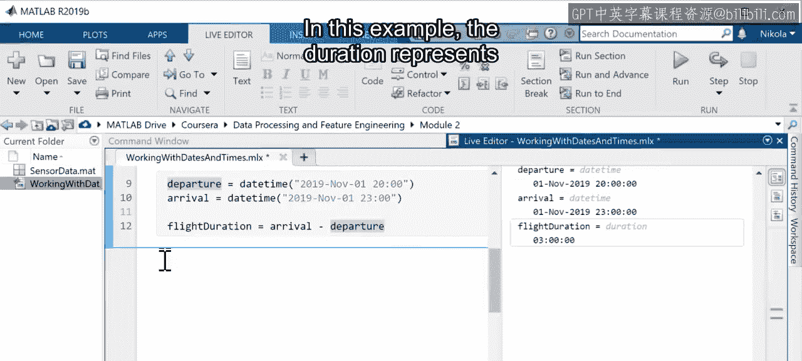

当你像上面那样对 `datetime` 变量进行减法运算时，结果的数据类型将是 **`duration`**。

在这个例子中，`duration` 表示以小时、分钟和秒为单位的时间长度。

## 处理时长数据

假设你有多个转机航班，想要计算总飞行时间。如果每个航班的时长都以小时和分钟分别记录，你需要额外的步骤来处理这两个独立的时间单位。

通过将小时、分钟和秒存储在 `duration` 数据类型的变量中，你可以直接对两个值进行加法运算，单位会自动处理。

```matlab
flight1 = duration(3, 30, 0); % 3小时30分钟
flight2 = duration(2, 45, 0); % 2小时45分钟
totalFlightTime = flight1 + flight2; % 结果为 6小时15分钟
```

如果飞行时长是以分钟为单位的数值变量（例如第一个航班200分钟，第二个航班50分钟），可以使用 `minutes` 函数将其转换为 `duration`，然后像之前一样进行计算。

```matlab
flight1_min = 200;
flight2_min = 50;
totalMinutes = minutes(flight1_min) + minutes(flight2_min); % 结果为 250分钟
```

通常，你可能希望结果以不同的格式显示，例如小时和分钟。你无需手动转换，只需改变其显示方式即可。

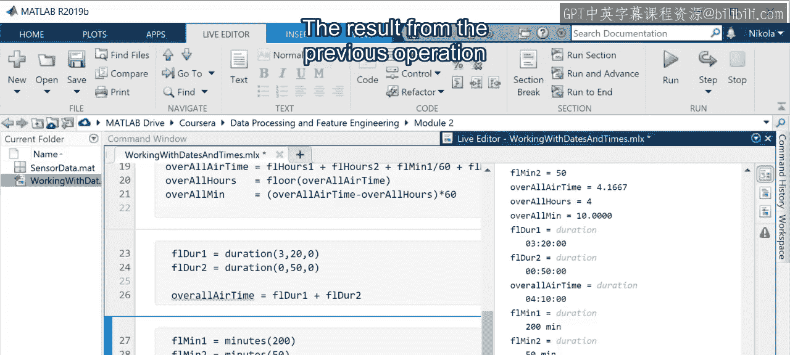

```matlab
totalMinutes.Format = 'h:mm'; % 将显示格式设置为“小时:分钟”
disp(totalMinutes) % 显示为 4:10 (即4小时10分钟)
```

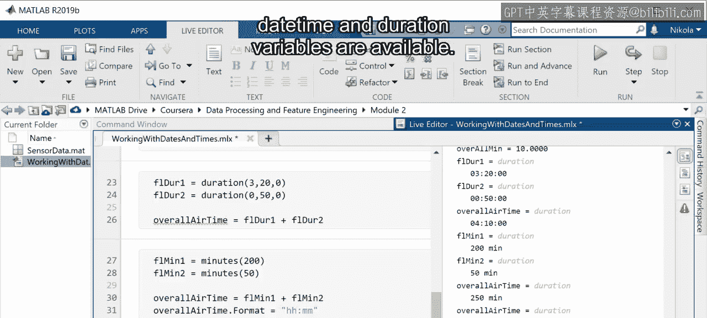

## 更多日期时间函数

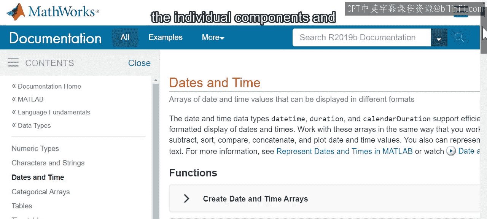

MATLAB 为 `datetime` 和 `duration` 变量提供了更多函数。使用这些函数，你可以在进行计算时无需考虑日期和时间的各个组成部分及其相关单位。

在官方文档中，你可以找到一系列函数，用于：
*   创建日期和时间数组
*   拆分日期和时间
*   确定其类型和时区偏移
*   计算日期之间的差异或进行日期偏移
*   将它们转换为数字和字符串

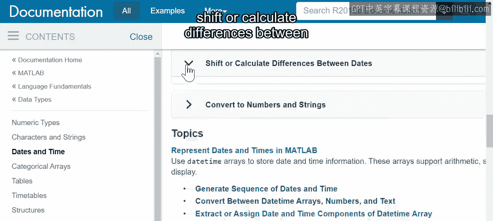

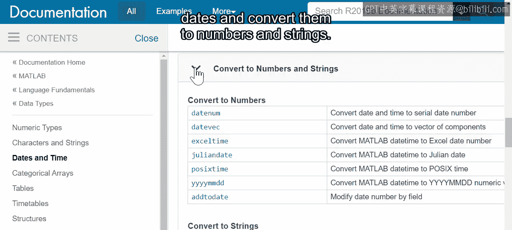

本节课中我们一起学习了如何在 MATLAB 中处理日期和时间数据。我们掌握了从分散变量创建 `datetime` 变量的方法，学习了如何对 `datetime` 和 `duration` 变量进行计算，并了解了如何控制它们的显示格式。这些技能对于分析时间序列数据和计算时间相关的指标至关重要。