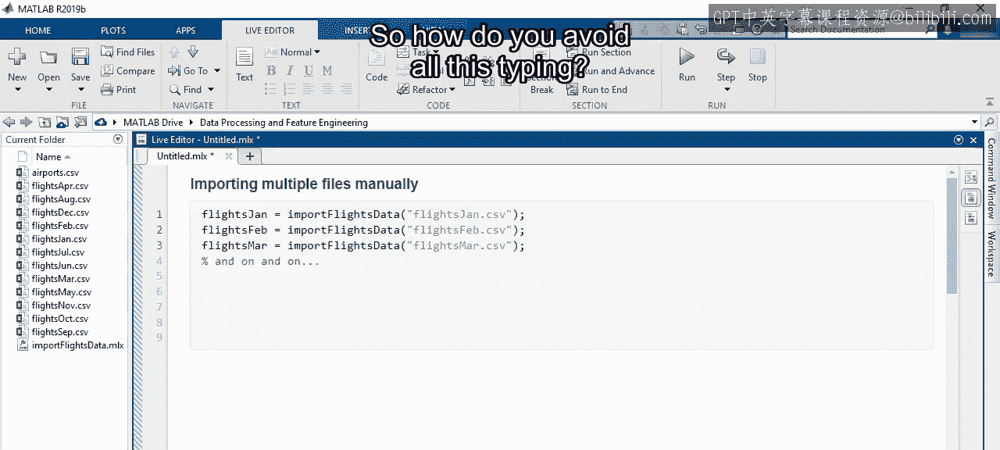
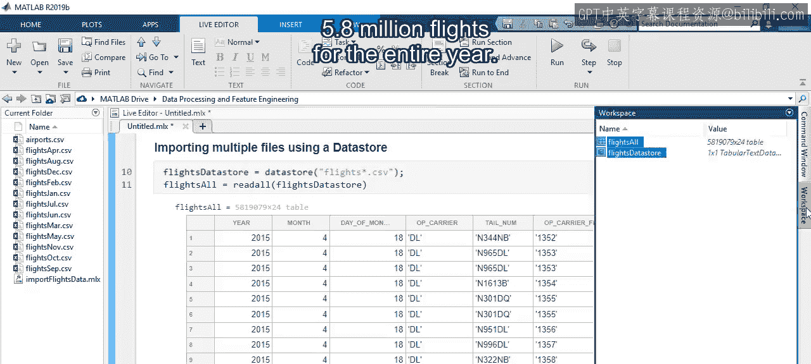
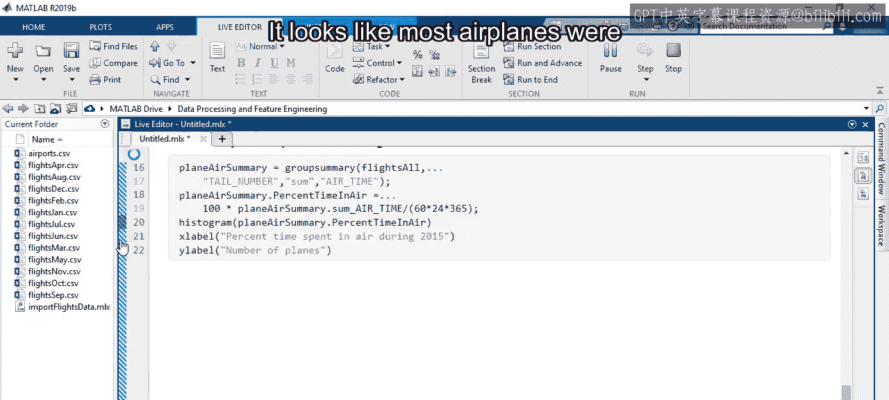
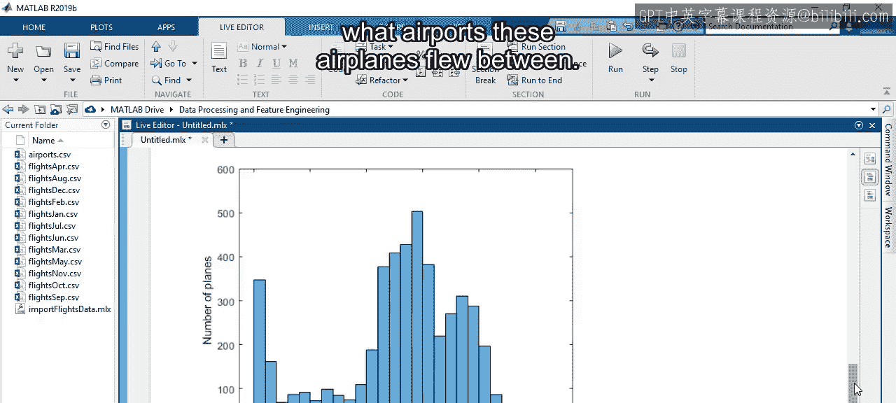
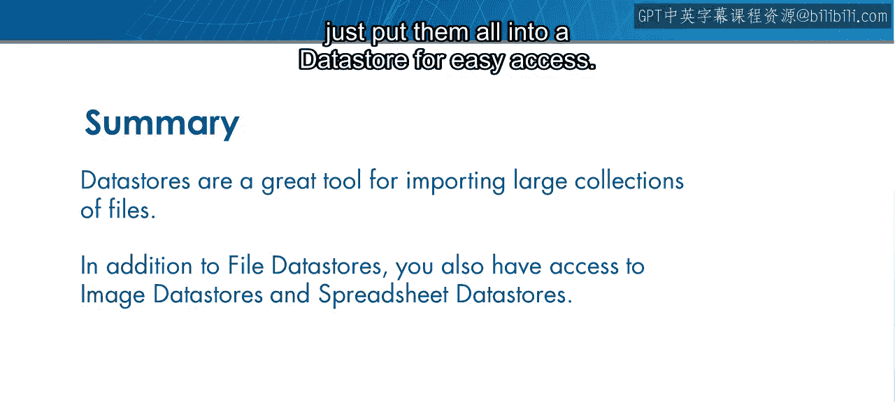

# 13：导入多个数据文件 📂

在本节课中，我们将要学习如何高效地导入和处理多个数据文件。当数据被分割存储在许多独立的文件中时，手动逐个导入会非常繁琐。我们将介绍如何使用MATLAB的**数据存储**功能来批量导入这些文件，并应用自定义的导入设置。

## 数据存储简介

上一节我们介绍了探索单个数据文件的方法。本节中我们来看看当数据分散在多个文件中时，如何一次性导入它们。

你已经花了一些时间探索航班数据集。现在你看到数据被分割成每个月一个独立的CSV文件。

但是，如果你有一个关于整个2015年的问题呢？

例如，假设你感兴趣的是每架飞机在整个一年中在空中飞行了多长时间。

要访问全年的数据，你可以导入一个月份的数据，然后将这段代码复制12次，将每个月保存到一个新表中。然而，这种方法很快就会变得乏味，特别是如果你要包含2015年之后的更多年份。那么，如何避免所有这些重复输入呢？

## 使用数据存储

一个更高效的方法是使用**数据存储**。数据存储是MATLAB为了方便导入而组织起来的文件集合。

在你的案例中，你有12个航班CSV文件，这非常适合使用数据存储。

要在MATLAB中创建数据存储，将一个CSV文件输入到`datastore`函数中，并将其输出保存到一个新变量。

但是，如何一次性包含所有文件，而不是逐个处理呢？同样，你可以输入一个文件名列表，但这正是你想要避免的麻烦。相反，因为每个文件仅在其三个字母的月份缩写上有所不同，你可以使用星号来代表所有文件。

这个符号作为一个**通配符**，可以匹配任何字符组合。在这种情况下，你想要所有以单词“fs”开头的文件。然后使用星号符号。最后，包含“.csv”来指定文件类型。现在，你的数据存储将收集所有符合此命名模式的文件。

接下来，使用`readall`函数将数据存储及其12个文件作为表格导入。

在MATLAB工作区中，你可以看到包含全年580万次航班的新表格。

## 应用自定义导入函数

这工作得很好。但请注意，你没有使用格式化表格的自定义导入函数。

例如，出发时间由CSV文件中报告的四位数时钟读数表示，而不是由导入函数转换成的`datetime`变量。

别担心，仍然可以指定导入函数，而不是使用默认的。要做到这一点，你需要使用一种特定类型的数据存储，称为**文件数据存储**，它设计用于使用自定义导入函数。将你的数据存储更新为此新类型后，你就可以使用`read`函数选项来指定你的自定义函数。

这是通过在函数名称前加上`@`符号来完成的。

## 统一读取数据

你几乎完成了，因为现在你已经导入了所有12个文件，但每个文件都包含在自己的表格中。例如，第一个表格是四月份的数据。

发生这种情况是因为文件数据存储不假设每个文件的结构都相同，而在这个案例中它们是相同的。例如，第五列始终是目的地机场变量。

要更改默认行为，将`UniformRead`选项设置为`true`。

现在，全年的数据都在一个表格中了。你可以回到最初的问题：确定飞机在2015年有多少时间在飞行。

看起来大多数飞机一年中有30%的时间在空中飞行。

但有几架飞机飞行时间超过半年。如果你想练习，看看是否能找出这些飞机在哪些机场之间飞行。

## 总结与扩展

正如你所看到的，数据存储是导入大量类似格式文件集合的强大工具。

本视频介绍了专门的**文件数据存储**。但根据你的需求，还有其他类型，例如**图像数据存储**和**电子表格数据存储**。

所以，下次你需要一起导入成百上千个文件时，只需将它们全部放入一个数据存储中以便轻松访问。