# 15：连接表格 🧩

在本节课中，我们将学习如何使用MATLAB连接表格。我们将通过一个具体案例——分析从纽约市两个主要机场（肯尼迪国际机场和拉瓜迪亚机场）出发的所有直飞目的地——来演示连接表格的完整流程。我们将使用“实时任务”来辅助操作，并最终生成一张可视化地图。

---

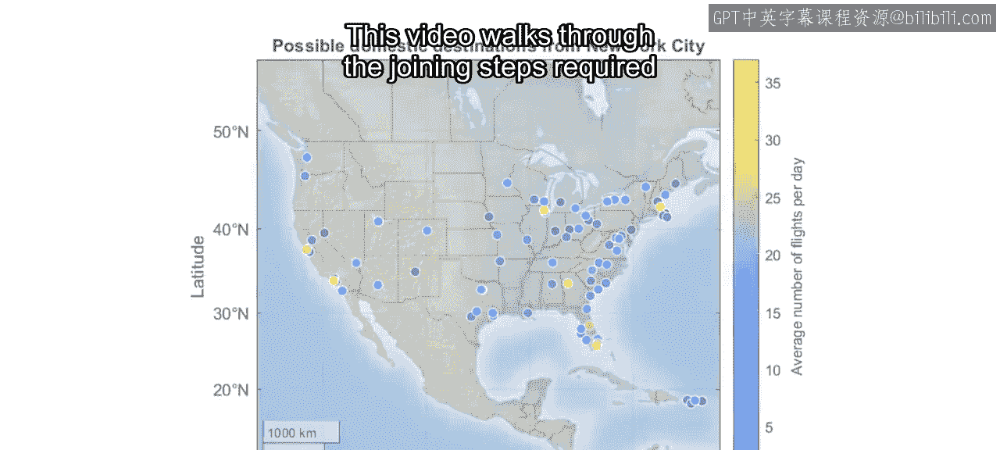

在美国境内飞行时，存在许多可能的目的地。但能否直飞取决于您的出发地。如果您身处像纽约市这样拥有两个主要机场的地方，那么您需要考虑从这两个机场出发的所有目的地。


本视频将逐步演示所需的连接步骤，以从航班数据集中生成这张地图，它展示了从纽约市出发的所有可达目的地，无论您是从肯尼迪国际机场还是拉瓜迪亚机场起飞。这些步骤融合了您之前学习过的不同连接方法。

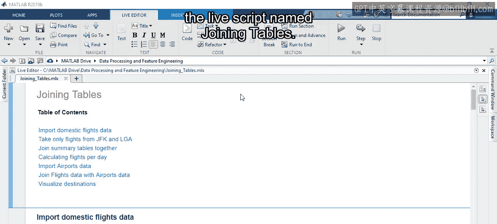

您可以跟随本视频，使用名为 `JoiningTables.mlx` 的实时脚本进行操作。

## 导入数据

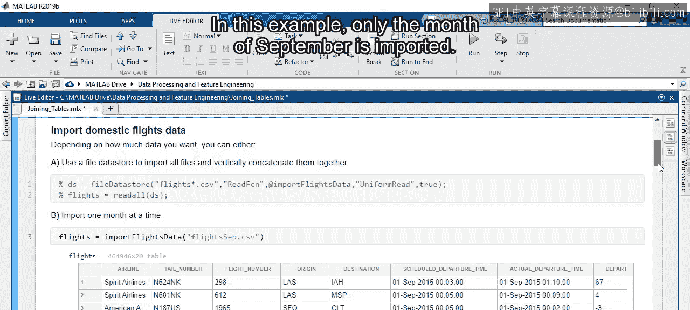

首先，您需要导入航班数据。您可以选择使用文件数据存储导入全年数据，或使用自定义导入函数仅导入单月数据。在本例中，我们仅导入九月份的数据。

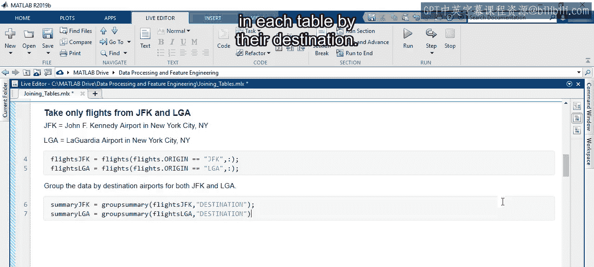

```matlab
% 示例：导入九月份航班数据
flightsData = importFlights('September');
```

## 创建并分组表格

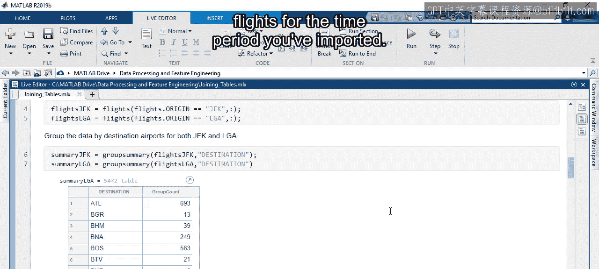

接下来，您需要创建两个表格，分别对应从纽约市的肯尼迪机场（JFK）和拉瓜迪亚机场（LGA）出发的航班。最后，您需要按目的地对每个表格中的航班进行分组。

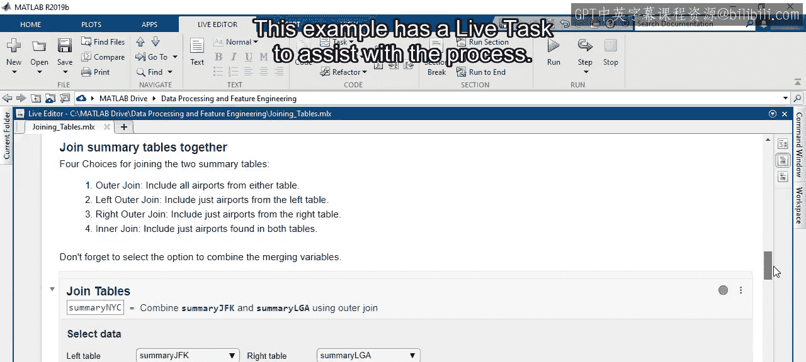

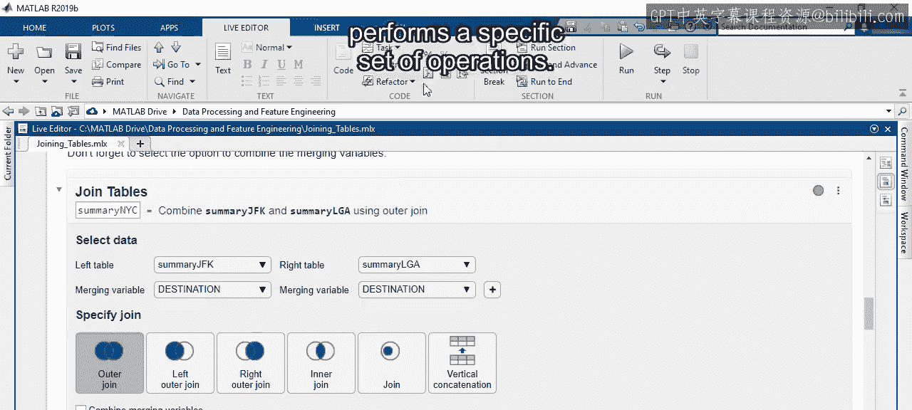

以下是操作步骤：
1.  从主数据中筛选出 `Origin` 为 `‘JFK’` 的行，创建 `flightsJFK` 表。
2.  从主数据中筛选出 `Origin` 为 `‘LGA’` 的行，创建 `flightsLGA` 表。
3.  对每个表格使用 `groupsummary` 函数，按 `Dest`（目的地）分组，并计算每个目的地的航班总数。

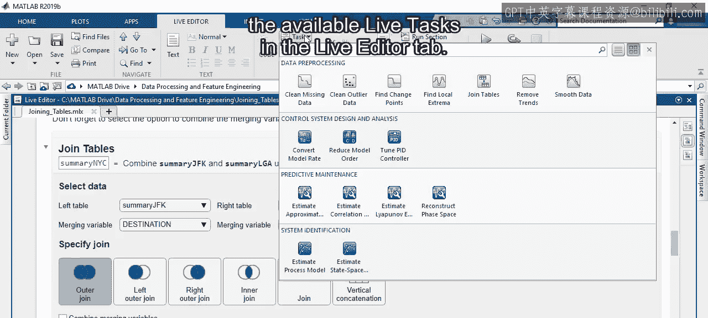

```matlab
% 创建并分组表格
flightsJFK = flightsData(flightsData.Origin == ‘JFK’, :);
flightsLGA = flightsData(flightsData.Origin == ‘LGA’, :);

summaryJFK = groupsummary(flightsJFK, ‘Dest’, ‘sum’, ‘Flights’);
summaryLGA = groupsummary(flightsLGA, ‘Dest’, ‘sum’, ‘Flights’);
```

这将为每个机场生成所有可能目的地的列表，以及您导入的时间段内的航班总数。

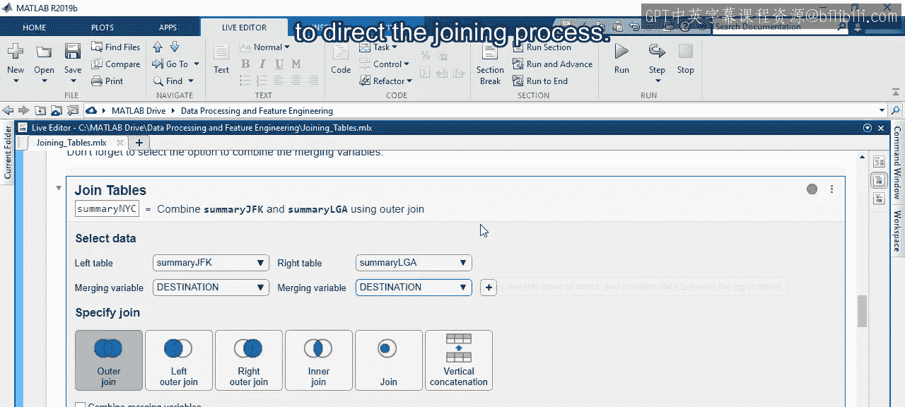

## 使用实时任务连接表格

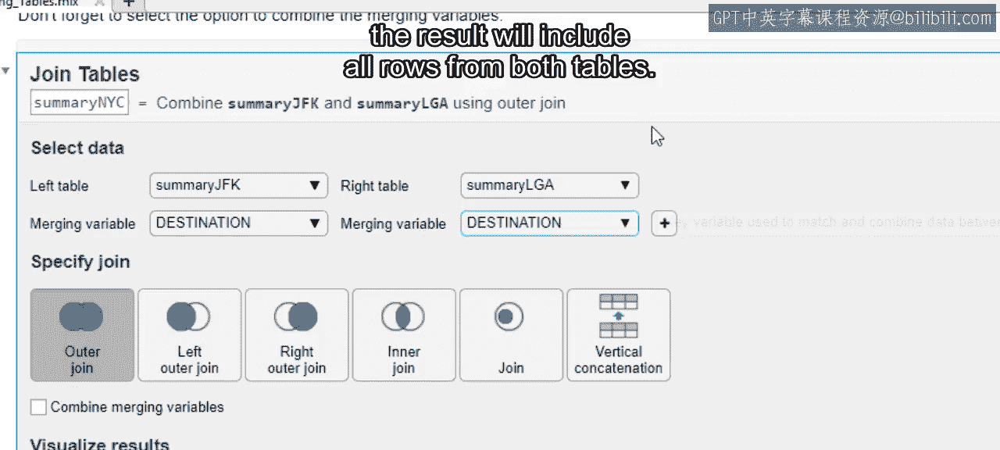

现在可以开始连接表格了。本例使用一个实时任务来辅助此过程。实时任务是您可以插入脚本中的应用程序，用于执行一组特定操作。

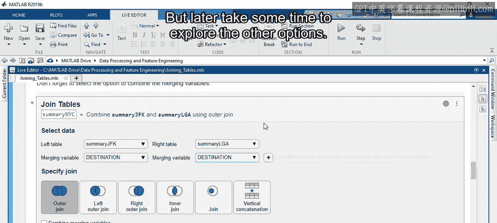

您可以在Live Editor选项卡中找到所有可用的实时任务。现在，您将使用连接表格的那个。

在实时任务中，您有几个选项可以修改连接表格时的输入、输出和可用选项。
*   在顶部，您可以看到输出将保存到变量 `summaryNYC`。
*   要选择连接哪两个表格，请使用左右表格的下拉菜单。
*   接下来，选择关键变量（也称为合并变量）来指导连接过程。
*   最后，指定要使用的连接方法。目前，请坚持使用**外连接**，以便结果包含两个表中的所有行。稍后，您可以花时间探索其他选项。

请注意，输出中为每个输入表（一个用于JFK，一个用于LGA）都有一个单独的 `Destination` 列。这是为了跟踪哪些键来自哪个表。现在，请选择合并关键变量的选项。由于实时任务会在您更改选项时立即执行，您可以立即看到新结果，现在它只有一个 `Destinations` 列。

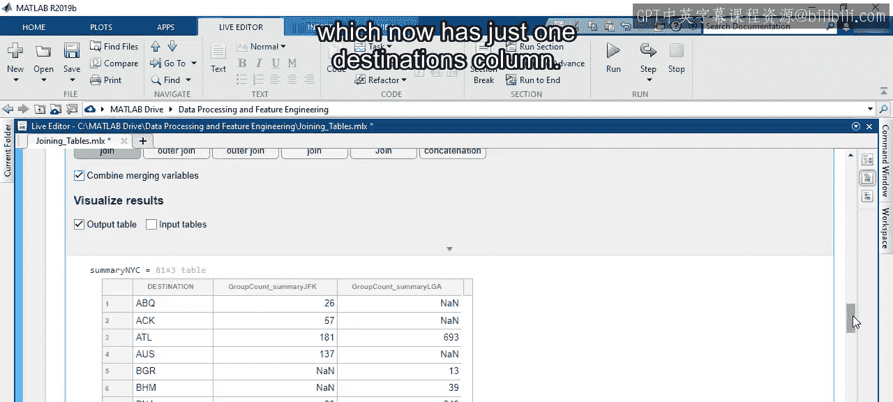

## 计算日均航班量

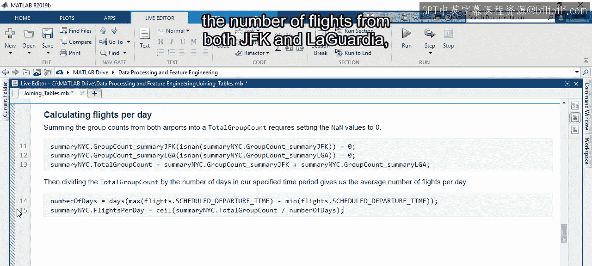

上一节我们介绍了如何连接两个机场的航班汇总表。本节中，我们来看看如何为最终的可视化地图准备数据。在最终的可视化地图中，每个目的地标记的大小由该航线日均航班量的平均值决定。

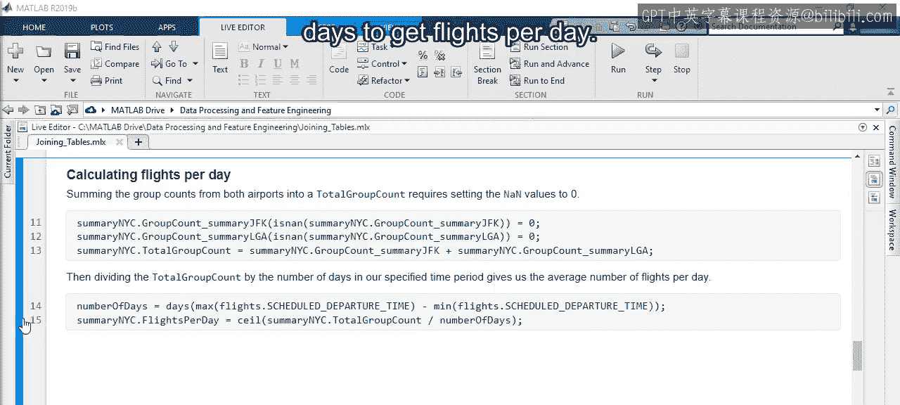

接下来的这段代码将肯尼迪机场和拉瓜迪亚机场的航班数相加，然后除以天数得到日均航班量。

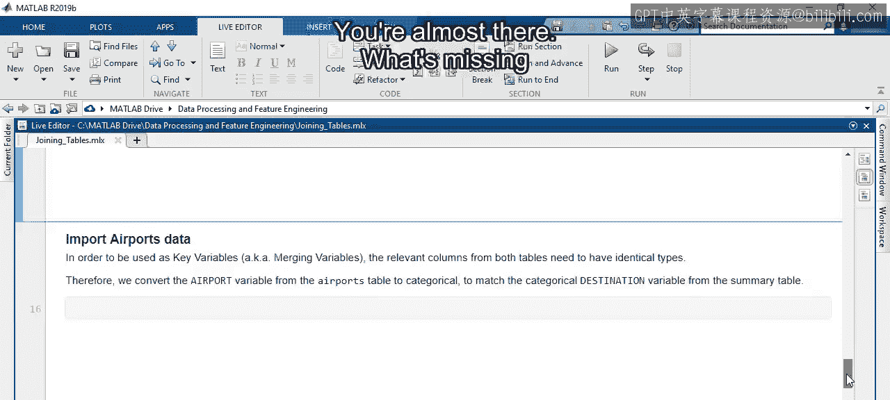

```matlab
% 计算日均航班量
totalFlights = summaryNYC.sum_Flights_summaryJFK + summaryNYC.sum_Flights_summaryLGA;
daysInMonth = 30; % 假设九月有30天
flightsPerDay = totalFlights / daysInMonth;
summaryNYC.FlightsPerDay = flightsPerDay;
```

## 连接地理位置信息

您几乎已经完成了。缺少的是每个目的地的地理位置信息，这些信息并未存储在航班数据中。但是，它是 `airports.csv` 文件中的一个变量，因此您需要将该文件作为表格导入。

接下来，您必须将包含每个目的地三字母代码的 `airport` 列从字符串转换为分类变量。这是因为两个表中的关键变量需要是相同类型。

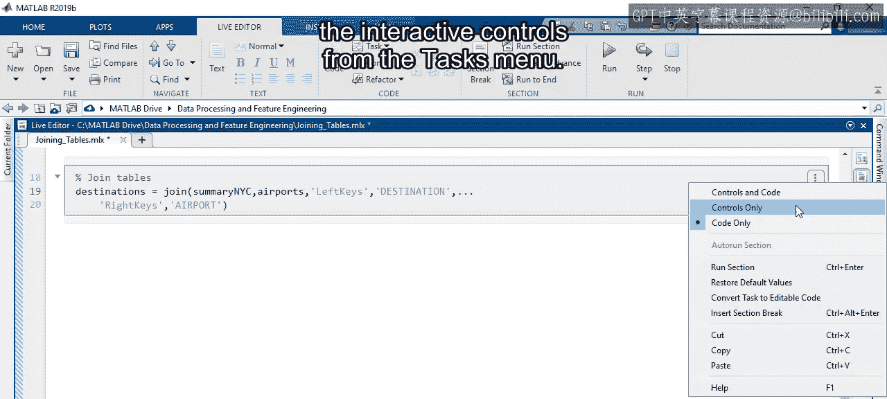

现在，您可以将航班数据和机场数据连接在一起了。同样，此操作使用了实时任务。不过，您现在看到的只是代码，这是因为您可以从任务菜单中隐藏交互式控件。显示控件后，您可以看到任务是如何配置的。

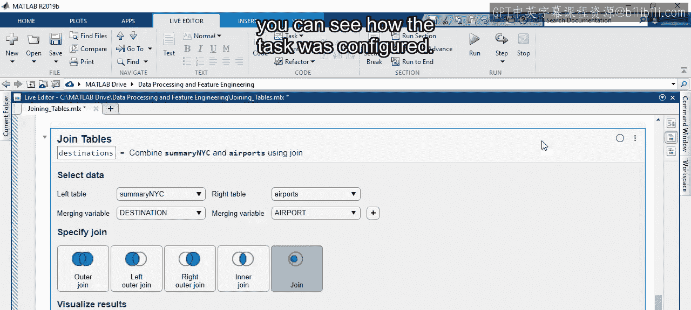

请注意，结果中包含的信息比您需要的更多，例如 `city` 和 `state` 列。如何删除这些不需要的变量？您始终可以从任务菜单将实时任务转换为可编辑的代码。这使您能够指定一个选项，以决定从每个表中保留哪些变量。虽然删除不相关的数据并非必需，但在本例中，它确实有助于清理您的输出。

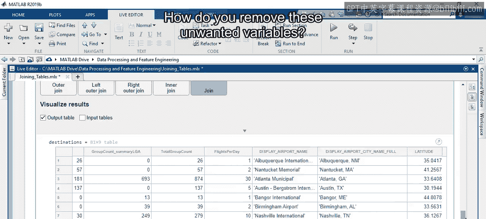

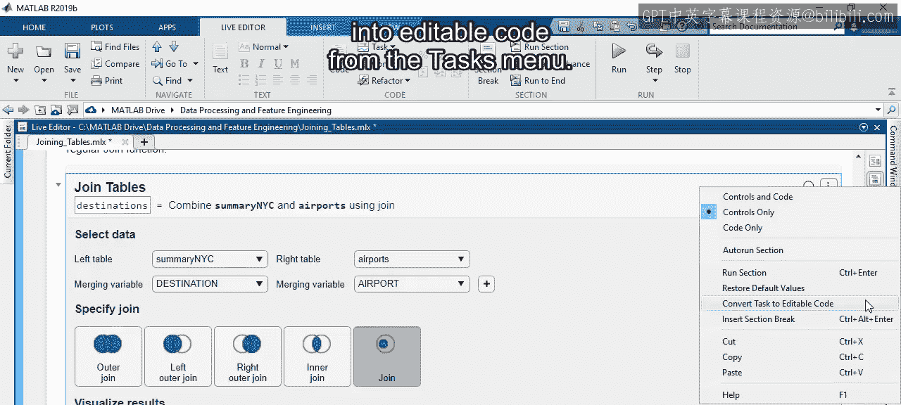

```matlab
% 示例：连接后仅保留所需变量
finalTable = outerjoin(summaryNYC, airportsTable, ‘Keys’, ‘Dest’, ‘KeepOneCopy’, {‘Lat’, ‘Lon’});
```

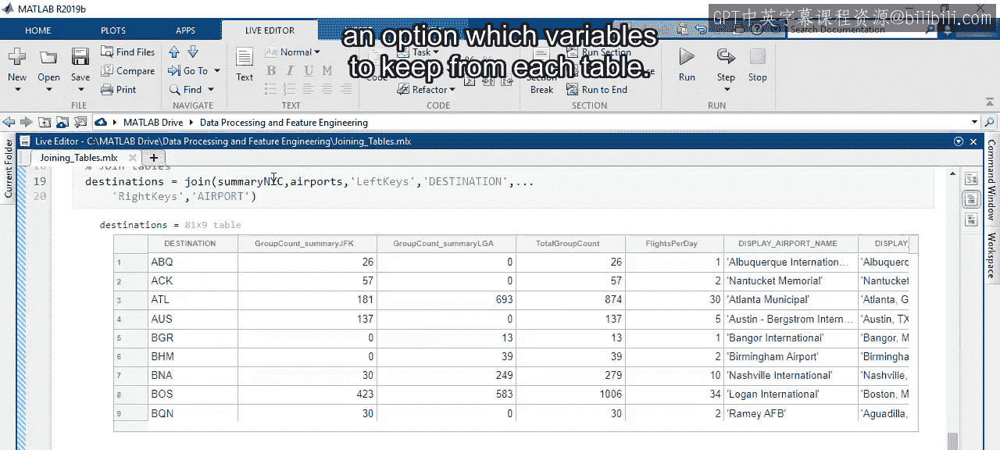

## 绘制地理气泡图

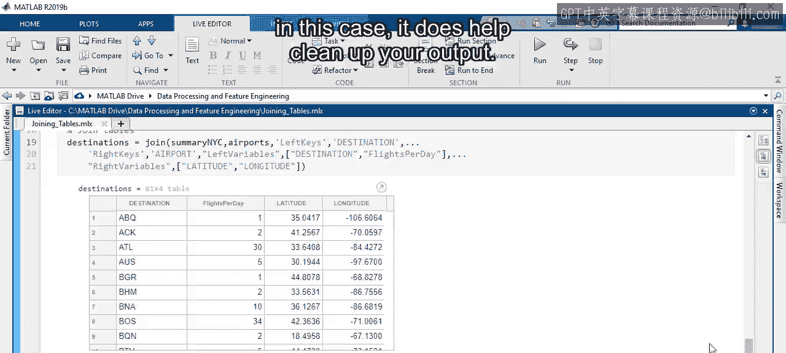

最后，您可以使用 `geobubble` 函数绘制数据了。

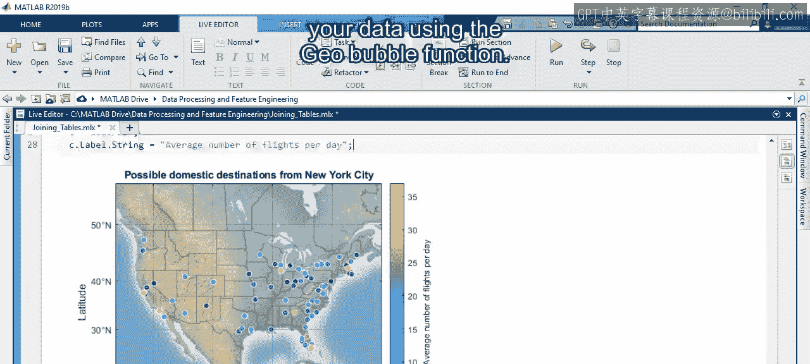

```matlab
% 绘制地理气泡图
gb = geobubble(finalTable, ‘Lat’, ‘Lon’, ‘SizeVariable’, ‘FlightsPerDay’);
gb.Title = ‘从纽约市出发的直飞目的地（日均航班量）’;
```

请随意试验此实时脚本，以了解不同连接选项在不同情况下的工作原理。例如，左外连接与您刚刚尝试的外连接有何不同？如果您想要额外的挑战，请看看是否可以使用表格连接方法来绘制从纽约市出发，**不仅**能直飞，还能**经一次中转**到达的所有机场。

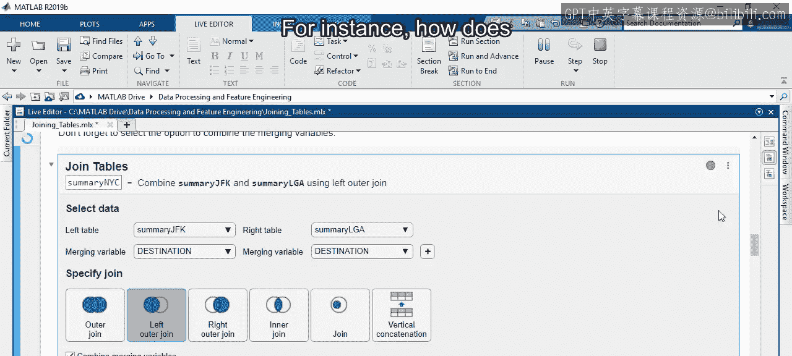

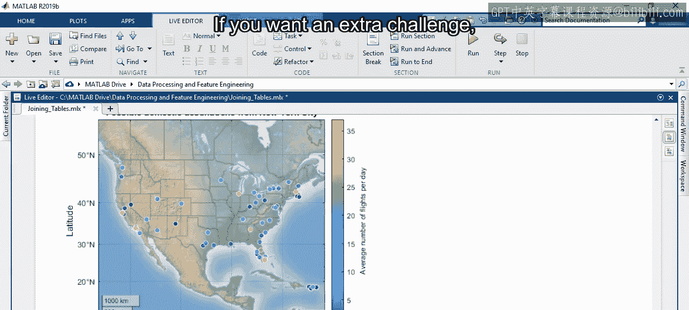

---


本节课中，我们一起学习了在MATLAB中连接表格的完整流程。我们从导入和预处理航班数据开始，创建了按机场和目的地分组的汇总表。接着，我们利用实时任务演示了如何执行外连接来合并数据，并计算了关键的日均航班量指标。然后，我们通过连接外部机场数据表补充了地理位置信息，并最终使用 `geobubble` 函数将结果可视化。通过这个案例，您掌握了使用连接操作整合多源数据、进行数据清洗并生成洞察的基本方法。