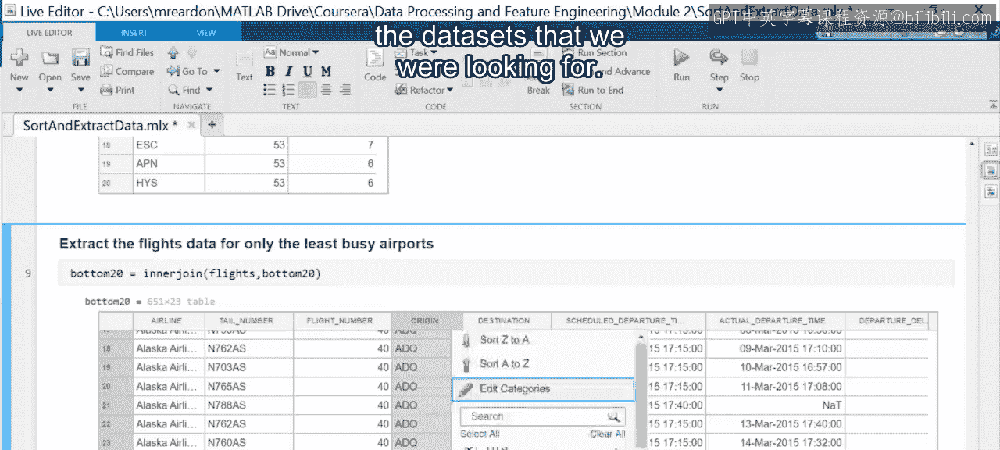

# 16：排序数据


在本节课中，我们将学习如何在MATLAB中对数据进行排序。排序是数据科学中的一项基本操作，它能帮助我们识别数据集中具有最高值和最低值的观测值，从而进行更深入的分析。

## 🎼 排序的用途

你可能遇到过许多按字母顺序排列的列表，或根据特定变量值排序的整个表格。在数据科学中，排序可以帮助你识别具有最高值和最低值的观测值。

让我们看看如何在MATLAB中进行排序。我们将从打开一个用于排序和提取数据的脚本开始。

## 📊 脚本目标：分析机场航班数据

该脚本旨在获取航班数量最多和最少的各20个机场的航班数据。这些数据集随后可用于研究繁忙与不繁忙机场之间航班延误的长度、原因和影响的差异。

## 🛠️ 数据准备与初步排序

脚本首先将单月的航班数据导入到一个表格变量中。下一步是使用 `groupsummary` 函数获取每个机场的出发航班数量，该函数返回一个包含机场和航班数量的表格。

以下是使用 `groupsummary` 的示例代码：
```matlab
flightCounts = groupsummary(flightData, 'Origin', 'numel', 'FlightNum');
```

回忆一下，你可以使用交互式控件预览和排序表格变量。例如，你可以按航班数量降序排列表格，以查看最繁忙的机场。

请注意，执行排序的相应代码会自动生成，并且我们已经将其添加到脚本中。排序是使用 `sortrows` 函数完成的，该函数将表格作为第一个输入，后跟排序变量和决定排序顺序的方向。

以下是 `sortrows` 函数的基本语法：
```matlab
sortedTable = sortrows(table, sortVariable, direction);
```

需要注意的是，整个表格会同时被排序，而不仅仅是排序变量本身。

## 🏆 提取最繁忙的机场数据

表格排序后，前20行被提取到一个新的表格变量中，该变量包含了20个最繁忙的机场及其航班数量。然后，这个表格通过关键变量 `Origin` 与原始航班数据执行内连接。

以下是执行内连接的示例代码：
```matlab
busyAirportsData = innerjoin(flightData, top20Airports, 'Keys', 'Origin');
```

生成的表格仅包含这20个最繁忙机场的航班数据。

## 🔍 处理并列情况与次级排序

现在，要找到20个最不繁忙的机场，情况稍微复杂一些。如果你返回到航班数量表格并按升序排序，你会看到有多个机场的航班数量相同，正好在我们设定的20个机场的截止线附近。

为了打破这种并列情况，有时需要添加额外的排序变量。由于本分析最终关注的是延误的原因，因此优先考虑延误次数更多的机场。

为了实现这一点，我们在原始数据中添加了一个新变量，用于指示延误超过15分钟的航班（这是美国联邦航空管理局认为航班延误的最低时间标准）。然后，再次按出发机场汇总航班状态，这次是汇总每个机场的延误次数。

以下是添加延误变量并再次汇总的示例代码：
```matlab
flightData.IsDelayed = flightData.DepDelay > 15;
delayCounts = groupsummary(flightData, 'Origin', 'sum', 'IsDelayed');
```

生成的表格现在包含了每个机场的航班数量和延误次数。

## ⚙️ 使用 `topkrows` 高效提取数据

提取前20行后，你可以看到行是按航班数量升序和延误次数降序排列的。这次，我们使用了 `topkrows` 函数来仅返回前20个机场。

以下是使用 `topkrows` 的示例代码：
```matlab
leastBusyAirports = topkrows(combinedTable, 20, {'FlightCount', 'DelayCount'}, {'ascend', 'descend'});
```

使用 `topkrows` 来查找你需要的行，通常比排序整个表格再提取更高效。`topkrows` 接受一个表格作为输入，后跟要从排序后表格顶部提取的行数。与 `sortrows` 类似，你也必须提供排序变量和方向。这两个函数在按多个变量排序时，也接受变量列表和方向列表。

## ✅ 完成数据提取

最后一步是再次使用内连接获取最不繁忙机场的航班数据，至此我们就完成了。

以下是最终的连接代码：
```matlab
leastBusyAirportsData = innerjoin(flightData, leastBusyAirports, 'Keys', 'Origin');
```

## 📝 总结



在本节课中，我们一起学习了MATLAB中的排序操作。我们了解了 `sortrows` 和 `topkrows` 函数的使用方法，以及如何通过多级排序来处理数据并列的情况。借助排序函数，我们成功地提取了用于分析繁忙与不繁忙机场延误情况的目标数据集。掌握这些技巧，能帮助你在数据科学项目中更有效地组织和探索数据。