# 18：数据整理总结 🧹

在本模块中，我们学习了如何将原始、杂乱的数据整理成适合分析的整洁格式。原始数据通常分散在多个文件中，且变量格式不便使用。通过本模块的学习，你将掌握一系列核心技能，为后续的数据探索和建模打下坚实基础。


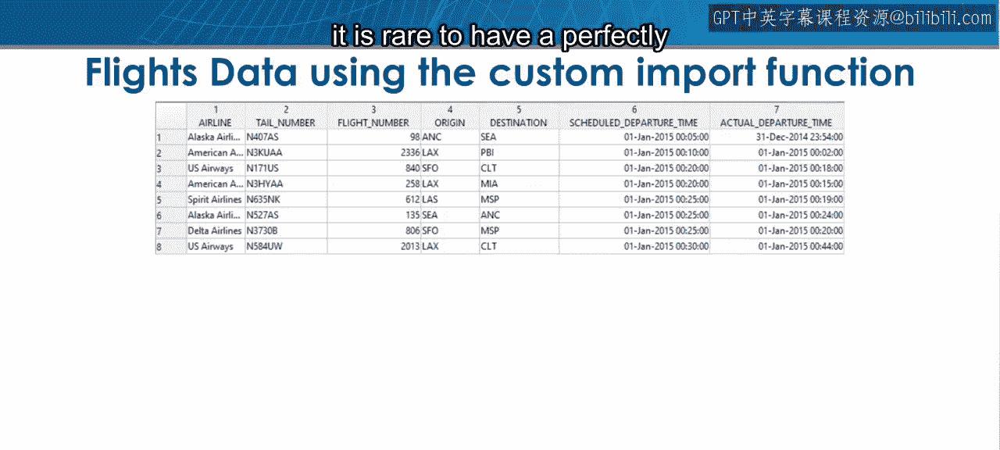

正如你在本模块中所见，当你首次导入原始数据时，很少能直接得到一个完美组织且可直接使用的表格。


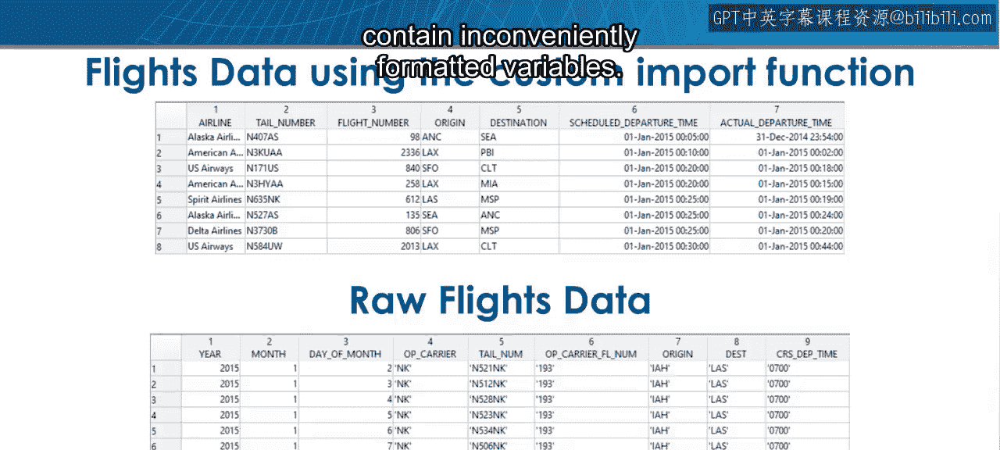

你的数据很可能杂乱无章，分散在多个文件中，并且包含格式不便的变量。


例如，原始的航班数据集就分散在多个文件中，需要大量的预处理工作才能将日期和时间信息整合成单一格式。


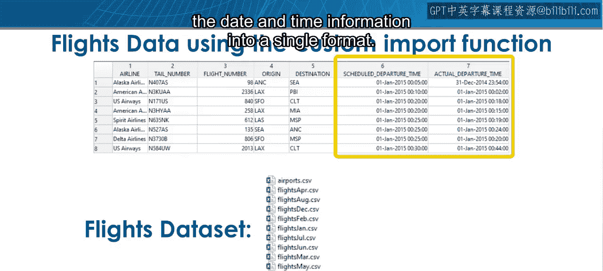

## 核心技能回顾

上一节我们介绍了数据整理的常见挑战，本节中我们来回顾一下你已掌握的核心技能。

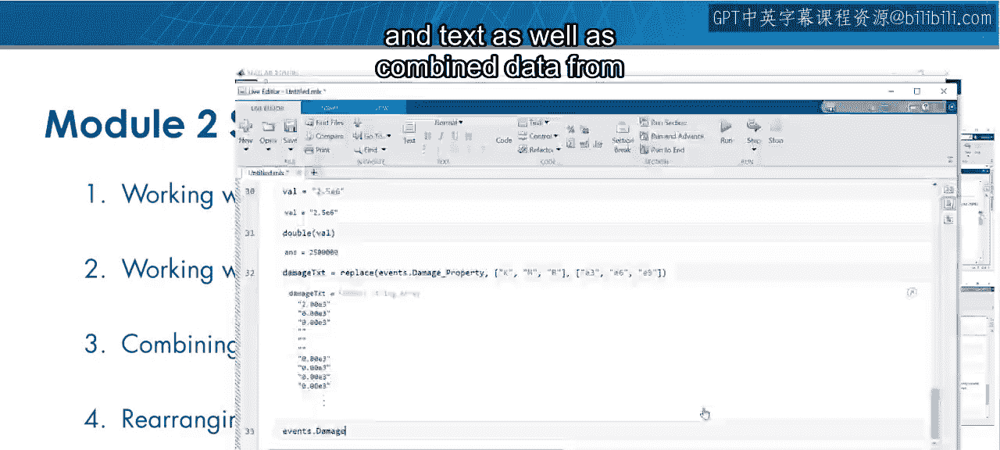

你学习了如何处理日期、时间和文本数据，以及如何合并来自多个来源的数据，并将其重新组织成更方便的形式。


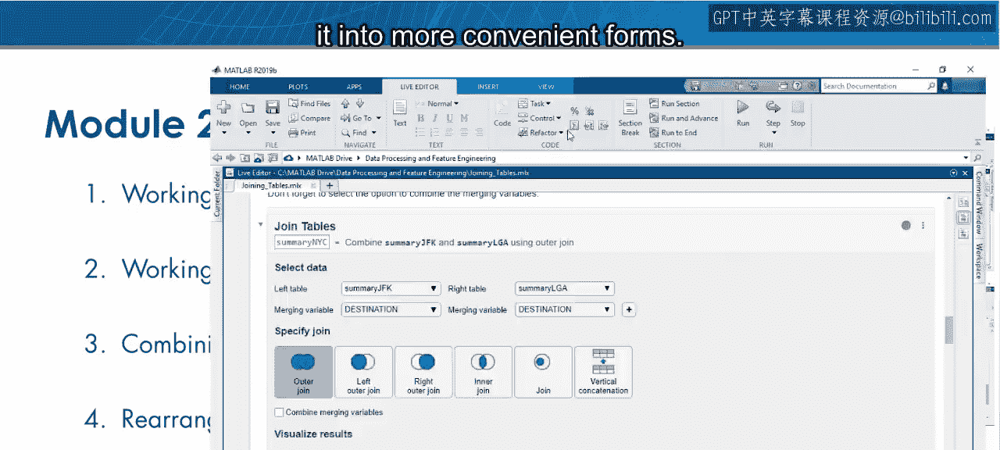

这些技能将帮助你预处理所拥有的任何原始数据。


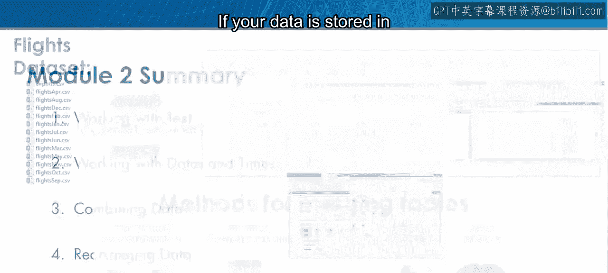

## 数据整合与重组

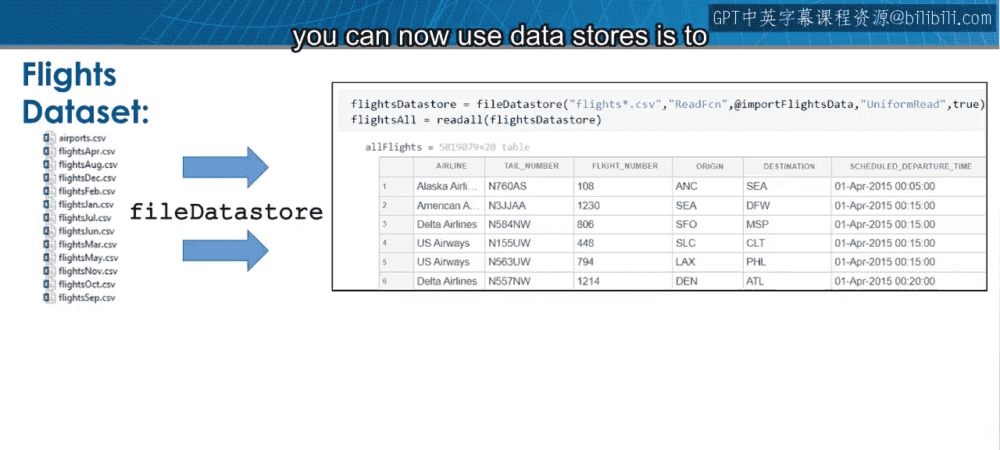

以下是处理分散数据和重组表格的具体方法。

*   **合并多个文件**：如果你的数据像航班数据集一样存储在多个文件中，你现在可以使用数据存储（`datastore`）在导入时将它们垂直连接起来。
    ```matlab
    ds = datastore('flightdata_*.csv');
    combinedData = readall(ds);
    ```

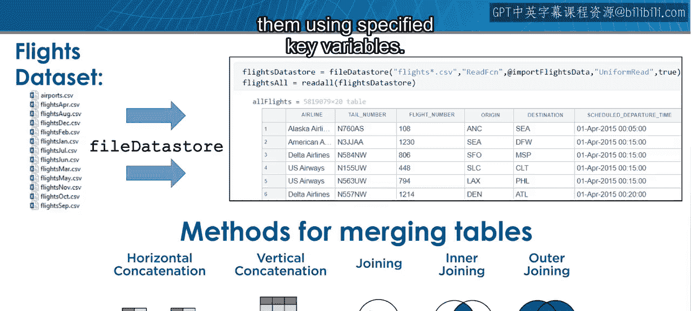

*   **合并多个表格**：如果你需要合并多个表格，可以使用连接方法（如 `join`, `innerjoin`, `outerjoin`），通过指定的键变量将它们组合起来。
    ```matlab
    mergedTable = join(table1, table2, 'Keys', 'ID');
    ```

*   **数据排序**：你还可以通过使用特定列对数据进行排序，来重新组织表格中的行。例如，航班数据可以按起飞时间、始发机场或两者进行排序。
    ```matlab
    sortedTable = sortrows(flightData, {'DepTime', 'Origin'});
    ```

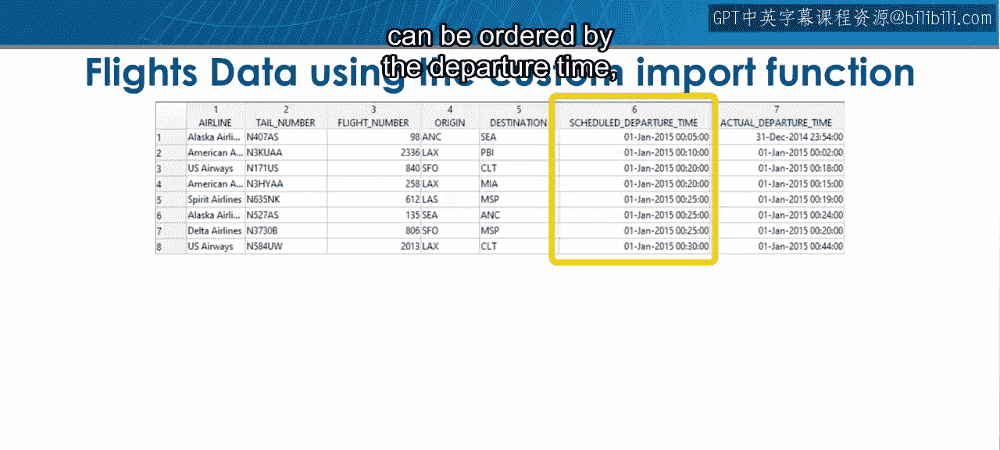

有多种排序方法可供选择，以帮助你分析数据并展示结果。


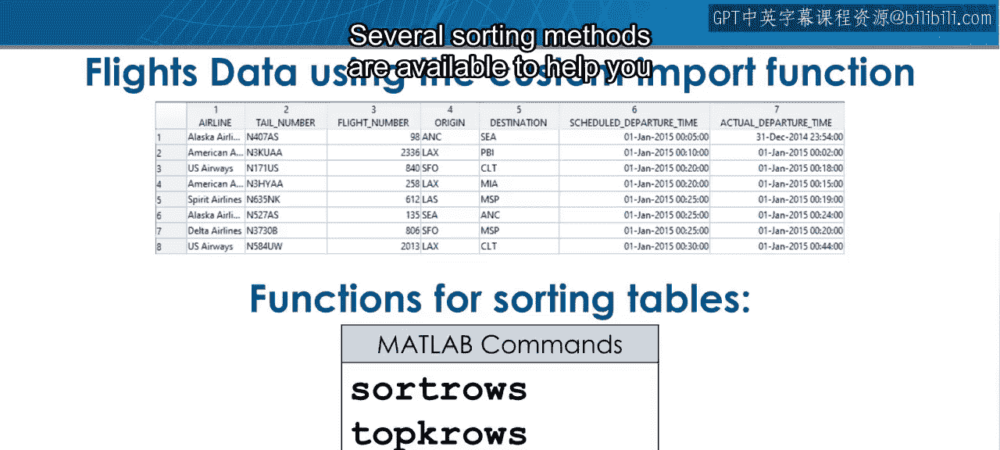

## 数据格式转换

你同样了解到，原始数据通常以不适合分析的格式记录。


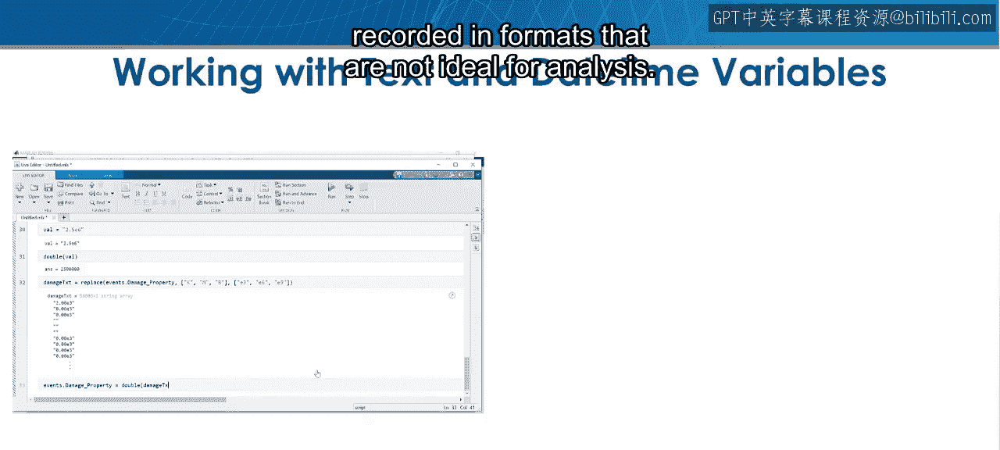

你现在可以使用文本和日期时间变量从原始数据中提取相关信息，并在数据类型之间进行转换。


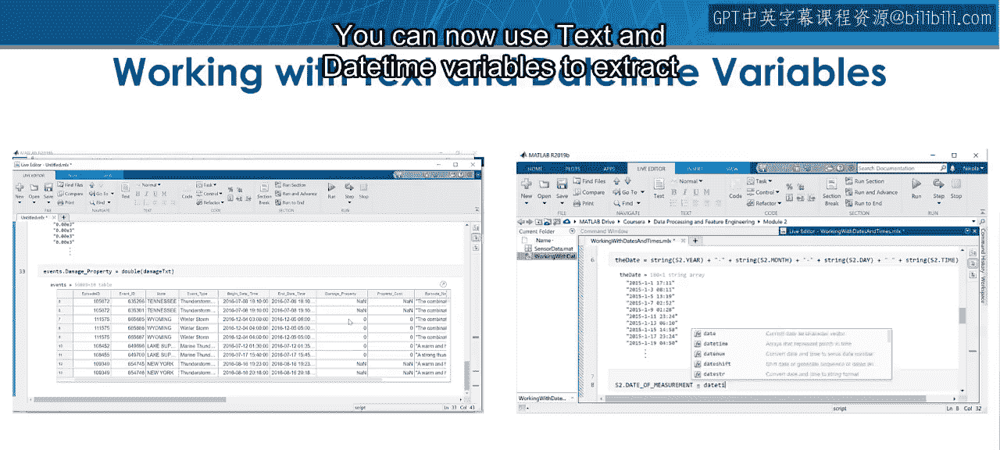

## 实践练习

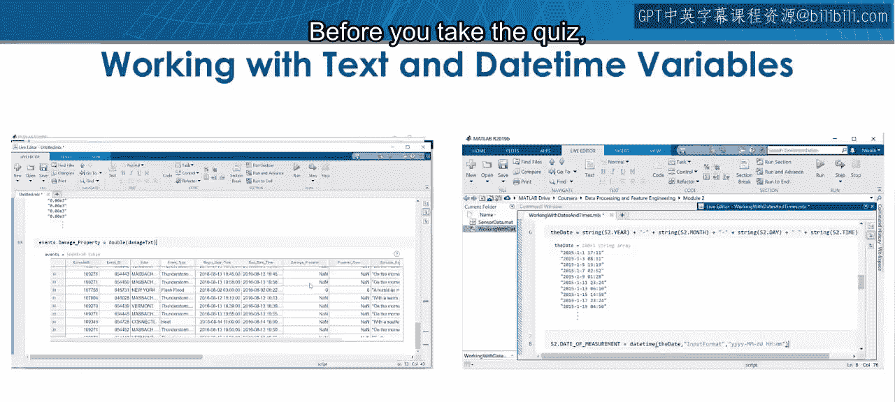

在参加测验之前，现在是练习所学知识的好时机。

导入航班数据集，使用数据存储加载全部12个月的数据，并尝试回答一些涉及本模块所涵盖主题的问题。


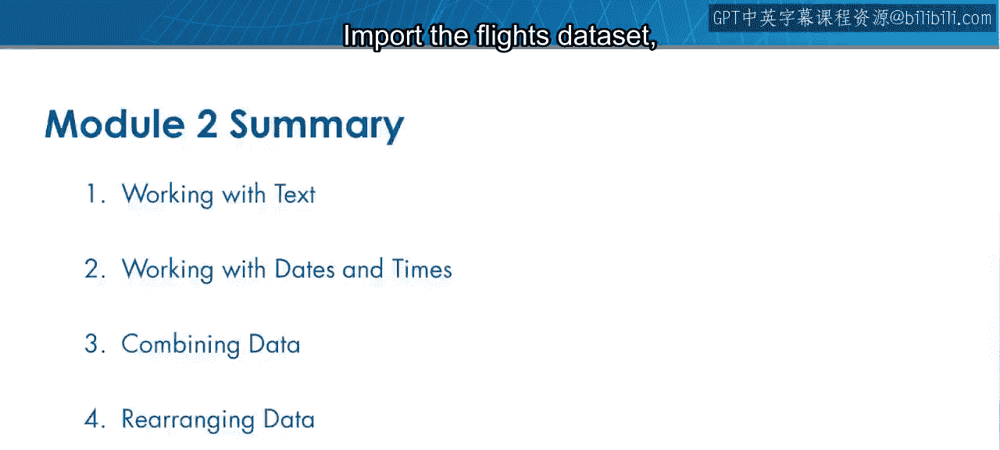

例如：
*   一周中哪一天的航班最多？
*   哪些州最容易因天气原因导致航班取消？

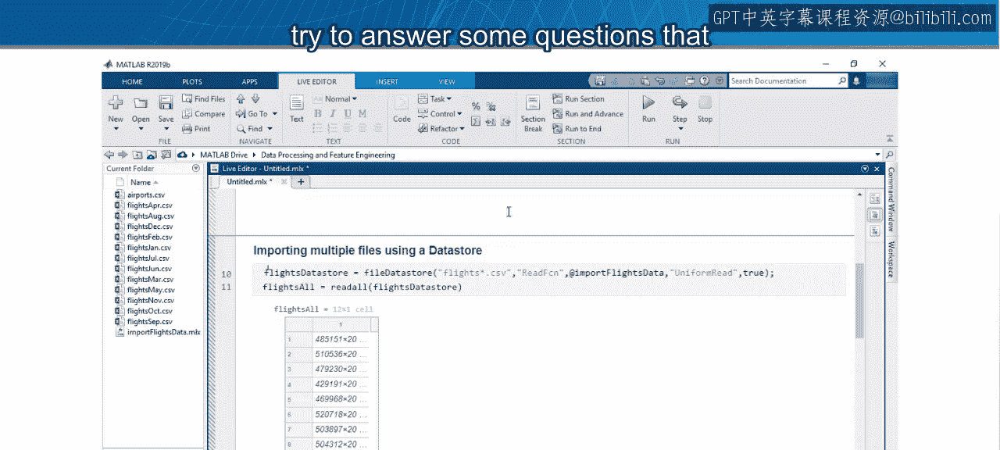

如果你发现了有趣的结果，请在论坛上分享。


## 总结

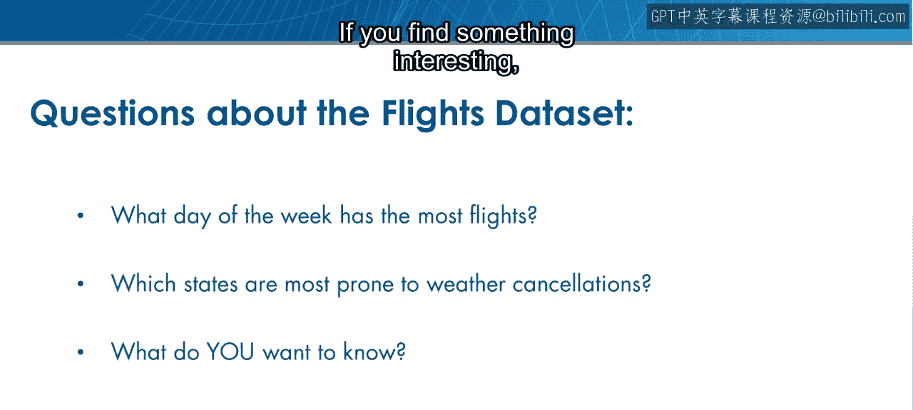

本节课中，我们一起学习了数据整理的核心流程。我们掌握了如何整合分散的数据源、重组表格结构以及对日期、时间等特殊格式数据进行处理。这些技能是进行有效数据科学分析的关键第一步，能够确保你的数据清洁、有序，为后续的特征工程和机器学习模型构建做好准备。