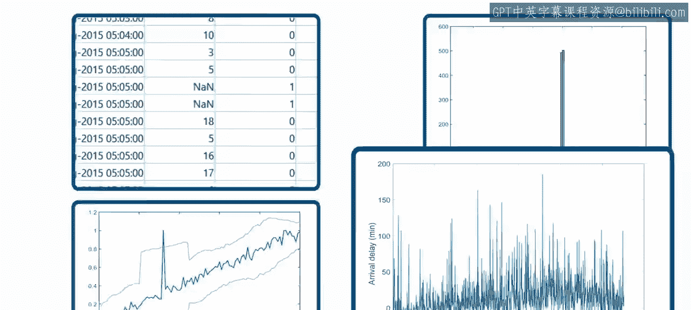
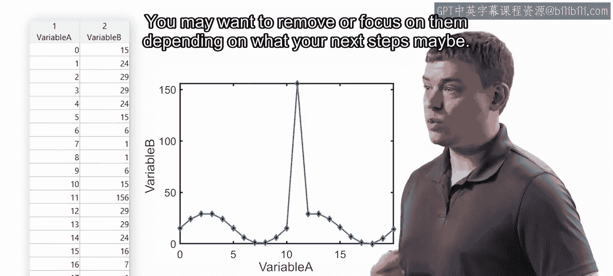
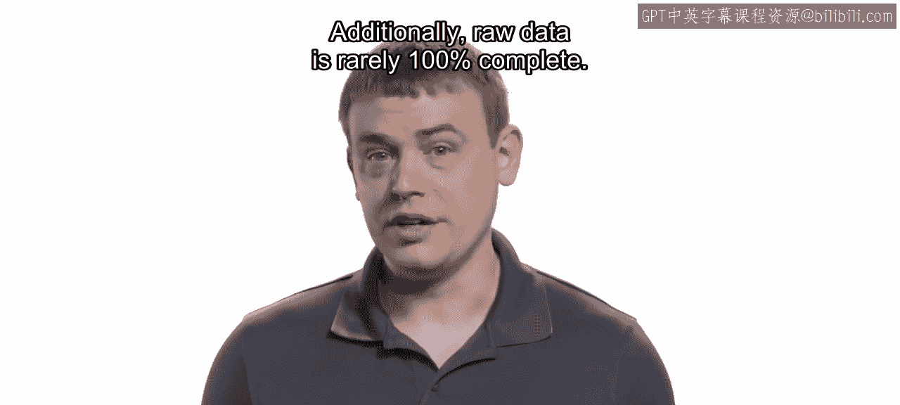
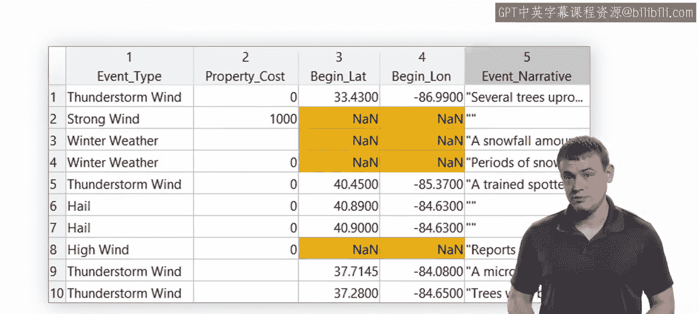
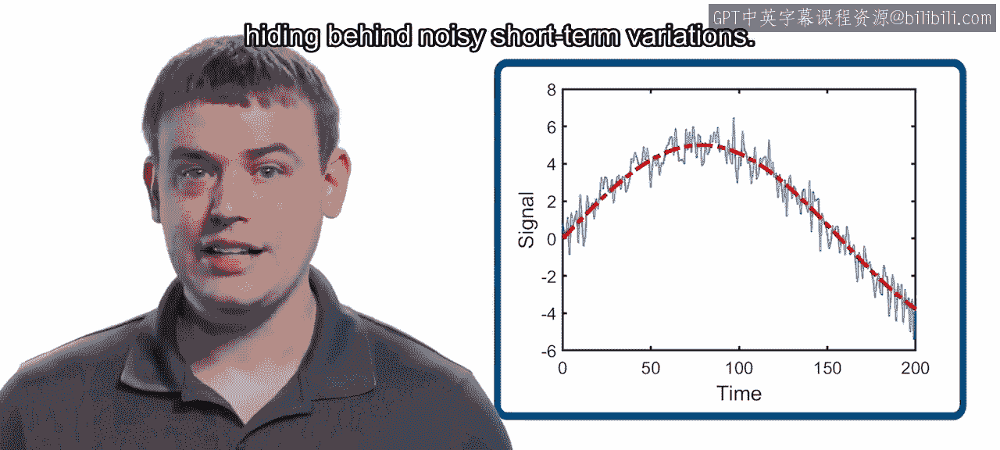
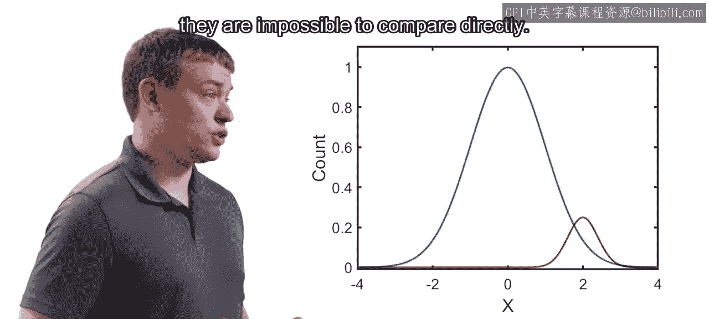
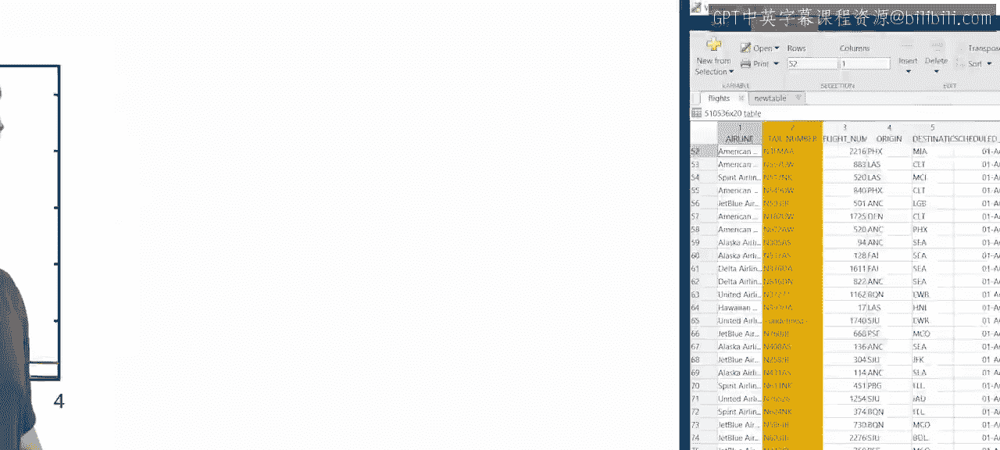
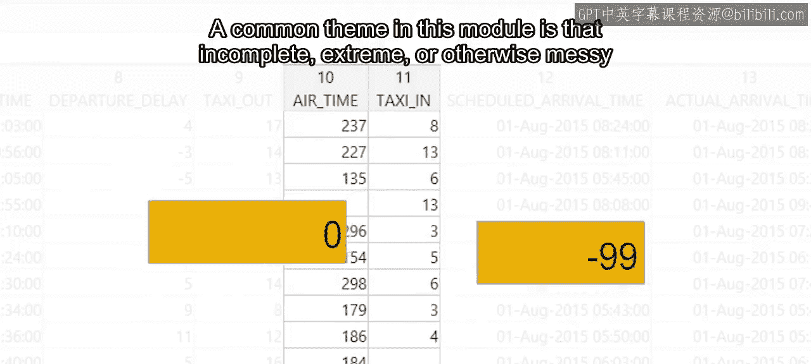
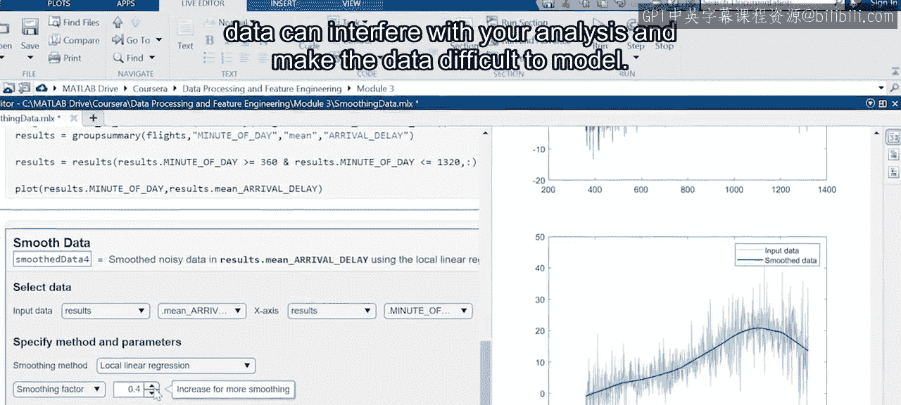
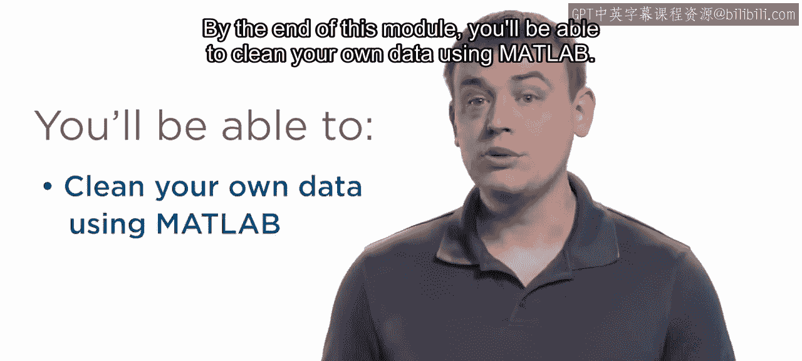

模块3：数据清理介绍 🧹

在本模块中，我们将学习数据清理的核心概念与常用技术。原始数据通常包含不完整、异常或不一致的记录，这些“脏数据”会干扰后续的分析与建模。通过本模块的学习，你将掌握使用MATLAB清理数据的基本方法。

在对数据有了初步了解后，你可能会发现其中存在一些不规则之处。这是因为原始数据通常是杂乱的，在进行深入分析之前需要进行预处理。

这项任务通常被称为**数据清理**。在本模块中，你将学习几种可用于清理数据的技术。

例如，某些数据点可能看起来不合常理，就像图表上的这些点。这些点被称为**异常值**。

根据后续步骤的不同，你可能需要移除这些异常值，或者专门对它们进行分析。

此外，原始数据很少是100%完整的。

例如，回顾风暴事件数据。一个缺失的条目可能意味着未知，比如缺失的GPS位置。

或者，它可能意味着某个值不重要，不值得报告，例如可忽略的财产损失。

有时，数据中的波动性可能使得难以识别任何规律。在这种情况下，你可能需要对数据进行**平滑**处理，以突出隐藏在嘈杂的短期变化背后的长期趋势。

最后，可能两个变量覆盖的范围差异巨大，以至于无法直接比较。

在这种情况下，你可以对数据进行**重新缩放**或**标准化**。

本模块的一个共同主题是：不完整、极端或杂乱的数椐会干扰你的分析，并使数据难以建模。

在本模块结束时，你将能够使用MATLAB清理自己的数据。

现在，让我们开始学习。