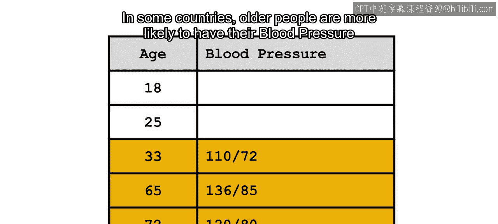
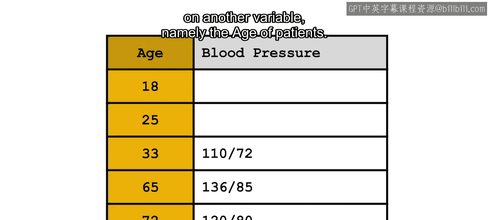
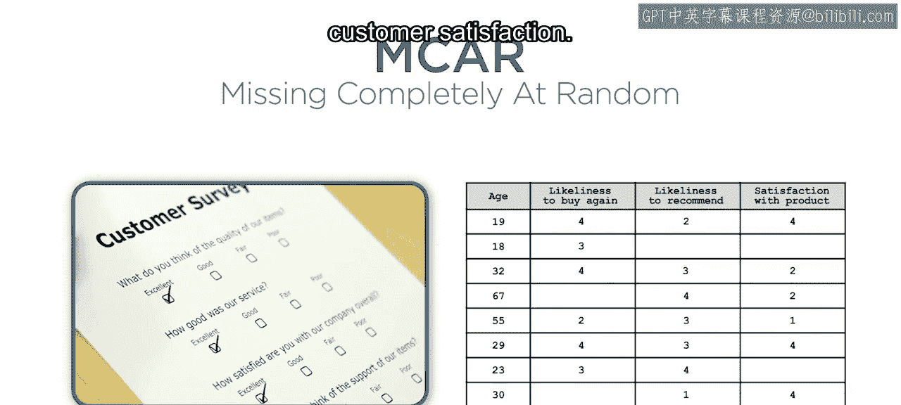
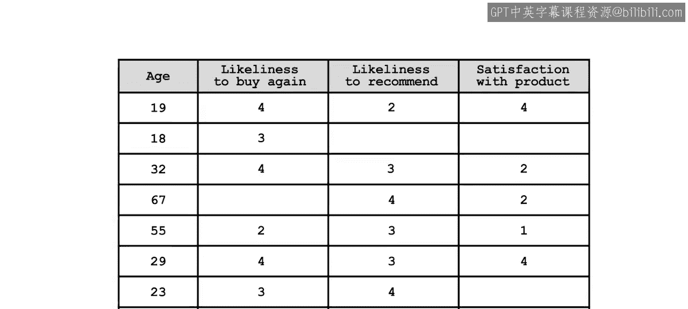
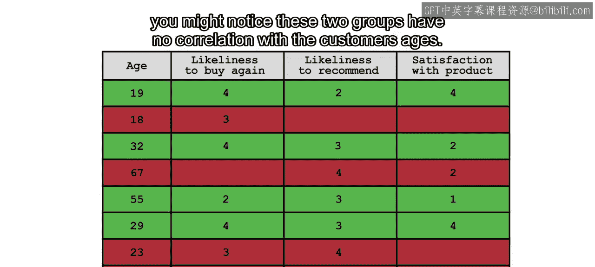
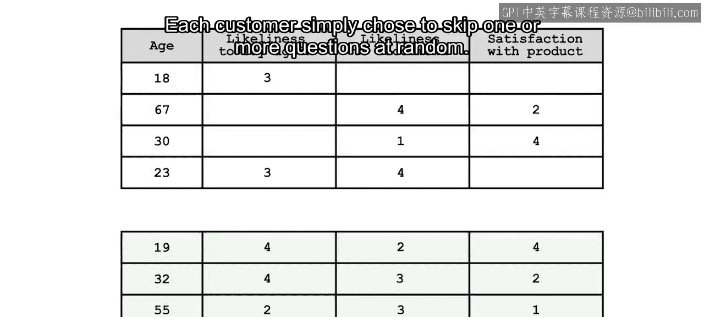
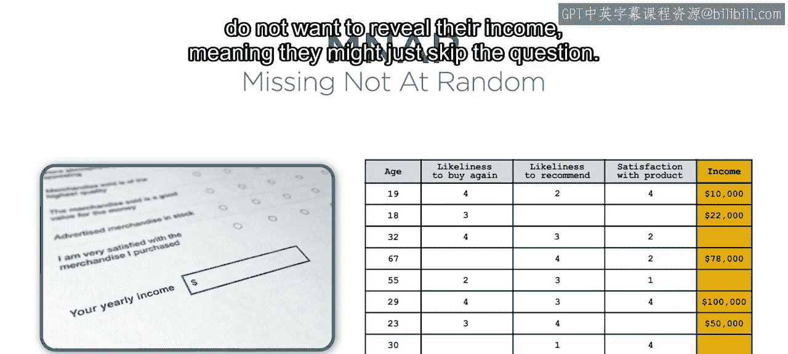
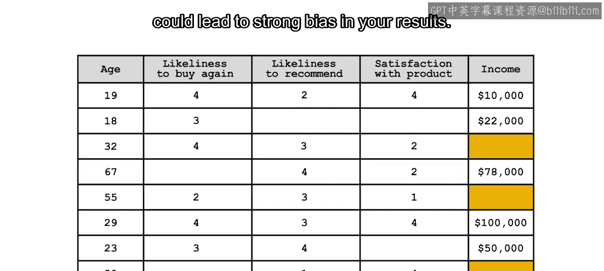
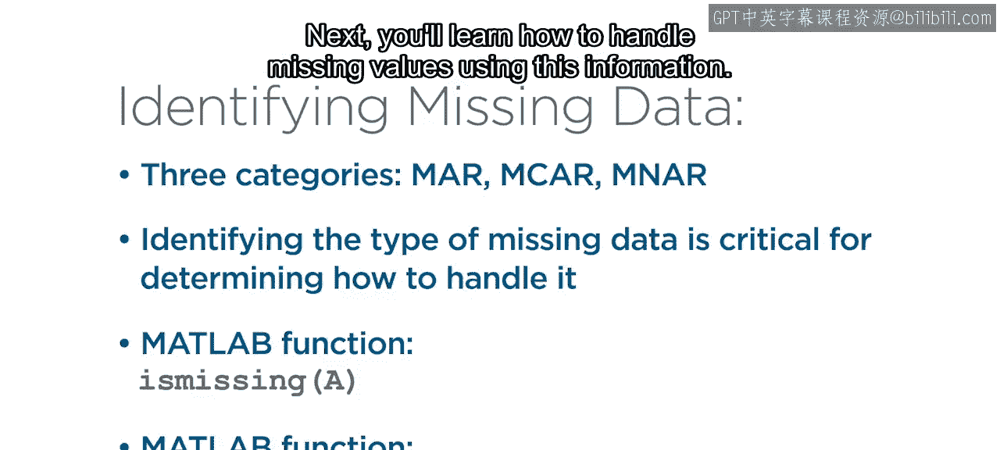

# 19：识别缺失数据 🔍

在本节课中，我们将要学习如何处理数据科学中一个几乎无处不在的挑战：缺失值。我们将首先了解缺失值的不同类型，然后学习如何使用MATLAB来识别它们。理解缺失值的成因和表现形式，是后续正确处理它们的关键。

## 概述

上一节我们学习了如何组织数据和合并多个数据文件。本节中，我们来看看数据预处理中的一个核心挑战——缺失值。处理缺失值的最佳准备是充分理解你的数据，包括缺失值的表示方式、数据收集过程、哪些地方不应该出现缺失值，以及哪些地方特意用缺失值来表示数据的缺失。识别缺失数据是决定如何处理它的第一步。

## 缺失值的成因与影响

多种因素可能导致数据缺失，例如信息加载失败、数据损坏、信息记录不完整等。理解数据为何缺失至关重要，因为缺失值会使从数据中学习的任务变得非常困难，甚至不可能。事实上，不完整的数据会给你的分析带来偏差，进而导致错误的预测。此外，识别和理解缺失值对于正确处理剩余数据也很重要。

## 缺失值的分类机制

让我们从理解缺失数据的分类开始。通常，数据科学家将缺失值分为三种主要机制：**随机缺失**、**完全随机缺失**和**非随机缺失**。这些机制将帮助你后续决定处理这些缺失值时应采用哪种方法。

以下是三种缺失机制的详细说明：

*   **随机缺失**：指某个变量的缺失原因与其自身的潜在值无关，而是**条件依赖于其他变量**。
    *   **公式/示例**：`P(变量X缺失 | 变量Y) ≠ P(变量X缺失)`
    *   例如，在一个包含人口血压信息的数据集中，缺失值可能与年龄条件相关。在某些国家，老年人比年轻人更可能在常规体检中检查血压。这与他们血压的具体数值无关，因此缺失模式不依赖于血压读数本身，而依赖于另一个变量——患者的年龄。

*   **完全随机缺失**：指缺失数据机制与**任何变量**的值都无关，无论是缺失的还是已观测到的。
    *   **公式/示例**：`P(变量X缺失) = 常数`
    *   例如，一个来自客户满意度调查的数据集。这类问题通常是可选的。如果将完整回答和缺失回答的结果分开，你可能会注意到这两组数据与客户的年龄没有相关性。每位客户只是随机选择跳过一个或多个问题。

*   **非随机缺失**：指变量缺失的原因与**该变量自身的值**有关。
    *   **公式/示例**：`P(变量X缺失) 与 X 的值相关`
    *   例如，如果你的调查现在询问人们的收入，高收入人群可能更不愿意透露自己的收入，这意味着他们可能会跳过这个问题。在这种情况下，数据缺失的原因正是你试图收集的数值本身。这是最棘手的一类，因为对这类缺失数据的错误处理可能导致结果出现严重偏差。

## 实例分析：航班数据集

那么，航班数据集的情况如何？假设你只列出了计划起飞时间、滑入时间和取消状态这几列。`TaxiIn`（滑入时间）的缺失值似乎与计划起飞时间没有关系，也没有迹象表明这些值缺失是因为它们自身的数值。然而，查看`Canceled`（取消）列，你会理解`TaxiIn`的缺失值是条件依赖于每个航班的取消状态的。因此，这可以假定为**随机缺失**的一个案例。计划起飞时间并不能预测何时会出现缺失值，但这个缺失值条件依赖于另一个变量。这种理解将帮助你后续确定处理这些缺失值的最佳方法。

## 在MATLAB中识别缺失值

现在，无论缺失数据的机制如何，你都需要识别缺失值。具体怎么做呢？在MATLAB中，你可以使用函数 `ismissing` 来识别数据中的缺失值。

`ismissing(A)` 返回一个逻辑输出，指示输入 `A` 的哪些元素包含缺失值。结果数组的大小与 `A` 相同。

但是，请注意，**标准缺失值取决于数据类型**。对于数值型和持续时间值，`NaN`（非数字）将被解释为缺失值。

**代码示例**：当对 `TaxiIn` 列使用 `ismissing` 时，注意带有 `NaN` 的条目如何返回逻辑值 `1`（真）。

对于 `datetime`、`string` 或 `categorical` 变量，缺失值的标识方式不同，如下表所示：

| 数据类型 | 标准缺失值表示 |
| :--- | :--- |
| 数值型 (`double`, `single`, ...) | `NaN` |
| 持续时间 (`duration`) | `NaN` |
| 日期时间 (`datetime`) | `NaT` (Not a Time) |
| 字符串 (`string`) | `<missing>` |
| 分类 (`categorical`) | `<undefined>` |

**代码示例**：考虑 `ActualDepartureTime`（实际起飞时间）变量。注意缺失值如何被标识为 `NaT`。同样，注意 `TailNum`（机尾编号）列中的缺失值如何被标识为 `<undefined>`。

## 处理错误记录的数据

缺失数据也可能对应于错误记录的数据。例如，假设 `Airtime`（飞行时间）的值被错误地记录为 `0`，或者 `TaxiIn` 的值被记录为一个负数。你会希望将这些值也标识为缺失。在这种情况下你该怎么做呢？

`standardizeMissing` 函数可以将 `indicator` 中指定的值替换为标准缺失值。

**代码示例**：对于错误记录为 `0` 的 `Airtime`，或记录为负数的 `TaxiIn`，你可以使用 `standardizeMissing` 将这些不正确的值替换为缺失值。

## 总结

本节课中，我们一起学习了缺失数据的原因通常分为三类，这有助于确定如何处理这些数据。你还学习了如何使用 `ismissing` 函数来识别缺失值，以及使用 `standardizeMissing` 函数将任何指定值替换为标准缺失值。接下来，你将学习如何利用这些信息来处理缺失值。