# 20：处理缺失数据 🛠️

在本节课中，我们将要学习识别出数据中的缺失值后，应如何处理它们。我们将探讨忽略、删除和替换这三种主要策略，并学习如何在MATLAB中实现这些操作。

---

你已经了解了什么是缺失数据以及如何在数据集中识别缺失值。然而，你现在面临另一个问题：一旦识别出缺失值，该如何处理它们？

你可以忽略这些缺失值，删除包含缺失数据的条目，或者用新值替换它们。处理缺失值没有通用的最佳方法。根据之前学到的不同缺失数据机制，存在一些替代方案。此外，领域知识和理解如何解读数据将是成功处理缺失数据的主要助力。

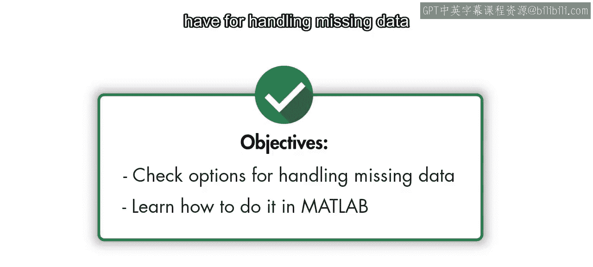

在本视频中，你将更详细地了解处理缺失数据的不同选项，以及如何在MATLAB中完成这些操作。

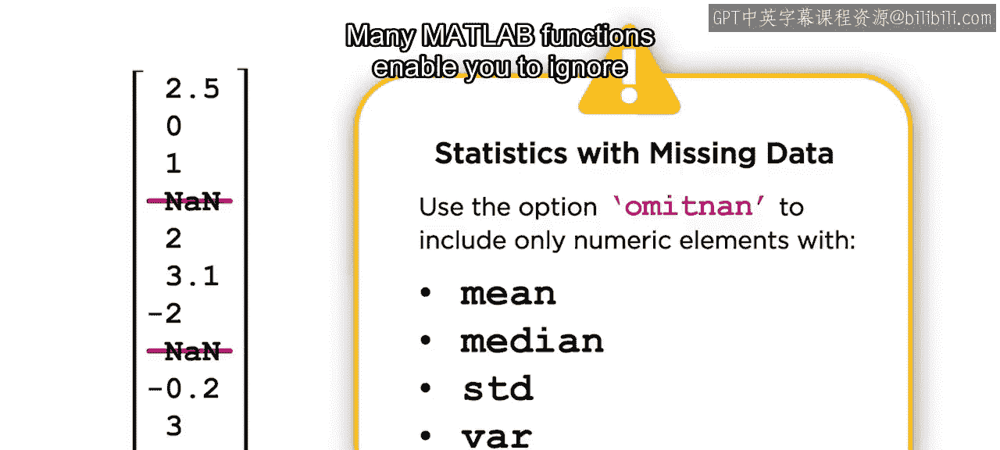

### 忽略缺失值

在探索性数据分析课程中，你学习了如何安全地忽略缺失数据。许多MATLAB函数允许你使用 `OmitNan` 选项来忽略缺失值。

请注意，这仅适用于数值。除了忽略缺失值，还有删除和替换两种选择。

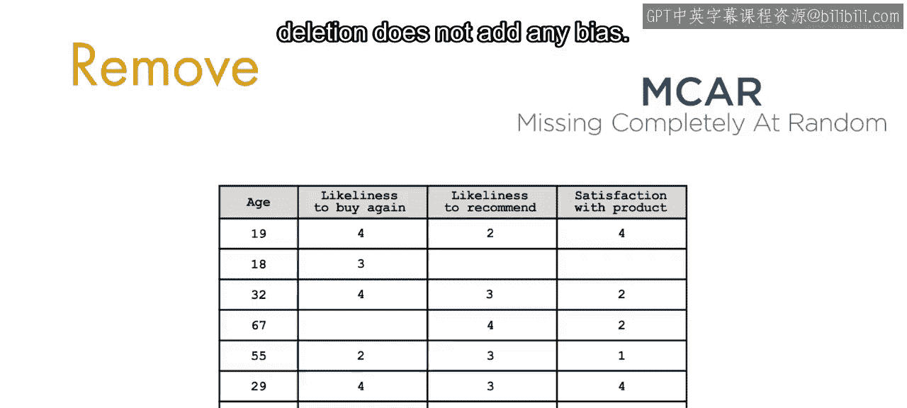

### 删除缺失值

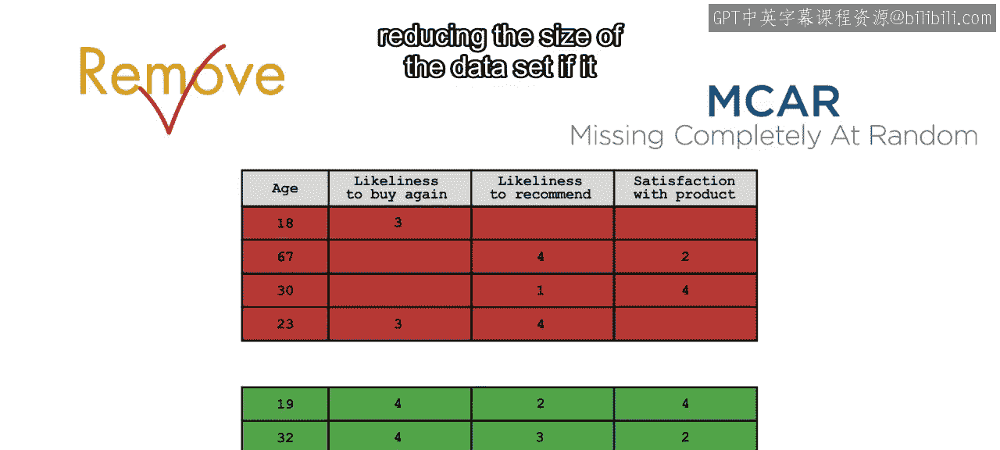

处理缺失值最简单的方法之一是直接删除包含缺失值的数据点。

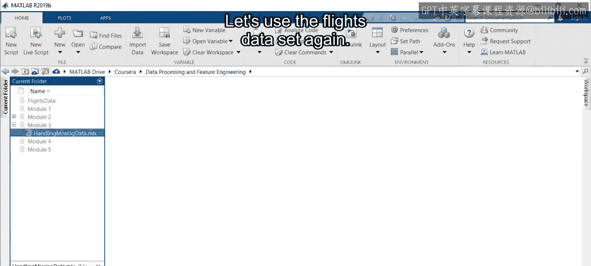

*   在**非随机缺失**的情况下，删除缺失值会给模型带来一定程度的偏差，因为值缺失的可能性与其本身的值有关。
*   在**随机缺失**的情况下，删除也可能引入偏差，但如果缺失数据的百分比很小，那么删除数据可能不会造成统计效力的显著损失。
*   如果数据是**完全随机缺失**，删除则不会增加任何偏差。

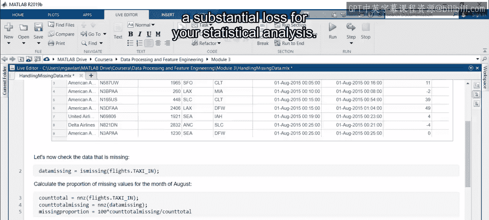

然而，你需要小心，如果数据集中有太多缺失值，你可能会显著减少数据集的大小。

让我们再次使用航班数据集。如前所述，该数据集中的缺失值被定性为随机缺失。如果你计算已识别的缺失值数量，会发现它们占八月份数据的1%。因此，删除这些值可能不会对你的统计分析造成重大损失。

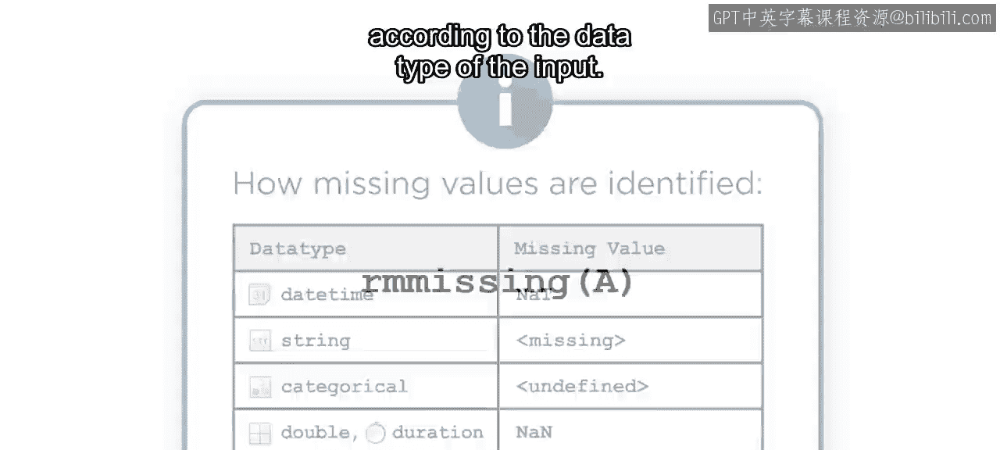

在MATLAB中，你可以使用函数 `rmmissing` 来删除缺失条目。

*   如果输入是**向量**，则 `rmmissing` 会删除任何包含缺失数据的条目。
*   如果输入是**矩阵**或**表**，则 `rmmissing` 会删除任何包含缺失数据的行。

与 `ismissing` 函数类似，缺失值的定义取决于输入的数据类型。

对于航班数据集，`rmmissing` 返回一个不包含缺失值行的输出。

请注意，此过程也可用于更复杂的任务。例如，假设你想确定数据是否揭示了到达延误的任何每日趋势。为此，你需要删除缺失值。由于每分钟都有多个航班，你可以使用 `groupsummary` 将数据按分钟分组。对于这个特定月份的每一天的每一分钟，平均到达延误将是一个单一的数字。然后，你可以删除所有对应的 `NaN` 缺失值。你可以通过使用输入参数 `DataVariables` 并选择相应的表变量名来实现。

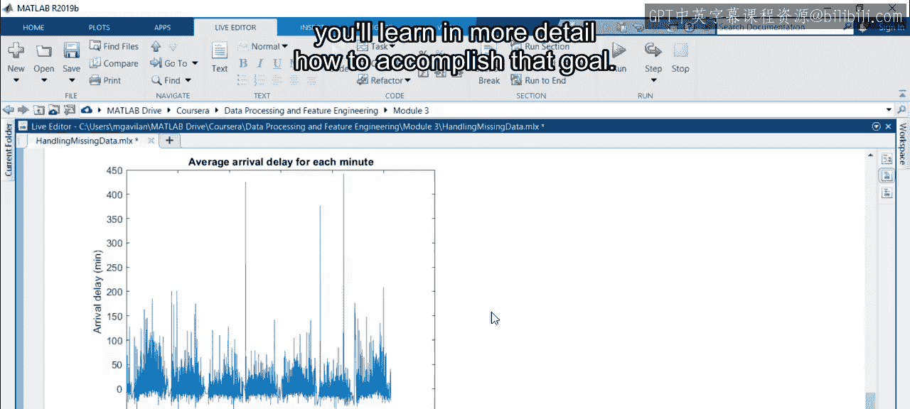

处理完缺失值后，你就可以使用这个结果来开始寻找数据中的趋势。在后续的视频中，你将更详细地学习如何实现这个目标。

### 替换缺失值

现在，你的第一个替代方案是删除包含缺失值的行。但如果这样做会显著减少数据集的大小怎么办？或者，如果你有一个显示非随机缺失机制的数据集怎么办？在这种情况下，你可以用估计值或代表性值替换缺失值。

在MATLAB中，你可以使用 `fillmissing` 来实现这一点，它使用指定的方法填充输入 `A` 的缺失值。例如，你可以使用一个常数值来替换缺失值。

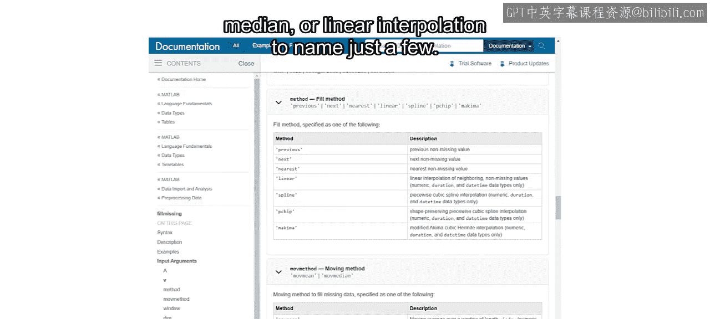

`fillmissing` 支持多种生成填充值的方法。常见的方法包括使用**均值**、**中位数**或**线性插值**等。当你只有数值数据时，使用实时编辑器任务可以简化测试多个选项的过程。

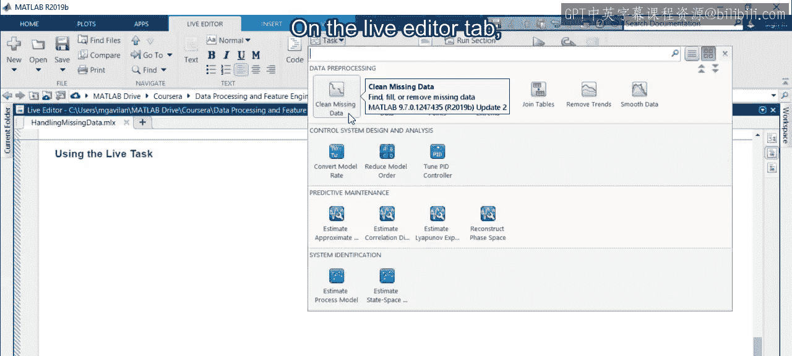

在实时编辑器选项卡上，选择“任务”，然后选择“清理缺失数据”。选择数据集和变量后，使用下拉菜单选择“填充缺失值”。将显示多种方法选项，你可以直观地检查每种不同方法的效果。

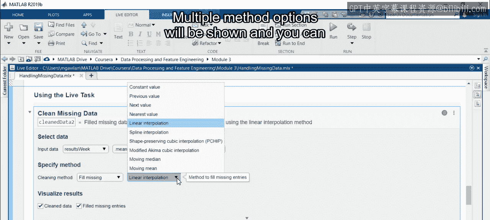

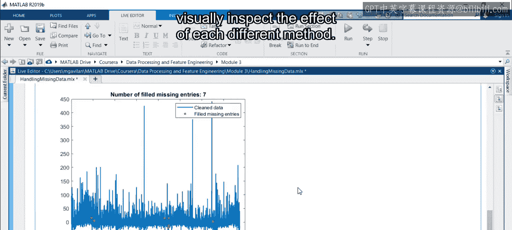

请注意，此实时编辑器任务也允许你删除缺失数据值，而不是填充它们。

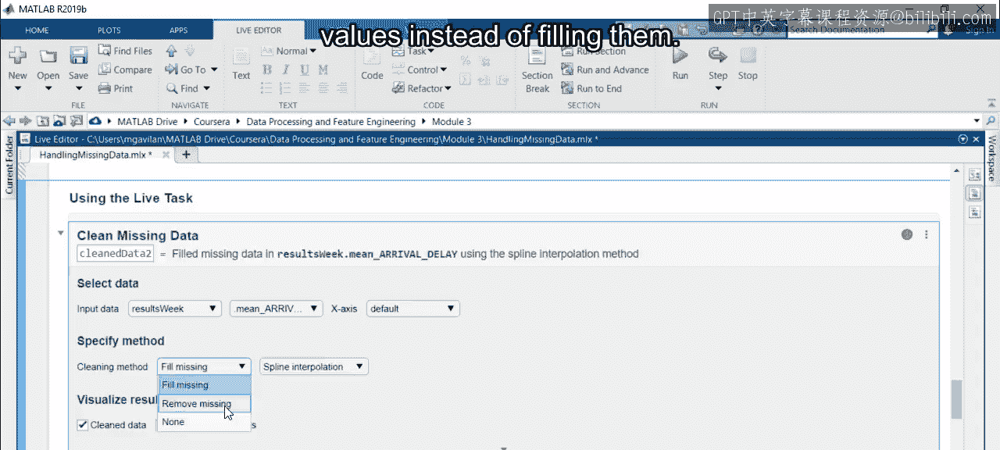

---

### 总结

本节课中我们一起学习了如何处理缺失数据。要记住，你必须适当地处理缺失值，以避免结果产生偏差。你可以使用 `rmmissing` 删除缺失值，或者使用 `fillmissing` 替换它们。在决定最佳行动方案时，请确保你理解数据中某些值缺失的原因。现在你将有机会练习这些概念。