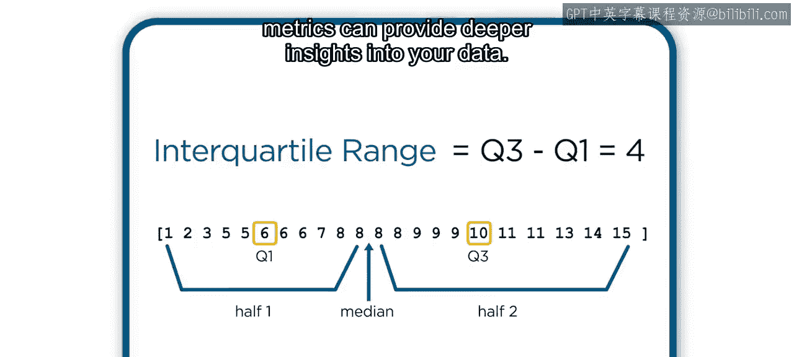
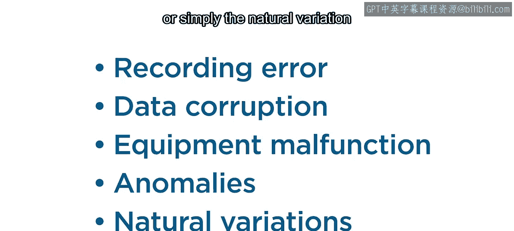
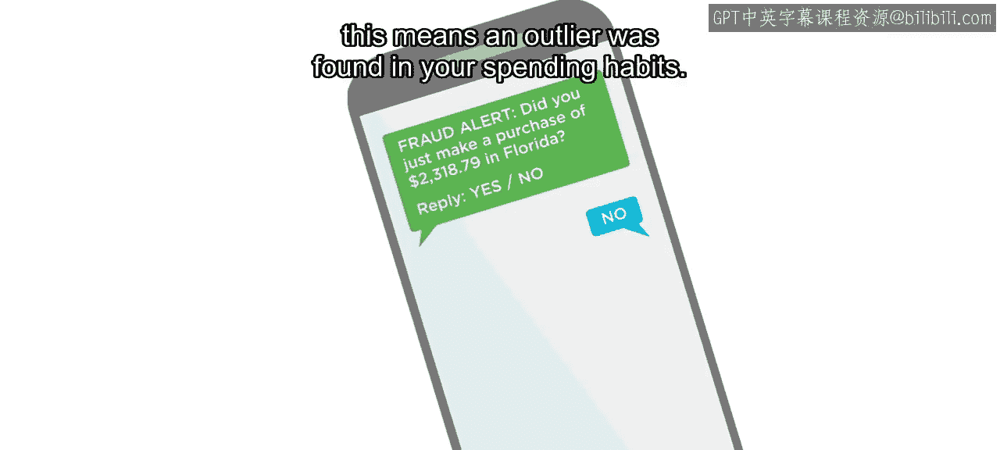
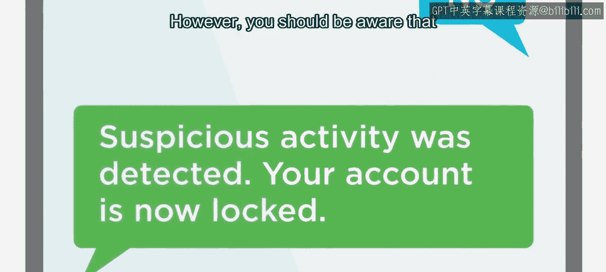

# 21：识别异常值 🎯



在本节课中，我们将要学习什么是数据中的异常值，它们如何影响数据分析与建模，以及识别和处理异常值的常用方法。

## 概述

上一节我们介绍了基本统计分布和指标如何帮助深入理解数据。本节中，我们来看看那些看起来不太可能或不太寻常的数据点——异常值。

## 什么是异常值？



异常值是指位于某些预期范围之外，或不遵循预期模式的数据点。

异常值可能由多种原因导致，例如：
*   记录错误
*   数据损坏
*   设备故障
*   异常现象
*   群体或系统中自然存在的变异

## 异常值的影响

异常值虽然与数据主体不同，但这重要吗？我们应该如何处理它们？

有时，你可能对数据有额外的了解，例如所在领域的理论知识或测量设置的技术知识。在这些情况下，你可能能够确定某个异常值是由特定错误源引起的，并决定将其删除甚至替换。

然而，需要记住，异常值不一定是坏数据。在足够大的数据集中，由于自然变异，异常值通常是预期会出现的。在医疗、制造、安全和安防等众多应用中，异常值实际上可能是异常检测的关注点。例如，如果你曾收到可疑信用卡活动通知，这意味着在你的消费习惯中发现了一个异常值。



尽管如此，你应该意识到任何类型的异常值都可能影响你的分析。



### 对数据可视化的影响

异常值会降低你轻松可视化整体数据的能力，因为缩放比例会倾向于少数异常大的数据点。在这种情况下，识别并忽略异常值可以显著改善图表，使趋势或模式更容易被观察到。

### 对统计指标的影响

异常值会显著影响分布的平均值和标准差。

考虑以下数值向量及其指标：
```
数据向量: [1, 2, 2, 3, 3, 4, 5]
平均值: 2.857
标准差: 1.345
中位数: 3
四分位距: 2
```

现在注意当我们添加一个大的异常值时会发生什么：
```
数据向量: [1, 2, 2, 3, 3, 4, 5, 100]
平均值: 15.0
标准差: 33.941
中位数: 3
四分位距: 2
```

平均值增加了一倍多，标准差增大了十倍以上。然而，中位数和四分位距变化不大。异常值对这些指标的影响通常要小得多。这些指标在存在异常值时的相对稳定性，对后续的一些识别算法很有用。

### 对建模的影响

异常值也会使基于数据创建的模型产生偏差。

考虑以下数据及其线性模型，看起来拟合得很好。现在注意在不同位置引入异常值时会发生什么。模型会偏向异常值，而偏离数据中的线性趋势。通过忽略此类异常值，通常可以提高模型的准确性。

## 如何识别异常值？

所有这些场景都有一个共同点：需要识别异常值。那么，你该如何进行呢？

没有一个关于数据点必须偏离多远或多不同才能成为异常值的通用定义。定义这些异常值阈值应始终根据你对具体情况和需求的理解，逐案进行。

识别异常值的方法有很多，无法在此一一涵盖。以下是几种流行的异常值界限定义方法：

*   **均值±3倍标准差**：适用于正态分布的数据。但由于平均值和标准差对异常值都很敏感，在偏态数据或存在大异常值时，界限可能会发生显著偏移。
*   **四分位距法**：界限为第一四分位数减去1.5倍四分位距，以及第三四分位数加上1.5倍四分位距。此方法对一般分布更有用，且不受极端异常值影响。
*   **中位数绝对偏差法**：界限为中位数±3倍缩放后的中位数绝对偏差。此方法同样对一般分布有效，且对极端值稳健。

此外，移动均值或移动中位数方法可用于识别信号上的瞬态尖峰或其他未超出范围但表现异常的离群数据点。

## 如何处理异常值？

总结一下，一旦你在数据中识别出异常值，你可以：
*   保留它们
*   将其隔离进行分析
*   删除它们
*   甚至替换它们

正如没有放之四海而皆准的异常值定义或识别方法一样，也没有处理它们的预定义方法。最终，需要你运用对数据的最佳判断和知识来决定如何识别异常值，以及如何处理识别出的异常值。

## 总结


本节课中，我们一起学习了异常值的概念、它们对数据分析和建模的潜在影响，以及几种识别异常值的常用统计方法。理解并妥善处理异常值是数据清洗和预处理的关键步骤，有助于获得更可靠的分析结果和模型性能。