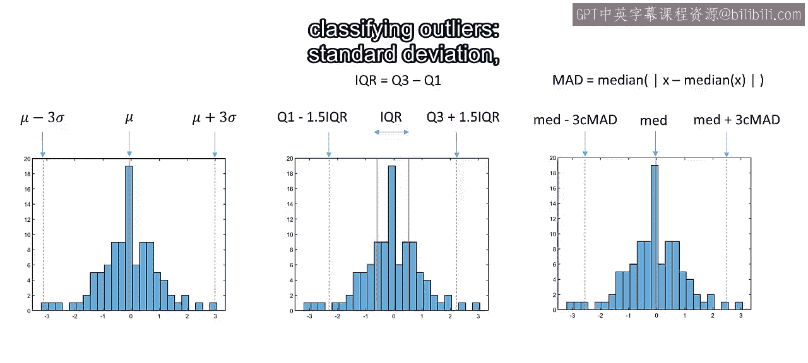
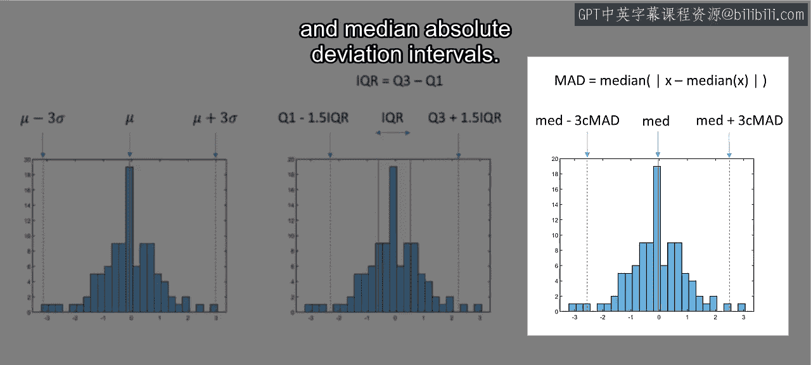
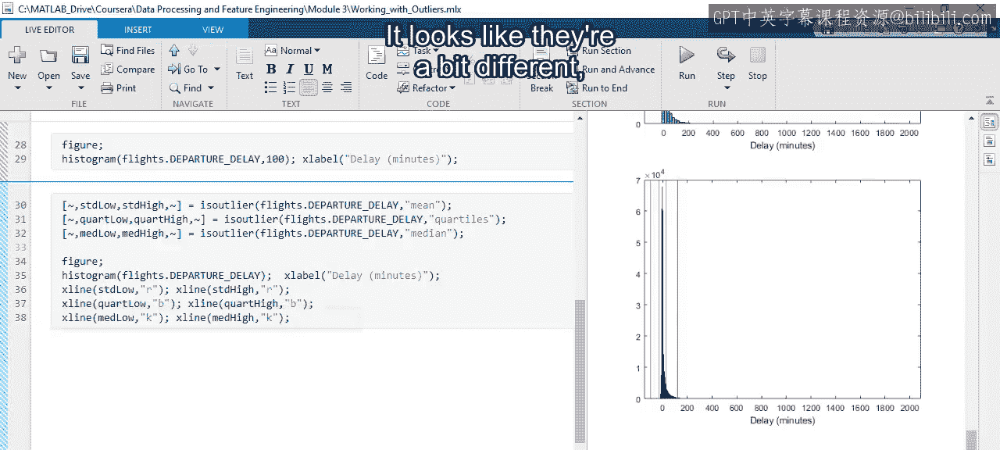
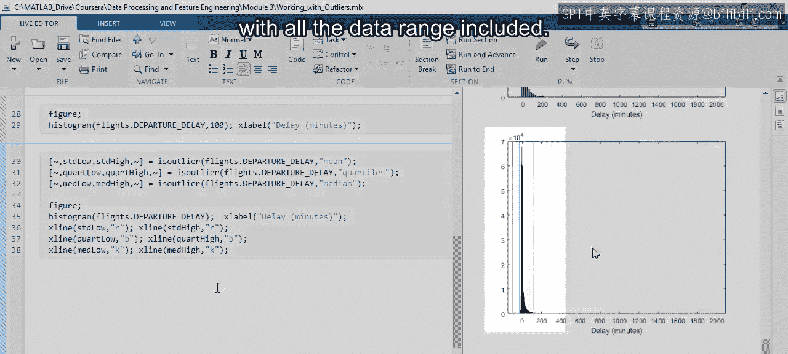
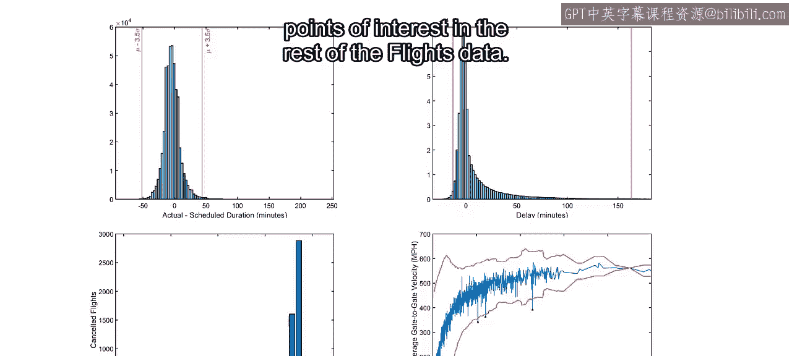

22：调查异常值 🕵️

在本节课中，我们将学习如何使用MATLAB工具来识别和处理数据集中的异常值。我们将以航班数据为例，探索航班延误和速度等指标，并应用不同的异常值检测方法。

上一节我们介绍了一些关于异常值的基本概念。本节中，我们来看看如何将这些概念应用于实际的航班数据，并使用MATLAB工具进行识别和处理。

航班晚点可能令人非常沮丧。但我们需要了解，与计划时间相比，典型的偏差是多少。为了调查这一点，我们计算从登机口到登机口的实际耗时与计划耗时的差值。

绘制结果后，我们发现大多数航班的偏差在正负一小时以内。但图中也显示存在相当多的异常值。由于数据点过于密集，我们很难准确评估其分布情况。

让我们使用直方图来获得更清晰的图像。大多数偏差集中在一小时以内，但在这个范围内的分布并不均匀。我们希望能看到更多细节，但一些较大的异常值影响了可视化的效果。

那么，如何处理这些异常值呢？MATLAB中有两个主要函数可以帮助我们：`isoutlier` 和 `rmoutliers`。




正如您可能从名称中猜到的，`isoutlier` 帮助您识别异常值以便进一步分析，而 `rmoutliers` 则负责检测并移除它们。




回顾一下之前提到的三种常见的异常值分类方法。


以下是这三种方法：
*   标准差法。
*   四分位距法。
*   中位数绝对偏差区间法。


由于我们知道存在非常大的异常值，因此选择中位数绝对偏差法。应用此方法后，数据分布的核心部分变得清晰得多。我们注意到，大多数航班的实际耗时少于计划时间。



为了查看更多数据，您可以使用 `rmoutliers` 的 `thresholdfactor` 参数来调整用于分类异常值的区间数量，其默认值为3。



接下来，让我们看看飞机离开登机口之前的情况。我们来观察起飞延误的分布。在这种情况下，异常值非常大，以至于几乎整个分布图看起来都是空的。这次，我们来比较一下三种常见的异常值分类方法。

首先，我们计算标准差法的边界，并将它们作为红色垂直线添加到直方图中。然后，用蓝色线表示四分位距法，用黑色线表示中位数法。看起来它们略有不同。


但由于包含了所有数据范围，我们很难看清细节。


您可以放大以获得更好的视图，或者重新生成图形以仅显示您感兴趣的部分。请注意，标准差法延伸到了大部分为空的区域，这并不理想。另外两种方法看起来可能会导致过多的数据丢失。所有这些方法的对称性意味着缩放它们无法同时解决这两个问题。

在这种情况下，您可能需要使用可以根据需要调整的、非对称的边界。一种方法是使用百分位数阈值。让我们看看1%到99%的百分位数边界是什么样的。百分位数边界可以根据需要调整，以消除或保留尽可能多的数据。

只有1%的起飞延误超过160分钟。但请记住，有些延误接近2000分钟，超过了一整天。起飞延误超过24小时的情况似乎相当可疑，可能值得进一步调查。

那么，您的数据中是否还有其他值得关注的异常值呢？当然有。我们可以使用 `groupsummary` 函数计算每天的取消航班数量，并将结果与计划起飞时间进行对比绘图。在这种情况下，视觉识别就足够了。您可以看到从26日到28日有些异常情况。

让我们检查一下1月27日取消离港和到港航班最多的前10个机场。看起来主要是美国东北部的机场。快速在线搜索显示，该地区在这一天遭遇了一场特大暴风雪。

思考航空旅行耗时的另一种方式是“登机口到登机口速度”，即总飞行距离除以从出发登机口到到达登机口的耗时。看起来平均速度最常见的是在每小时300到400英里之间。但有些航班的速度似乎出奇地慢，甚至低于典型的高速公路速度。

在移除任何异常值之前，请考虑这种分布可能是飞行距离的函数。将平均速度作为距离的函数进行绘图，证实了平均速度与总距离之间存在关系。因此，仅基于速度本身的分布来定义异常值可能没有意义。

让我们看看最大平均速度作为距离的函数。这里似乎有一些异常值。由于异常值只有在我们将速度与距离进行对比绘图时才显现出来，因此使用移动窗口会很有用。您可以将 `isoutlier` 与移动均值或移动中位数结合使用。

例如，一个基于300个数据点的移动均值分类可以这样实现：
```matlab
TF = isoutlier(velocity, 'movmean', 300);
```

您可以使用 `isoutlier` 函数的输出来可视化结果。首先，将移动下界绘制为红线。然后，添加上界。最后，可以使用函数返回的索引来高亮显示被分类的异常值。

现在，您已经看到了几个在MATLAB中调查和处理异常值的例子。接下来轮到您了。请花些时间扩展此处展示的脚本，继续本分析未完成的部分，或者在航班数据的其余部分中寻找您自己感兴趣的趋势和要点。




本节课中，我们一起学习了如何利用MATLAB的 `isoutlier` 和 `rmoutliers` 函数，结合标准差、四分位距、中位数绝对偏差以及百分位数等多种方法，来识别和处理数据集中的异常值。我们通过分析航班延误和速度数据，实践了从可视化识别到算法检测的完整流程，并探讨了在特定场景下（如速度与距离相关时）如何选择合适的异常值检测策略。