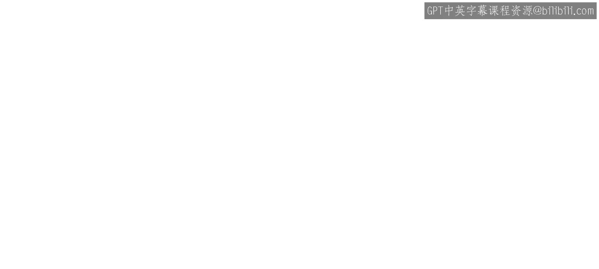
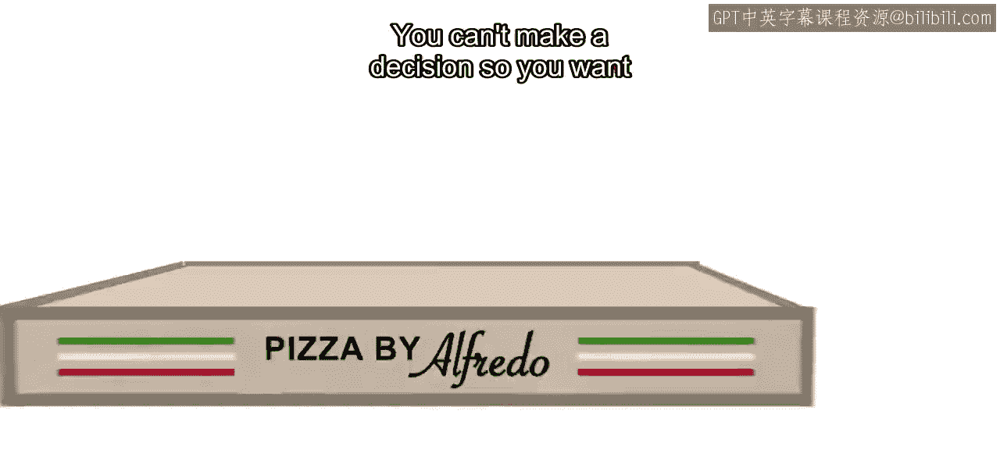
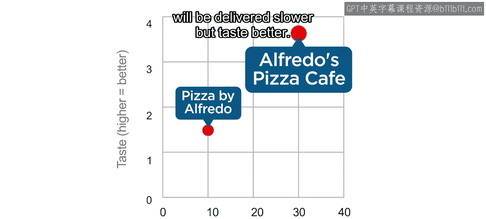
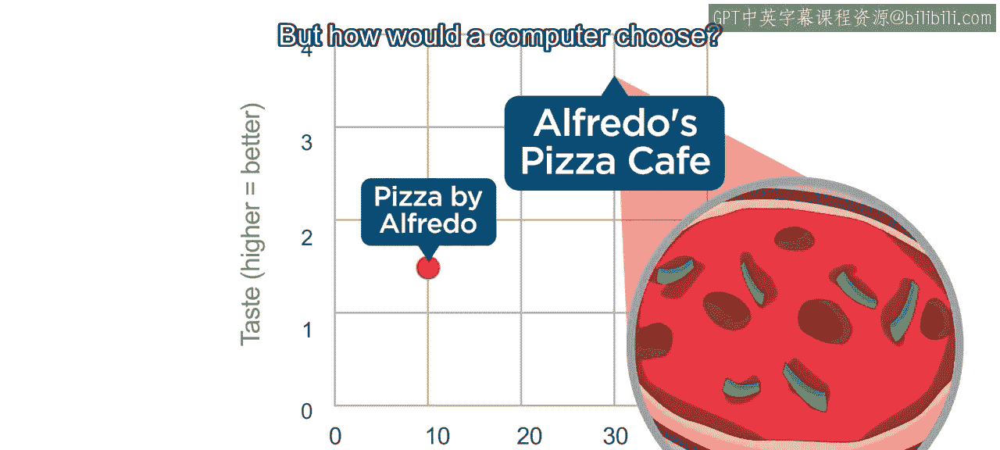
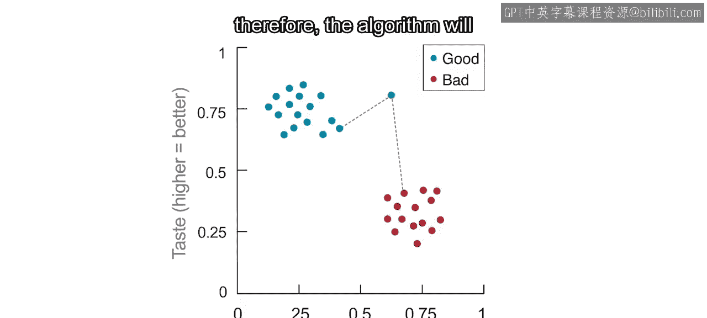
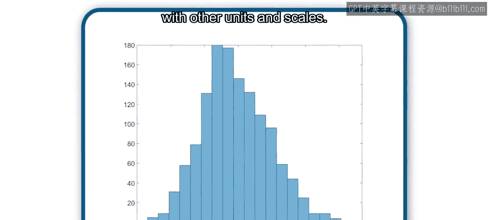
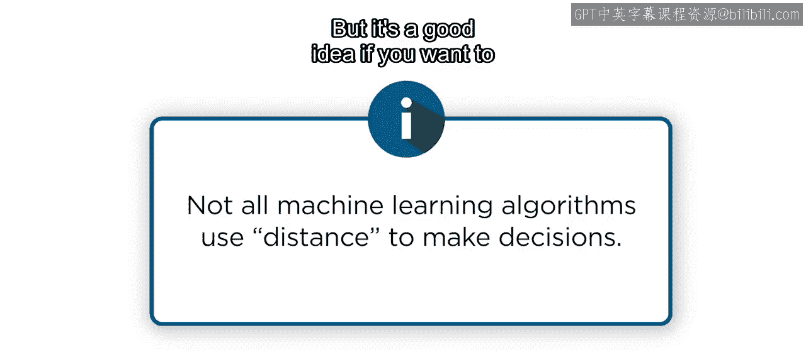
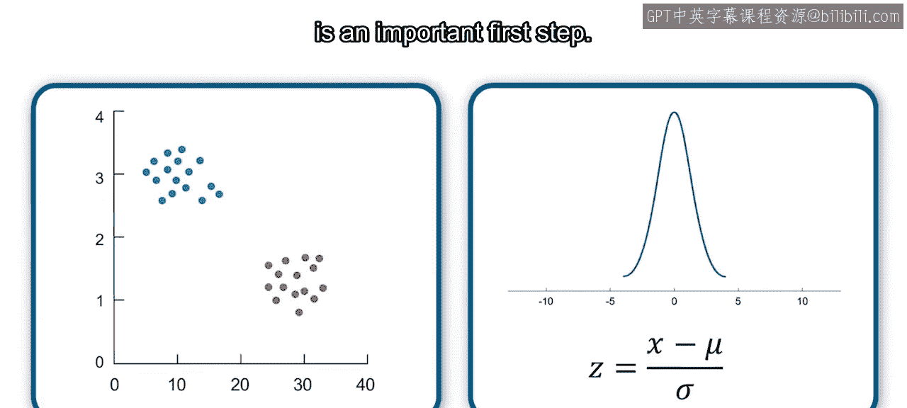

# 23：标准化数据 📊

在本节课中，我们将要学习数据标准化（或归一化）的概念、原因以及两种主要方法。我们将通过一个披萨店选择的例子，理解为什么不同尺度的数据会影响机器学习算法的决策，并学习如何通过标准化来解决这个问题。

---

想象你正在两家披萨店之间做选择：阿尔弗雷多披萨咖啡馆和阿尔弗雷多披萨店。

你无法做出决定，所以想让计算机帮你选择。

假设你给计算机两个信息：**口味**和**配送时间**。

阿尔弗雷多披萨店的配送速度更快，但口味不佳。另一方面，阿尔弗雷多披萨咖啡馆的配送速度较慢，但口味更好。

你可能不介意为了美味的披萨多等一会儿，但计算机将如何选择？

计算机只关心数字。对它而言，数据图实际上是这样的：数字是均匀分布的，因此X轴（配送时间）现在看起来比Y轴（口味）长10倍。

这种视图使得配送时间看起来比口味重要得多，仅仅因为配送时间的数值比口味的数值大。

为了确保计算机将每个变量视为同等重要，你需要对数据进行标准化。**数据标准化**是将不同变量转换到相似尺度的过程，以便它们可以直接比较。这个过程有时也被称为**数据规范化**。

对于某些类型的机器学习算法来说，这可能是数据准备的关键步骤。

为了说明其中一种算法，假设你收集了几家披萨店的数据，并将它们标记为“好”或“坏”。以下是两组数据的散点图。你想训练一个模型，使用口味和配送时间值将一个新的数据点归类为“好”或“坏”。

一些机器学习算法会根据点之间的距离进行预测。这样的算法会将这个数据点分配给距离它最近的组。

但是，请记住，算法使用的是数值，所以它的视图实际上更接近这样：因为口味值的范围较小，配送时间值在确定到特定组的距离时将重要得多。

假设新店需要25分钟配送披萨。无论披萨口味多好，算法都会将其分配给“坏”组，因为这些数据点总是更近。

标准化数据将通过确保每个变量对距离计算的贡献相等来防止这个问题。

---

一种常见的标准化类型是将数值缩放到0和1之间，使得最小值变为0，最大值变为1。

请注意，现在两个轴具有相同的范围，因此它们被正确地显示为具有相同的长度。

现在，如果新的数据点有足够高的口味值，即使配送时间很短，它也会更接近蓝色的数据点。因此，算法会将其分配给“好”组。

这种将数据缩放到0和1之间的标准化方法，对于具有明确定义的最小值和最大值的均匀分布非常有效。

---

但对于正态分布呢？在这种情况下，更好的标准化选择是**Z分数**。

Z分数的计算方法是：取任何正态分布（这里用变量`x`表示），首先减去均值（通常用希腊字母`μ`表示）。这将分布平移，使均值为0。

然后，数据除以标准差（这里用字母`σ`表示），这会缩小或扩大分布的范围，使其标准差为1。

如果你为之前直方图中的数据计算Z分数，新的直方图看起来会一样，只是现在的数值范围大约在-3到3之间。

现在，这些数据可以用于需要与其他单位和尺度进行比较的机器学习算法中。

---

请注意，并非所有机器学习算法都使用距离作为度量标准，有些算法可以轻松处理不同尺度的变量。在这些情况下，你不必标准化数据，因为这不会影响结果。但如果你想尝试多种模型，标准化是一个好主意。

最终，这取决于你的具体情况。尝试多种方法并找出最适合你特定数据集的方法是很好的实践。理解为什么以及如何使用标准化技术的基础知识是重要的第一步。

---

在本节课中，我们一起学习了数据标准化的核心概念。我们了解到，当数据特征具有不同尺度时，机器学习算法可能会做出有偏的决策。为了解决这个问题，我们介绍了两种主要的标准化方法：**最小-最大缩放**（将数据缩放到0-1范围）和**Z分数标准化**（基于均值和标准差）。标准化确保了每个特征在模型训练中具有同等的重要性，这对于基于距离的算法尤为关键。