24：标准化数据示例

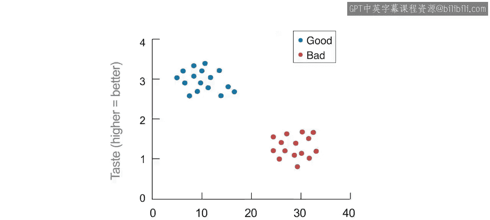

在本节课中，我们将学习如何在MATLAB中对数据进行标准化处理。我们将了解标准化的重要性，并实践几种不同的标准化方法，包括Z分数、范围缩放和稳健Z分数，以处理不同分布类型的数据。


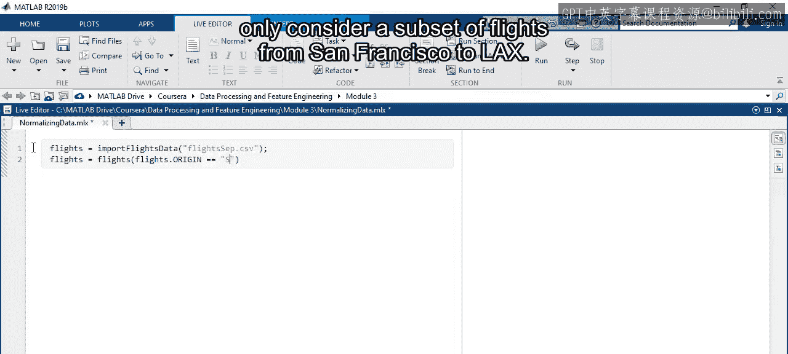

上一节我们了解了标准化对于比较不同单位和量纲的变量的重要性。本节中，我们将学习如何在MATLAB中执行不同类型的标准化。


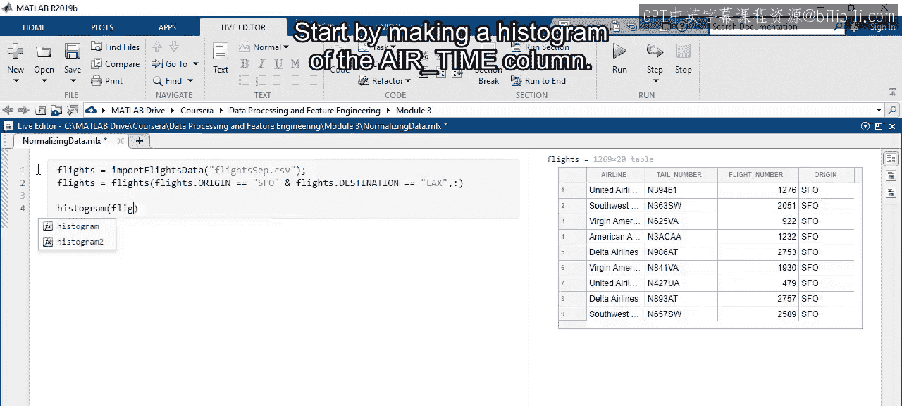

首先，我们从航班数据集中加载九月份的数据，并筛选出从旧金山飞往洛杉矶国际机场的航班子集。


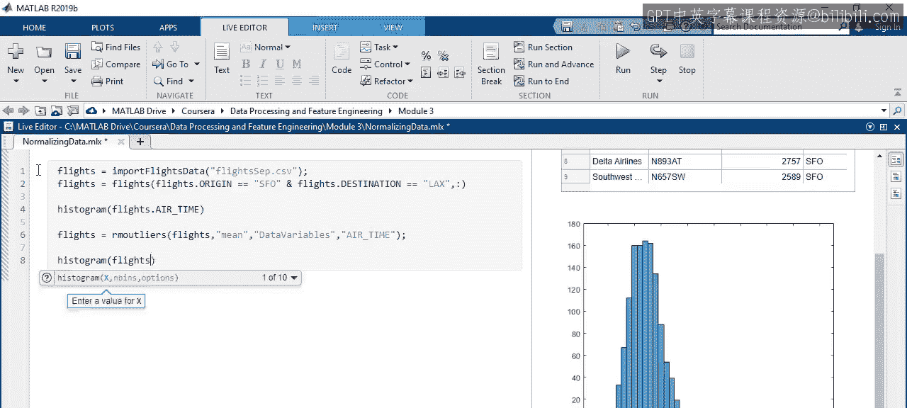

以下是加载和筛选数据的示例代码：
```matlab
% 加载数据并筛选特定航线
flights = readtable('flights_data.csv');
sf_to_lax = flights(flights.Origin == 'SFO' & flights.Dest == 'LAX' & flights.Month == 9, :);
```


接下来，我们为`airtime`（飞行时间）列创建直方图。数据显示出近似正态分布，但存在一些异常值。


以下是创建直方图的代码：
```matlab
% 绘制飞行时间的直方图
histogram(sf_to_lax.Airtime);
title('Distribution of Airtime (Original)');
xlabel('Airtime (minutes)');
ylabel('Frequency');
```


我们可以使用`rmoutliers`函数来移除这些异常值。


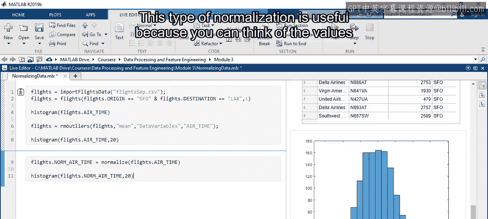

以下是移除异常值的代码：
```matlab
% 移除飞行时间中的异常值
sf_to_lax_clean = rmoutliers(sf_to_lax, 'DataVariables', 'Airtime');
```


处理后的数据分布更清晰。请注意，这里指定了直方图的箱数，这将便于与标准化后的直方图进行比较。


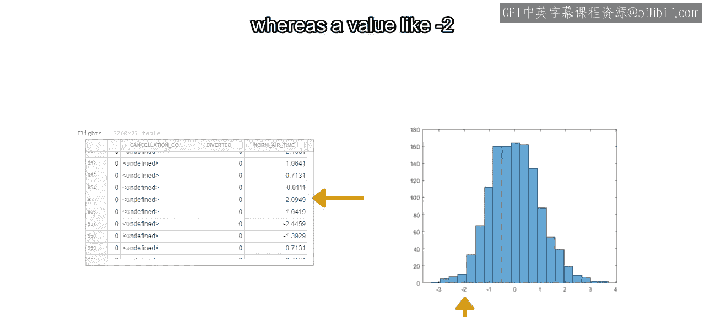

为了标准化`airtime`数据，我们使用`normalize`函数。该函数以表格中的一列作为输入，并返回其标准化版本。


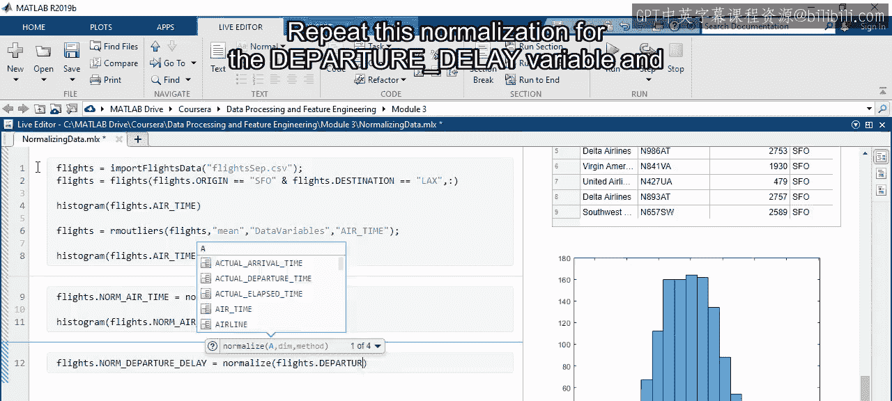

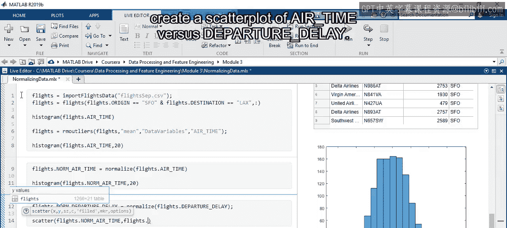

以下是使用默认方法（Z分数）进行标准化的代码：
```matlab
% 使用默认的‘zscore’方法标准化飞行时间
airtime_normalized = normalize(sf_to_lax_clean.Airtime);
% 或直接添加到表中
sf_to_lax_clean.AirtimeNormalized = normalize(sf_to_lax_clean.Airtime);
```


让我们再次检查直方图。它看起来形状完全相同，但请注意X轴的单位。数值范围从原来的50到70分钟，变成了大约-3到3。这些值已被转换为**Z分数**，这是`normalize`函数的默认方法。


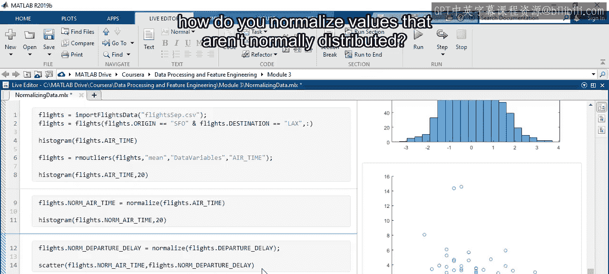

这种标准化很有用，因为你可以将这些值理解为以**标准差**为单位。例如，一个标准化后的飞行时间值为+1，意味着原始值比平均值高一个标准差；而值为-2，则意味着原始值比平均值低两个标准差。


现在，我们可以利用标准化来比较具有不同范围的变量。对`departure delay`（起飞延误）变量重复此标准化过程，并创建飞行时间与起飞延误的散点图。


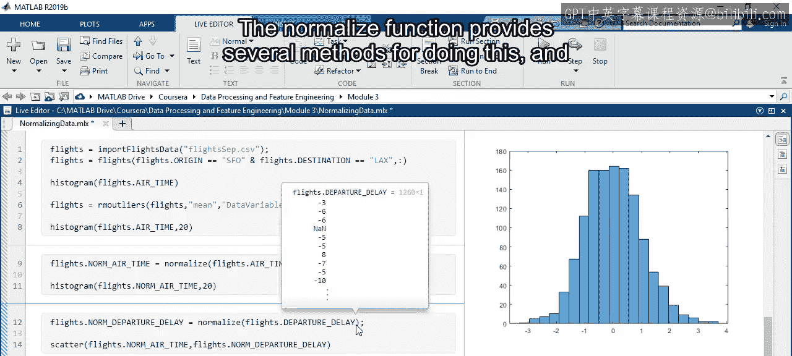

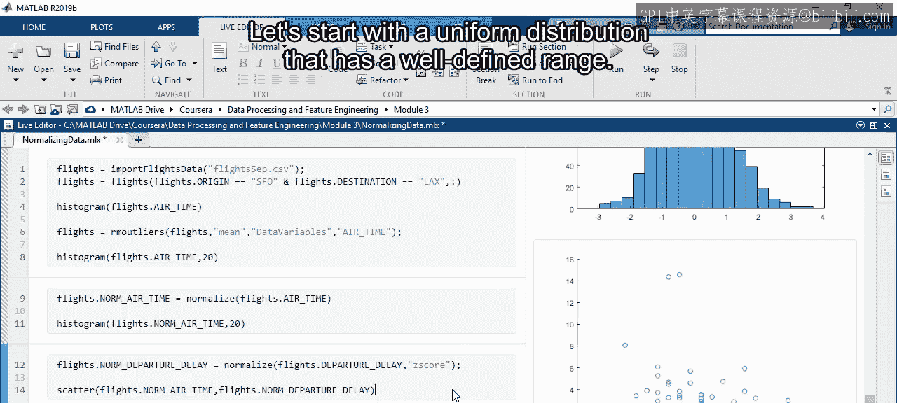

以下是标准化延误并绘制散点图的代码：
```matlab
% 标准化起飞延误并绘图
depdelay_normalized = normalize(sf_to_lax_clean.DepDelay);
scatter(airtime_normalized, depdelay_normalized);
xlabel('Normalized Airtime (z-score)');
ylabel('Normalized Departure Delay (z-score)');
title('Normalized Airtime vs. Departure Delay');
```


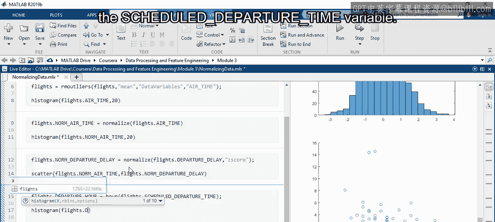

`departure delay`的值并非正态分布，因此Y轴上的范围有所不同。尽管如此，两个变量标准化后的值都具有均值为0、标准差为1的特性。这就引出了一个问题：如何对非正态分布的值进行标准化？


`normalize`函数提供了多种方法来实现这一点，你可以通过添加额外的参数来指定要使用的方法。


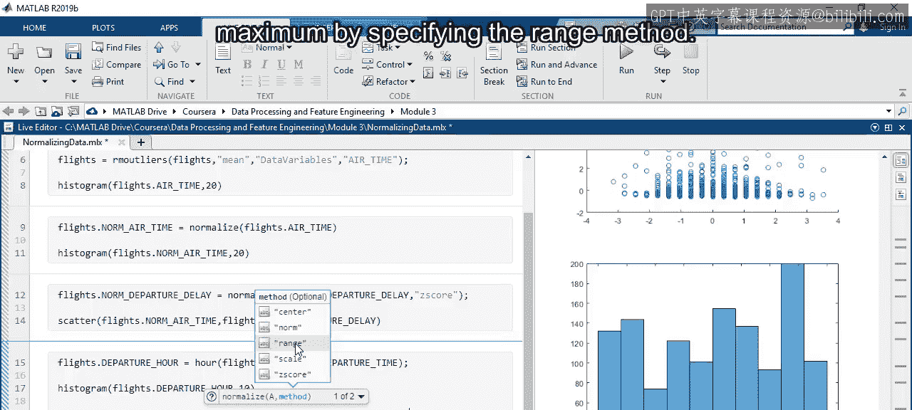

让我们从一个具有明确定义范围的均匀分布开始。我们使用`hour`函数和计划的起飞时间变量来创建`departure hour`（起飞小时）变量。


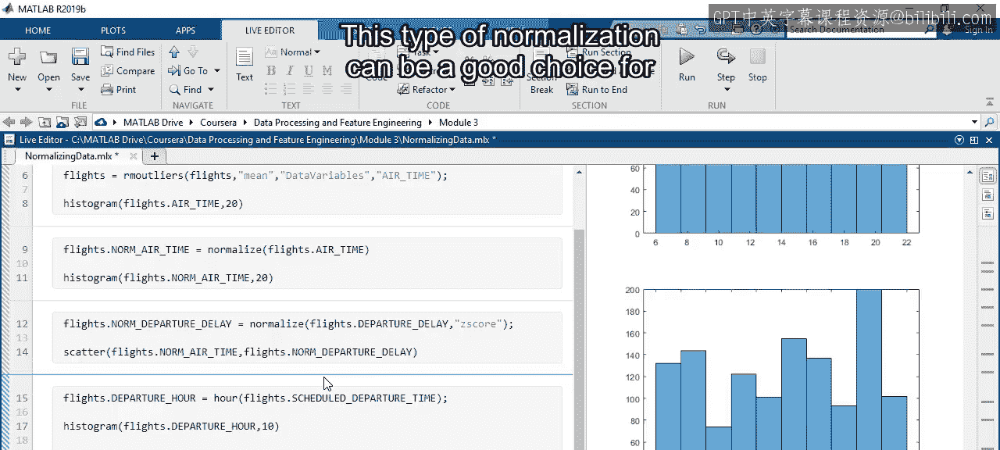

以下是创建起飞小时变量的代码：
```matlab
% 从计划起飞时间中提取小时
sf_to_lax_clean.DepHour = hour(sf_to_lax_clean.CRSDepTime);
```


这些值的范围是6到22，这意味着从旧金山飞往洛杉矶的航班，计划起飞时间在早上6点到晚上10点之间。


你可以通过指定`‘range’`方法，将这些值缩放到最小值和最大值之间（默认为0到1）。


以下是使用范围缩放方法的代码：
```matlab
% 使用‘range’方法标准化起飞小时
sf_to_lax_clean.DepHourNormalized = normalize(sf_to_lax_clean.DepHour, 'range');
```


让我们再次检查直方图。现在所有值都在0到1之间，而不是原来的6到22。这种标准化对于像起飞小时这样均匀分布的变量来说是一个不错的选择。


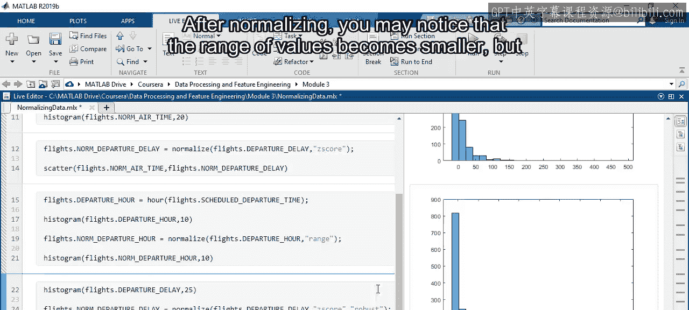

现在让我们回到像起飞延误这样既非均匀也非正态分布的变量。除了标准Z分数，一个选择是通过在`‘zscore’`后添加`‘robust’`标志来计算其稳健版本。


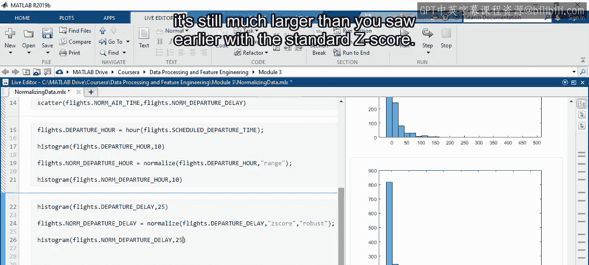

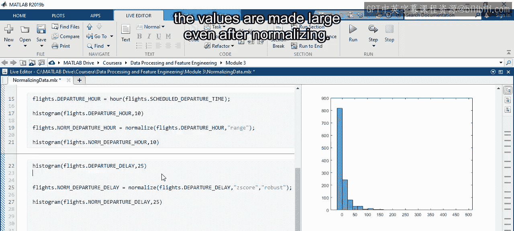

这个标志将使用**中位数绝对偏差**而不是标准差来缩放数据的范围。你可能记得，中位数绝对偏差是MATLAB中一种异常值检测方法。这是因为与标准差相比，这个统计量受异常值造成的扭曲影响较小，因此对于此类非正态分布是一个很好的选择。


以下是计算稳健Z分数的代码：
```matlab
% 使用稳健Z分数方法标准化起飞延误
depdelay_robustz = normalize(sf_to_lax_clean.DepDelay, 'zscore', 'robust', true);
```


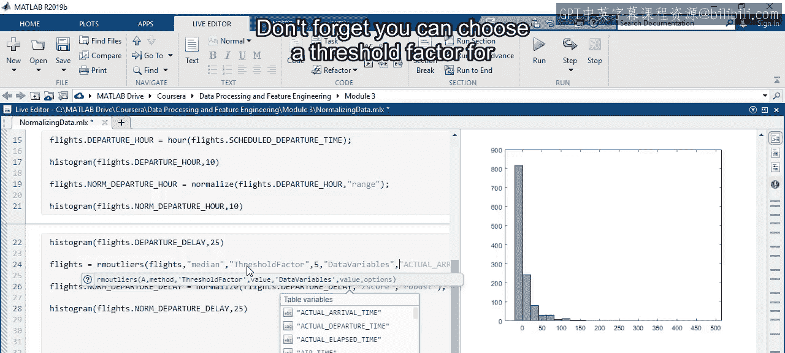

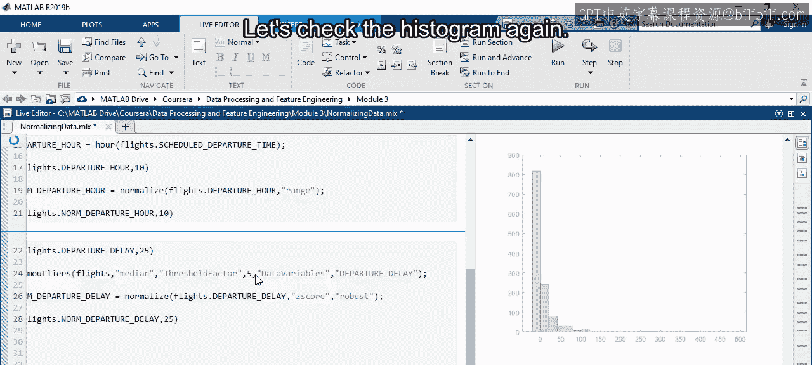

标准化后，你可能会注意到值的范围变小了，但仍然比之前使用标准Z分数时看到的范围大得多。这是因为大的正异常值对缩放的影响较小，所以即使标准化后，值仍然很大。


为了将范围减小到与之前相当的水平，你可以先移除异常值，然后再进行标准化。别忘了，你可以选择一个阈值因子来指定哪些值应被视为异常值。


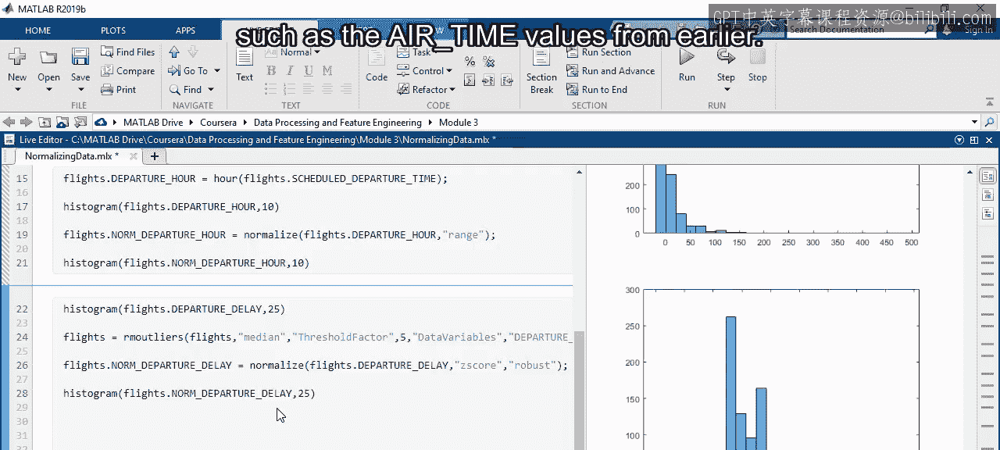

以下是先移除异常值再标准化的代码：
```matlab
% 先移除异常值，再进行标准化
sf_to_lax_nooutliers = rmoutliers(sf_to_lax, 'DataVariables', 'DepDelay', 'ThresholdFactor', 3);
depdelay_clean_normalized = normalize(sf_to_lax_nooutliers.DepDelay, 'zscore', 'robust', true);
```


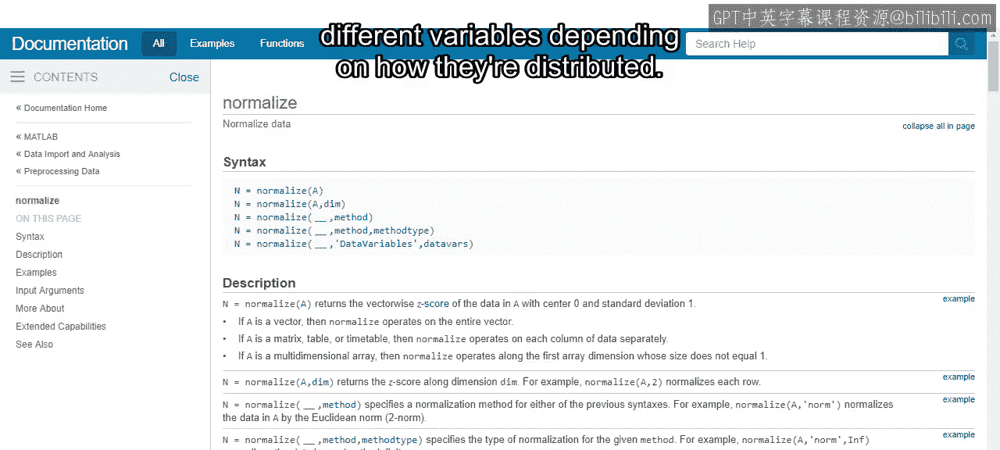

让我们再次检查直方图。现在看起来好多了，意味着标准化后的值具有合理的范围。现在，这个变量可以更容易地与其他变量进行比较，例如之前的飞行时间值。


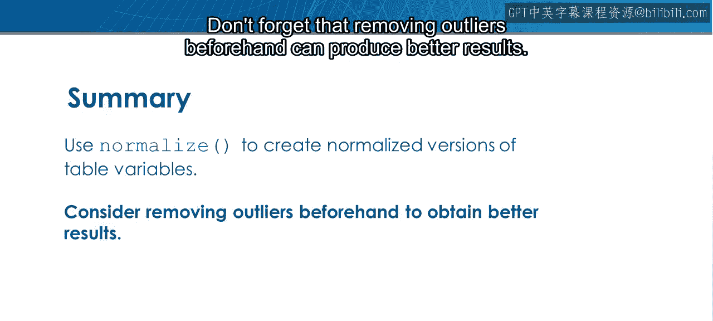

你可以查看`normalize`函数的文档页面，了解其他标准化数据的方法。根据数据分布方式的不同，你可能需要对不同的变量使用不同的方法。


本节课中我们一起学习了：
1.  使用`normalize`函数创建表格变量的标准化版本。
2.  事先移除异常值可以产生更好的结果。
3.  根据数据的分布选择适当的标准化方法，可能需要对不同的变量使用不同的方法。


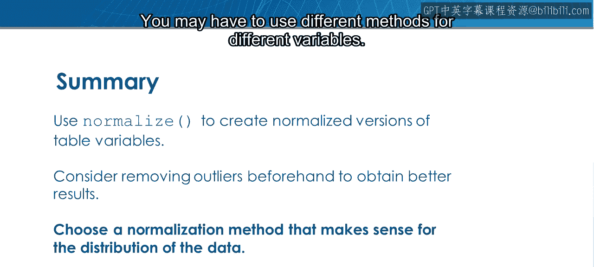


现在，轮到你尝试在一个分级问题中标准化数据了。