25：平滑数据 📊

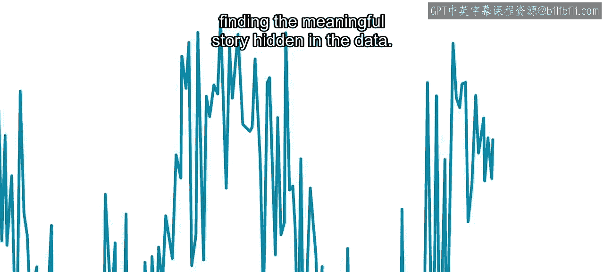

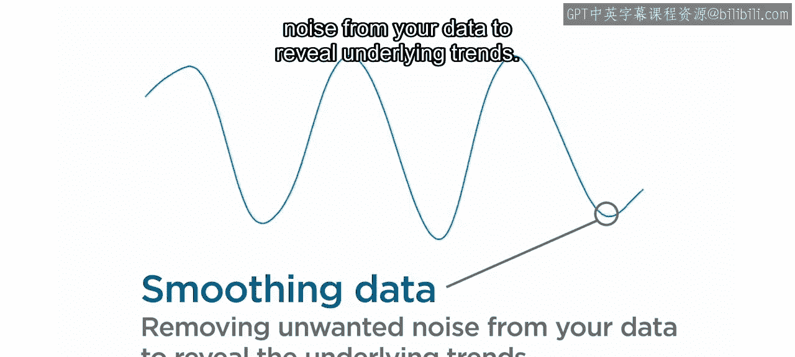

在本节课中，我们将要学习数据平滑技术。数据平滑是数据科学中一项重要的技术，它通过移除数据中不想要的波动或噪声，来揭示数据背后隐藏的趋势。

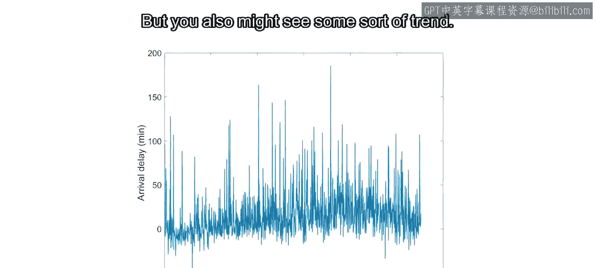

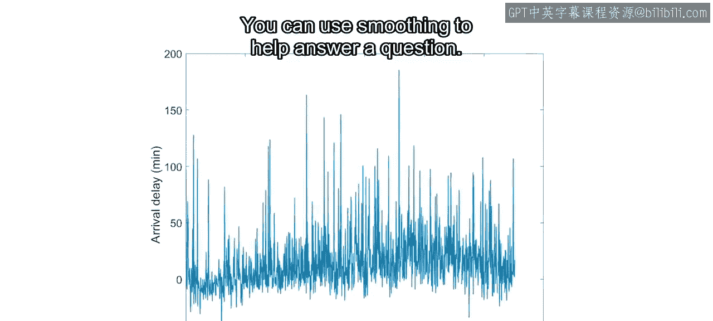

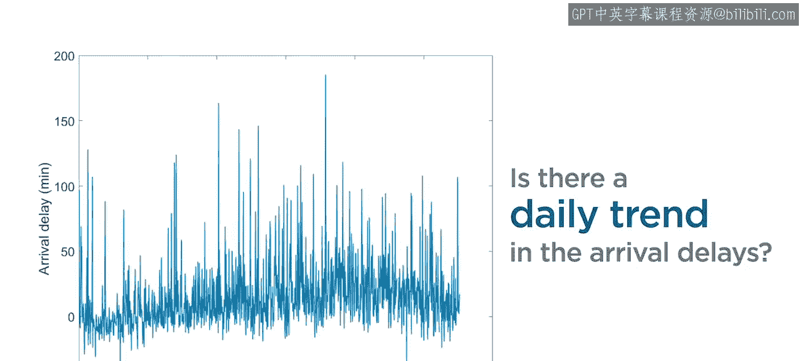

数据科学的一个重要部分是处理大量信息，并找出隐藏在数据中有意义的故事。平滑技术可以帮助你完成这项任务。

上一节我们介绍了数据平滑的基本概念，本节中我们来看看平滑技术的一些具体细节和应用。

首先，让我们介绍一些术语。平滑技术只应用于**索引数据**，也就是说，数据点具有特定顺序的数据。索引数据的一个好例子是按时间索引的信号。信号中的每个点都有一个对应的时间，这个时间定义了数据点的顺序。

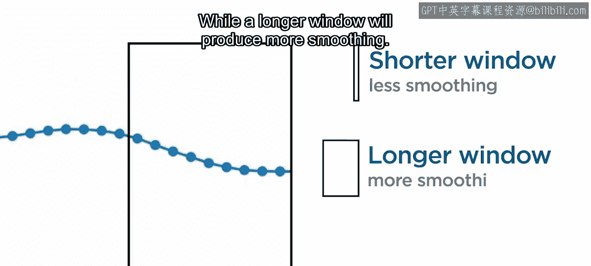

区分索引数据和非索引数据非常重要，因为平滑方法一次只处理一小块数据。这些数据块有时被称为**窗口**。窗口会沿着数据滑动，逐点进行平滑处理。在任何给定时间，只考虑窗口内的值。随着窗口向前移动，它会留下平滑后的结果。

如果数据不是索引数据，那么数据点可以是任何顺序。滑动窗口会产生完全不同的平滑结果，具体取决于数据如何被打乱。同时，请注意，**窗口的大小**控制着结果的平滑程度。较短的窗口产生的平滑效果较弱，而较长的窗口产生的平滑效果更强。

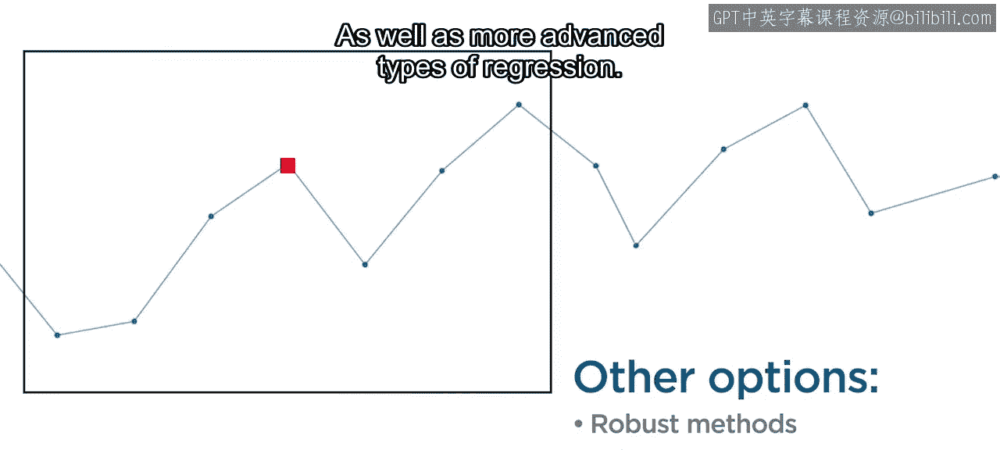

让我们放大信号的一部分，看看一些不同的平滑方法是如何工作的。考虑用红色方块标记的点以及包含其左右各三个点的窗口。

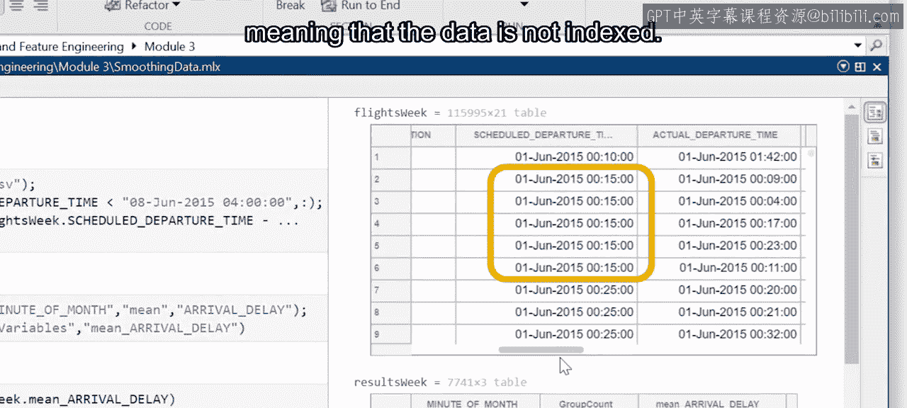

以下是几种常见的平滑方法：
*   **移动平均**：这是最常见的平滑类型。窗口内的所有值使用**均值**或**中位数**进行平均，中心点被更改为该平均值。
*   **局部回归**：这类方法为窗口内的点计算一个局部回归线。这条回归线被用来选取新的数据点。
*   **稳健方法**：其他可用的选项包括对异常值不那么敏感的稳健方法，以及更高级的回归类型。

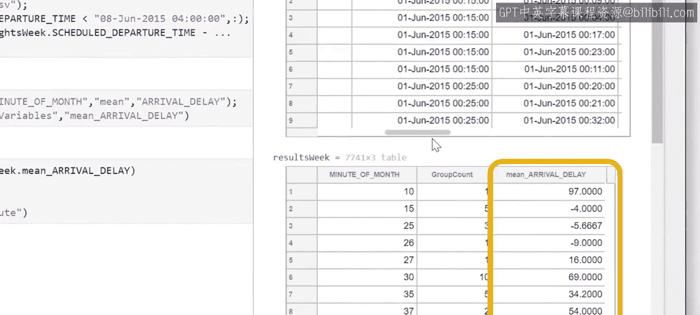

回到航班数据，我们处理的是一个包含索引数据的平均到达延误表。具体来说，延误值是按“月份分钟数”列索引的。原始的航班表不适合进行平滑，因为可能有多个航班在同一时间起飞。这些记录在表中的顺序可以是任意的，这意味着数据不是索引数据。这就是为什么需要计算每分钟的平均到达延误。

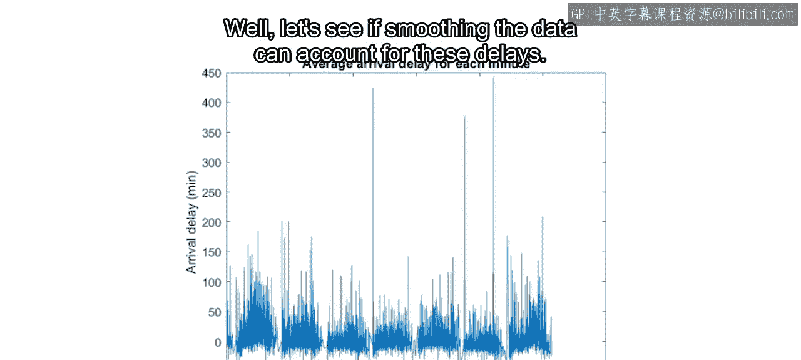

考虑这里显示的仅第一周的MeA到达延误数据。你或许能看到七组数据，分别对应每一天。你可能也能看到一个每日趋势，但信号极其嘈杂。这种噪声包括潜在的异常值，平均延误超过400分钟。你可以花时间事先移除这些异常值，但让我们看看平滑数据是否能处理这些延误。

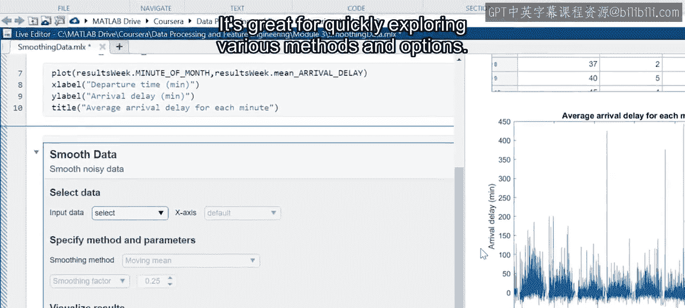

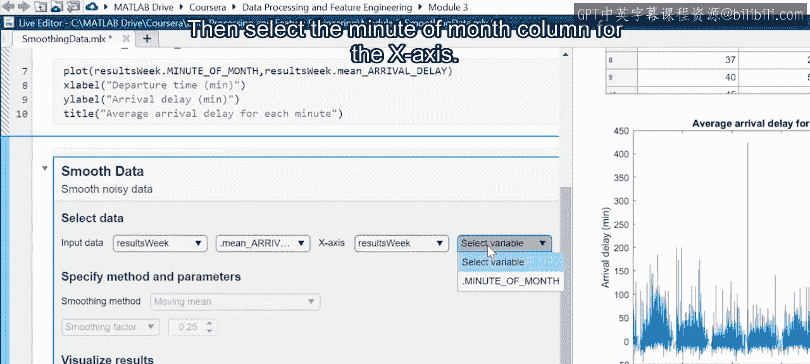

为了探索各种平滑方法和选项，可以使用“平滑数据”实时编辑器任务。这个任务与你之前看到的处理缺失数据的任务类似。它非常适合快速探索各种方法和选项。

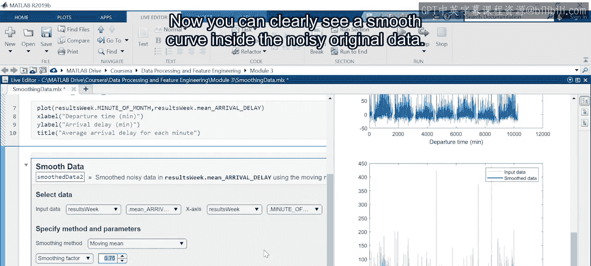

以下是使用实时编辑器任务进行平滑的步骤：
1.  从表格中选择“Me到达延误”列作为输入数据。
2.  然后选择“月份分钟数”列作为X轴。

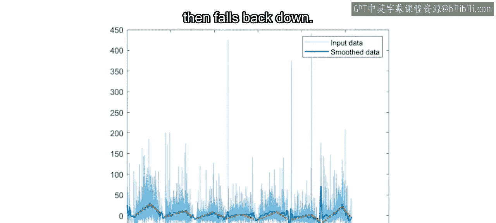

实时编辑器任务将显示原始数据和平滑数据的可视化图。看起来默认选项的平滑效果不够，所以你可以尝试延长窗口。你可以通过增加平滑因子来实现。这个因子是一个介于0和1之间的数字，用于控制移动窗口的大小。接近1的值使用较长的窗口，而接近0的值使用较短的窗口。将此值更改为0.75。现在，你可以在嘈杂的原始数据中清晰地看到一条平滑曲线。

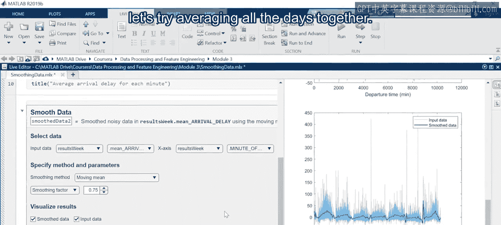

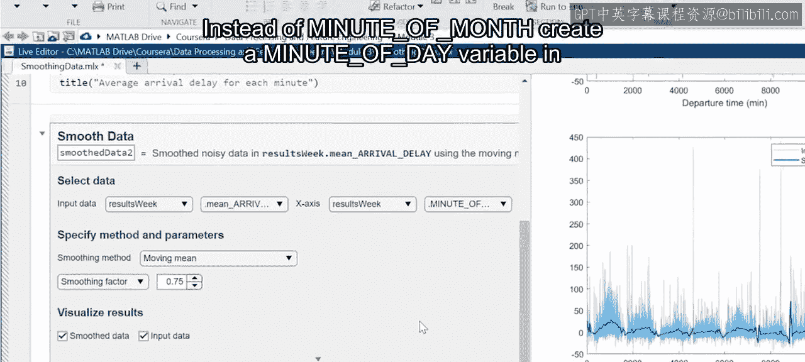

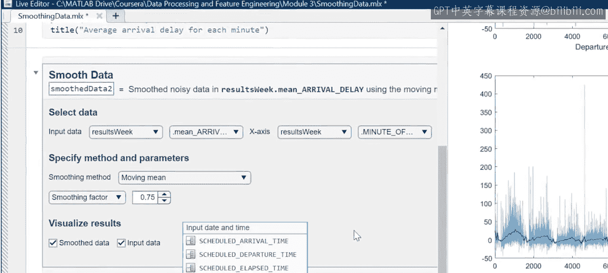

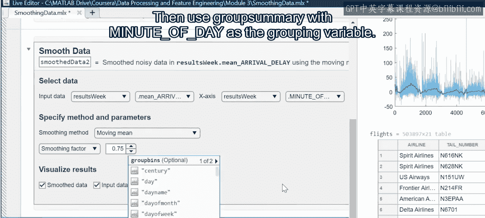

这也使得每日趋势更加明显。看起来平均到达延误在一天中逐渐增加，然后回落，尽管这种趋势在某些日子里比其他日子更显著。

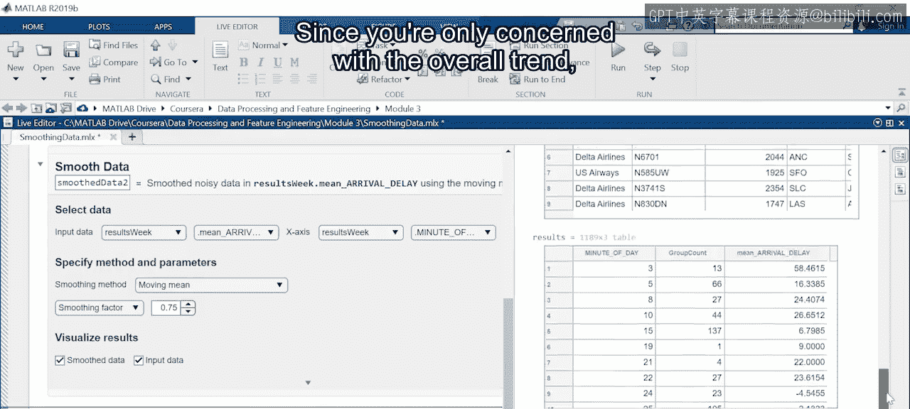

为了明确回答到达延误是否存在每日趋势的问题，让我们尝试将所有天的数据平均起来。

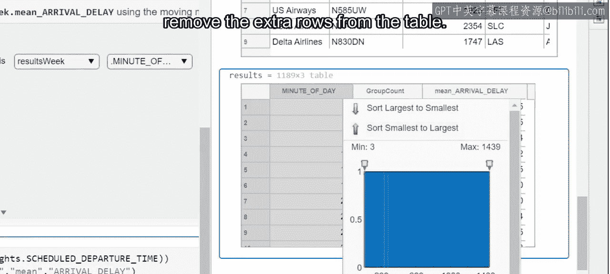

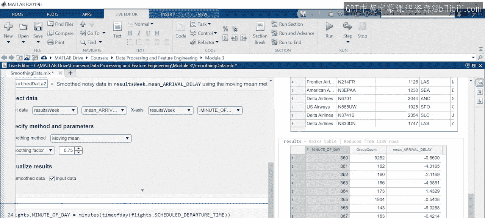

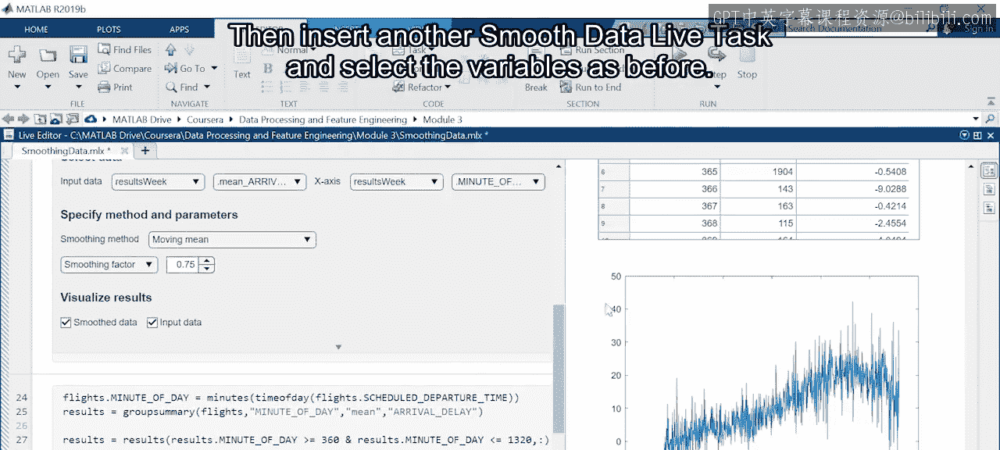

具体操作如下：
1.  在Fs表中，不再使用“月份分钟数”，而是创建一个“一天中的分钟数”变量，该变量记录自午夜以来经过的分钟数。
2.  然后使用`groupsummary`函数，以“一天中的分钟数”作为分组变量。
3.  当你绘制结果时，可以看到这个信号在清晨时分特别嘈杂，因为这段时间只有少数航班。大多数航班安排在早上6点之后。
4.  由于你只关心整体趋势，可以从表中移除额外的行，只考虑一天中的主要部分。
5.  然后，插入另一个“平滑数据”实时任务，并像之前一样选择变量。
6.  同样，默认选项似乎平滑效果不足。尝试再次增加平滑因子，或者从下拉菜单中选择不同的方法，例如**局部线性回归**。尝试不同的方法以找到最适合你数据的方法是很有帮助的。

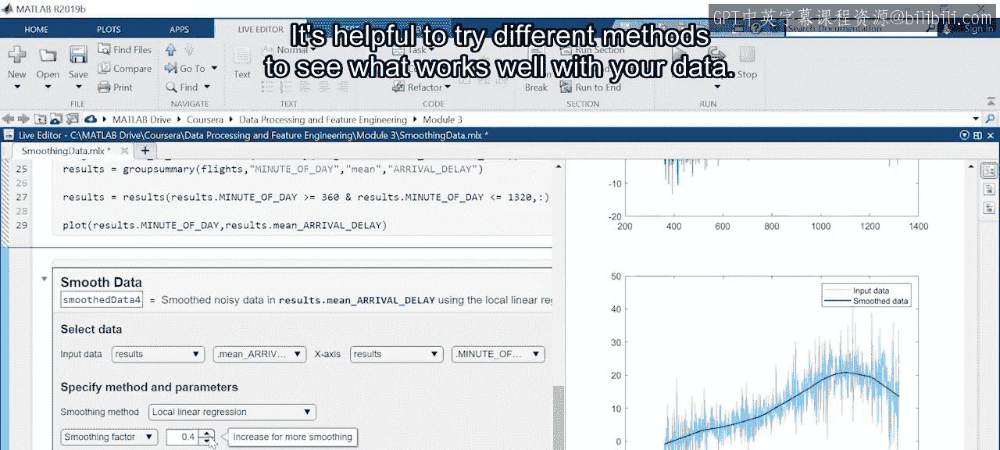

通过这些选项，潜在的趋势变得清晰。平均延误在一天中持续增加，直到大约1100分钟（接近下午6点）达到峰值。之后，平均延误开始下降。

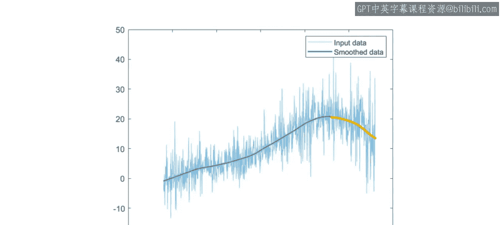

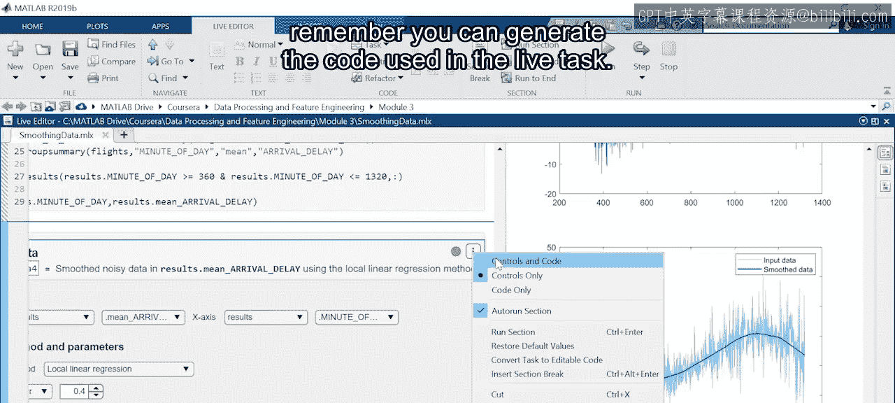

就是这样。你现在已经证明了存在一个明显的每日趋势。换句话说，你知道一天中的时间可以在某种程度上预测到达延误的程度。为了重现你的分析，请记住你可以生成实时任务中使用的代码。在这种情况下，实际的平滑操作是由`smoothdata`函数执行的。

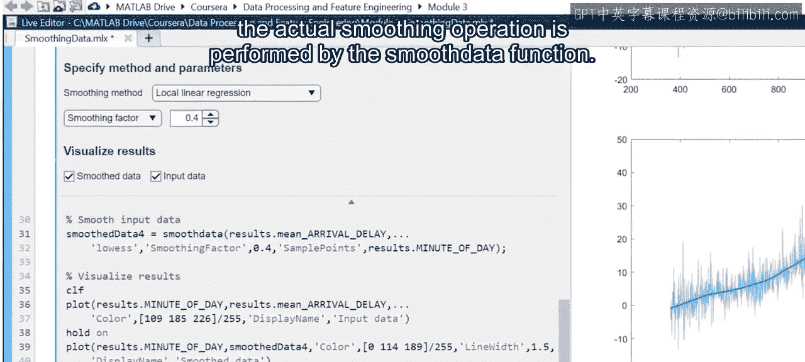

本节课中我们一起学习了数据平滑。总结一下，平滑数据是移除数据中不想要的噪声的过程。它可以帮助你找到被噪声掩盖的隐藏趋势。它要求数据以某种方式被索引或排序，因为平滑方法是逐块处理数据的。请记住，有多种方法可供选择，尝试不同的方法并选择最适合你数据的一种。最后，“平滑数据”实时编辑器任务使你能够快速探索各种方法和设置，并生成可用于重现步骤的代码。

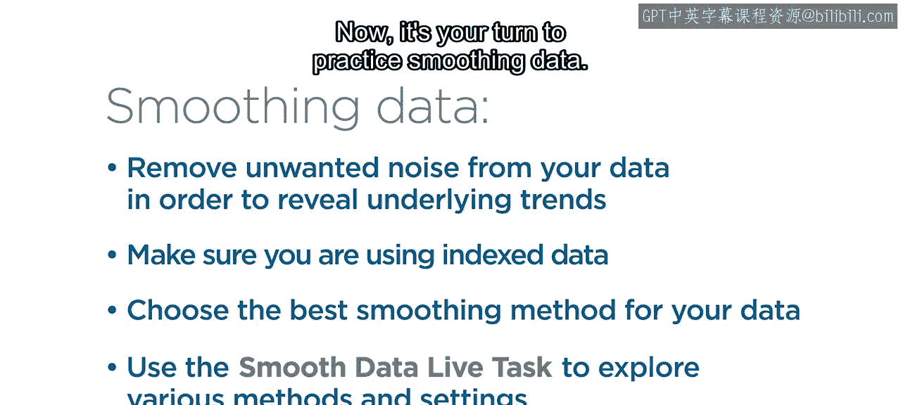

现在轮到你练习平滑数据了。