模块3：数据清理总结 🧹

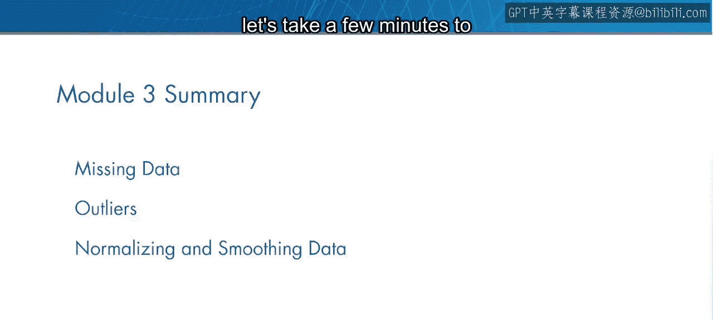

在本节课中，我们将回顾模块3“数据清理”的核心内容，总结处理原始数据中常见问题的方法与思路。

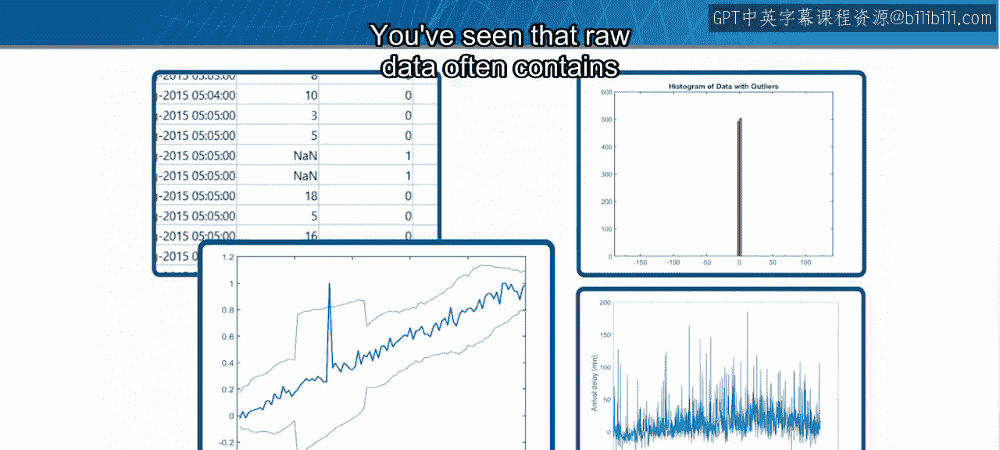

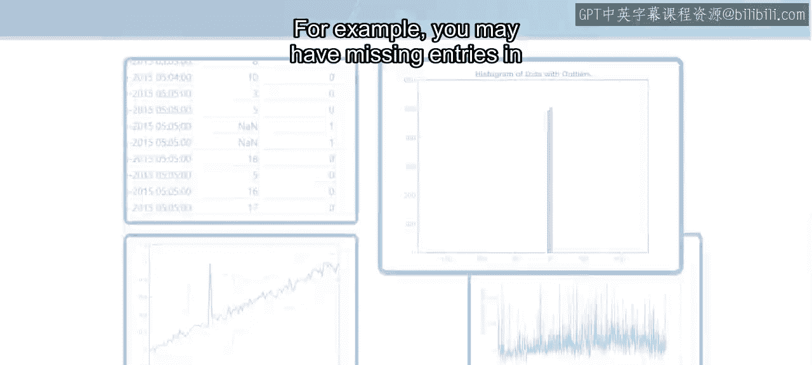

你已经完成了模块3的学习。在继续测验之前，让我们花几分钟时间回顾一下到目前为止学到的知识。

原始数据通常包含不规则之处，需要进行清理，以便为深入分析做好准备。

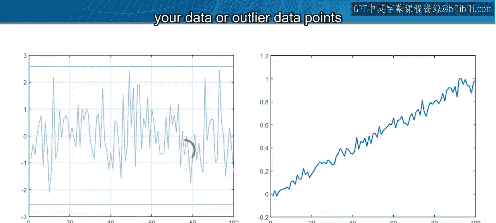

例如，你的数据中可能存在缺失条目，或者存在一些与整体趋势不符的异常数据点。

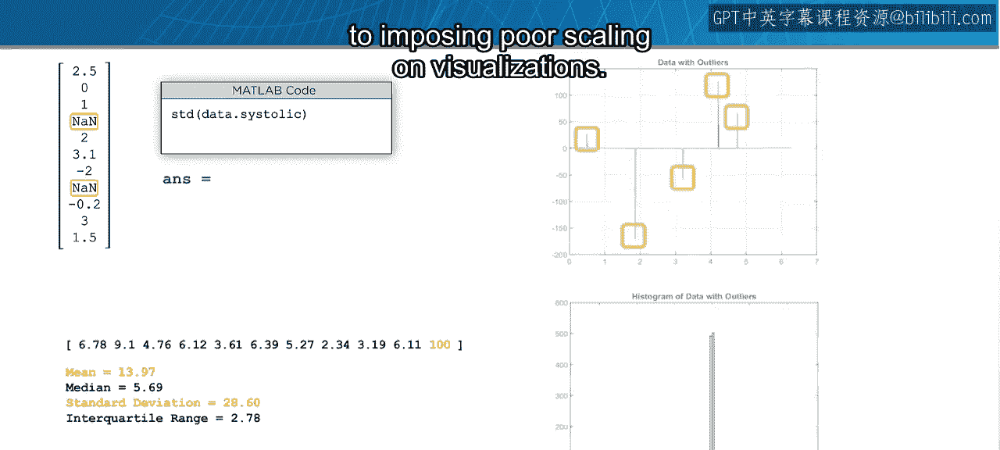

你看到了缺失条目和异常值可能影响分析的几种方式，从导致统计计算偏差到使可视化效果不佳。

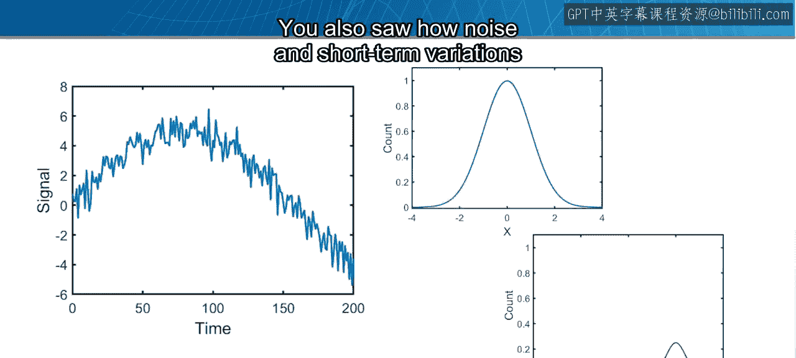

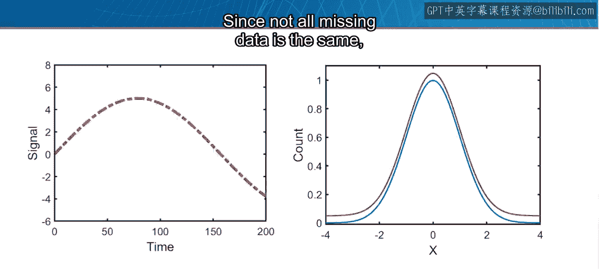

你也看到了噪声、短期波动或不当的数据缩放如何掩盖数据中更大的趋势。

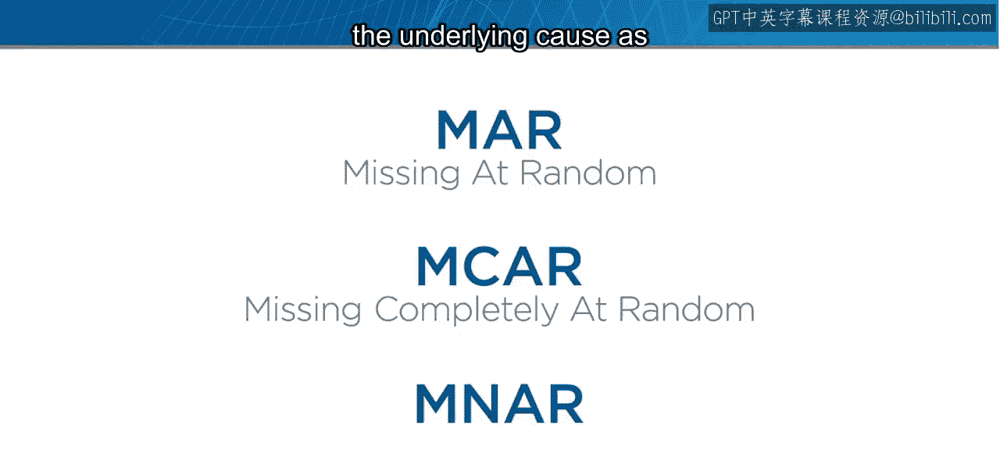

由于并非所有缺失数据都相同，处理它的最佳方法取决于其根本原因以及你试图回答的问题。

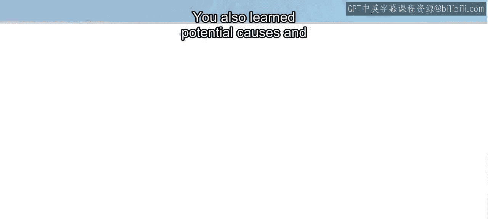

你练习了识别缺失数据，以及根据需要保留、删除或填充缺失数据的技术。

你也学习了识别异常值的潜在原因和方法。由于没有关于什么构成异常值的统一定义，你学会了使用可视化来辅助分析，并确定识别它们的最佳方法。

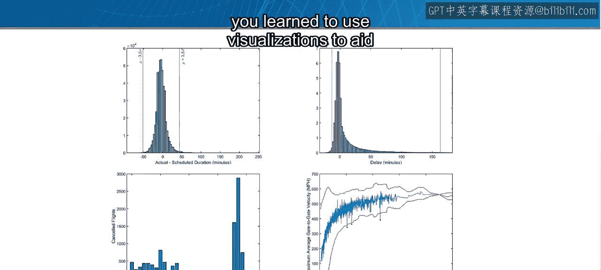

你了解到，有时需要移除异常值，而有时则需要将它们提取出来作为关注点。

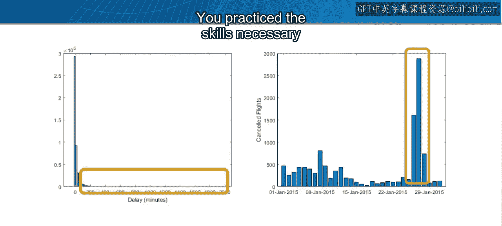

你练习了处理这两种情况所需的技能。

你还学习了如何平滑和归一化数据，这使你能够发现之前被隐藏的趋势和相似性。

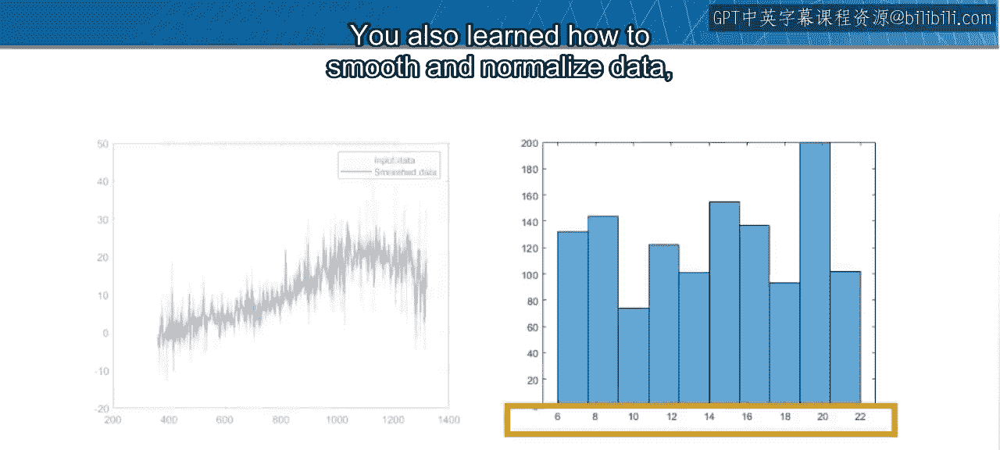

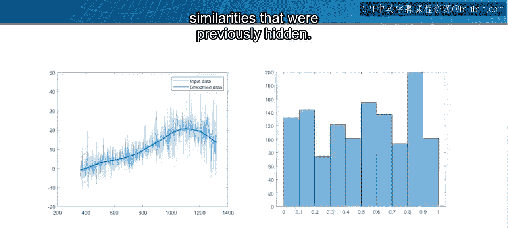

在本模块的最后，你通过一个示例综合运用了所学概念，以确定航班量与星期几之间是否存在关系。

请记住，你采取的数据清理方法取决于数据类型、具体情况和分析目标。

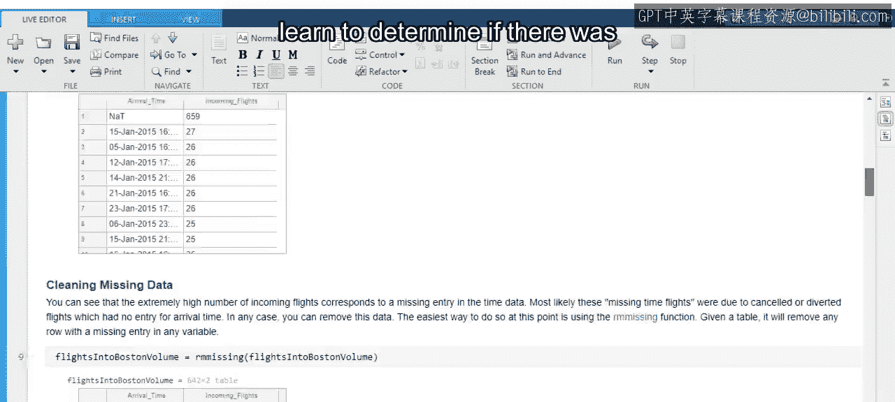

现在，是时候通过完成模块3的测验来检验你的知识了。

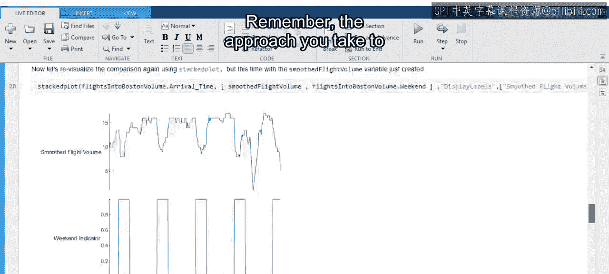

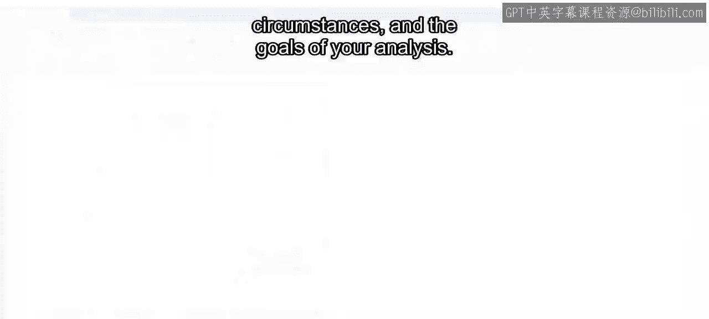

如果你遇到困难，可以回顾课程内容或在论坛中提问。祝你好运。

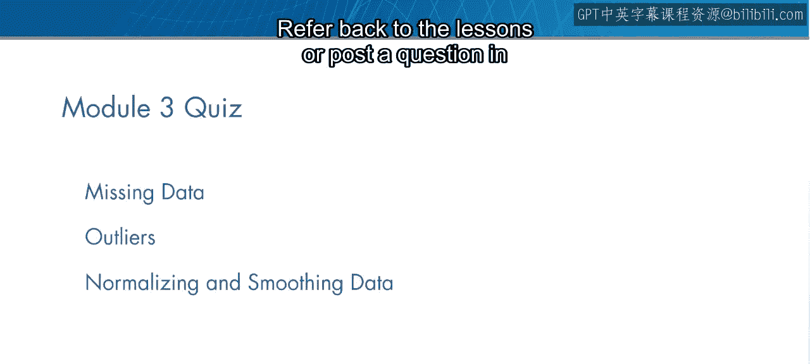

在本节课中，我们一起回顾了数据清理的核心概念，包括处理缺失值、识别与处理异常值、以及通过平滑与归一化揭示数据趋势。掌握这些技能是进行有效数据分析的重要基础。