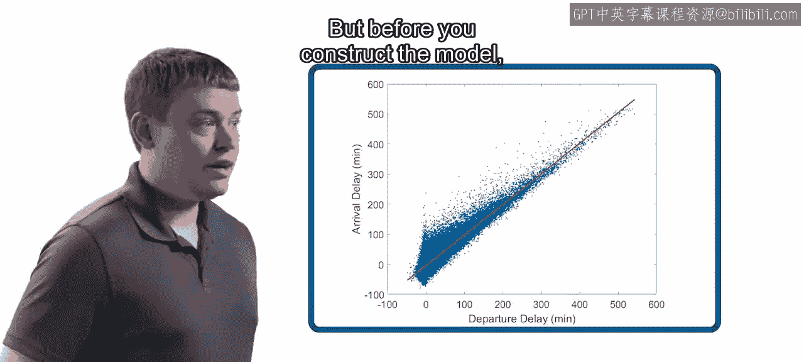
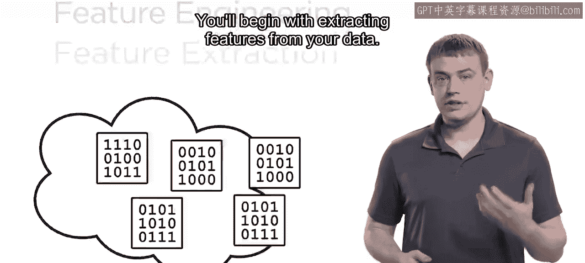
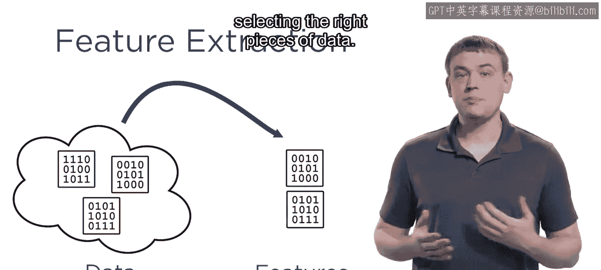
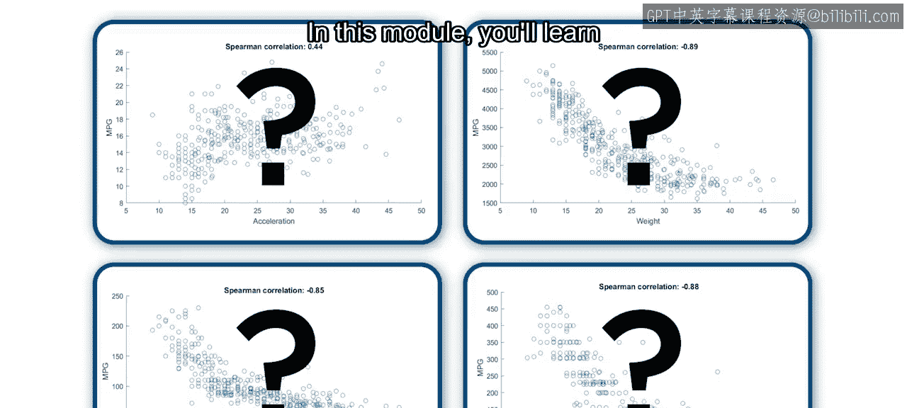
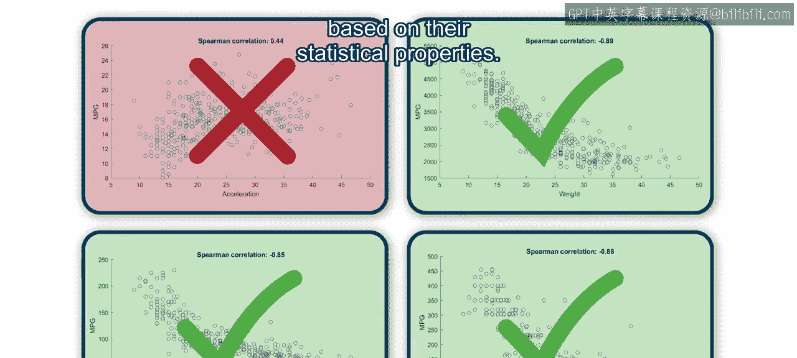
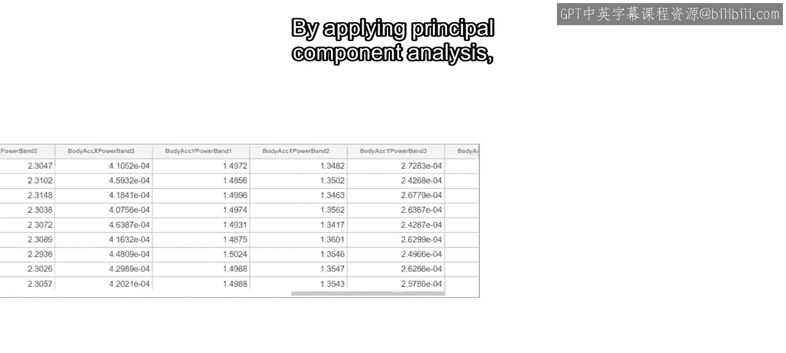
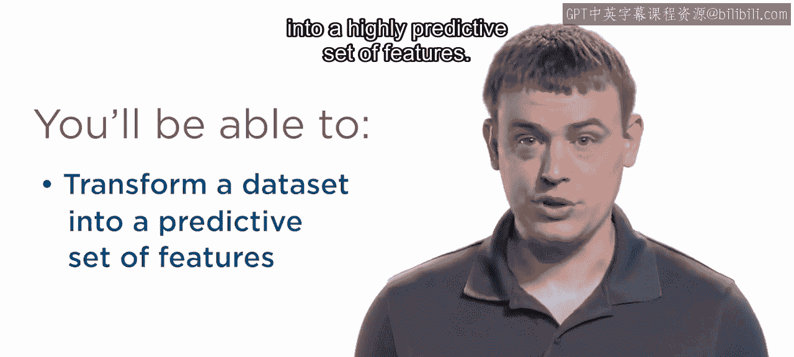

模块4：寻找重要特征介绍 🎯

在本节课中，我们将要学习数据科学流程中的关键一步：特征工程。我们将了解什么是特征，如何从数据中提取和构建特征，以及如何评估和选择对模型预测最有价值的特征。

上一节我们介绍了数据清洗与整理，本节中我们来看看如何为构建预测模型准备数据。

例如，你可能希望使用航班数据来创建一个预测到达延误的模型。

但在构建模型之前，你需要决定模型将使用哪些特征。

**特征** 是指数据中对你要解决的问题有意义的一条信息。你将使用特征来教导或训练你的模型进行预测。将数据转化为特征的过程称为 **特征工程**。这是一个高度迭代的过程，也是本模块的重点。

你将从数据中提取特征开始。

这个过程可能简单到只是选择正确的数据片段。

例如，航班的起飞时间可能是预测到达延误的一个好特征。在其他情况下，提取特征可能需要更复杂的计算和数据转换。

以下是另一种生成特征的常见方法：通过无监督学习。你将学习如何使用聚类等无监督学习算法，通过发现数据中隐藏的关系和模式来揭示新的特征。

一旦你识别、构建或提取了一组特征，你需要确定哪些特征将帮助你的模型做出准确预测，哪些不会。在本模块中，你将学习几种基于统计特性来评估特征间关系的技术。

但是，随着可用数据量的不断增长，潜在特征的数量也在同步增加。通过应用 **主成分分析（PCA）**，你将能够从最少数量的特征中提取最具预测性的价值，从而帮助你处理即使是最大的数据集。

在本模块结束时，你将能够将一个数据集转化为一组具有高度预测性的特征。

所以，让我们开始学习特征工程。

本节课中我们一起学习了特征工程的基本概念及其重要性。我们了解到，特征是从原始数据中提取的、对解决特定问题有意义的信息，而特征工程就是创造和选择这些特征的过程。接下来，我们将深入探讨具体的特征提取、构建和选择技术。