28：特征工程介绍 🎼

在本节课中，我们将要学习特征工程。特征工程是为预测模型准备数据的重要步骤。

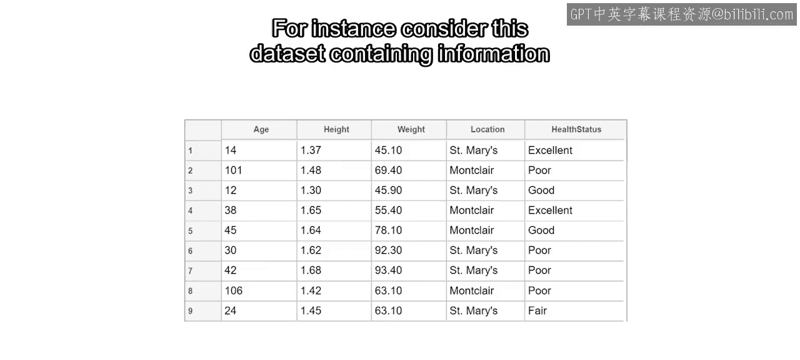

一个特征是你试图描述对象的属性。多个独立特征的集合构成一个观测样本，而多个观测样本的集合则构成一个数据集。数据科学家的任务就是将这些特征作为预测变量用于模型中。模型的优劣完全取决于你输入的数据质量。因此，通常需要通过特征工程来揭示数据中隐藏的趋势，以供模型识别。

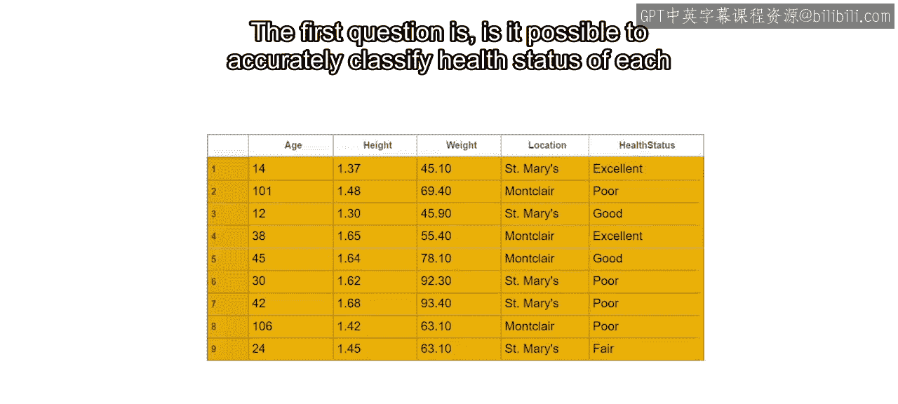

例如，考虑这个包含医院患者信息的数据集，其中每一行代表一个人。

首要问题是，能否仅凭年龄、身高、体重和位置这些原始变量，准确地对每个人的健康状况进行分类？

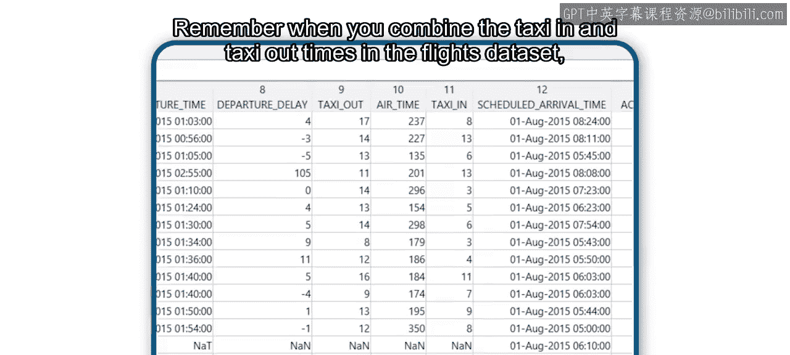

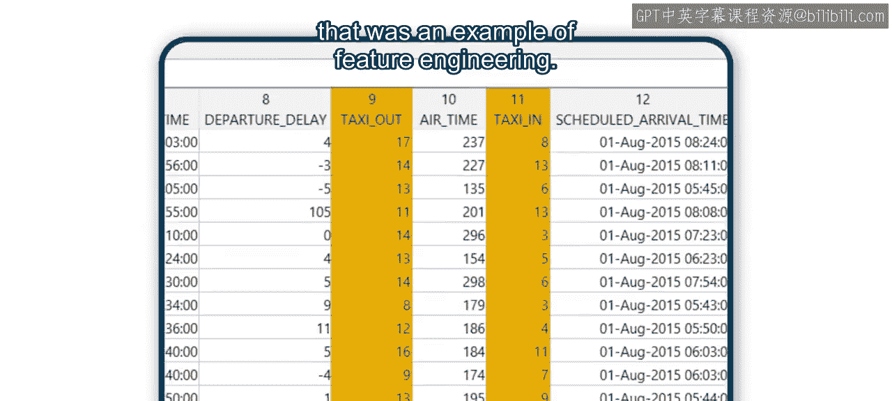

起初，你可以直接将原始变量输入模型并尝试比较，例如健康状况与体重或身高的关系。然而，简单的可视化显示，这些变量本身并不擅长预测健康状况，因为它们之间没有明显的相关性。

那么，你能做什么呢？你可以开始特征工程的过程。你会发现，通过应用领域知识来生成有用的特征，可以提高模型的预测能力。实际上，你可能已经这样做过。还记得在航班数据集中合并滑入和滑出时间吗？那就是特征工程的一个例子。

在本视频中，你将使用患者数据集来探索如何利用领域知识进行特征工程。😊 你会发现，有许多特征比单独的原始变量能更好地预测健康状况。

在这个过程中，你将应用三种通用的特征生成方法。

以下是三种主要的特征生成方法：

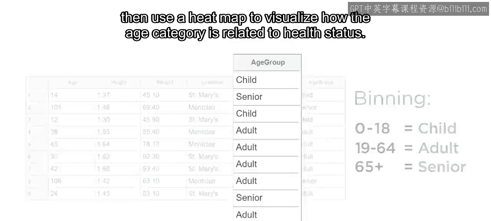

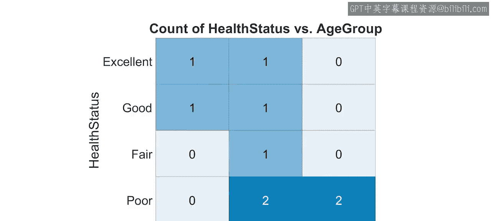

1.  **变量转换**：对现有变量应用公式以创建新特征。例如，一个人的身体质量指数（BMI）是其体重除以身高的平方。你可以将这个新特征作为变量添加到表中。可视化BMI显示，它确实比单独的体重或身高与患者健康状况的相关性更好。
    *   **公式**：`BMI = weight / height^2`

2.  **离散化**：使用数值变量将数据分组。这很有帮助，因为有时变量的重要方面不是其精确值，而是其所在的范围。例如，年龄变量自然适合将患者分为三类：儿童、成人和老年人。然后，你可以将这个分类变量作为新特征添加到表中，并使用热图来可视化年龄类别与健康状况的关系。
    
    

3.  **分组汇总**：总结数据中的组别信息。例如，患者的体重与其同龄组的其他人相比如何？为了找出答案，计算每个类别的平均体重，然后将这个结果作为新变量连接到你的表中。接着，你可以计算每个个体与平均体重的差值。

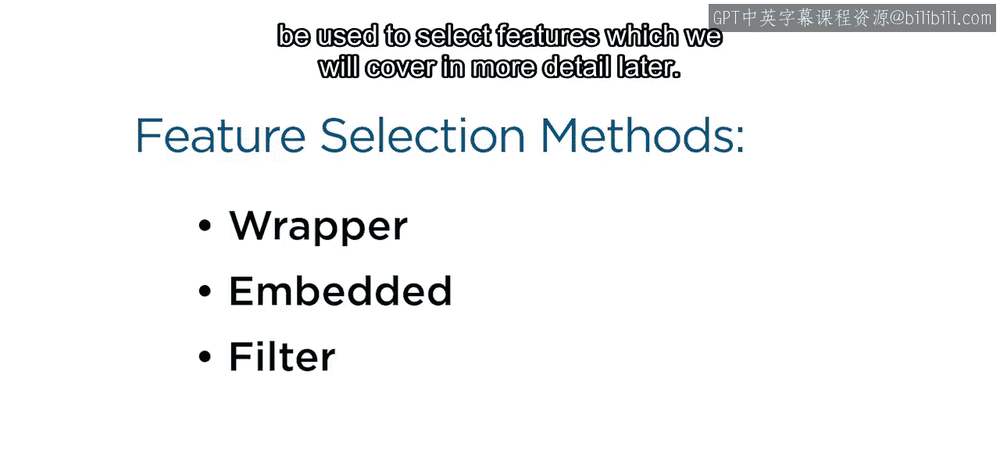

这些方法中的每一种都可以应用于任何数据集，但具体的实现依赖于你对数据本身的知识。理论上，你可以生成无限多的新特征，但只有有限的几个真正有用。

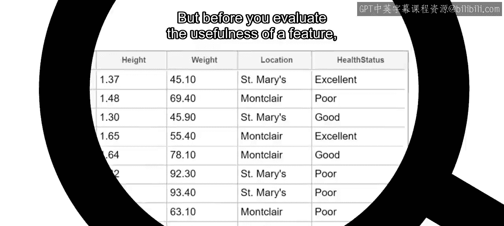

那么，如何知道一个特征是否值得保留呢？有一些定量的方法可以用来选择特征，这些内容将在后面详细介绍。

但在评估一个特征的有用性之前，请考虑你已经掌握的关于数据及其代表意义的知识。

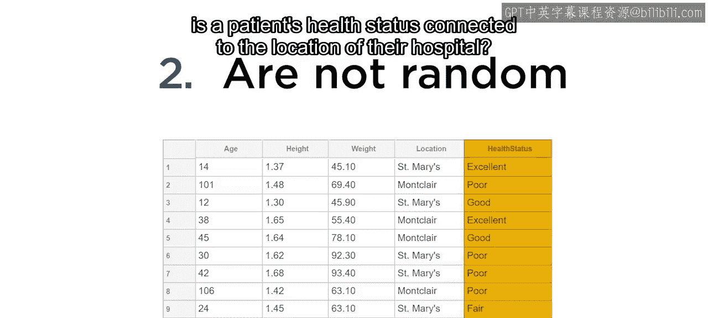

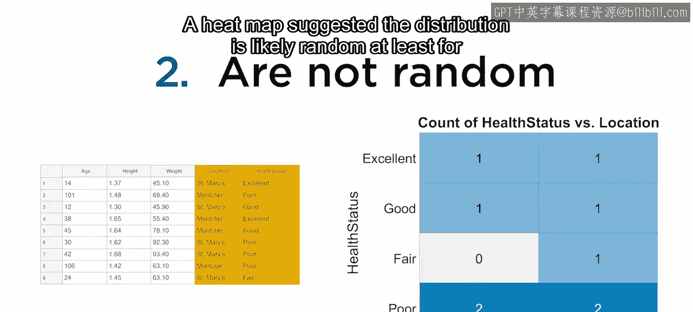

以下是一些定性测试，有助于判断一个变量是否可以被视为有用的特征：

*   **具有变异性**：如果一个变量在整个数据中是恒定的，那么它就没有预测能力。例如，如果有一个关于患者家乡州的列，而所有患者都恰好来自佛罗里达州，那么这个变量就不是一个有用的特征。
*   **非随机性**：与你的响应变量相比，有用的特征不应表现出随机行为。例如，患者的健康状况是否与其医院的位置有关？热图表明，至少对于这个小样本量，分布很可能是随机的。
    
    
    因此，位置变量不应作为特征包含在你的模型中。
*   **包含独特信息**：如果你通过将体重从公斤转换为磅来创建一个新变量，那么它就是冗余的，并且不会为你的模型增加任何新信息。
*   **基于直觉或领域知识**：最有用的特征通常源于你的直觉或领域知识。例如，之前你计算了BMI以更好地预测健康状况。然而，你也可以发明任何其他类型的指数，例如将患者的体重除以年龄的平方，或者涉及所有三个数值变量的更复杂公式。但是，这样的指数究竟代表什么呢？这就是你的领域知识无价的地方，它帮助你设计出有意义的特征。

最后，请记住，预测模型的好坏完全取决于你输入的特征。

因此，从原始数据中设计有用的特征是有益的；然而，这个过程可能更像一门艺术而非纯粹的科学，所以在实验过程中要做好大量试错的准备。
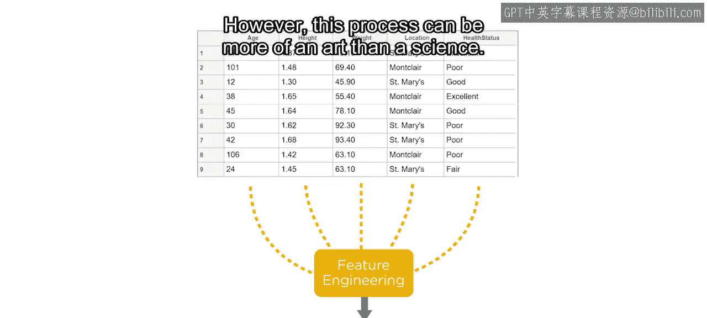

本节课中，我们一起学习了特征工程的基本概念、三种核心方法（变量转换、离散化、分组汇总）以及如何定性评估特征的有用性。特征工程是提升模型性能的关键步骤，它依赖于对数据的深入理解和创造性思考。