# 29：无监督学习介绍 🧠

在本节课中，我们将要学习机器学习的一个重要分支——无监督学习。我们将了解它与监督学习的区别，并探索如何利用无监督学习技术从数据中发现隐藏的模式和分组，从而创建新的特征。

## 概述

在创建特征时，数据科学家通常从寻找数据中的关系开始。这些关系使他们能够根据一个变量的值来预测另一个变量的值。

有些关系很容易被发现。例如，你在这个散点图中注意到了什么关系？

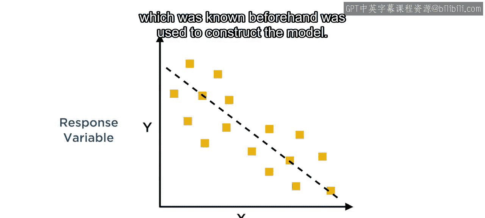

图中存在一个清晰的线性趋势，你可以用它来根据给定的 `x` 值估算未来的 `y` 值。在此，`x` 被称为**预测变量**，而 `y` 是**响应变量**。在这个例子中，我们使用了事先已知的输出数据来构建模型。

## 监督学习

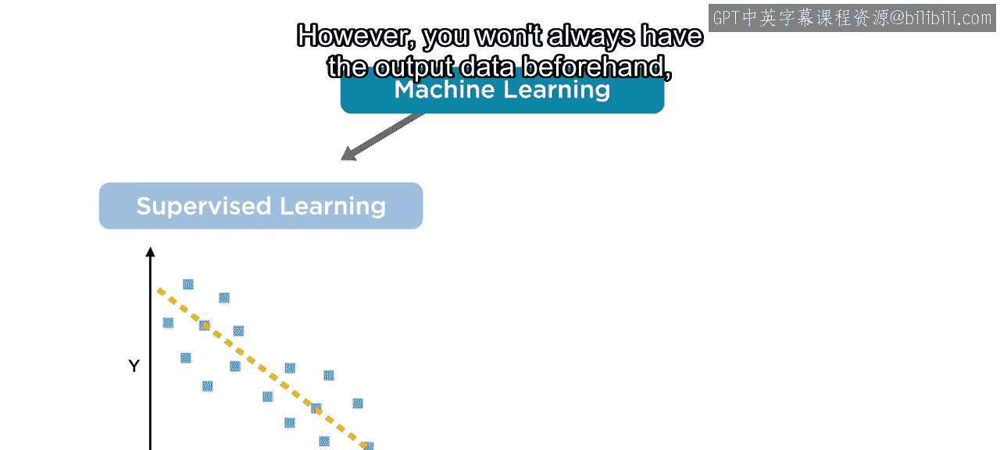

上一节我们看到了一个基于已知输出关系构建模型的例子。这种技术被用于机器学习的一个分支，称为**监督学习**。换句话说，一个已知的关系被用来监督或指导创建一个模型，该模型可以根据输入数据预测未来的响应。

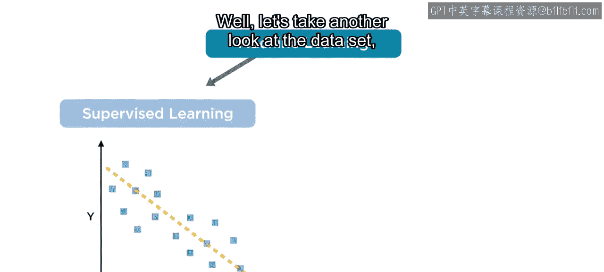

然而，你并非总是能事先获得输出数据。这是否意味着你就无法使用机器学习了呢？

## 发现数据中的其他关系

让我们再仔细看看这个数据集。

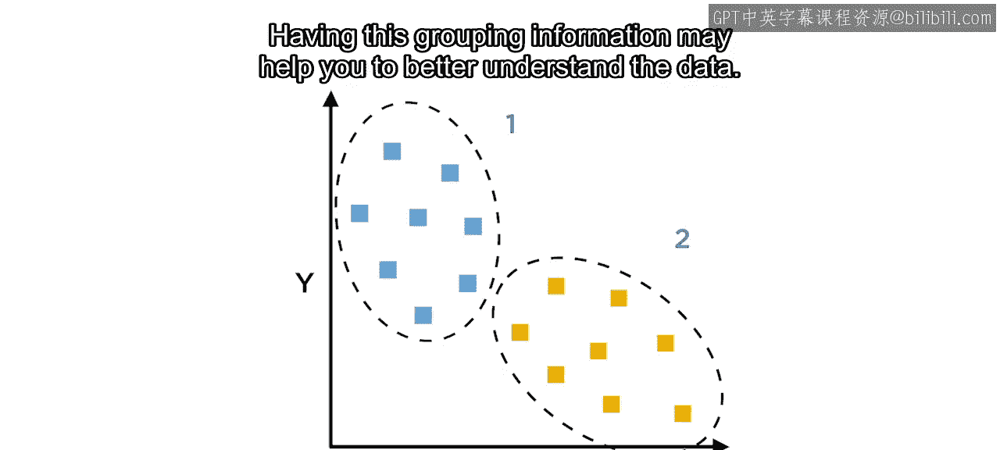

你还能在数据中看到其他关系吗？请记住，关系并不仅限于趋势。关系也可以是表现为模式或分组的相似性。

看起来这些观测点可以被分成两个**簇**。可能存在某种独特的特性或属性导致了这些群组的形成。掌握这种分组信息可能有助于你更好地理解数据。

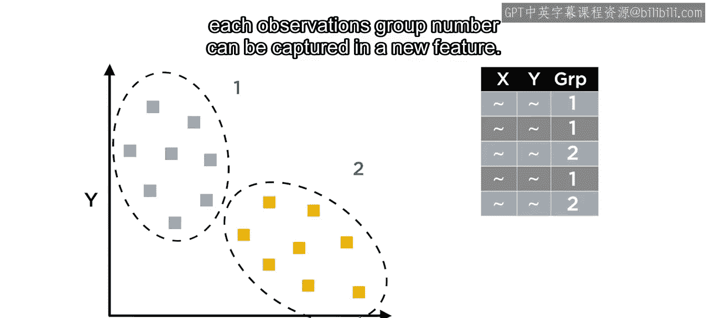

由于这些信息在原始数据集中并不存在，因此每个观测点的组别编号可以被捕获为一个**新特征**。

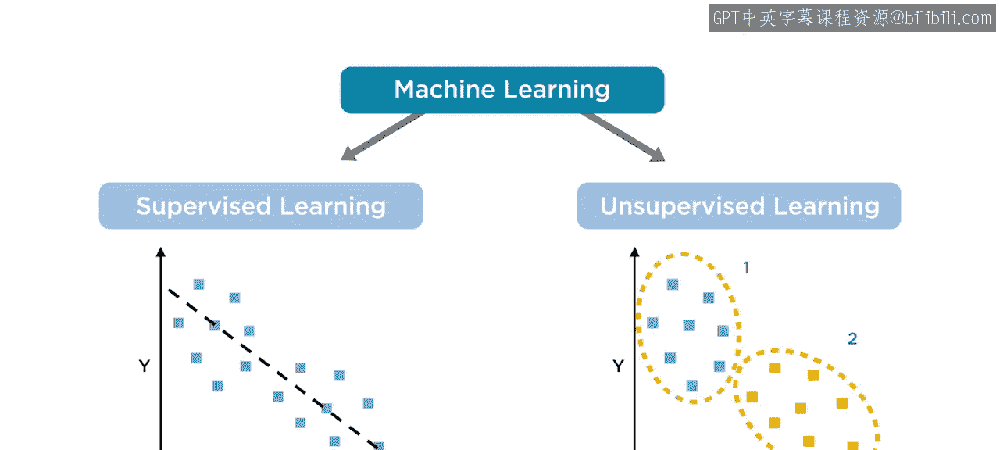

## 无监督学习

用于识别数据中模式或分组的技术，被用于机器学习的第二个分支，即**无监督学习**。

在无监督学习中，没有响应变量来对比结果。相反，输入变量之间的关系被用来定义数据的结构。

当你不确定数据可能包含什么信息时，这种技术在探索数据时非常有用。

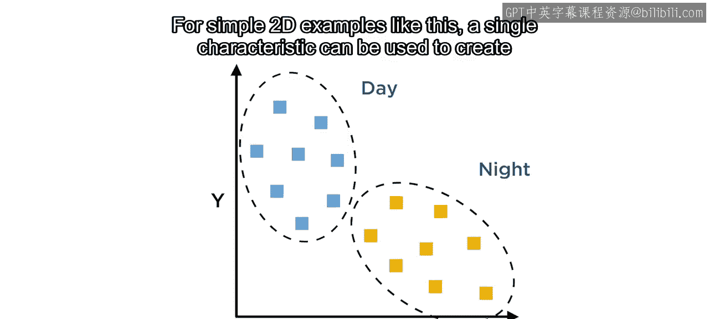

## 理解分组结果的挑战

无监督学习的一个挑战在于理解分组的含义。

当簇的数量较少或数据集规模较小时，你或许可以利用领域知识来识别这些分组的特征是什么。

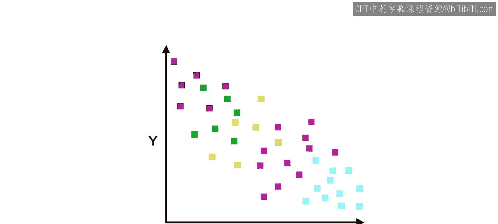

以下是几个例子：
*   如果图中包含的是汽车性能数据，这些簇可能由燃料类型（如汽油、柴油）导致。
*   如果数据来自太阳能电池阵列的输出，则可能是白天和黑夜的区别。

对于像这样的简单二维示例，可以用一个单一特征来创建分组。

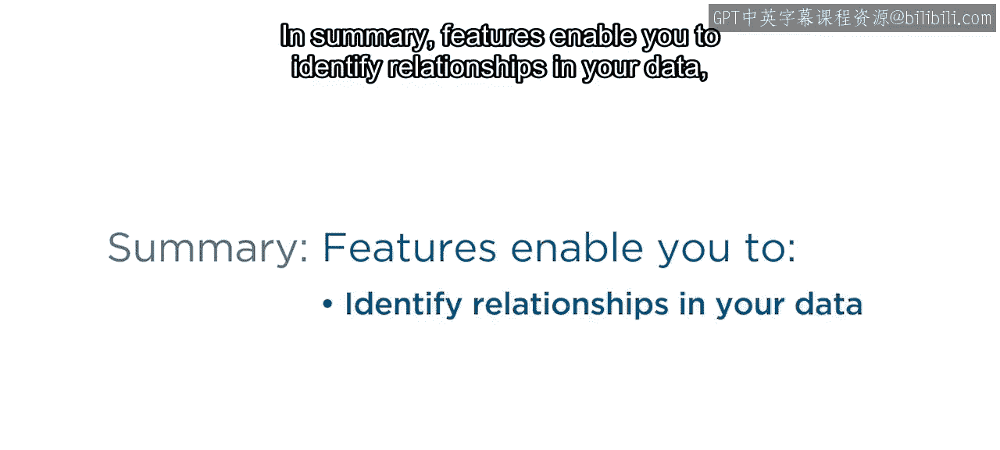

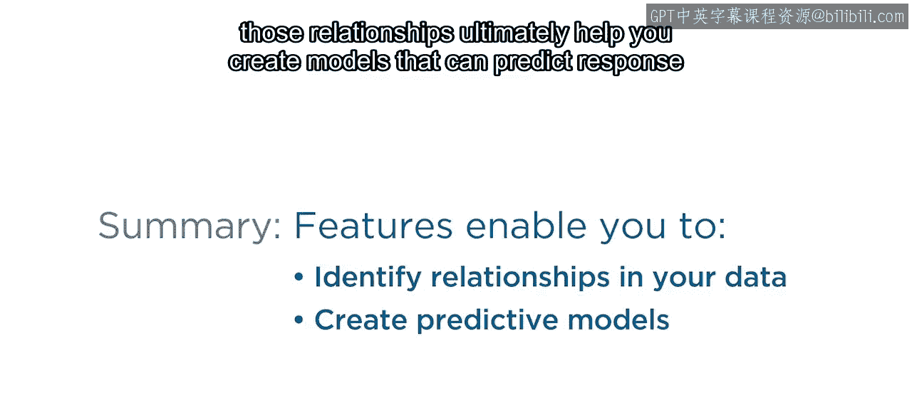

然而，通常数据科学家处理的是大型的多维数据集。无监督学习仍然可以识别数据中的群组，但这些共同特征往往是复杂的模式，可能没有明确的现实世界解释。你将在后续课程中学习评估和选择哪些特征应包含在模型中的技术。

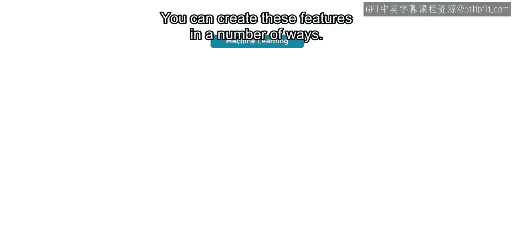

## 总结

本节课中我们一起学习了特征如何帮助你识别数据中的关系，这些关系最终帮助你创建能够基于输入值预测响应值的模型。

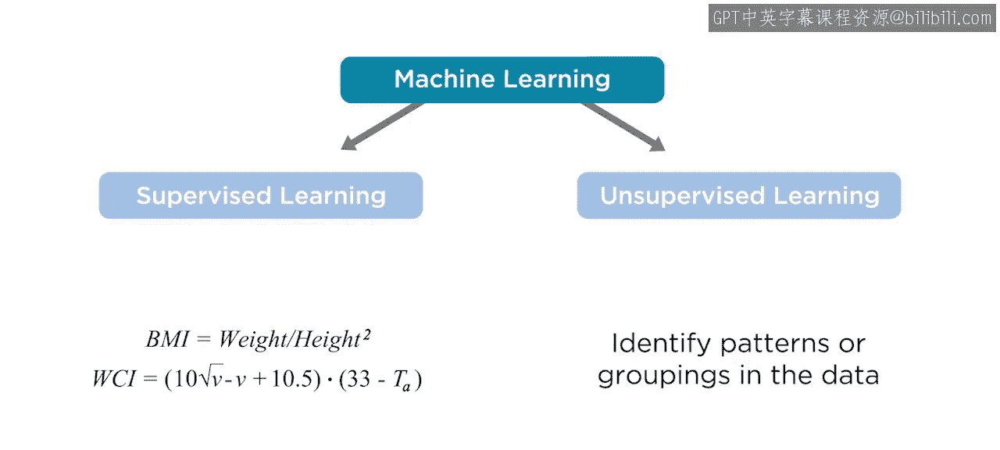

你可以通过多种方式创建这些特征：
*   你可以运用领域知识来组合和转换现有变量，正如之前所学。
*   你也可以使用无监督学习来识别数据中你可能不知道其存在的模式和分组。

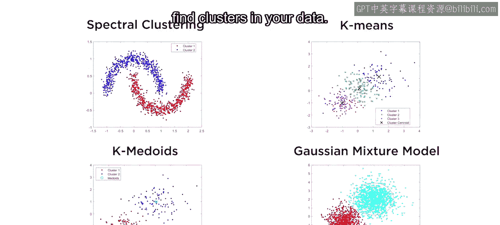

接下来，你将学习一些可用于在数据中寻找簇的不同技术。