# 31：评估特征 🎯

在本节课中，我们将学习如何评估和选择对预测模型有价值的特征。特征选择的目标是保留有价值的特征，舍弃无用的特征，从而提升模型性能、简化模型解释并提高计算效率。

## 特征选择方法概述

预测模型利用一个或多个特征（如发动机重量）与响应特征（如马力）之间的关系进行预测。如果引入与响应无关的特征（如汽车颜色），不仅不会带来额外收益，甚至可能损害模型性能。

特征选择方法主要分为三类：封装法、嵌入法和过滤法。

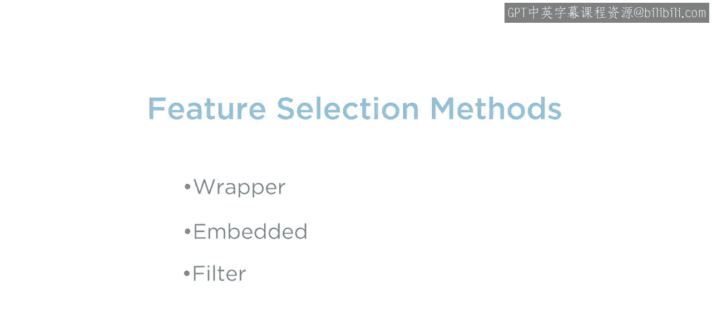

## 封装法

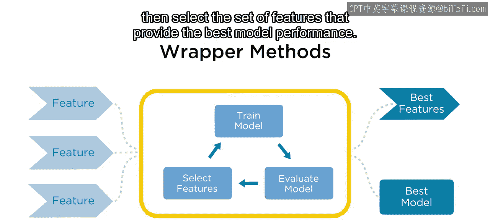

上一节我们介绍了特征选择的目标，本节中我们来看看第一种方法——封装法。

封装法通过训练和评估使用不同特征组合的预测模型，然后选择能提供最佳模型性能的特征子集。

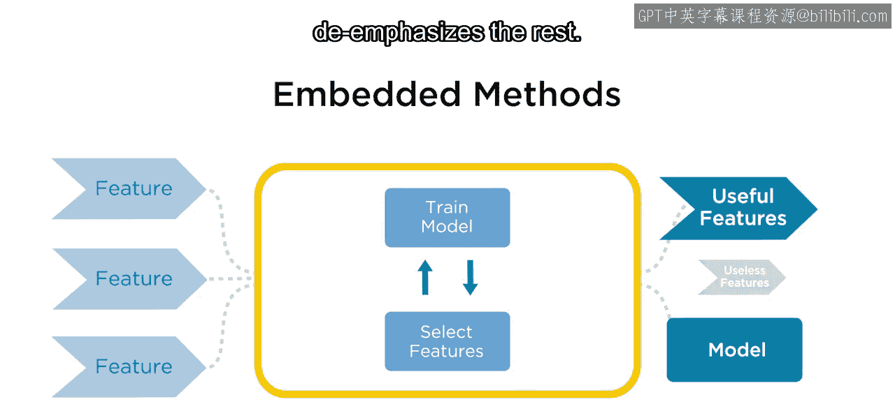

## 嵌入法

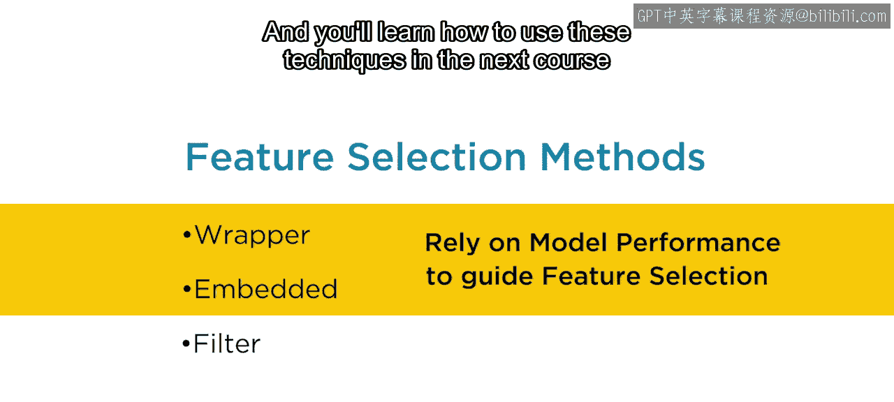

了解了封装法后，我们来看第二种方法——嵌入法。

嵌入法是一类机器学习模型，它们在模型训练过程中自动执行特征选择。其结果是得到一个训练好的模型，该模型会强调有用的特征，弱化其他特征。

封装法和嵌入法都依赖于模型性能来指导特征选择。在本专业的后续课程中，你将学习如何使用这些技术。

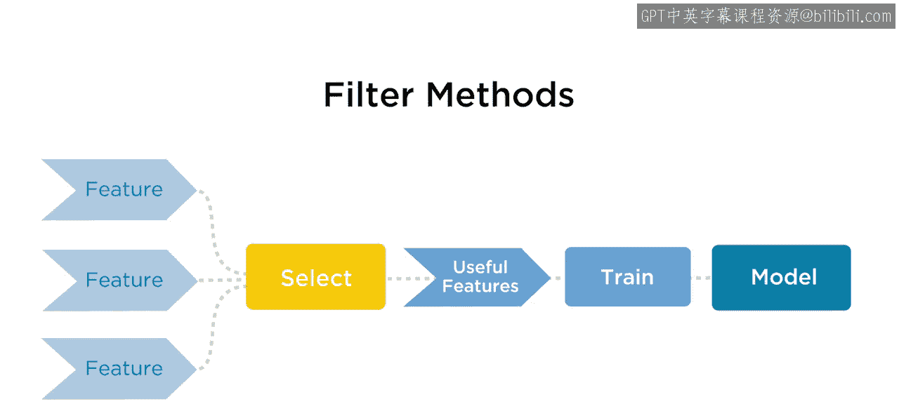

## 过滤法

与上述两种方法不同，过滤法在训练模型之前应用。它们基于预测变量的统计特性及其与响应的关系。过滤法独立于模型，常与封装法或嵌入法结合使用。

本视频的剩余部分将探讨三种常见过滤技术背后的主要思想：方差阈值法、协方差与相关性，以及特征独立性的统计检验。

### 1. 方差阈值法

我们从方差阈值法开始，其指导原则很简单：预测模型利用预测变量值的变化来估计响应变量相应的变化。因此，值变化不大的特征不太可能有帮助。

第一步是通过计算方差来确定每个预测变量的变化程度。在之前的课程中，你学习了描述分布的几种统计量，包括描述平均值或期望值的**均值**，以及描述值围绕均值分布的**标准差**。

**方差**等于标准差的平方。一个特征的方差通过计算每个值到均值的距离、将其平方，然后对所有值取平均得到。

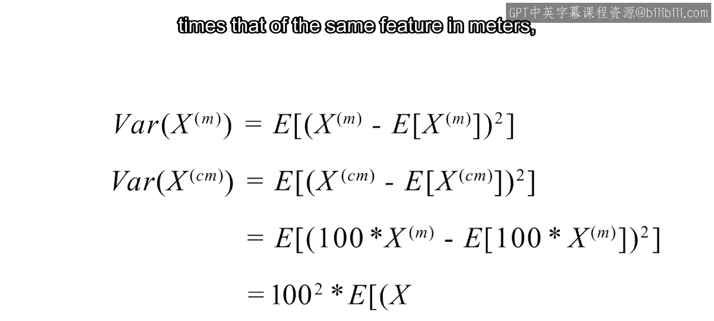

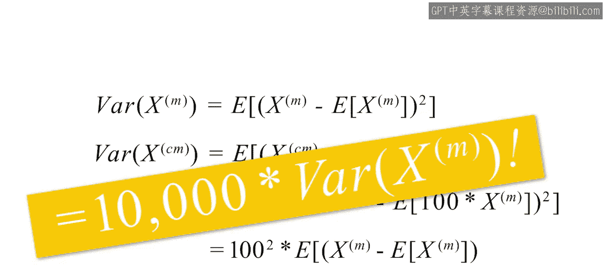

**公式**：`方差 = (Σ(x_i - μ)^2) / N`，其中 `x_i` 是单个值，`μ` 是均值，`N` 是值的数量。

较大的方差通常表示更多值远离均值，而较小的方差表示更多值聚集在均值附近。

虽然直接比较两个特征的方差很诱人，但必须理解尺度如何影响方差。例如，以厘米记录的特征的方差，将是同一特征以米记录时的10000倍，尽管两个特征包含相同的信息。

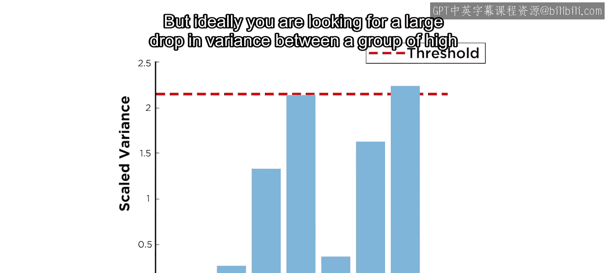

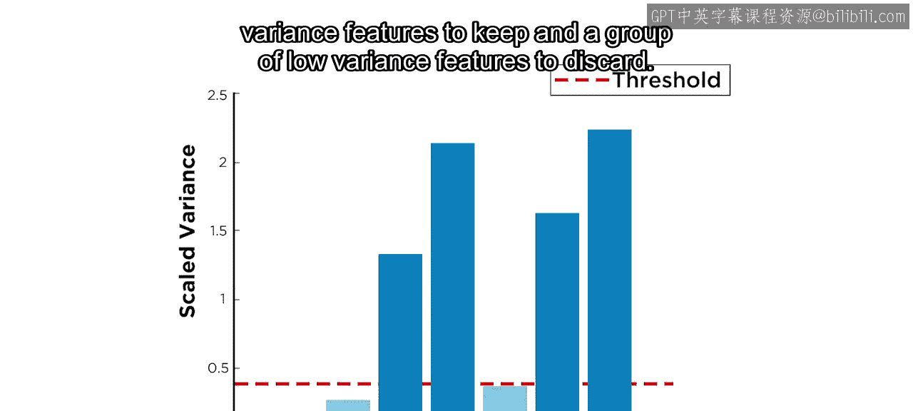

因此，在计算方差之前对特征进行缩放非常重要。接下来，选择一个阈值，仅选择缩放后方差高于该阈值的特征，舍弃其余特征。

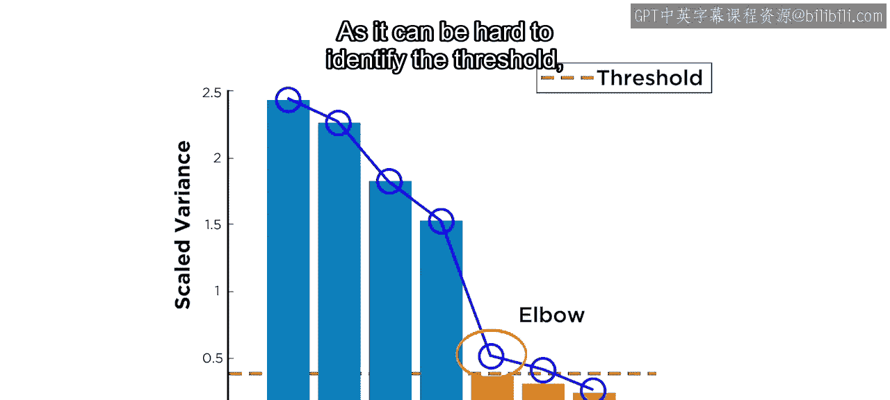

在实践中选择一个好的阈值可能有些棘手。理想情况下，你希望在一组要保留的高方差特征和一组要舍弃的低方差特征之间，看到方差的显著下降。

当方差按降序绘制时，这可能对应于一个尖锐的弯曲或“肘部”，但不一定。由于很难确定一个好的阈值，因此在使用方差阈值法时最好保守一些，转而使用考虑预测变量与响应之间关系的其他指标。

### 2. 协方差与相关性

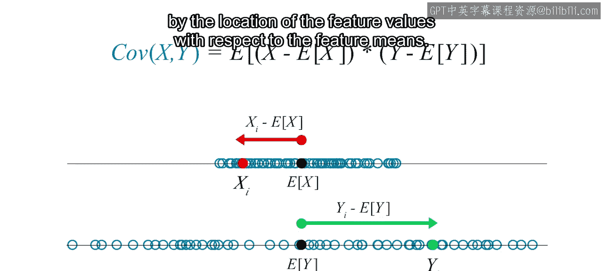

其中一个衡量指标是协方差。**协方差**是两个项的乘积的期望值：预测变量值到预测变量均值的距离，以及响应值到响应均值的距离。

**公式**：`Cov(X, Y) = E[(X - μ_X)(Y - μ_Y)]`

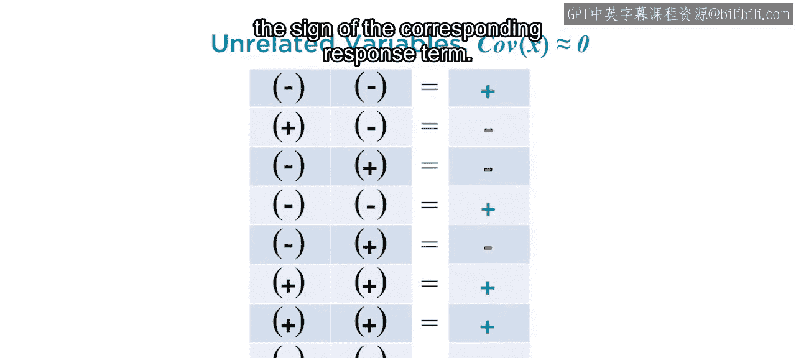

虽然方差总是大于或等于零，但两个特征的协方差可以是正数或负数。接近0的值表示预测变量与响应之间的关系较弱。较大（正或负）的值表示关系较强。

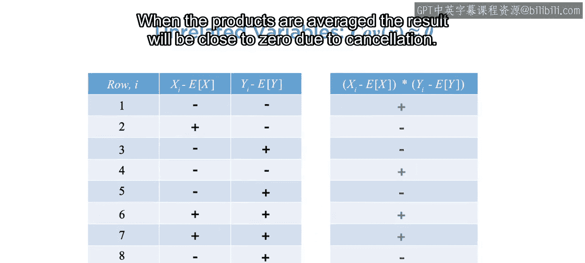

要理解原因，可以考虑协方差公式中每一项的符号，这些符号由特征值相对于特征均值的位置决定。

对于不相关的特征，每个预测变量项的符号与对应响应项的符号无关。

因此，乘积的符号会随机变化。当对这些乘积取平均时，由于相互抵消，结果将接近零。

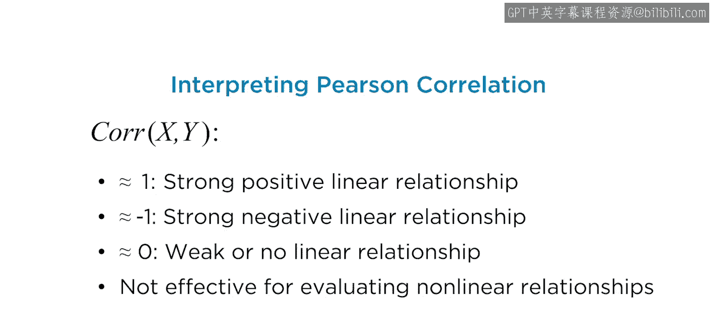

对于相关的特征，每一项的符号将是相关的，因此它们的乘积将始终为正或为负。这将导致较少的抵消，并且期望值远离0。

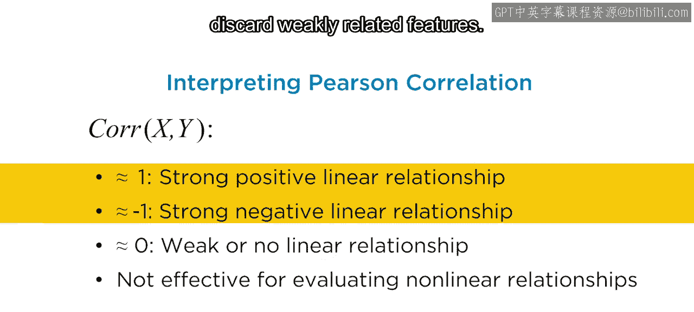

不幸的是，协方差也受尺度影响，因此不能用于比较不同预测变量之间的关系强度。然而，当你用每个变量的标准差缩放协方差值时，结果是一个可用于比较的无量纲指标——**皮尔逊相关系数**。

你在之前的课程中已经了解过皮尔逊相关，以下是其关键属性：

当用作特征选择工具时，相关性让你可以比较预测变量与响应之间线性关系的强度，并舍弃弱相关的特征。

除了皮尔逊相关，还有另外两种度量：**斯皮尔曼相关**和**肯德尔相关**，它们在非线性数据上表现更好。需要注意的是，所有这三种度量仅能有效识别单调（即严格递增或递减）关系。识别和评估其他类型的非线性关系需要更高级的技术。

### 3. 特征独立性统计检验

最后一种过滤方法是特征独立性的统计检验。这些检验的主要思想是：两个独立特征的值在共同考虑时，应以特定方式分布。因此，可以通过分析它们的分布来计算两个特征独立的概率或P值。

当使用统计检验进行特征选择时，第一步是选择适当的检验，这取决于每个预测变量和响应的数据类型。接下来，选择一个概率阈值（称为alpha值），低于该阈值将假定预测变量和响应在统计上相关。最后，计算P值。如果P值高于阈值，则假定响应和预测变量是独立的，并消除该预测变量；否则，保留该预测变量。

计算P值的方法超出了本课程的范围，但你可以使用MATLAB来计算。在随后的实时脚本阅读中，你将学习如何使用卡方检验和方差分析检验来选择特征，并了解如何获得基于相关性检验的P值。

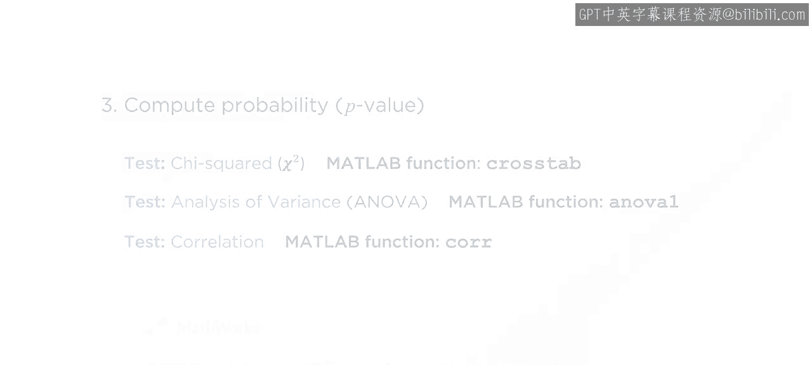

## 总结

本节课中我们一起学习了评估和选择特征的几种定量方法。我们介绍了三种主要方法：封装法、嵌入法和过滤法，并重点探讨了过滤法中的三种技术：方差阈值法、协方差与相关性分析，以及特征独立性的统计检验。理解这些方法有助于你构建更高效、更易于解释的预测模型。