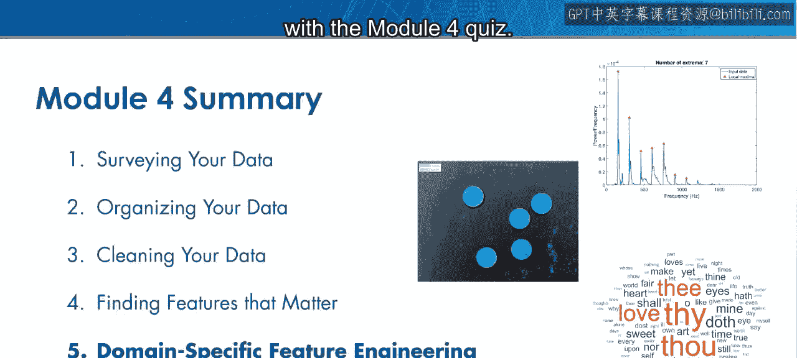

# 33：寻找重要特征总结


🎉

在本节课中，我们将回顾模块4所学习的核心技能，并了解这些技能如何为数据科学工作流的下一步——机器学习——做好准备。

---

### 概述

模块4的核心目标是掌握特征工程与评估技术。我们学习了什么是特征、如何从现有特征生成新特征、如何评估特征的重要性，以及如何处理复杂数据集。这些技能是构建高性能预测模型的基础。

---

### 特征工程基础

上一节我们介绍了模块的整体目标，本节中我们来看看特征工程的基础概念。

特征是用来描述数据样本的属性或变量。在预测模型中，特征的质量直接影响模型的性能。通常，一个预测模型的好坏取决于其特征集的质量。

以下是特征工程的两个主要目的：
*   **构建更多样化的模型**：通过生成新特征，你可以构建比仅使用原始特征集时更多样化的预测模型。
*   **提升模型性能**：通过设计能更好描述响应变量的新特征，你会发现模型的性能也会得到提升。

---

### 生成新特征的方法

除了转换或组合现有特征，还有其他方法可以生成新特征。

无监督学习可以帮助你发掘数据集中未知的关系和模式。利用MATLAB的聚类函数，你现在拥有了发现这些关系并将其转化为预测模型有用特征的工具。

例如，使用K均值聚类：
```matlab
[idx, C] = kmeans(data, k); % 将数据分为k个簇
```
此代码将数据点分组，簇的标签`idx`可以作为一个新的分类特征。

---

### 特征评估技术

拥有了众多特征后，在构建预测模型时，如何区分有用和无用的特征呢？

你现在可以通过识别并应用适当的特征评估技术来回答这个问题。常见的评估方法包括：
*   **过滤法**：基于特征的统计属性（如与目标变量的相关性）进行排序和选择。公式示例：皮尔逊相关系数 `ρ = cov(X,Y) / (σ_X * σ_Y)`。
*   **包装法**：使用模型的性能作为评价标准来选择特征子集。
*   **嵌入法**：在模型训练过程中自动进行特征选择（如LASSO回归）。

---

### 处理复杂数据集

有时，数据集的规模和复杂性使得探索和理解都变得困难，更不用说进行特征工程和评估了。

主成分分析（PCA）是一种强大的降维技术。通过PCA，你可以分析、可视化并从复杂数据集中提取特征，而其他人可能对此无从下手。

PCA的核心是找到数据方差最大的方向（主成分）。其数学基础是特征值分解：
```
[coeff, score, latent] = pca(X);
```
其中，`latent`包含了各主成分的方差（特征值），`coeff`是主成分系数（特征向量）。

---

### 总结与展望

本节课中，我们一起学习了特征工程与评估的核心技能。我们了解了特征的重要性，掌握了生成新特征（包括通过无监督学习）的方法，学会了评估特征对模型的贡献，并掌握了使用PCA处理复杂数据集的技巧。

在下一个模块中，你将进一步磨练特征工程技能，并学习从信号、图像和自由格式文本这些数据类型中提取特征的新方法，这些技能将区分业余数据科学家与专业人士。



但在继续前进之前，是时候通过模块4的测验来测试你的特征工程与评估技能了。