# 34：特定领域特征工程介绍 🎼

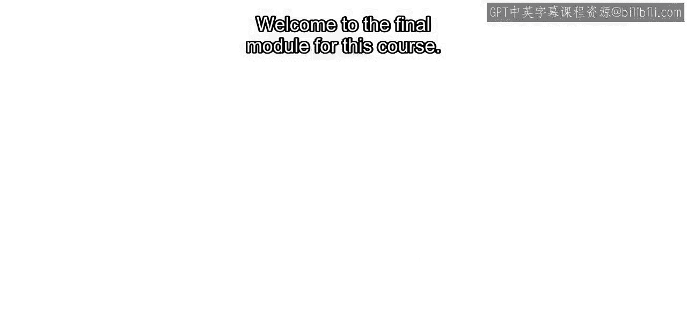

欢迎来到本课程的最后一个模块。到目前为止，你已经学习了一个完整的工作流程，用于为机器学习准备数据集，在本案例中是航空航班数据。你从在MATLAB中探索数据开始，接着进行数据清理和组织，最后进行了特征工程。

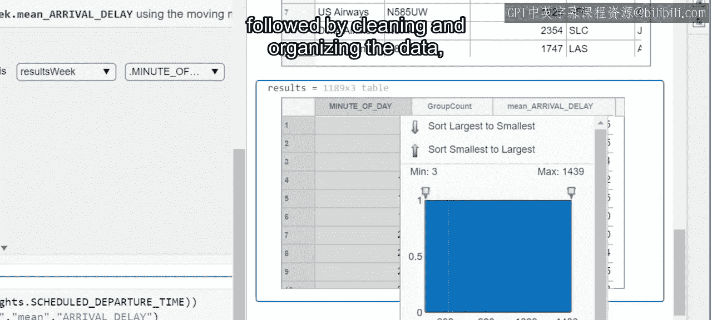

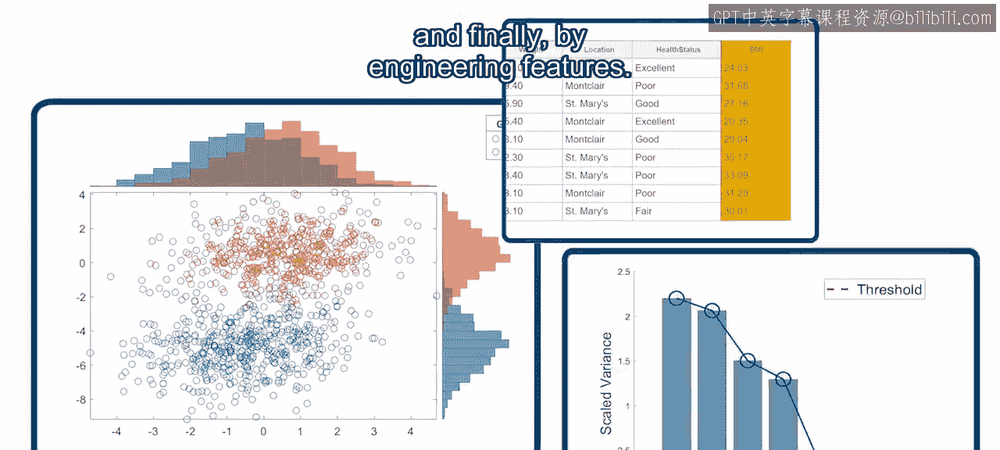

但是，如果你的数据看起来不像航班数据表那样呢？根据你的领域，你的数据可能看起来非常不同。

那么你将如何应用特征工程呢？不用担心，无论你的领域是什么，你所学到的技术和概念仍然适用。

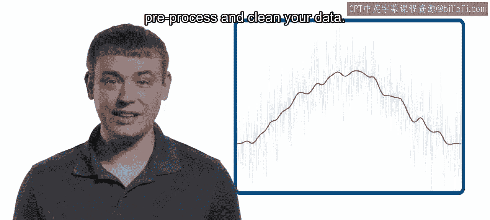

例如，你总是需要对数据进行预处理和清理。

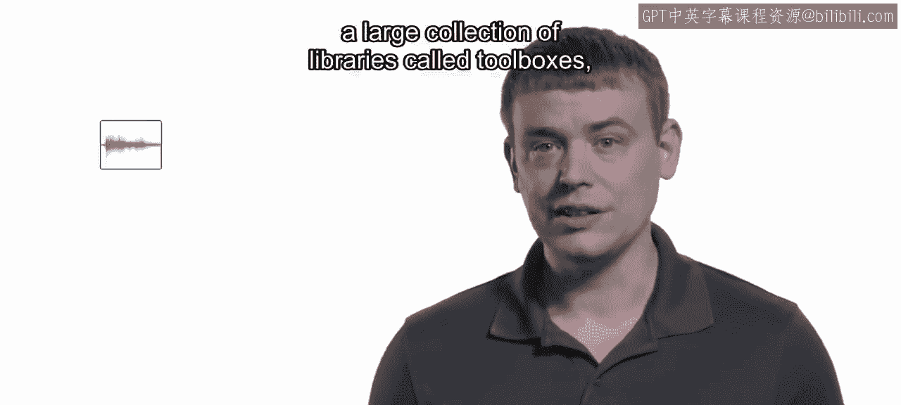

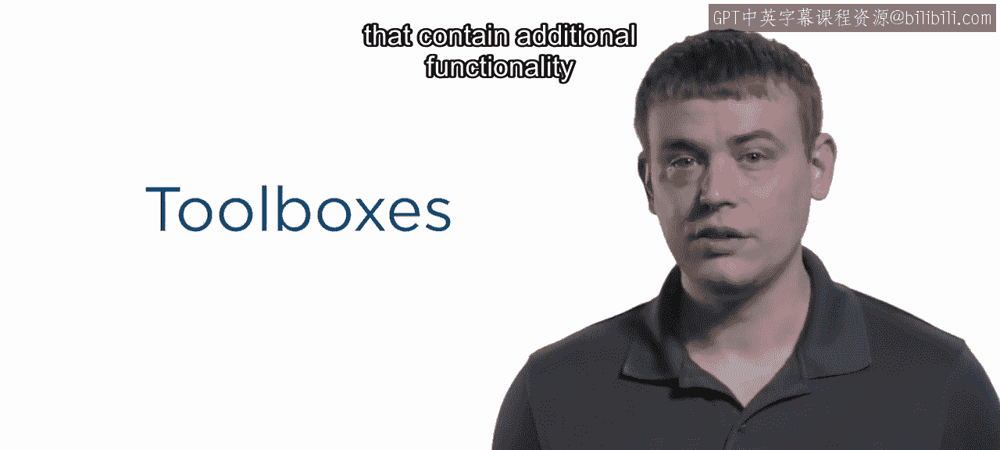

但是，当你的数据不仅仅是包含数字行的表格时，你可能需要额外的能力。这就是为什么MATLAB拥有一个庞大的库集合，称为工具箱，它们包含了用于分析不同领域数据的额外功能。

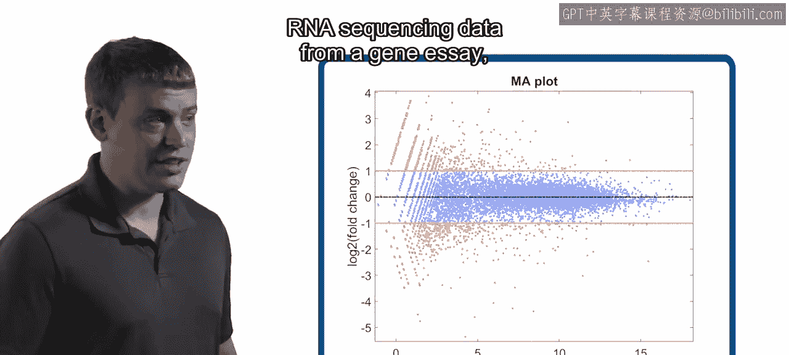

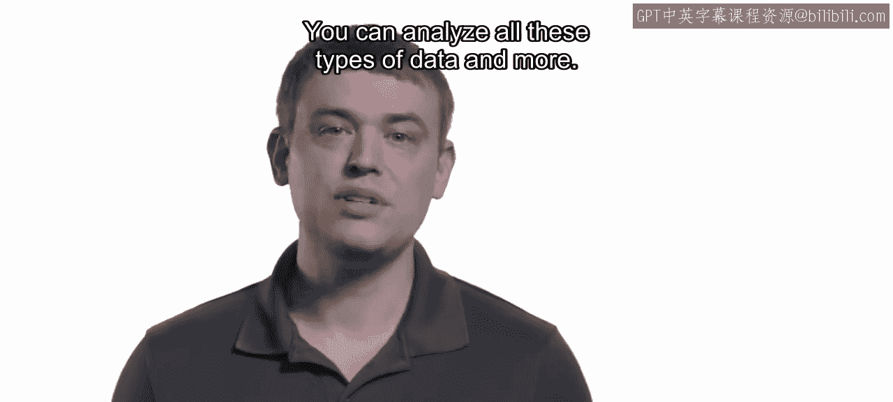

你拥有来自自动驾驶汽车的视频和传感器数据吗？来自基因检测的RNA测序数据？来自零售网站的产品评论？你可以分析所有这些类型的数据，甚至更多。

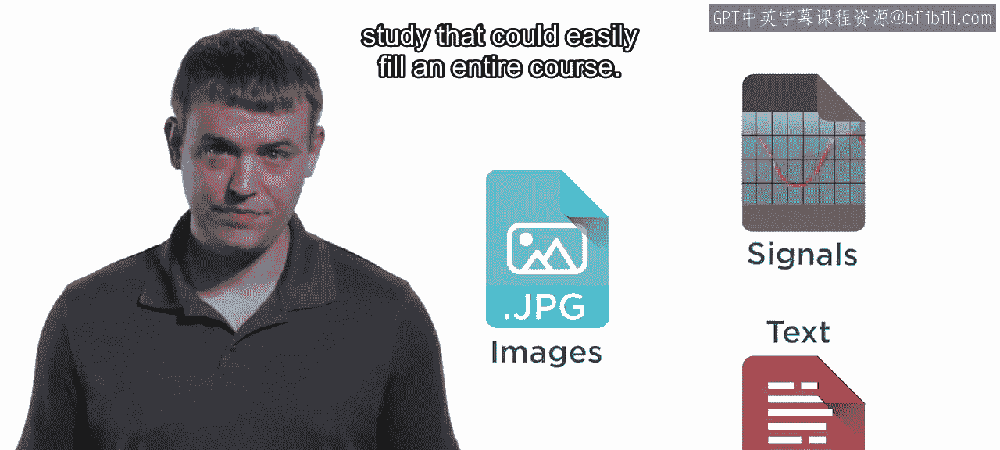

在本模块中，你将探索三种常见的数据类型：**信号**、**图像**和**文本**。这些类型中的每一种都代表了一个深入的研究领域，足以填满整个课程。

因此，本模块有两个不同的目标。对于那些对其中一种数据类型不熟悉的人来说，目标是掌握一些基础知识，以便在遇到它时知道从哪里开始。对于那些已经对特定数据类型有经验的人来说，目标是在数据科学的框架内学习如何应用你的领域知识。

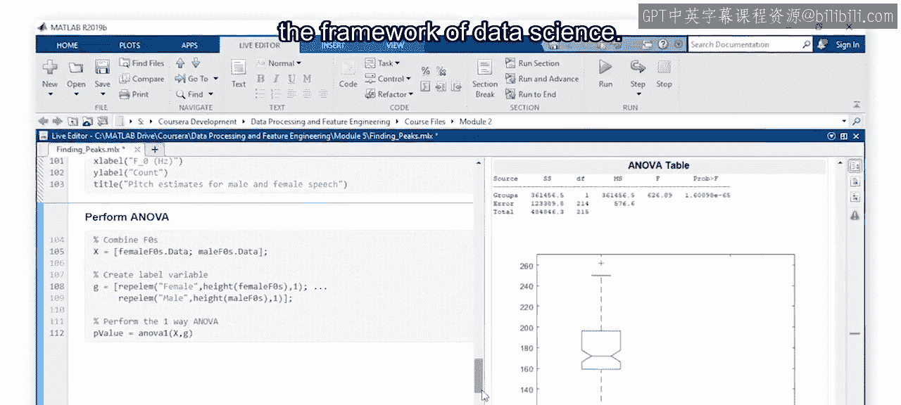

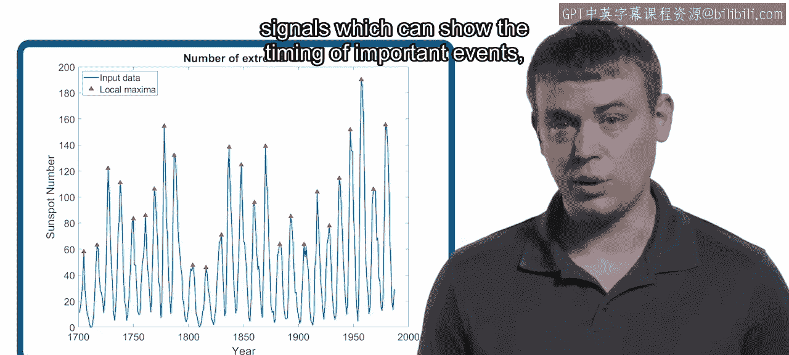

例如，你将使用针对每种数据类型独特的特征提取技术。你将在信号中寻找峰值，这可以显示重要事件的时间。你将在图像中定位边缘，这可以标记物体之间的边界。你将统计文本中最常见的单词，这可以揭示重要的主题和内容。这些都是简单的特征，但在回归和分类任务中可能具有很高的预测性。

在每一课中，你将使用相关工具箱中的函数来识别并应用最适合你特定应用的特征提取技术。

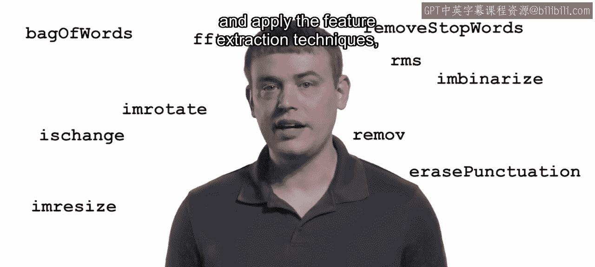

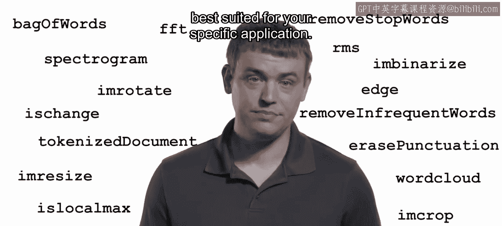

在本模块结束时，你将准备好将你的领域特定知识与MATLAB的功能相结合，将特征工程应用到你的数据中。那么，让我们开始吧。