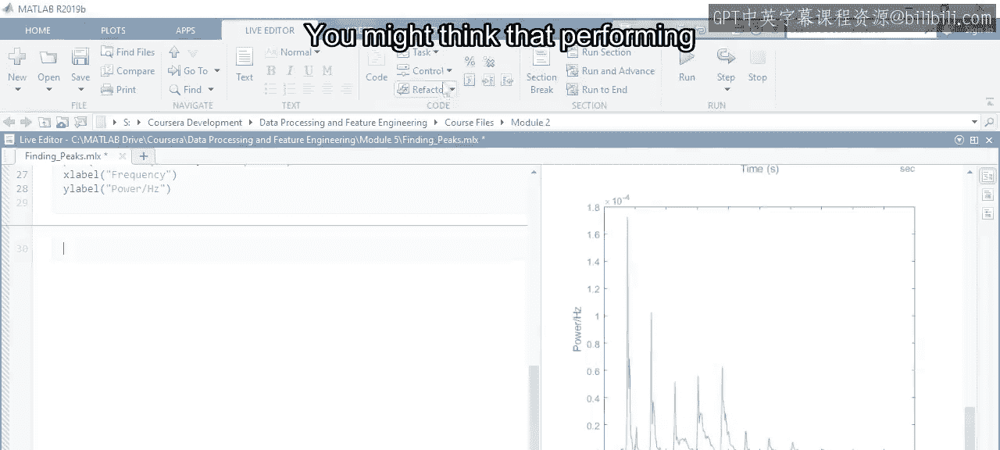
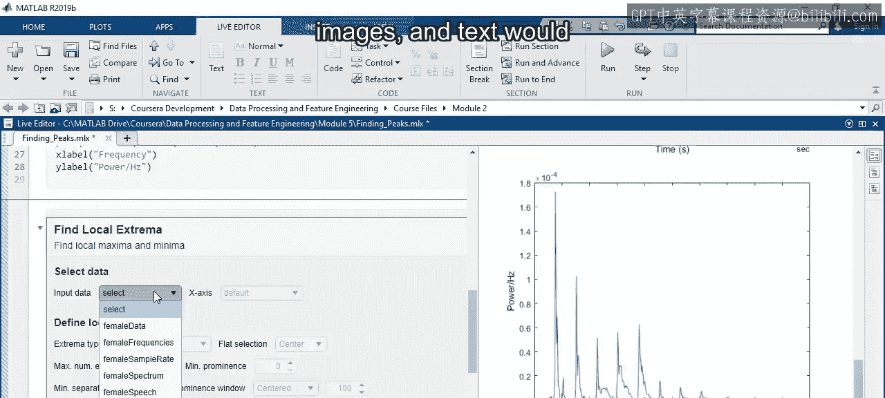
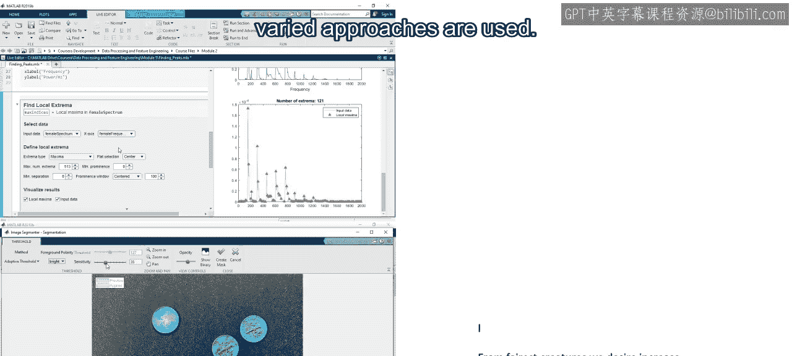
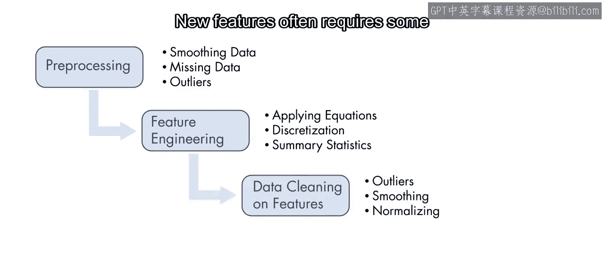
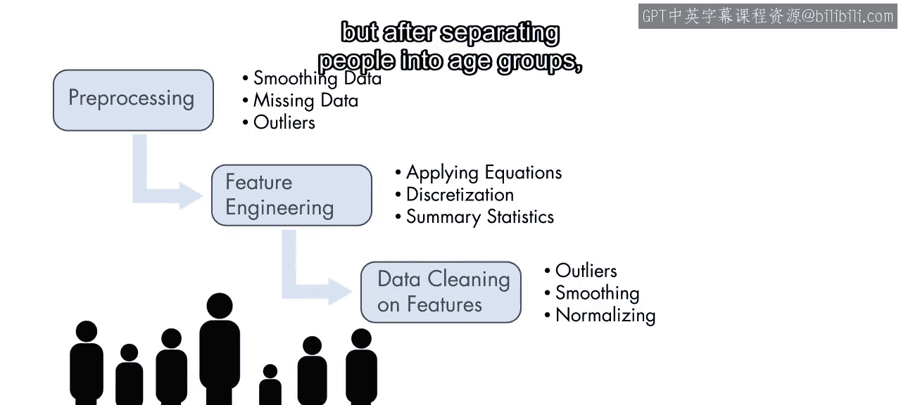
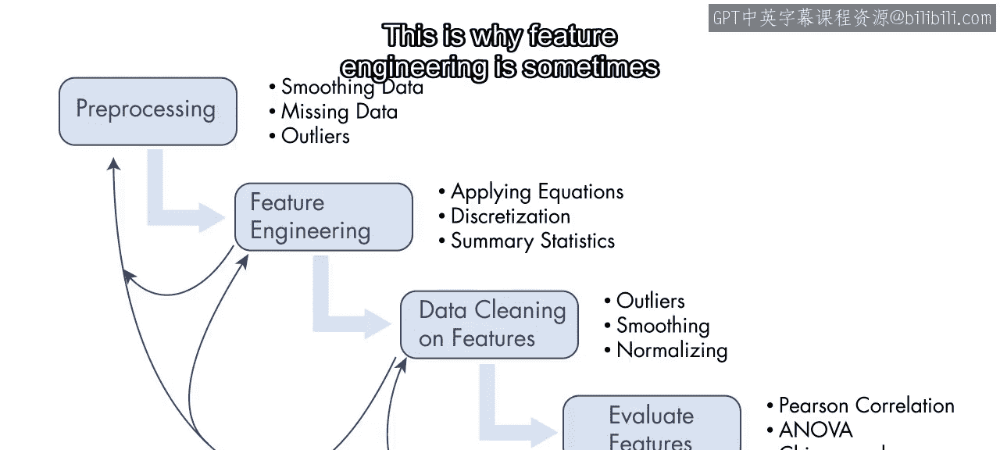
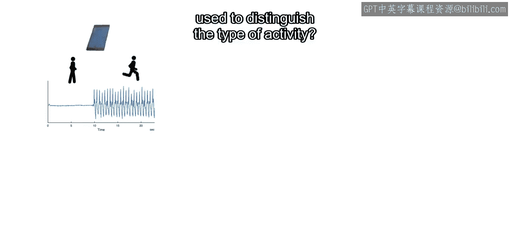
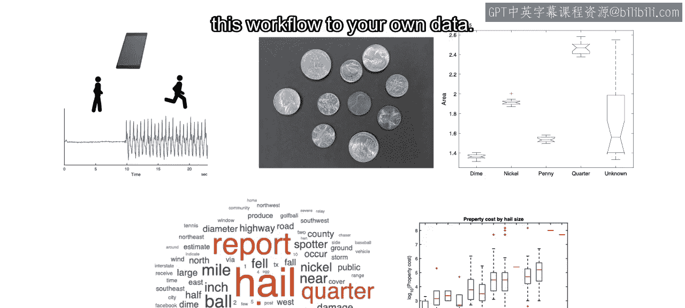
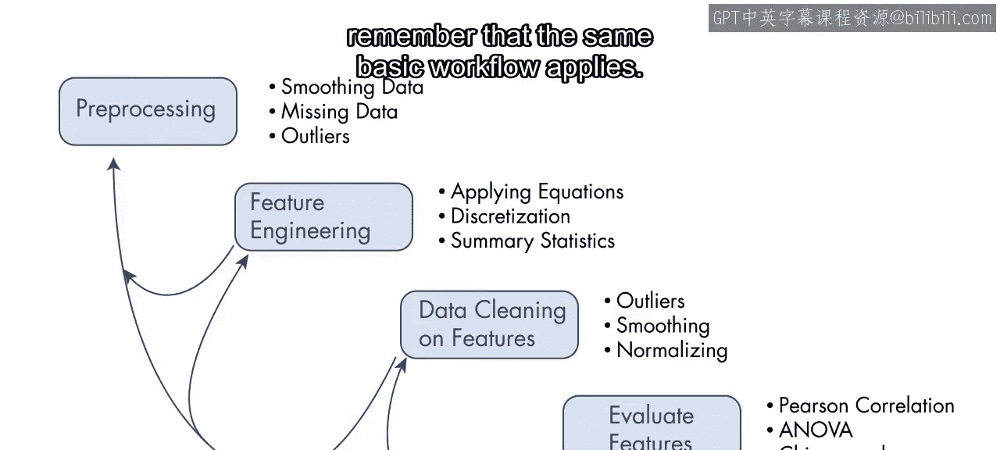

35：特征工程工作流程 🎼

在本节课中，我们将学习特征工程的核心工作流程。无论处理信号、图像还是文本数据，虽然具体方法各异，但都存在一个通用的步骤序列。我们将了解这些步骤如何协同工作，并探讨如何将其应用于解决实际问题。

你可能会认为，对信号、图像和文本进行特征工程需要完全不同的工作流程。确实，即使在同一个领域内，也会使用多种不同的方法。

然而，无论你的数据领域是什么，执行特征工程时都会遵循一系列通用步骤。你已经单独见过每个步骤。在本视频中，你将学习它们如何组合在一起。

上一节我们介绍了特征工程的多样性，本节中我们来看看其通用的核心流程。以下是特征工程工作流程的三个主要阶段：

1.  **数据准备**：首先，你学习了如何准备数据。在创建特征之前，通常需要进行预处理。但你采取的方法将取决于你感兴趣的特征。例如，在检测峰值之前，你可能需要对数据进行去趋势和平滑处理。或者在计算汇总统计量之前，需要先移除异常值。
2.  **特征创建**：接下来，你使用了多种技术来创建新特征，例如对单个或多个变量进行计算、离散化观测值以及计算汇总统计量。新特征通常需要你之前执行过的一些数据清洗步骤。例如，一个身高2米的人在原始数据集中可能不是异常值。但在将人群按年龄组分开后，一个身高2米的儿童就变成了异常值。
3.  **特征评估**：最后，你确定了你的特征是否有用。也就是说，你需要检查它们是否能帮助你更好地解释数据并做出未来的预测。你学习了一些统计技术和可视化方法来评估特征。在本专项课程的后续部分，你还将通过研究特征对机器学习模型的影响来评估特征。

当将特征工程应用于你自己的数据时，请记住这个过程是高度迭代的。在流程的任何阶段，你都可能返回到之前的任何步骤。试错是这个过程的一部分。这就是为什么特征工程有时被称为一门艺术而非纯粹的科学。

创建新特征通常需要你创造性地思考如何利用现有信息来回答你的问题。例如：
*   手机运动传感器的汇总统计量能否用于区分活动类型？
*   图像中硬币的面积能否用于准确地对它们进行分组？
*   描述冰雹的用词与风暴造成的损害之间是否存在相关性？

在本模块中，你将逐步完成这些示例。在此过程中，请注意如何利用现有数据来回答上述问题。思考如何将这一工作流程应用于你自己的数据。

无论数据领域如何，请记住相同的基本工作流程都适用。你需要考虑：需要哪些预处理步骤？你将如何评估特征？

本节课中我们一起学习了特征工程的通用工作流程，它主要包括数据准备、特征创建和特征评估三个迭代阶段。理解并应用这一流程，是创造有效特征以解决实际数据科学问题的关键。