# 36：将数据与时间表同步 📊

在本节课中，我们将学习如何处理和分析具有不同采样率的信号数据。具体来说，我们将了解如何将信号组织到时间表中，如何改变信号的采样率，以及如何同步多个信号以便进行比较。

## 信号与采样率

假设你正在处理一组随时间以固定间隔记录的温度数据。这种类型的数据被称为**信号**。在数据科学领域，信号是一种数据值具有特定顺序的数据类型。在关于数据平滑的课程中，信号被称为一种索引数据，因为存在一个索引变量（如时间）来定义数据点的顺序。

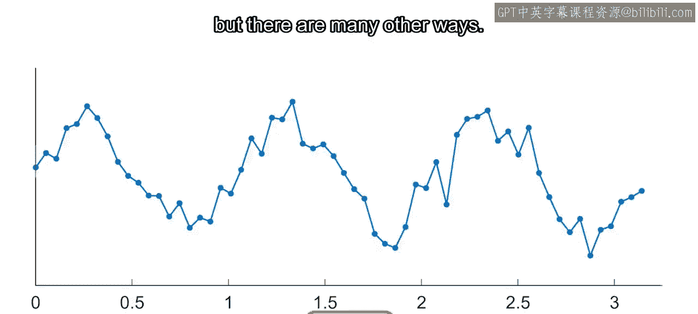

时间是指示信号的常见方式，但还有许多其他方式。


图像可以被视为一个二维信号，其中像素不是由时间索引，而是由它们在X、Y平面中的位置索引。


信号的一个重要方面是**采样率**，它是一个定义数据如何被索引的数字。例如，你现在听到的音频信号的采样率为44.1 kHz，意味着每秒音频有44100个数据点。同样，你现在观看的视频信号是在一个定义了每单位长度像素数量的屏幕上录制的，其像素密度为221 PPI，即每英寸221个像素。

分析信号时使用正确的采样率非常重要。播放音频时，使用错误的采样率会导致声音失真。

那么，如果你有多个具有不同采样率的信号，该如何分析它们呢？

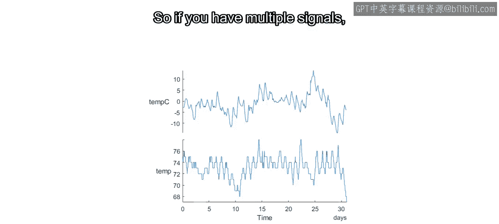


在本视频中，你将学习如何组织、重采样和同步信号数据，以便能够比较具有不同采样率的信号。

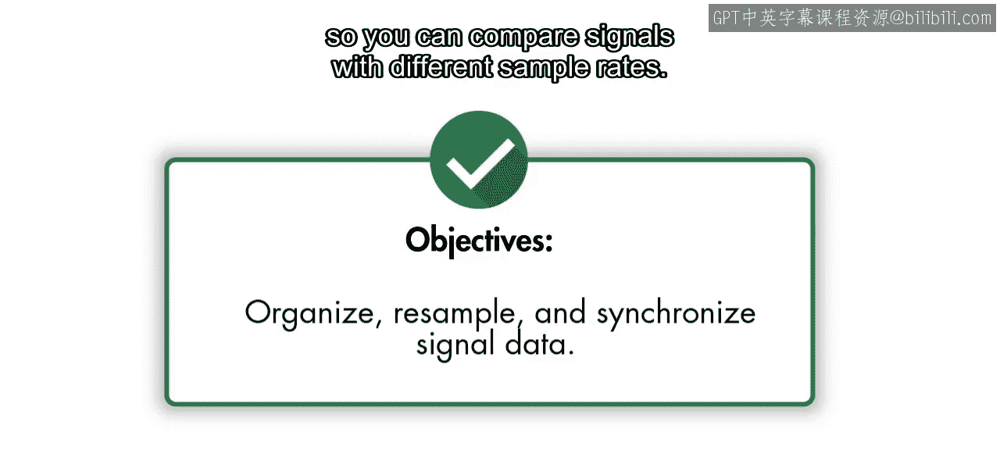


## 加载示例数据

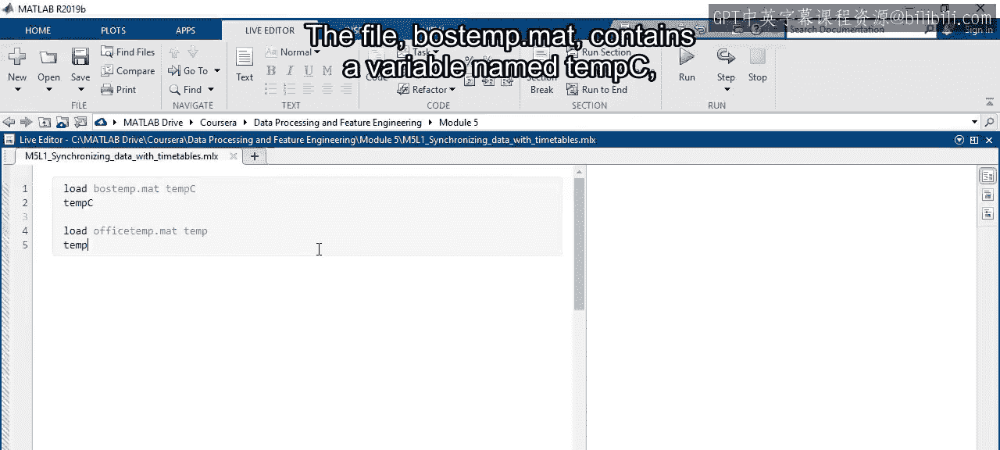

为了演示，让我们加载两个包含温度数据的信号。这两个信号都包含在MATLAB中，因此你无需下载。


文件 `Bo_tempemp.mat` 包含一个名为 `Temp_C` 的变量，其中记录了波士顿的摄氏温度值，每小时采样一次。文件 `office_temp.mat` 包含一个名为 `temp` 的变量，其中记录了办公楼内部的华氏温度值，每半小时采样一次。

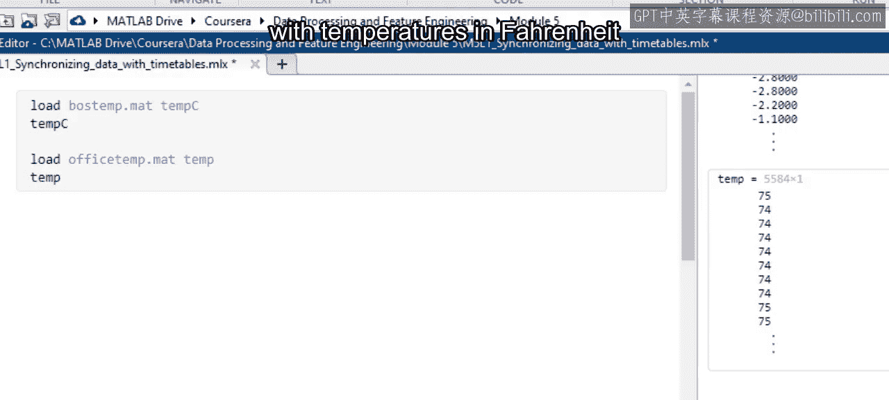

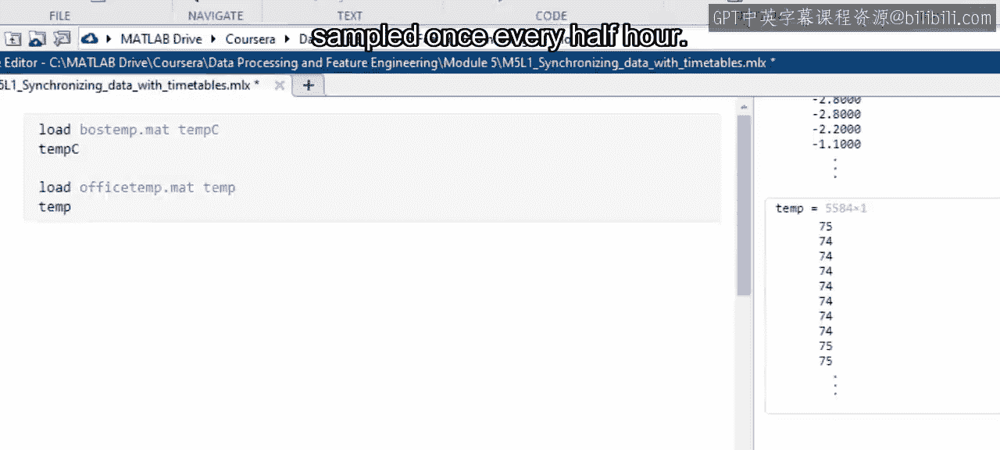


因此，办公室信号的采样率是波士顿信号的两倍。如果你绘制这些信号，可能会注意到另一个问题：波士顿信号大约有750个数据点，而办公室信号有5000多个。这意味着这些信号不仅采样率不同，而且办公室数据的记录时间更长。你如何对齐这些信号，以便比较一天中相同时刻记录的温度？

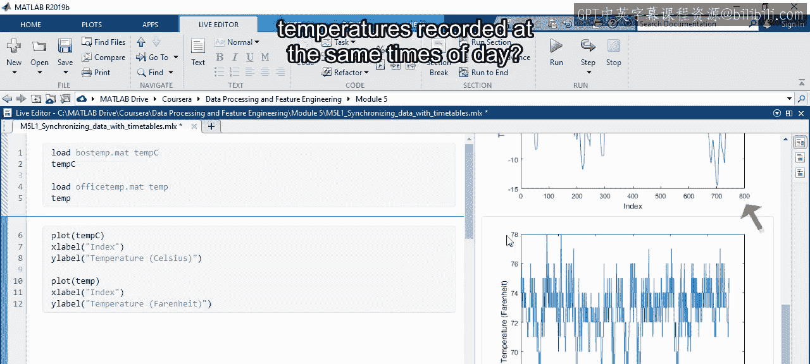

## 创建时间表


首先，你需要将信号组织到**时间表**中。这种数据结构类似于表格，但第一列始终是时间。如果你知道以赫兹（Hz，每秒样本数）为单位的采样率，可以创建时间表。但另一种选择是指定**时间步长**。

对于波士顿信号，你可以使用一小时的时间步长。对于办公室信号，你可以使用30分钟的时间步长。你可以看到时间都从零开始，这意味着这些信号在同一时间开始。但情况并非总是如此。

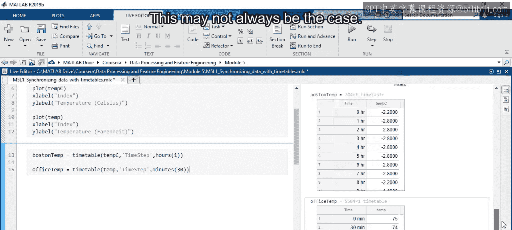

例如，你可能已经将录制的确切时间存储为日期时间值。在这种情况下，你可以使用 `timetable` 函数并指定 `RowTimes` 选项；或者，如果你的数据已经在一个常规表格中，你可以直接使用 `table2timetable` 函数进行转换。


但现在，让我们坚持使用原始的时间表。由于我们指定了时间步长，时间列中的值是**持续时间**值，而不是日期时间值。你可能从之前的课程中记得，持续时间值可以有不同的单位，例如天或秒。你可以通过将格式指定为字母 `D`（代表天）来将时间列的单位从小时转换为天。你也可以使用 `M` 代表分钟或 `S` 代表秒。如果你以天为单位重新绘制波士顿信号，可以看到数据记录了31天。

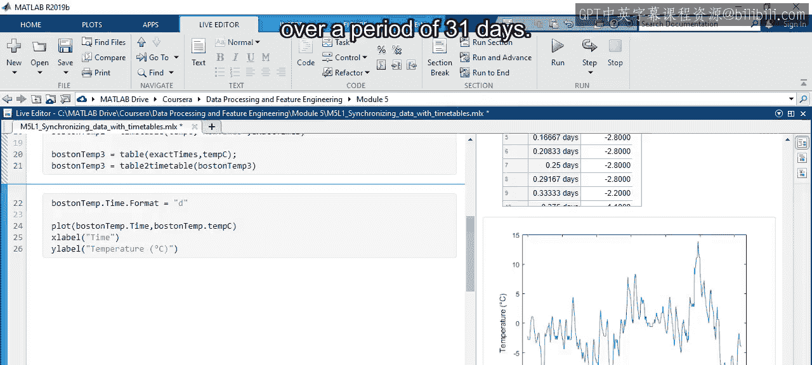

## 重采样信号

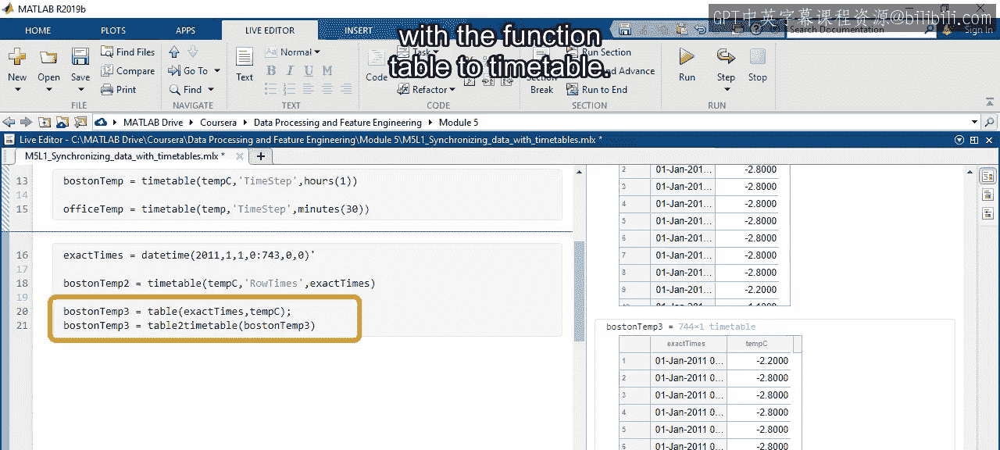

现在，为了对齐两个信号，一种选择是将其中一个信号转换为不同的采样率。例如，你可以将波士顿信号的采样率从每小时一次转换为每小时两次，以匹配办公室信号。这是采样率的增加，因此你需要通过一个称为**插值**的过程在现有数据点之间插入点。任何现有点将保持不变。采样率的增加通常称为**上采样**。你也可以降低采样率，这称为**下采样**。

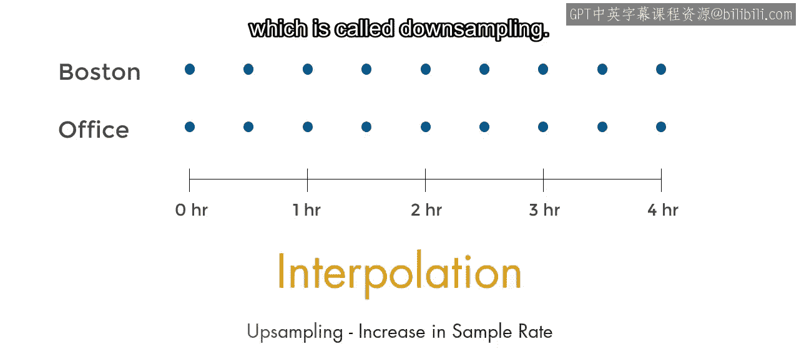

要更改采样率，请使用 `retime` 函数。你需要指定插值方法和新的采样率。这里的示例使用线性插值，但你可以在文档中阅读其他选项。

```matlab
% 示例：使用线性插值将采样率提高一倍
newTimeStep = hours(0.5); % 新的时间步长：30分钟
bostonTT_resampled = retime(bostonTT, 'regular', 'linear', 'TimeStep', newTimeStep);
```


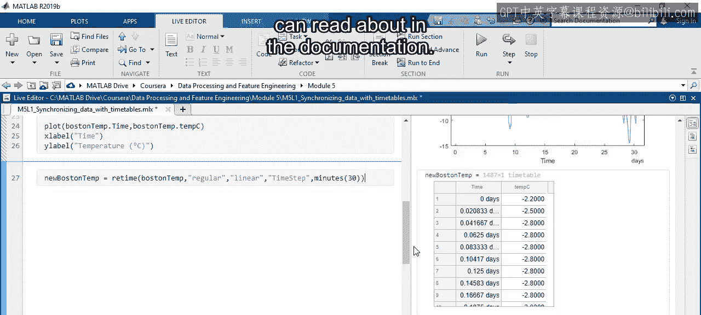

时间列的单位仍然是天，但现在时间表中的数据点是原来的两倍。

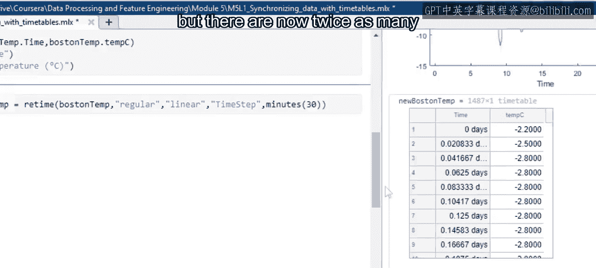

如果你的信号没有规则采样的点或缺少时间点，这种使用 `retime` 的方法也很有帮助。

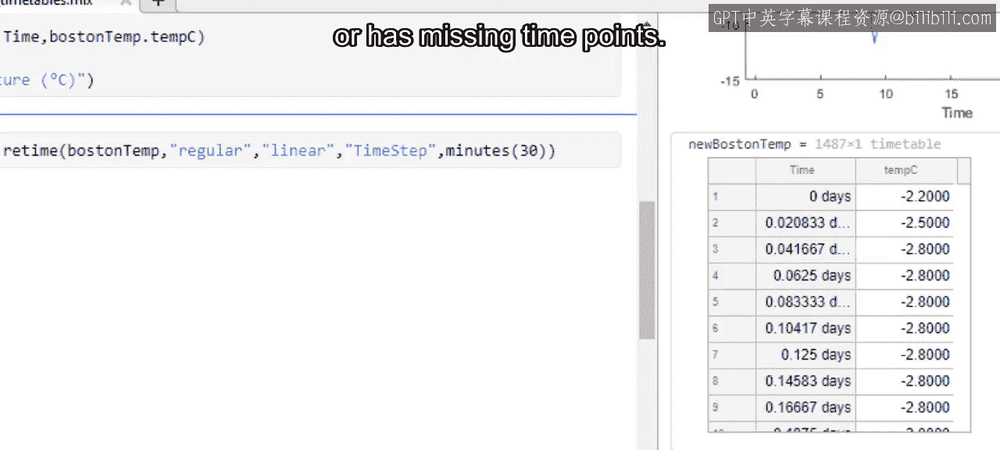


温度数据已经有规则采样，但如果没有，你可以使用 `retime` 来强制规则采样或填充缺失的时间点。

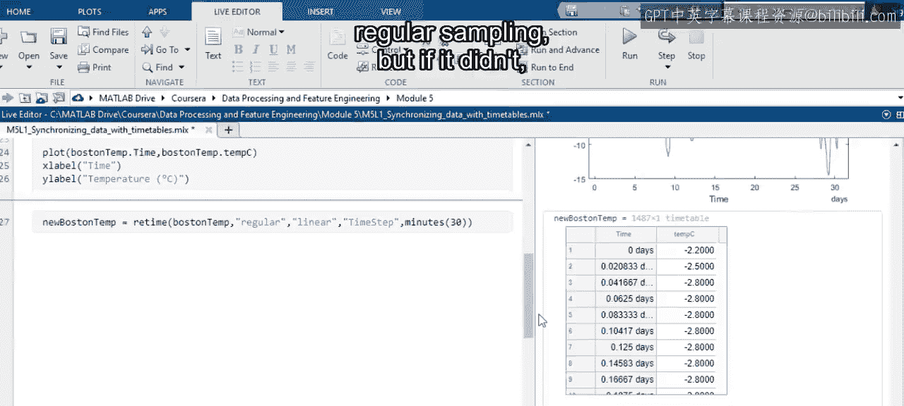
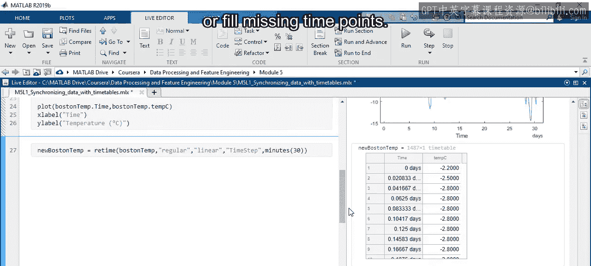


## 应用汇总统计


你可以用 `retime` 做的另一件有用的事情是应用汇总统计，而不是插值方法。例如，假设你想要每日的最高和最低温度。你可以使用 `retime` 函数，通过将 `linear` 替换为 `max` 和 `min`，并将时间步长设置为一天，来获取最小和最大温度。

```matlab
% 获取每日最高和最低温度
dailyMax = retime(bostonTT, 'daily', 'max');
dailyMin = retime(bostonTT, 'daily', 'min');
```


这段代码创建了两个时间表。如果你绘制信号，可以看到每天只有一个数据点：每日最高点或每日最低点。


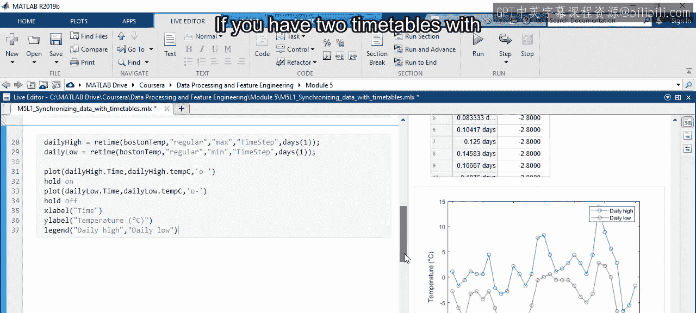


## 同步时间表

现在回到对齐不同信号的想法。如果你有两个具有相同采样率的时间表（就像你现在拥有的那样），你可以执行连接操作将它们合并在一起，就像你之前对常规表格所做的那样。然而，当你有多个时间表时，这可能会变得非常繁琐。

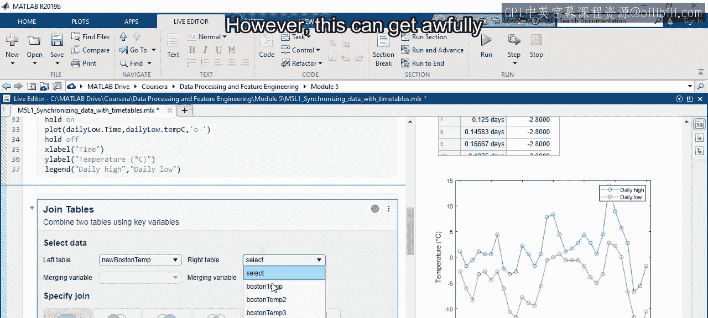

相反，你可以使用恰如其名的 `synchronize` 函数，将采样率转换和连接过程合并为一个同步步骤。

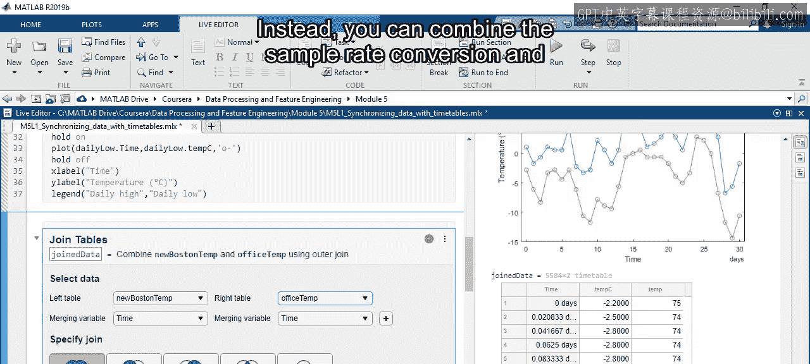


与 `retime` 类似，你可以指定插值方法或汇总统计，以及不同的采样率。现在，让我们使用波士顿数据的原始采样率，即每小时一次，指定为时间步长。

```matlab
% 同步两个时间表，使用波士顿数据的原始采样率
syncTT = synchronize(bostonTT, officeTT, 'regular', 'linear', 'TimeStep', hours(1));
```


输出是一个新的时间表，现在有三列。对于每个时间点，你都有来自两个信号的值，这意味着这些信号是同步的。


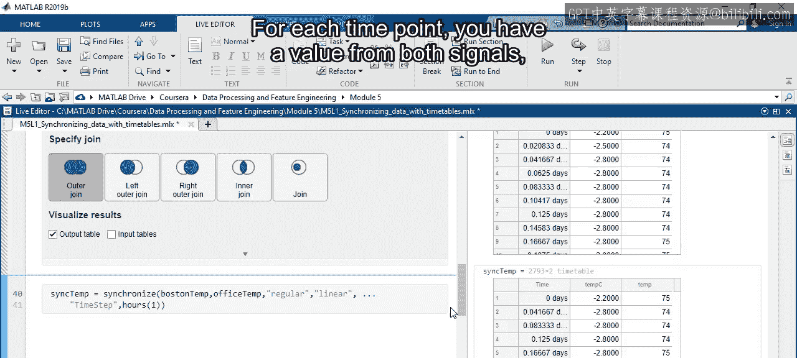

## 可视化与处理外推

可视化具有多列的时间表的一个好方法是使用堆叠图。


```matlab
stackedplot(syncTT);
```

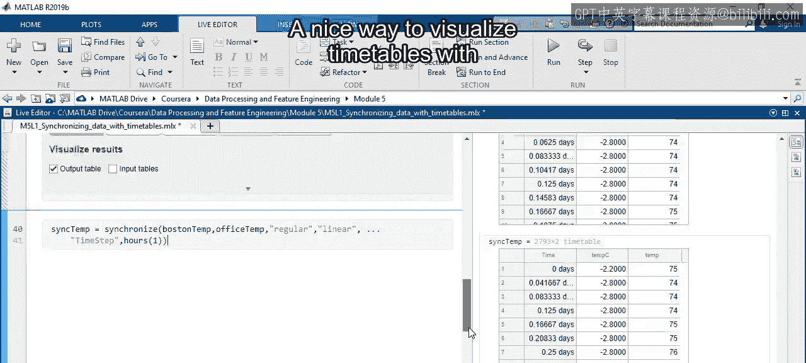


这创建了一个为每个信号使用单独Y轴但共享X轴的图。但这里有些不对劲。

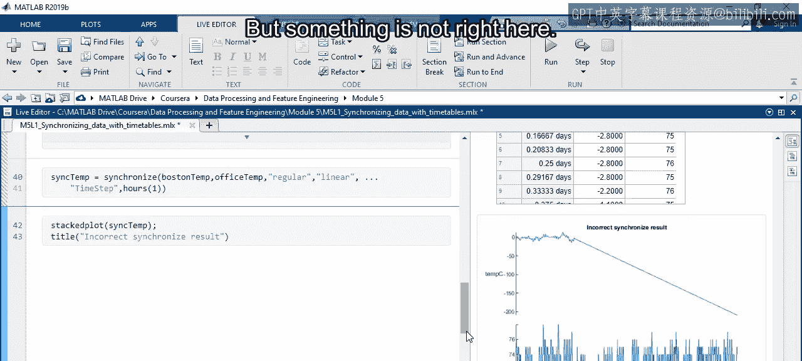


为什么 `Temp_C` 曲线有一条长长的斜线？波士顿会变冷，但没那么冷。新的波士顿信号有这条线，是因为办公室信号包含了四个月的数据，而波士顿信号只跨越了一个月。这条线是线性插值方法在最后一个数据点之外进行**外推**的结果。

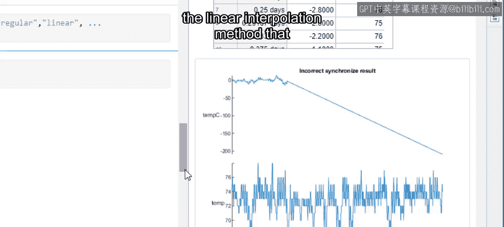
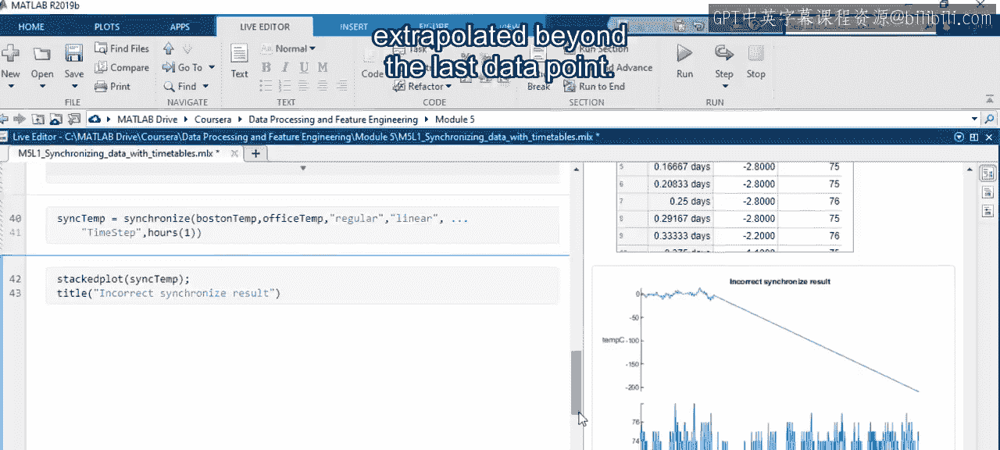


试图外推这么多数据没有太大意义。你可以通过向 `synchronize` 函数添加 `'endvalues'` 选项并设置为 `NaN` 来修复这个问题。

```matlab
% 同步并防止外推，在信号结束后填充NaN
syncTT = synchronize(bostonTT, officeTT, 'regular', 'linear', 'TimeStep', hours(1), 'endvalues', NaN);
```

这样好多了。信号仍然是同步的，但波士顿信号在一个月后停止。让我们通过将X轴限制设置为31天来放大第一个月的数据。

```matlab
xlim([0 days(31)]);
```

现在你可以开始看到两组数据中温度的每日趋势。稍后，你将学习如何从这些信号中提取特征。由于信号现在已经同步，你可以对两个信号使用相同的方法。

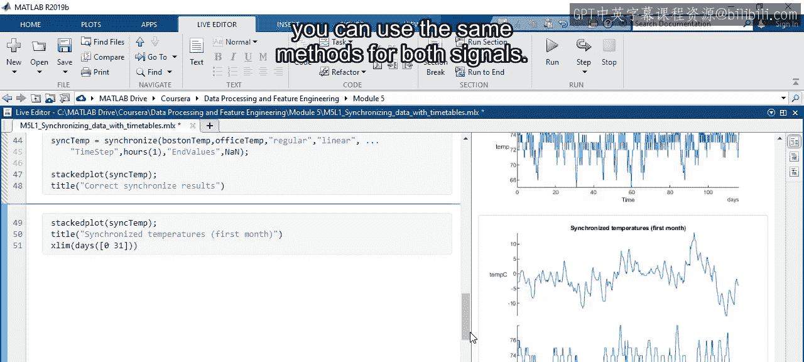


## 总结

在本节课中，我们一起学习了如何处理具有不同采样率的信号数据。

*   **时间表**是组织和处理信号的有用方式。你可以通过多种方式创建时间表。在我们的示例中使用了时间步长，但你也可以使用采样率或显式的行时间。
*   **`retime` 函数**用于转换信号的采样率，或者对非规则采样的信号在规则时间点进行重采样。
*   **`synchronize` 函数**用于同步具有不同采样率的时间表。

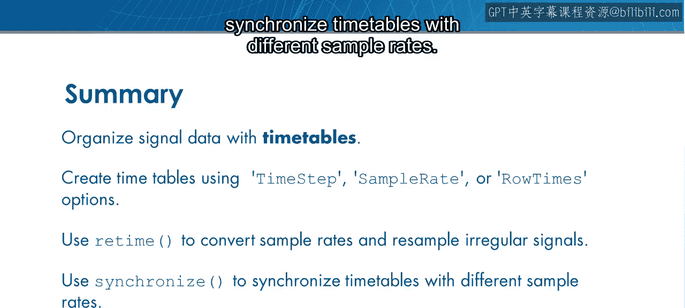


要了解更多细节，请查看 `retime` 和 `synchronize` 的文档，并花点时间回顾用于信号插值或使用汇总统计进行聚合的不同选项。

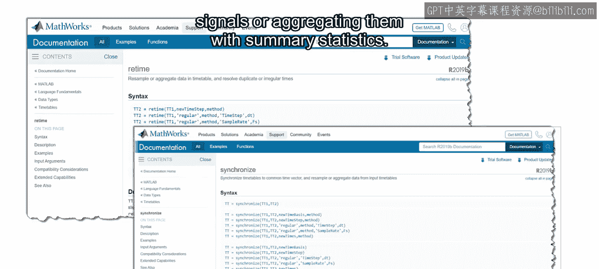

