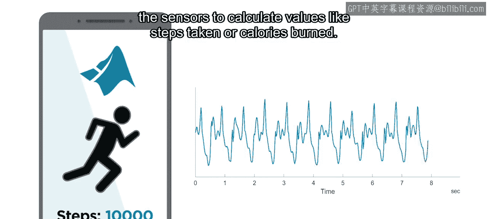
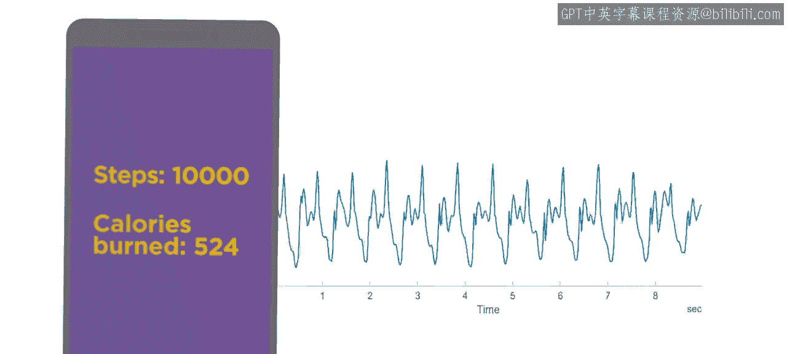
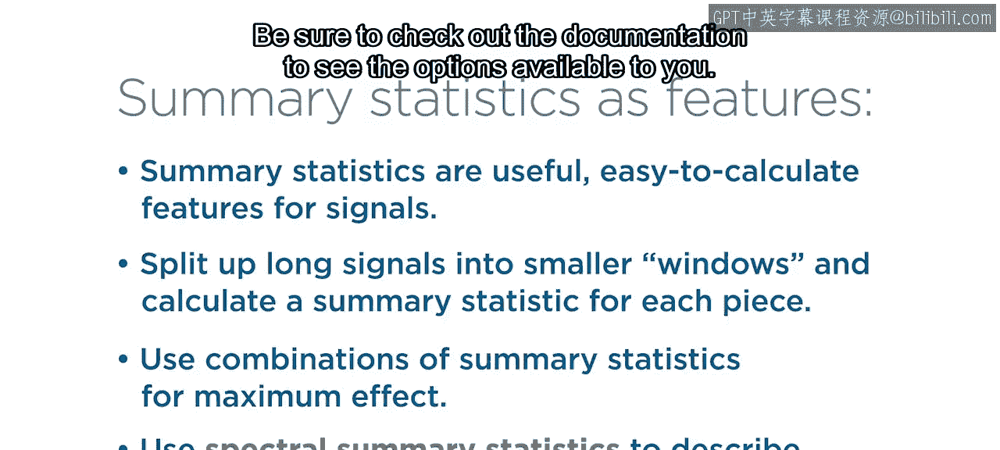

# 37：汇总统计作为特征

在本节课中，我们将学习如何将汇总统计量用作特征来描述信号。我们将探讨如何通过计算均值、标准差等统计量，以及进行频谱分析，来区分不同的活动类型，例如区分静坐、站立、行走和上楼梯。

上一节我们介绍了如何通过重采样和同步信号来在时间表中组织数据。这是数据预处理的重要步骤。本节中，我们将进入特征工程领域，学习如何使用汇总统计量作为特征来描述信号。





## 为何使用汇总统计量？


假设你正在帮助开发一款使用内置传感器追踪身体活动的手机或智能手表应用。作为团队的数据科学家，你的任务是找到一种方法，利用传感器信号来计算诸如步数或卡路里消耗等数值。


为了提供准确数值，你可能需要区分不同类型的活动。例如，根据用户是静坐、站立、行走还是上楼梯，你可能需要报告不同的数值。

在本视频中，你将看到如何使用汇总统计量，通过信号数据来描述这些活动。

## 数据来源：加速度计

你将看到的数据由加速度计记录。加速度计是现代手机中的常见传感器，它测量手机沿X、Y、Z三个轴的加速度。当你将手机静止握持时，由于重力作用，它会报告一个恒定但非零的值。当手机旋转时，数值会发生变化。只有在自由落体时，它才会精确记录为零值，但我们不建议尝试。

以下是来自加速度计Y轴通道的示例数据。在此案例中，佩戴智能手表的人先原地站立约10秒，然后开始行走。两种活动之间存在明显差异。但请注意，每种活动期间信号都相当一致。

## 特征工程方法：窗口化与统计量

区分这些活动的一种方法是将信号分成两部分，并为每个部分的整体计算一些汇总统计量。然后，你可以将这些数字用作特征来对活动类型进行分类。

当然，你事先并不知道将信号分成两部分的准确位置。因此，更常见的做法是取一个长信号，并将其分割成规则大小的片段。这个过程称为**窗口化**。

一旦信号被分割成独立的窗口，你就可以为每个片段计算汇总统计量，并进行预测。

## 有用的汇总统计量类型

**均值**可能足以区分静态活动，例如静坐与站立。因为传感器在不同活动之间可能处于不同的方向。当你静坐时，加速度计为每个轴报告一个恒定值。当你站立时，每个轴的加速度计输出会移动到另一个恒定值。你可以通过计算不同窗口的均值来检测这种变化。

那么，你认为哪种汇总统计量对于区分站立和行走有用？有很多候选者，但一个好的选择是**标准差**。行走时，传感器不断移动，因此数值会以反映运动强度的方式波动。与站立相比，行走时信号的变化更大，因此标准差会更高。

## 区分相似活动：频谱分析

但是，如何区分相似的活动，例如正常行走与上楼梯？在这些情况下，信号可能看起来非常相似。高阶统计量，如偏度和峰度，可能有助于揭示这些差异。

另一种比较此类复杂信号的常用方法是分析信号的频率成分。频率分析很有帮助，因为信号可以被视为一个或多个频率的组合。

最简单的例子是只包含单一频率的纯音。稍微复杂一点的信号是音符，例如来自吉他的音符。这个信号有一个决定音高的基频，但也有谐波，即声音的更高频率成分。当然，加速度计的信号不是音符，但原理相同。你可以将它们视为不同频率的组合。

## 傅里叶变换与频谱

信号的频率成分可以通过**傅里叶变换**进行分析。傅里叶变换是一种数学变换，它将信号转换到不同的域。这意味着数据以不同的方式索引。原始数据按时间索引，而变换后的数据按频率索引。

如果你仔细观察变换后的数据，可以看到一系列规则间隔的峰值。第一个峰值是基频，大约1赫兹，对应于时域信号中大约相隔一秒的波动。频率中的其他峰值是谐波，就像音符一样。

在MATLAB中，你可以轻松计算傅里叶变换并创建此类图表，它们通常被称为**频谱**。你可以在“频谱估计”绘图选项卡下看到一些可能性。

此图是使用 `periodogram` 函数创建的。另一个常见选择是 `pwelch` 函数，它绘制平滑版本的周期图。当你调用这些函数而不指定输出参数时，它们会创建图表。但你可以查阅文档，了解如何从图表中返回频谱值。

以下是一个使用示例：
```matlab
[Pxx, F] = periodogram(x, [], [], Fs);
```
在此用法中，信号在变量 `x` 中，采样率在变量 `Fs` 中。两个输出是频谱 `Pxx` 和频率索引数组 `F`。空输入用于指定这些选项的默认值。

## 频谱统计量

那么，频谱分析如何帮助你区分两种不同类型的活动？一旦你有了频谱，就可以计算另一类汇总统计量。

你可以计算**频谱均值**，也称为**频谱质心**，而不是时域均值。你可以计算**频谱标准差**，也称为**频谱扩展**，而不是时域标准差。

频谱统计量的计算方式与你已经见过的汇总统计量大致相同，但它们代表非常不同的值。信号随时间变化的均值代表平均振幅，而频谱质心是一个频率值，代表频谱中所有频率的加权平均值。同样，频谱扩展是衡量频谱在频率上分布广泛程度的指标。

## 应用示例：行走与上楼梯

让我们将这些技术应用于正常行走和上楼梯的加速度计信号。查看为两种活动从Y轴信号计算出的频谱。

请注意，蓝色代表的正常行走频谱具有规则间隔的峰值，这意味着该信号的谐波非常突出。另一方面，上楼梯频谱只在基频处有一个突出的峰值。

由于谐波不那么突出，该信号的大部分能量集中在较低频率。这种集中影响了频谱质心，上楼梯信号的频谱质心约为1赫兹。正常行走信号的频谱在较高频率处有更多能量。因此，频谱质心更大，约为3赫兹。

这种差异可能看起来不大，但请考虑其含义。你现在已经设法用单一的汇总统计量区分了两个非常相似的信号。

## 组合特征与特征选择

如果一个统计量不够，你可以将多个汇总统计量组合在一起，创建更大的特征集。然后，你可以应用之前学到的过滤方法，仅选择有助于实现预期目标的特征。

## 总结



本节课中我们一起学习了如何将汇总统计量用作信号特征。你可以通过将长信号分割成小片段或窗口，然后为每个窗口计算统计量来应用它们。当单个统计量不够时，使用汇总统计量的组合。最后，使用频谱汇总统计量来分析信号的频谱。请务必查阅文档以了解可用的选项。