# 38：寻找峰值 🎯

在本节课中，我们将学习如何通过寻找信号频谱中的峰值来提取特征，特别是用于估计语音信号的基础频率。我们将使用MATLAB的“查找局部极值”任务，并探讨如何通过调整参数来优化峰值检测，最终评估该特征在区分不同说话者时的有效性。

## 概述：从音频信号中提取音高特征

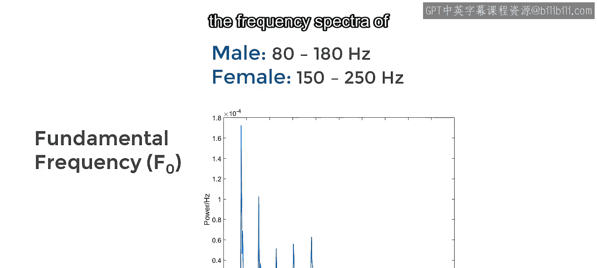

假设你正在分析包含语音录音的数据集。你已经了解了如何使用汇总统计来描述信号。但如果你需要测量信号的具体属性，例如说话者的音高，该怎么办？音高在许多情况下都是一个有用的特征。它在普通话等声调语言中进行语音识别时至关重要，因为音高的差异会导致完全不同的词语。音高也可用于帮助识别说话者的性别。男性的典型语音音高在80到180赫兹之间，而女性的音高通常在150到250赫兹之间。在本视频中，你将看到如何通过寻找男性和女性语音录音频谱中的峰值来估计基础频率。

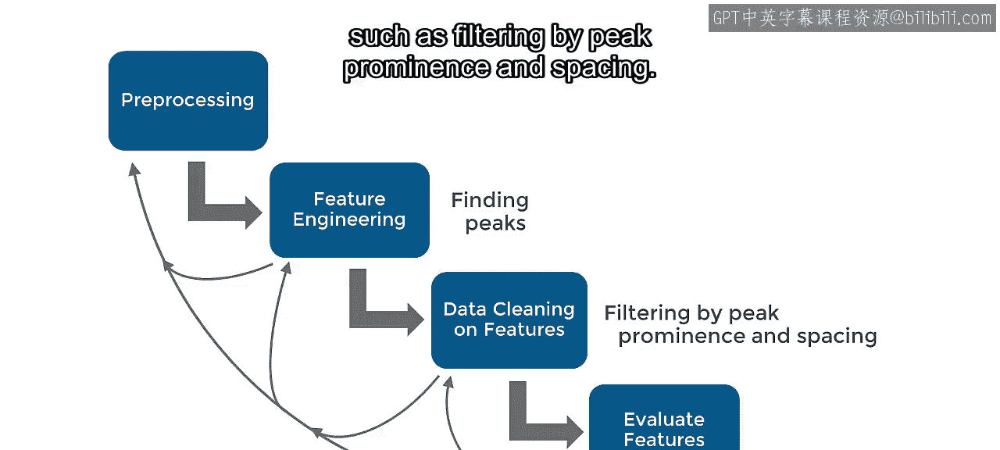

## 加载与准备音频数据

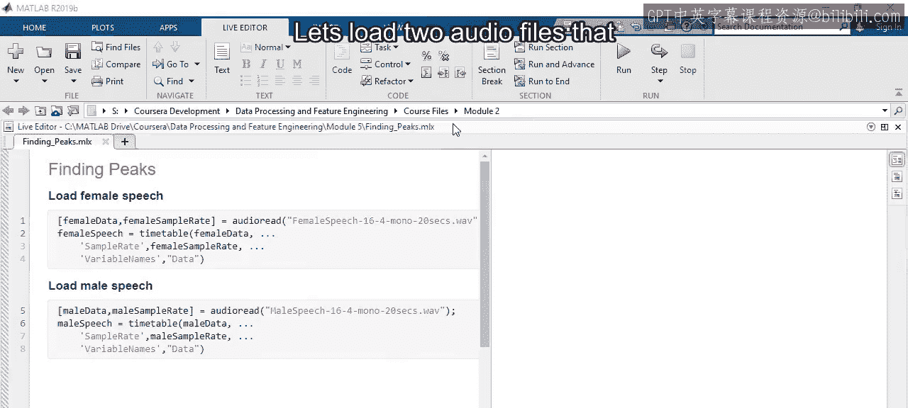

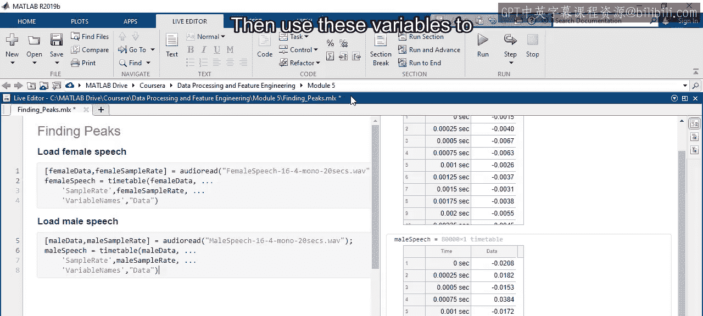

首先，我们加载两个包含男性和女性说话者语音录音的音频文件。这两个文件都包含在MATLAB中。

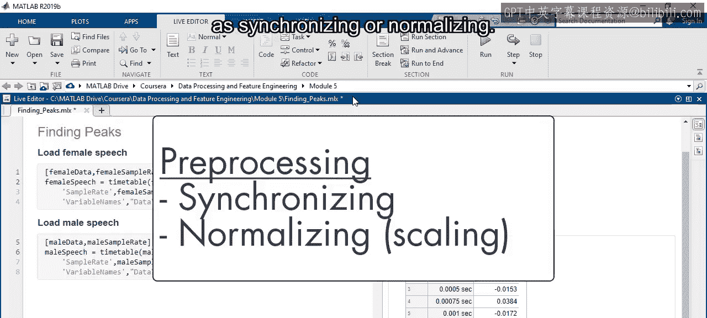

以下是加载数据的步骤：

1.  使用 `audioread` 函数加载两个变量：信号和采样率。
2.  使用这些变量为每个文件创建一个时间表。

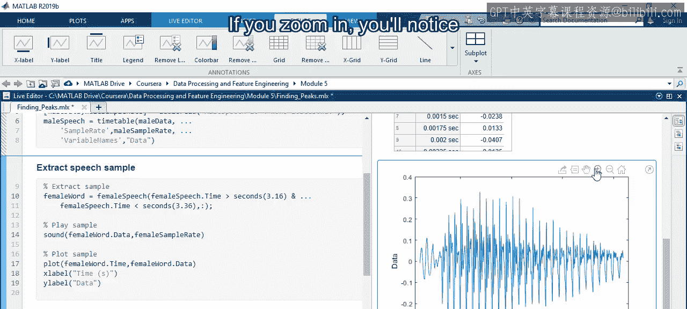

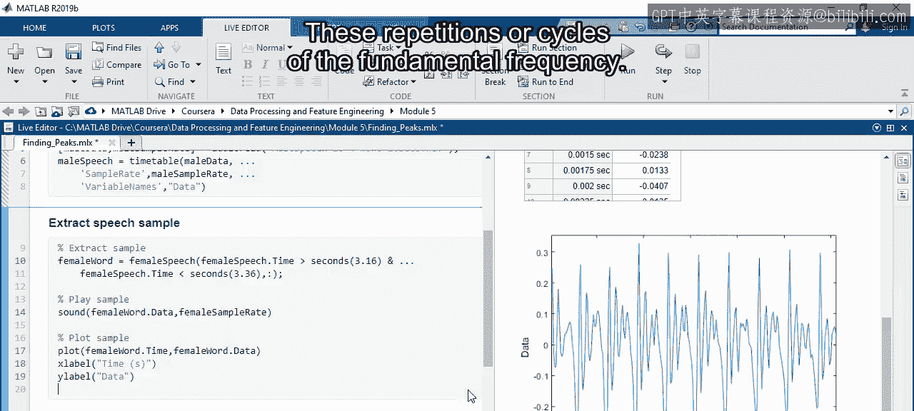

此时是应用任何预处理操作（如同步或归一化）的好时机。如果音频文件是用不同设置或设备录制的，这可能很有必要。然而，这些特定文件是同时录制的，因此不需要额外的预处理。

## 分析女性语音样本

接下来，使用此处显示的时间从女性语音时间表中提取一个样本。这个波形是单词“rainbow”中“bow”音的录音。你可以使用 `sound` 函数播放录音。如果放大，你会注意到大约每5毫秒有一个重复模式。这些重复是基础频率的周期。

在频谱中可以更清楚地看到这一点，频谱可以使用 `periodogram` 函数计算。注意频谱有一系列突出的峰值。第一个接近200赫兹的峰值代表基础频率，而其他峰值是谐波。谐波频率是基础频率的倍数，因此它们的值是基础频率的两倍、三倍，依此类推。

## 使用“查找局部极值”任务自动化峰值检测

让我们尝试通过寻找频谱中峰值的位置来识别这些频率。你可以使用名为“查找局部极值”的实时编辑器任务来自动化峰值查找过程。这将生成可重用的代码，以便你可以在其他数据上复现结果。

现在插入一个这样的任务，并选择频谱作为输入数据。哇，有很多峰值。如果放大，你可以看到信号中的每个峰值都被标记了。这些峰值对基础频率估计没有帮助，因此你需要在实时任务中更改一些参数。

你可以调整两个参数来减少检测到的峰值数量：

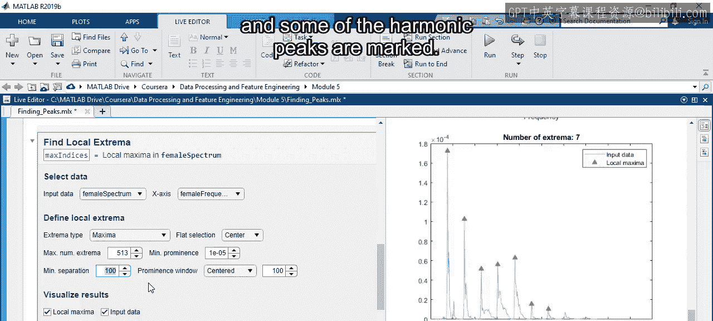

*   **最小突出度**：衡量一个峰值相对于周围点的突出程度。
*   **最小间隔**：指定峰值之间允许的最小距离。

由于基础频率峰值几乎跨越了整个范围，其突出度值可能接近数据的最大值（大约 `2e-4`）。你可以增加最小突出度，以便只检测到基础频率峰值。但基础频率峰值并不总是最大的。相反，尝试识别所有谐波峰值可能更好。然后，可以通过计算峰值之间的平均距离来计算基础频率。

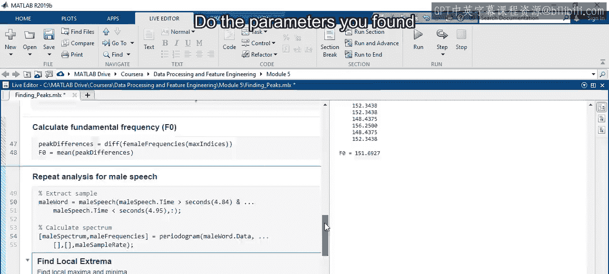

尝试将最小突出度增加到 `1e-5`。你可以看到这移除了大部分较小的峰值，但仍有部分额外峰值不在谐波频率附近。由于谐波具有固定的间隔，你可以指定最小间隔来限制检测峰值的频率。让我们尝试将峰值之间的最小间隔设为100赫兹。这很好。只有基础频率峰值和一些谐波峰值被标记。

现在，为了估计基础频率，你可以使用实时任务的输出和 `diff` 函数来获取每个峰值之间的频率差，然后取平均值。这样，样本的基础频率大约为152赫兹。

## 将方法应用于男性语音样本

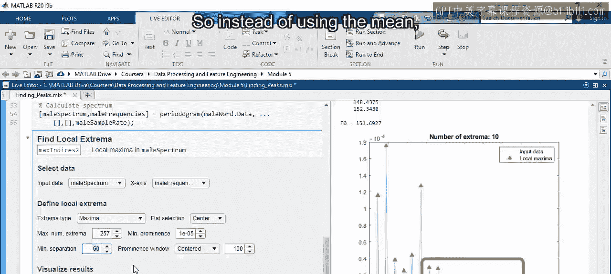

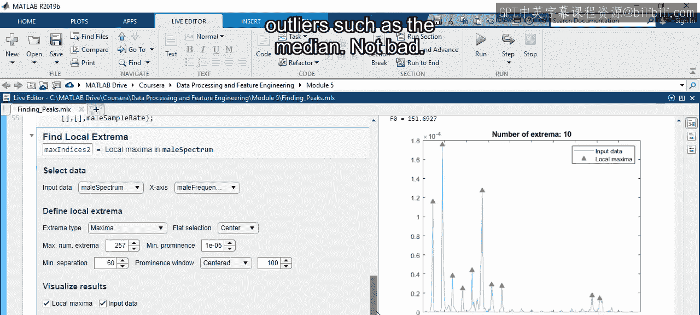

但是，请稍等。你找到的参数是否也适用于男性语音录音？让我们用新样本重复这个过程。确保使用相同的参数以保持一致性。哦，显然遗漏了一些峰值。这是因为最小间隔设置为100赫兹，但有时男性声音会低于这个值。

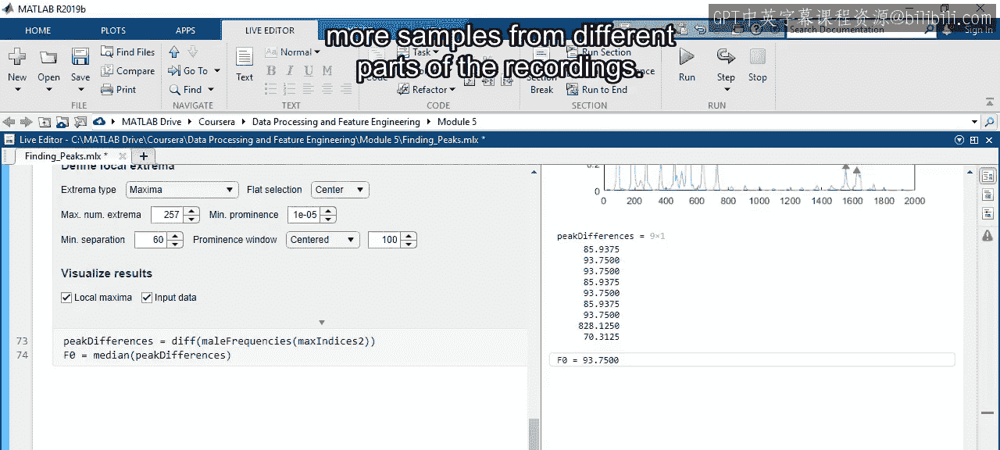

在尝试寻找特征时，这类问题很常见。适用于一段数据的方法可能不适用于另一段。幸运的是，这是一个领域知识可以派上用场的情况。语音音高很少低于60赫兹，所以让我们尝试将最小间隔设为60。这似乎效果很好，但它带来了另一个问题：如果遗漏了一些谐波，可能会出现一些非常大的峰值差异。因此，你可以使用对异常值不那么敏感的统计量，例如中位数，而不是平均值。

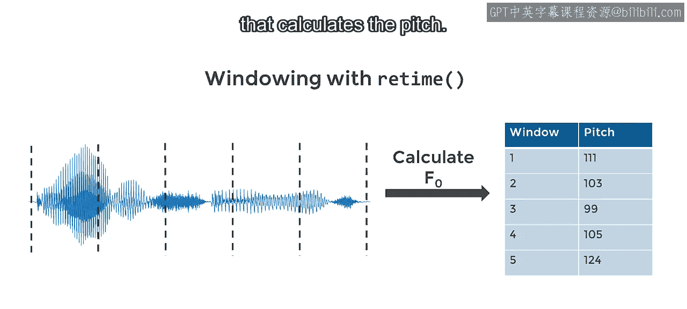

不错。看起来这个片段的音高大约为94赫兹。这个值低于从女性语音样本中测得的值，但男性声音总是更低吗？要得到答案，你需要从录音的不同部分获取更多样本。

## 使用窗口化处理整个录音

手动操作会非常繁琐。但你已经看到了使用 `retime` 函数的更简单方法。之前，你使用 `retime` 将信号分割成单独的窗口，然后为每个窗口应用汇总统计量。你可以应用一个计算音高的自定义函数，而不是汇总统计量。

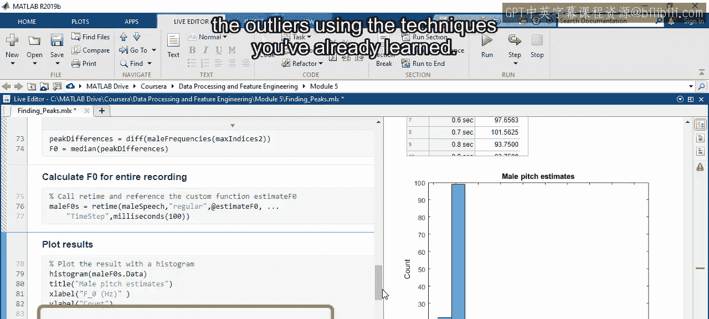

以下是一个使用实时任务自动生成代码的函数示例，其中包括适用于此数据的突出度和间隔值。要查看该函数的详细信息，请查看随本视频附带的实时脚本。

让我们使用 `retime` 将此函数应用于整个男性录音，窗口长度为100毫秒。输出是另一个时间表，但现在它包含了每个窗口的音高估计值。直方图显示大多数值低于200赫兹，但肯定存在更高频率的异常值。这些可能来自峰值检测遗漏了某些谐波的窗口。可能值得回头调整峰值查找参数，但你也可以使用已经学过的技术来移除异常值。

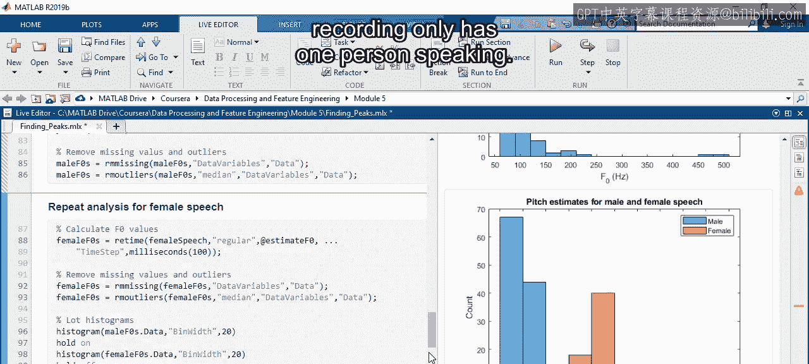

## 比较结果与评估特征

最后，你可以对女性语音录音重复此分析并比较结果。直方图显示女性的基础频率值往往高于男性，但分布存在一些重叠。还值得注意的是，每个录音只有一个人说话，因此这些分布可能会随着更多数据而改变。

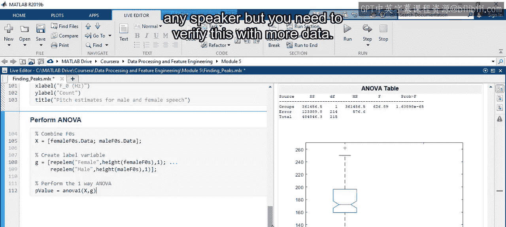

尽管如此，分布之间确实存在差异，这可以通过单因素方差分析来量化。要计算P值，你需要将两组基础频率值合并到一个数组中，并创建一个标签变量来指定数据是来自男性还是女性说话者。方差分析表中报告的P值非常小，意味着它具有高度显著性。因此，这种音高测量是区分这些说话者的有用特征。它可能对识别任何说话者的性别有用，但你需要用更多数据来验证这一点。

## 总结

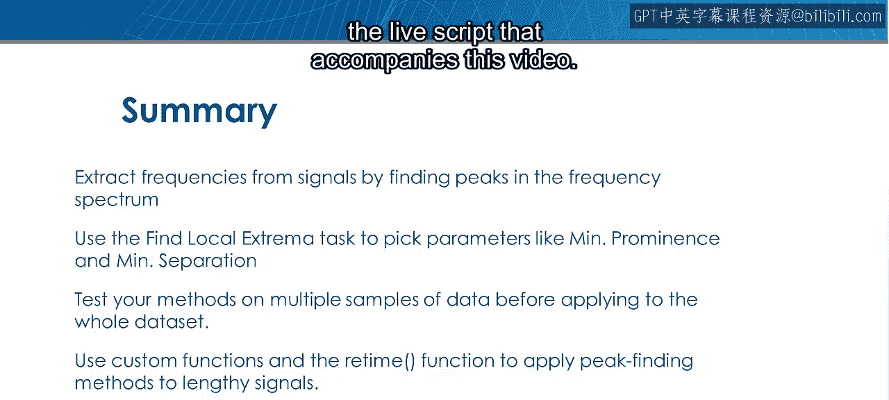

本节课中我们一起学习了如何通过寻找频谱中的峰值从信号中提取频率。“查找局部极值”任务是通过选择最小突出度和间隔等参数来寻找峰值的有用方法。在将方法应用于整个数据集之前，不要忘记在多个数据样本上测试你的方法。最后，在 `retime` 函数中使用实时任务的自动生成代码，将窗口化过程应用于整个信号。