# 39：使用MATLAB Mobile记录传感器数据 📱

在本节课中，我们将学习如何使用MATLAB Mobile应用程序来记录移动设备中的传感器数据，并将这些数据导入到MATLAB中进行初步分析。我们将以记录加速度计数据并计算步数为例，演示完整的工作流程。

许多健身追踪应用程序利用移动设备中的传感器来监测您的运动。通过MATLAB Mobile，您可以访问设备中的加速度计、陀螺仪、磁力计和GPS数据。在本视频中，您将学习使用MATLAB Mobile记录加速度计数据，并在实时脚本中与数据进行交互。

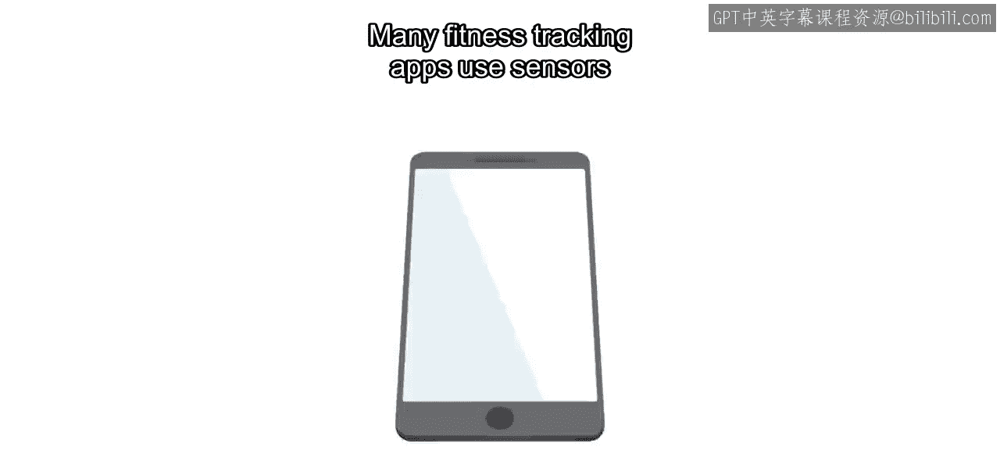

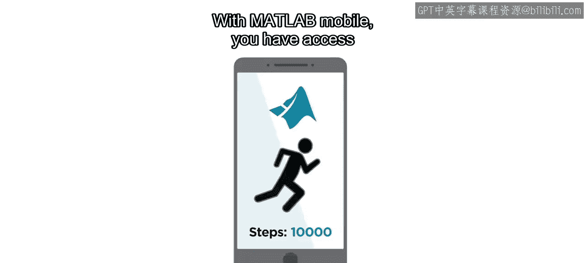

## 第一步：设置与记录数据

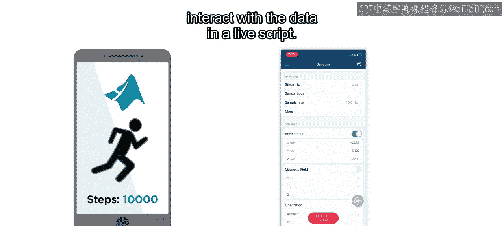

上一节我们介绍了课程目标，本节中我们来看看如何开始记录数据。

首先，您需要从设备的应用商店下载MATLAB Mobile应用程序，并使用您的MathWorks账户登录。

打开MATLAB Mobile后，您首先看到的是MATLAB命令行界面。您可以在此输入与桌面版MATLAB相同的命令。

要为数据记录设置您的设备，请首先导航至传感器菜单。确保开启传感器访问权限，并设置存储数据的文件夹名称。然后选择加速度传感器，并将“流”选项设置为“记录”。准备就绪后，按下“开始”按钮。当您四处移动时，MATLAB Mobile将记录加速度数据。完成记录后，按下“停止”按钮，命名您的数据文件并点击“保存”。

现在，您已使用MATLAB Mobile记录了传感器数据并将其存储在设备上。但如何开始在计算机上处理这些数据呢？

## 第二步：访问与加载数据

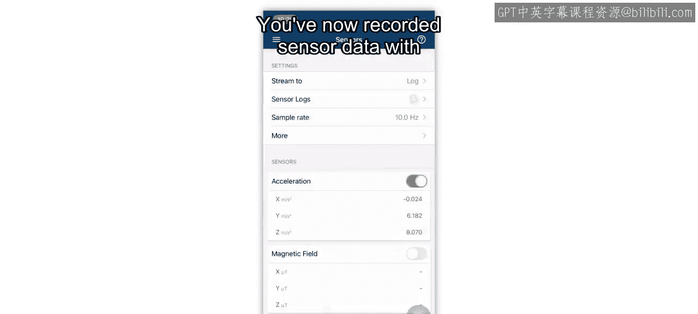

上一节我们完成了数据记录，本节中我们来看看如何获取并加载这些数据。

MATLAB Mobile会自动将所有文件与MATLAB Drive同步。MATLAB Drive是一项基于云的服务，用于在不同设备间共享文件。


在您的计算机上导航至MATLAB Drive以访问此文件。传感器日志将位于您之前命名的文件夹中。

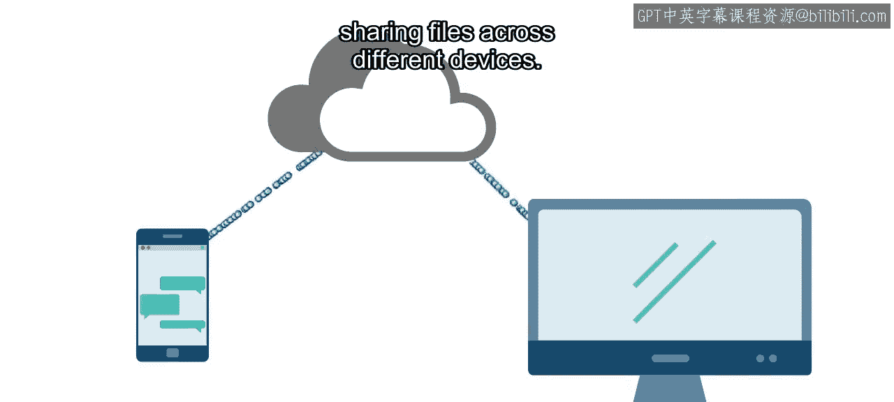

然后，使用 `load` 命令将数据加载到MATLAB工作区。

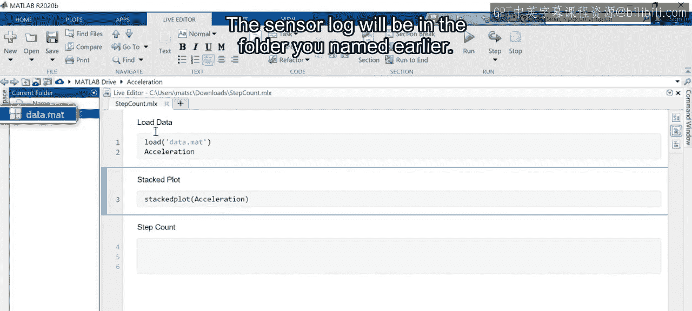

```matlab
% 示例：加载名为 ‘sensorLog.mat’ 的数据文件
load(‘sensorLog.mat’)
```

来自MATLAB Mobile的传感器数据存储在**时间表**中。时间表是一种表格类型，其每一行都关联有一个时间戳。

## 第三步：可视化与分析数据

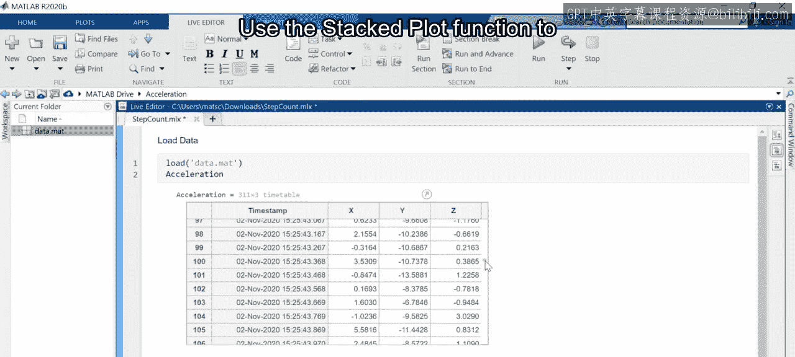

上一节我们成功加载了数据，本节中我们来看看如何可视化数据并进行分析。

使用 `stackedplot` 函数来可视化时间表中的三个信号，它们分别对应设备三个轴向上的加速度。

```matlab
% 示例：绘制时间表 ‘accelData’ 的堆叠图
stackedplot(accelData)
```

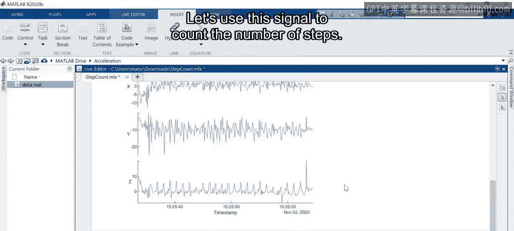

仔细观察此数据集，您会注意到Z轴信号上有等间距的峰值。这些峰值对应行走时的每一步。让我们利用这个信号来计算步数。

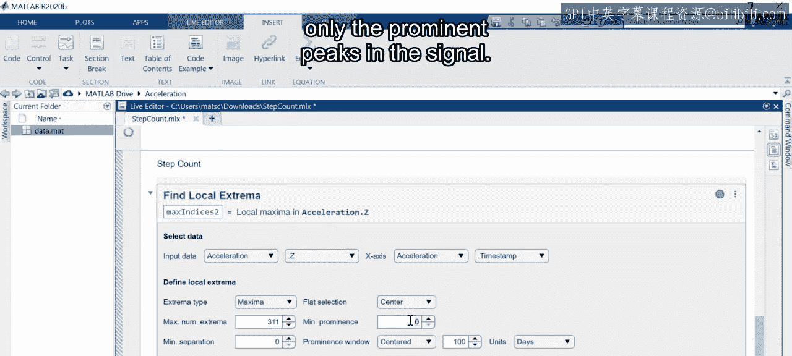

## 第四步：使用实时任务计算步数

上一节我们识别了数据特征，本节中我们使用一个便捷的工具来精确计算步数。

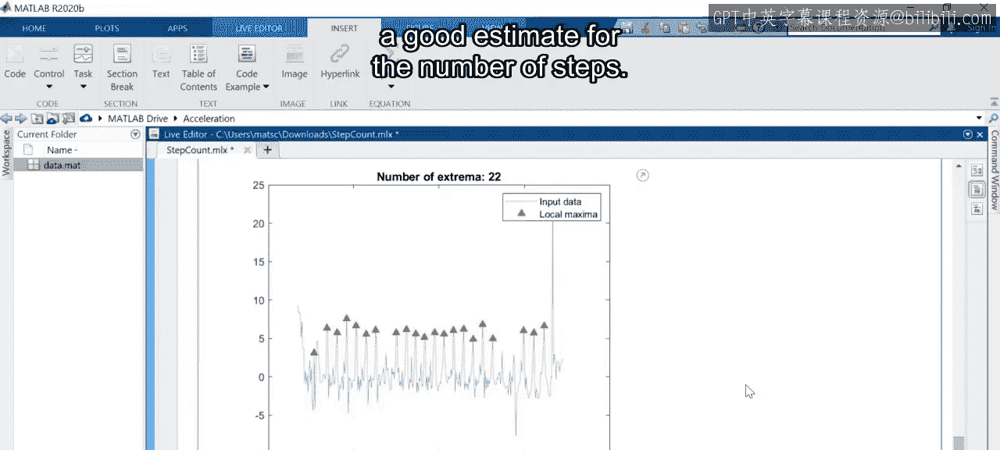

将“查找局部极值”实时任务插入到您的实时脚本中。选择Z轴信号，并设置仅识别信号中显著峰值的参数。

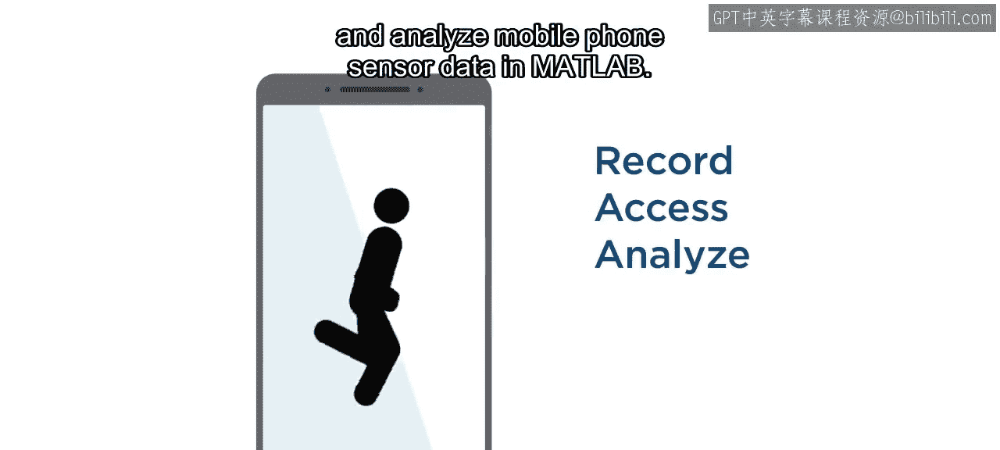

生成的图表显示了信号及检测到的峰值。峰值总数是步数的一个良好估计。

## 总结

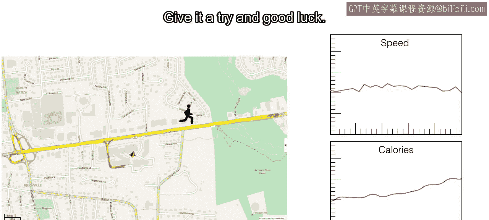

本节课中我们一起学习了如何在MATLAB中记录、访问和分析手机传感器数据。您使用加速度计计算了行走时的步数。但这仅仅是您所能实现功能的开始。您能否利用GPS数据计算移动速度，或者估算消耗的卡路里？请尝试一下，祝您好运。