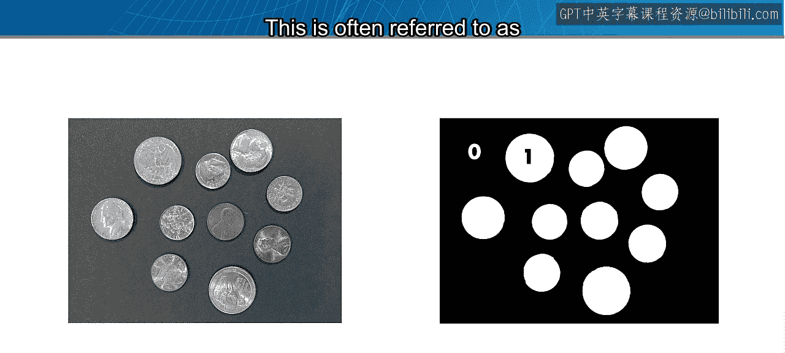
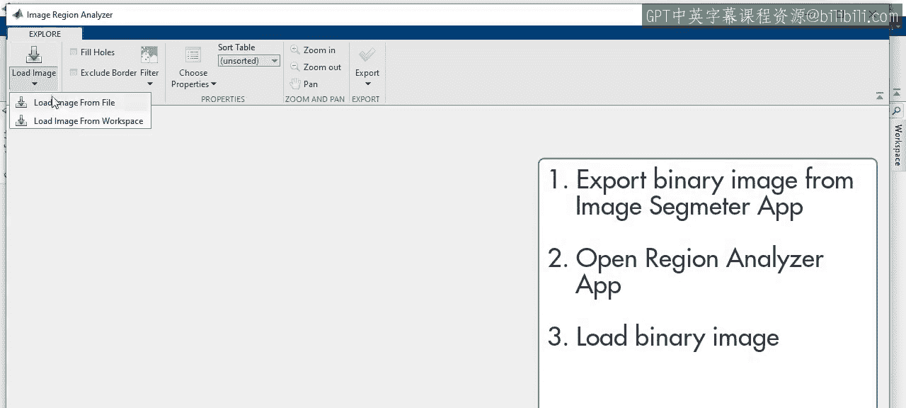
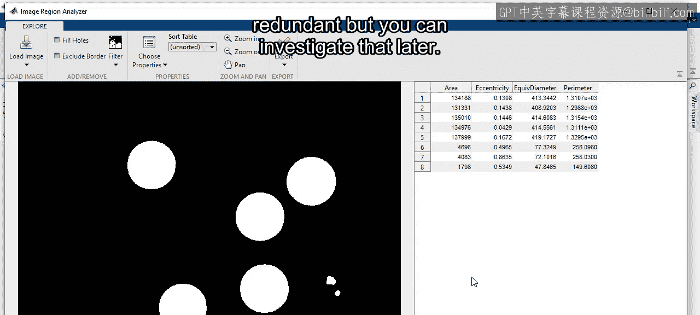
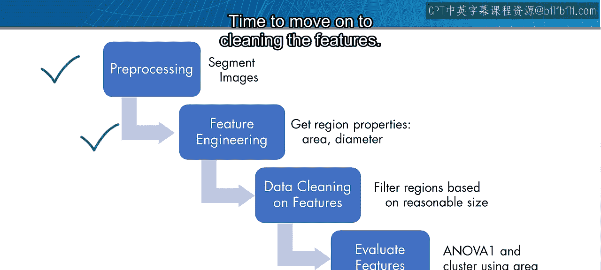
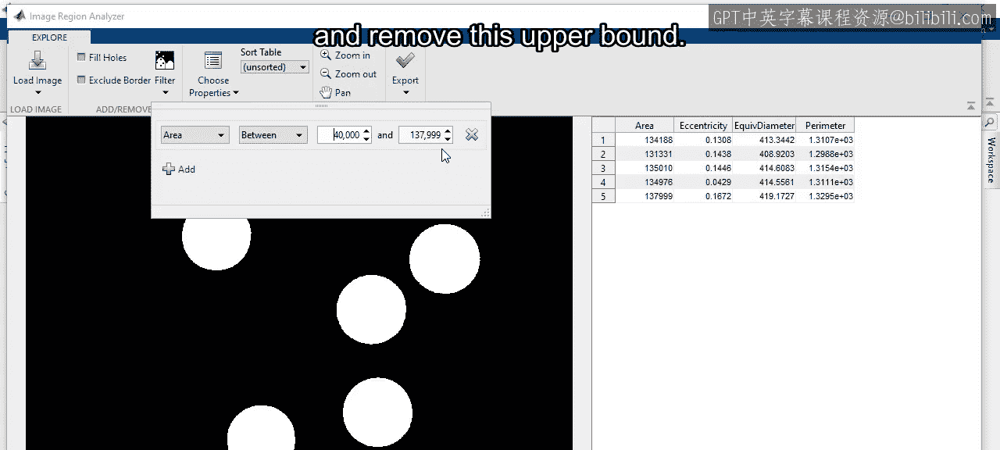
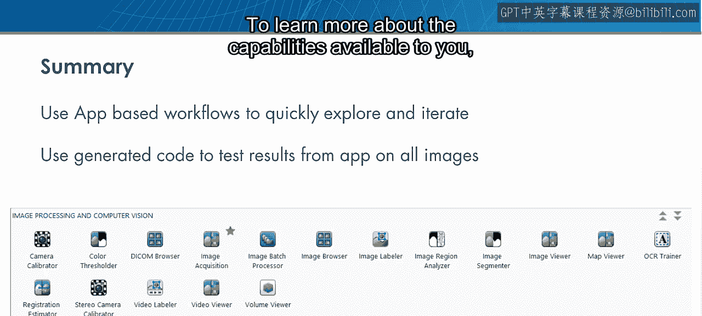
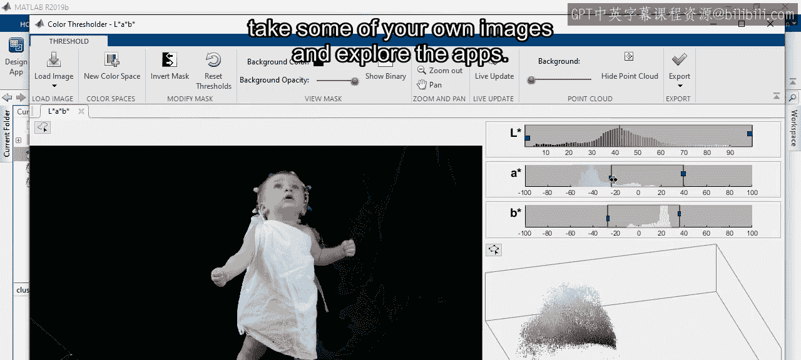

# 40：图像特征工程与聚类

在本节课中，我们将学习如何对图像进行特征工程，以识别和分类不同的硬币。我们将遵循一个完整的工作流程：图像预处理、特征生成、特征清洗，最后应用聚类算法来验证特征的有效性。

---

你的视觉系统在无意识中持续进行着特征工程。边缘、形状、颜色、图案和光照，都是大脑用来识别物体、帮助你导航环境的众多特征中的一部分。

以这张图片为例，你可能立刻就知道这是不同硬币的图像，即使你不熟悉这些硬币的类型。这是因为你的大脑擅长识别物体。

你看到了多少种不同类型的硬币？你可能首先使用大小来开始对它们进行分组，同时结合独特的图案和边缘。但是，你如何教会计算机识别这些硬币呢？

在接下来的内容中，你将看到一个执行特征工程以识别图像中不同硬币的示例。

---

### 图像预处理与分割

上一节我们介绍了特征工程的概念，本节中我们来看看如何为硬币图像准备数据。我们的第一步是将图像分割，将灰度图像转换为二值图像，其中硬币像素为1，背景像素为0。

首先，在MATLAB中导航到模块5的文件夹，那里存放着硬币的灰度图像。我们将使用“图像分割器”应用程序。

打开应用程序后，加载一张具有代表性的图像。应用程序会提示调整图像对比度，这通常是个好主意，因为它能确保像素值使用全部可用范围，有助于后续基于阈值的分割。

图像显示后，我们可以在“创建蒙版”部分开始操作。蒙版指定了二值图像中哪些像素将变为1。我们首先尝试“阈值”选项。

预览显示，全局阈值分割效果不佳，图像左上角有许多不应被视为前景的像素被识别出来，这是由于光照不均匀造成的。

使用“自适应阈值”可以帮助补偿不均匀的光照。现在，蒙版看起来更均匀了。我们还可以调整阈值的灵敏度。目标是使硬币区域为纯白色，背景为纯黑色，但这通常无法一步完成。

点击“创建蒙版”应用更改。此时，“创建蒙版”选项变为非活动状态，但“优化蒙版”选项被激活。硬币的边界被很好地捕捉，但内部区域是空的。

在“优化蒙版”下，选择“填充孔洞”以捕捉每个硬币的整个区域。很好，硬币区域被完整捕捉，但背景中仍有许多噪声点。

返回“优化蒙版”，选择“清除边界”。虽然这张图片没有硬币接触边界，但其他图片可能有，接触边界的硬币面积会偏小，因此清除它们。

接下来，使用形态学操作清理背景。形态学是一组利用形状来减少、扩展、填充和开启蒙版的图像处理操作。在左上角的下拉菜单中选择“开启蒙版”操作，该操作会移除小于结构元素的前景物体，这正是我们需要的。

可以更改结构元素的形状和大小。增加大小可以移除更大的前景物体。调整到合适大小后应用操作。这个分割效果相当好。

如果想尝试不同方法而不丢失当前工作，只需点击“新建分割”即可。这将在原始图像上开始第二次分割，第一次分割及其历史记录仍然保留。你可以尝试多种方法并选择最佳的一个。

当然，这只是处理了一张图像。我们需要将相同的步骤应用到所有图像上。我们将分两步进行：生成一个函数来重复分割过程，然后使用“图像批处理器”应用程序来分割所有图像并检查结果。

在“导出”下，选择“生成函数”。生成的代码包含了应用程序中执行的每个步骤的注释和相应代码。保存此函数。

然后，从应用程序选项卡打开“图像批处理器”应用程序。加载所有图像，并指定我们刚刚保存的函数来处理所有图像。处理完成后，应用程序会同时显示原始图像和处理后的图像，方便我们检查分割结果是否理想。

这个过程可能需要多次迭代。当发现某张图像分割效果不佳时，只需返回“图像分割器”应用程序尝试不同的方法，然后使用新生成的函数通过“图像批处理器”重新处理所有图像。

回顾我们的整体工作流程，预处理步骤现已完成。通常，处理新数据时，预处理是最耗时的步骤之一。

---

### 生成图像特征

上一节我们完成了图像分割，本节中我们将从分割后的图像中生成特征。为了获取分割图像中各个区域的属性（如面积），我们将使用“图像区域分析器”应用程序。

首先，将二值图像导出到工作空间，然后打开“图像区域分析器”应用程序。

应用程序会计算图像中每个连通区域的各种属性。我们将选择要保留的特征。硬币是圆形的，因此我们保留以下特征：
*   **面积**
*   **偏心率**
*   **等效直径**
*   **周长**

其中一些特征可能是冗余的，但这可以在后续进行分析。

至此，特征生成步骤完成。接下来是清洗特征。

---

### 清洗特征

图像中仍然包含非硬币区域，需要将其移除。“图像区域分析器”应用程序允许我们根据区域的属性来过滤图像。

观察发现，实际硬币的最小面积约为130,000像素，而我们想要移除的区域面积约为5,000像素。因此，我们设置一个最小面积过滤器，例如40,000像素。

这样，小区域就被移除了，我们得到了该图像中硬币区域的特征表。

请注意，应用程序将最大面积设置为图像中的最大面积。这里我们不想要上限，否则任何更大的硬币都会被过滤掉。因此，我们需要查看生成的代码并移除这个上限。

在“导出”下，选择“导出函数”。在生成的代码中，我们看到执行应用程序中步骤的两行代码：过滤和区域属性计算。

通过将上限值改为 `inf` 来移除过滤操作中的上限。同时，注释提示我们可以通过取消注释一行代码来将变量 `properties` 作为表格返回，我们照做。然后保存新函数。

现在，我们准备看看是否可以使用面积作为特征来对不同的硬币进行分组。

---

### 应用特征与聚类评估

为了使用面积特征对硬币进行分组，我们需要将之前在应用程序中创建的图像分割和区域过滤函数应用到所有图像上。然后，我们将对观测值进行聚类，并将聚类结果与已知的硬币标签进行比较。

有一个提供的实时脚本可以完成此分析。我们在此快速浏览，你可以更详细地研究它。

第一步是创建一个图像数据存储。注意，它使用文件夹名称作为图像的标签。这就是我们将聚类结果与已知硬币进行比较的方式。要在你的计算机上运行此脚本，需要更新图像的位置。

在 `while` 循环内部，获取每张图像的特征并添加到一个名为 `properties` 的表格中。每次循环迭代，从数据存储加载一张图像，应用刚刚创建的两个函数来计算当前图像的区域属性。代码获取图像的标签，为图像中找到的每个硬币重复该标签，然后将其添加到表格中。循环结束时，将当前图像的结果添加到总表中。

很好，我们现在有了一个包含89个观测值及其特征的表格。

那么，如何确定面积是否是一个有用的特征呢？之前你看到了几种评估特征的方法。由于响应变量“类型”是分类变量，可以使用 `anova1` 函数来检验面积作为特征的有效性。

得到的P值几乎为零，表明硬币类型依赖于面积。此外，带凹口的箱线图显示，尽管一角硬币和一美分硬币的面积接近，但它们在统计上是显著不同的。

完成此分析后，假设你不知道有四种硬币，但想尝试基于面积对数据进行分组，即使用你的特征对数据进行聚类。

第一步可能是使用 `evalclusters` 函数找到最佳聚类数量。这里我们使用K均值算法，测试K值从2到6的聚类效果。

很好，最佳K值（聚类数量）是4，这正是我们对此数据集的期望。接下来，将面积数据传递给 `kmeans` 函数并指定4个聚类。这将返回每个观测值被分配的簇，我们将其添加到表格中。

浏览表格，我们看到每种类型的硬币只与一个单独的簇相关联。无需对任何图像进行标记，你就能得出正确的结论：存在四种类型的硬币。

---

### 总结与拓展

本节课中，我们一起学习了如何利用MATLAB的应用程序（App）工作流对图像进行特征工程。我们从图像预处理和分割开始，生成了描述硬币形状的特征，清洗了无关数据，最后使用聚类算法验证了“面积”这一特征能有效区分不同类型的硬币。

一个基于应用程序的类似工作流可以应用于许多场景。例如，有基于颜色的分割应用程序和图像配准应用程序。这些应用程序大多会生成代码，使你能够快速在单张图像上探索技术，然后在更大的数据集上测试整个工作流程。

要了解更多可用功能，请尝试使用你自己的图像来探索这些应用程序。你可能会因此发现一个新的爱好。