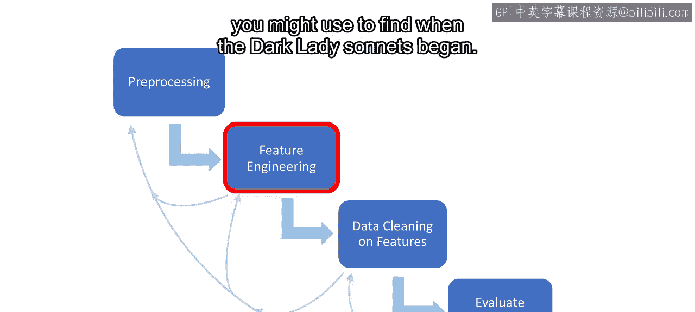
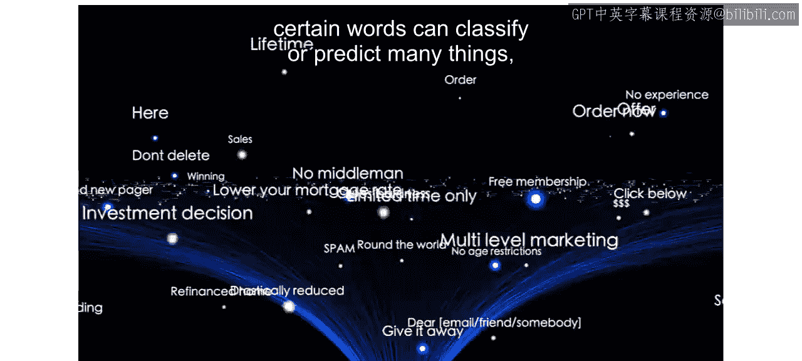
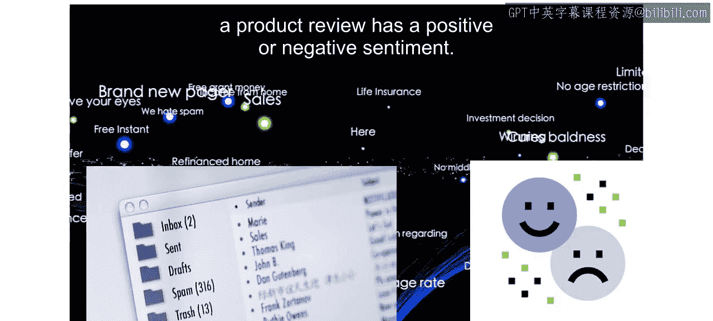
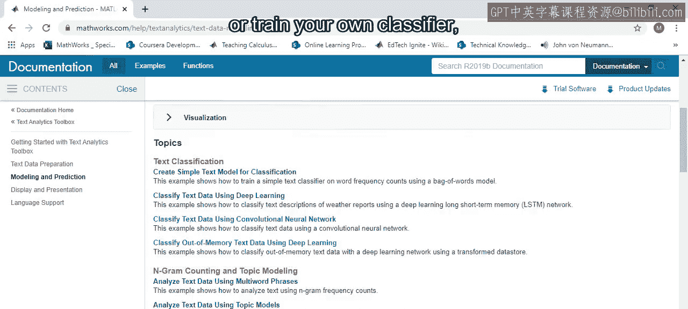

# 41：文本特征工程 📝

在本节课中，我们将学习如何处理和分析文本数据。你将了解如何从常见文档格式中提取文本，如何在MATLAB中预处理和清理文本，以及如何从文本中提取有意义的特征，例如词频和情感倾向。我们将以莎士比亚的十四行诗为例，演示如何通过数据分析发现其主题的转变。

---

## 导入与提取文本

上一节我们介绍了数值和分类数据的处理。本节中，我们来看看如何处理文本数据。

许多有价值的信息都隐藏在文本中。处理文本数据需要类似的步骤：提取、预处理和特征工程。MATLAB提供了多种方法来从不同来源提取文本。

以下是常见的文本提取方法：
*   从纯文本文件、Microsoft Word文档、PDF和HTML中提取文本，可以使用 `extractFileText` 函数。
*   对于文本、CSV或Excel文件，可以像之前一样使用导入工具。
*   要从网页直接读取，可以结合使用 `webread` 和 `extractHTMLText` 函数。

让我们以莎士比亚的十四行诗为例。首先，我们需要将文本导入MATLAB。

```matlab
% 从文本文件提取全部内容
fullText = extractFileText('sonnets.txt');
```

---

## 预处理与清理文本

现在我们已经有了原始文本，但为了分析，需要将其分割成独立的十四行诗。

观察文本结构，发现每首诗之间有两个空行。我们可以利用这个模式进行分割。

```matlab
% 按两个连续的换行符分割文本
sonnets = split(fullText, newline + newline);
```

分割后，会得到一些标题和空字符串。通过计算每个部分的长度并可视化，可以识别出哪些是过短的无效字符串。

```matlab
% 计算每个字符串的长度
strLengths = strlength(sonnets);
% 可视化长度分布
histogram(strLengths);
```

由于一首标准的十四行诗有14行，每行约10个音节，长度过短（例如少于25个字符）的字符串很可能是标题或空行，可以将其移除。

```matlab
% 移除过短的字符串（例如长度小于25）
sonnets = sonnets(strLengths > 25);
```

现在，每首十四行诗都作为一个独立的字符串存储在变量中，便于后续分析。

---

## 文本分析与特征提取



接下来，我们开始分析文本，并思考如何提取特征来发现“暗黑夫人”系列十四行诗的开始。

特定词语的出现和频率可以用于分类或预测，例如判断邮件是否为垃圾邮件，或产品评论的情感是积极还是消极。





让我们用这种方式来研究十四行诗。首先，使用 `tokenizedDocument` 函数将每个字符串转换为文档及其独特的组成部分（即词元，通常是单词和标点）。

```matlab
% 将字符串数组转换为分词文档
documents = tokenizedDocument(sonnets);
```

我们可以使用词云来可视化最常见的词元及其相对频率。

```matlab
% 创建词云
figure
wordcloud(documents);
```

词云显示，最常见的词元是逗号，还有其他标点、因大小写差异而重复的单词，以及诸如“the”、“and”、“but”之类的停用词。这些元素对句子结构很重要，但本身缺乏独立含义，可能会干扰分析。

可以使用以下函数移除这类“词汇噪声”：
*   `removePunctuation`：移除标点。
*   `lower`：将所有字母转换为小写。
*   `removeStopWords`：移除常见停用词。

```matlab
% 清理文档：移除标点、转为小写、移除停用词
cleanedDocs = erasePunctuation(documents);
cleanedDocs = lower(cleanedDocs);
cleanedDocs = removeStopWords(cleanedDocs);
% 查看被移除的停用词列表
stopWordsList = stopWords;
```

词云现在包含了更有意义的词，但可能仍包含一些莎士比亚时代特有的“停用词”，如“thou”、“thee”、“thy”。我们可以使用 `removeWords` 函数移除自定义词集。

```matlab
% 移除自定义的词汇
customStopWords = ["thou", "thee", "thy", "thine"];
cleanedDocs = removeWords(cleanedDocs, customStopWords);
% 再次生成词云
figure
wordcloud(cleanedDocs);
```

不出所料，最常出现的有意义的词是“love”。

词云能快速可视化文本中的常见元素。但要进行更深入的分析并利用词频等特征，需要将文本量化。这时 `bagOfWords` 函数就非常有用。它会根据文档列表创建一个计数矩阵。

```matlab
% 创建词袋模型
bag = bagOfWords(cleanedDocs);
% 可视化矩阵结构（非零条目）
figure
spy(bag);
```

在这个矩阵中，每一行代表一个分词后的文档，每一列代表所有文档中出现的一个独特单词，每个值是该单词在文档中出现的次数。

我们可以对列求和，以查看每个独特单词在所有文档中出现的总次数。

```matlab
% 计算每个单词的总出现次数
wordCounts = sum(bag.Counts, 1);
% 使用 topkwords 获取出现频率最高的单词
T = topkwords(bag, 20);
```

或者，可以提取特定单词（如“love”）的列，查看它在哪些文档中出现以及频率如何。

```matlab
% 获取“love”一词的出现情况
loveIdx = (bag.Vocabulary == "love");
loveCounts = bag.Counts(:, loveIdx);
```

此外，还可以使用 `context` 函数进一步分析单词出现的上下文。

---

## 应用分析：发现主题转变

为了尝试找到从“俊美青年”系列到“暗黑夫人”系列的转变，让我们观察“love”（爱）与“hate”（恨）这两个词在全部十四行诗中出现频率的变化。

为了捕捉与这些词相关的情感或主题，需要考虑它们的各种形式，如“loved”、“loves”或“hated”。可以使用 `normalizeWords` 函数将单词还原为其词根形式。

```matlab
% 对文档进行词形还原（归一化）
normalizedDocs = normalizeWords(cleanedDocs, 'Style', 'lemma');
% 基于归一化文档创建新的词袋
normBag = bagOfWords(normalizedDocs);
```

现在，让我们查看“love”和“hate”词根在所有诗篇中的分布。

```matlab
% 获取归一化后‘love’和‘hate’的出现次数
loveCountsNorm = normBag.Counts(:, (normBag.Vocabulary == "love"));
hateCountsNorm = normBag.Counts(:, (normBag.Vocabulary == "hate"));
% 绘制条形图
figure
subplot(2,1,1)
bar(loveCountsNorm)
title('Occurrences of "love" (normalized) per Sonnet')
subplot(2,1,2)
bar(hateCountsNorm)
title('Occurrences of "hate" (normalized) per Sonnet')
```

仅从条形图很难得出结论。之前我们学过如何使用汇总统计量来提取时间序列数据的特征。让我们计算每个词出现次数的归一化移动平均值。

```matlab
% 定义移动平均窗口大小
windowSize = 10;
% 计算移动平均值
loveMA = movmean(loveCountsNorm, windowSize);
hateMA = movmean(hateCountsNorm, windowSize);
% 绘制移动平均曲线
figure
plot(loveMA, 'b-', 'LineWidth', 2)
hold on
plot(hateMA, 'r-', 'LineWidth', 2)
xlabel('Sonnet Number')
ylabel('Normalized Moving Average Count')
legend('Love', 'Hate')
title('Thematic Shift in Shakespeare Sonnets')
grid on
hold off
```

有趣的是，虽然“love”的出现频率上下波动，但“love”和“hate”在后期诗篇（大约从第127首之后开始）的出现频率都出现了非常明显的同步上升。请记住，“俊美青年”系列结束于第127首，而“暗黑夫人”系列开始于第128首。看来我们成功地利用数据科学发现了这一主题转变。

---

## 总结

本节课中，我们一起学习了文本数据常见的提取、预处理和特征工程任务。我们以莎士比亚十四行诗为例，演示了如何从原始文本开始，经过清理和分词，创建词袋模型，并最终通过分析关键词的频率变化来揭示文本中的主题转变。



然而，MATLAB中关于文本分析的功能远不止于此。你可以探索文档，了解如何使用词序列进行类似的分析和特征提取，执行完整的情感分析，训练自己的分类器，创建主题模型等等。