# 42：风暴事件特征工程 🌀

在本节课中，我们将学习如何对风暴事件描述文本进行特征工程。我们将预处理数据，从冰雹事件描述中提取并处理冰雹尺寸信息，以创建能够预测损失成本的特征，并使用可视化和统计测试来评估这些特征的预测能力。

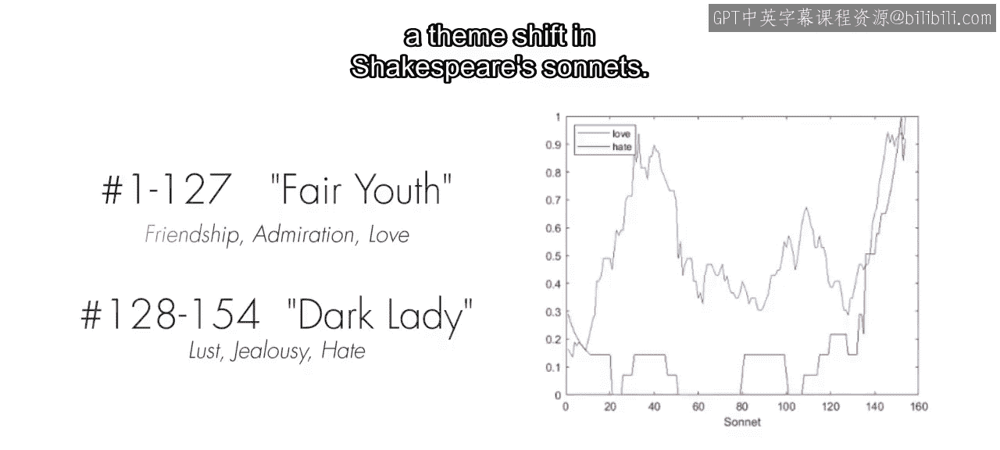

## 数据加载与初步预处理

上一节我们介绍了文本特征工程的核心技术。本节中，我们来看看如何将其应用于一个更复杂的真实数据集——风暴事件数据。

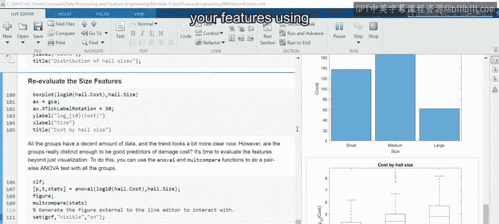

首先，使用 `StM Data importm` 函数加载一年的风暴事件数据。你也可以自行导入更多年份的数据进行深入探索。

接下来，对数据进行预处理：
*   将所有缺失的成本值替换为零。
*   将财产损失和作物损失合并为一项总损失。
*   提取描述字段非空的冰雹事件。

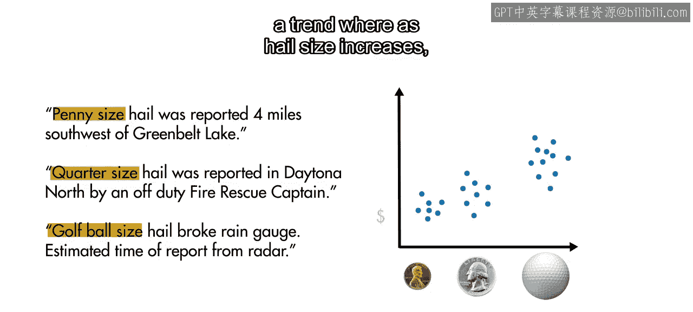

请注意，像“quarter sized”这样的短语有时带连字符，有时是分开的单词。为了保持一致性，将所有连字符替换为空格，以便单独评估每个单词。通常，初始预处理步骤因情况而异，因此务必先检查数据，以确定需要做哪些调整。

## 文本数据标准化处理

现在，就像在莎士比亚十四行诗的例子中一样，我们对文档进行分词、移除标点符号和停用词、添加词性标签、将所有单词转换为小写并还原为其词根形式。

**代码示例：文本预处理**
```matlab
% 假设 documents 是文本数据数组
documents = tokenizedDocument(documents);
documents = removePunctuation(documents);
documents = removeStopWords(documents);
documents = addPartOfSpeechDetails(documents);
documents = normalizeWords(documents, ‘Style‘, ‘lemma‘);
documents = lower(documents);
```

然后，用词云可视化处理结果。这些步骤是分析文本数据时常见的预处理工作流。

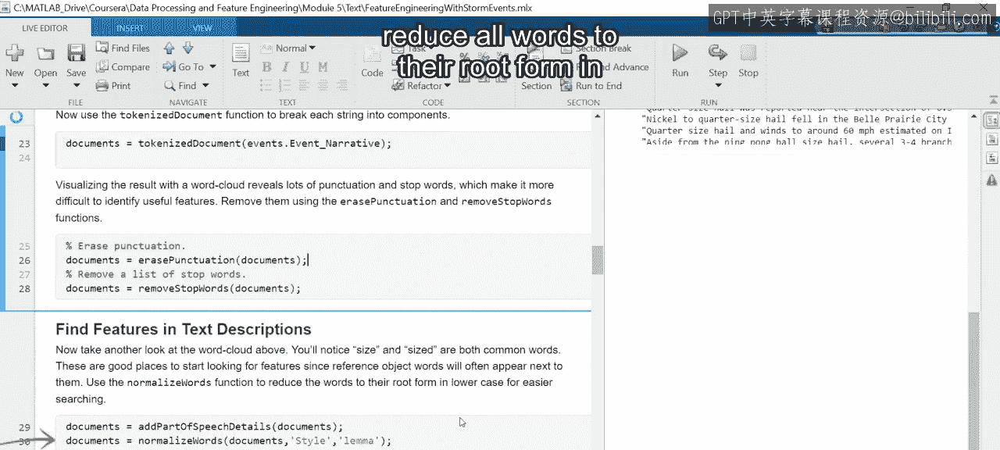

## 识别并提取冰雹尺寸描述

我们的目标是找到冰雹尺寸的描述。一个很好的起点是查找包含“size”一词的多词序列。

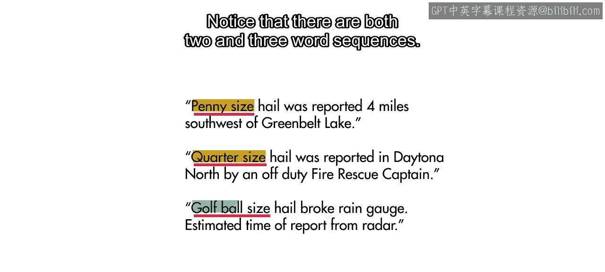

观察这些例子，你会发现其中包含两词和三词序列。

就像在莎士比亚例子中看到的 `bagOfWords` 函数一样，`bagOfNgrams` 函数用于查找包含“size”一词的多词序列。我们先检查紧邻“size”之前的单词。

正如我们之前探索数据时所预期的，像“ball size”这样的短语本身提供的信息有限。因此，让我们提取包含这些单词的三词序列（三元组）。

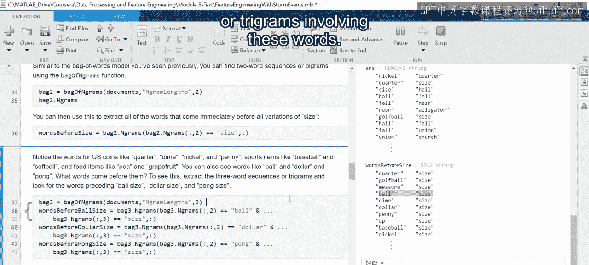

这样更有意义了，我们得到了“golf ball size”、“half dollar size”和“ping pong size”。这再次说明了理解数据的重要性，以便知道何时需要定制预处理步骤。

## 处理拼写错误与统一表达

处理文本数据时，一个常见且令人头疼的问题是拼写错误。使用 `replaceWords` 函数来纠正拼写错误。在本例中，“nickel”一词存在拼写错误。

此外，虽然不一定错误，但像“tennis ball”和“half dollar”这样的多词描述比单个单词更难查找。因此，让我们将这些多词短语替换为单个单词。

处理文本时，拼写错误、缩写和表达替换是预料之中的。因此，通常建议仔细检查数据，以便及早发现可能的问题。

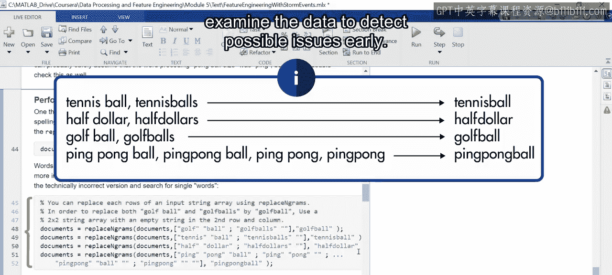

## 统一尺寸描述并排序

注意，这里使用的尺寸描述物品种类繁多，从美国硬币到体育用品再到食品。语言往往有多种方式表达同一概念，因此在处理文本数据时，留意冗余表达是一个好习惯。我们将在后续的实时脚本中处理这些冗余。

在本例中，为了观察尺寸与损失成本之间是否存在趋势，我们使用美国国家气象局提供的物体到尺寸的转换关系，将这些描述符按尺寸大小排序。

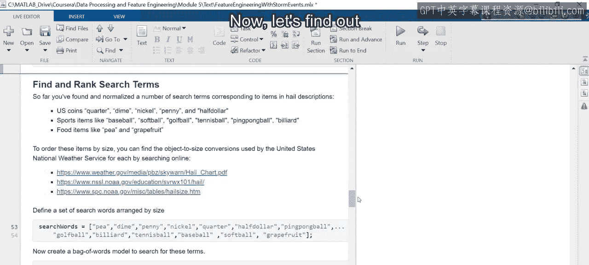

## 定位尺寸描述符并构建特征矩阵

现在，找出哪些事件描述包含了不同的尺寸描述符。首先，使用词袋模型来搜索每个描述符。

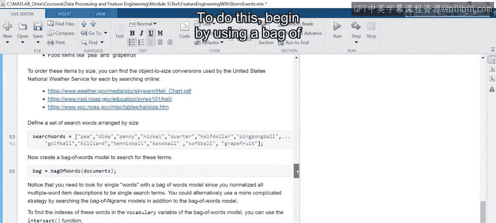

请注意，由于之前进行了多词替换，我们现在只查找单个术语。

接下来，使用 `Intersect` 函数找出尺寸描述符在词袋词汇表中的位置。将 `setOrder` 参数设为 `‘stable‘`，以确保结果的索引与描述符的尺寸排序相对应。

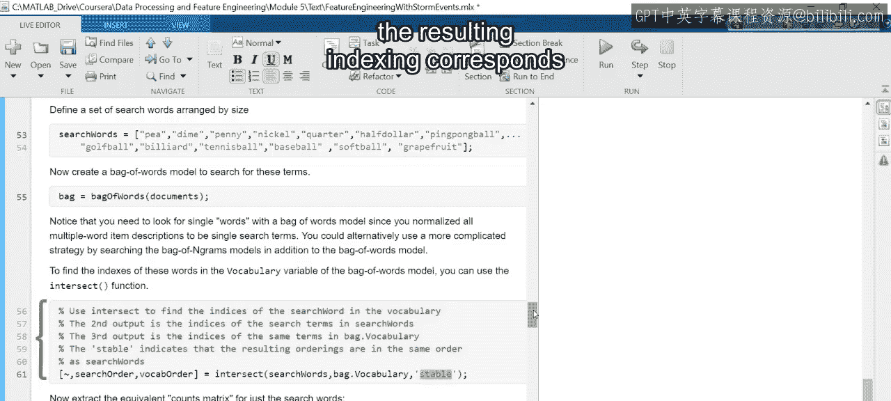

就像在莎士比亚的例子中一样，提取搜索词的计数矩阵，这样你就能确切知道哪些事件描述包含了哪些尺寸描述符。

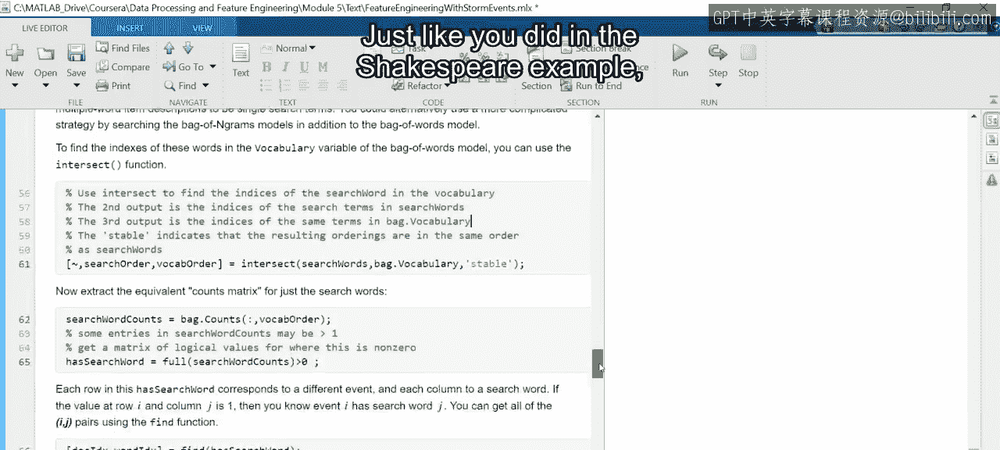

## 特征可视化评估

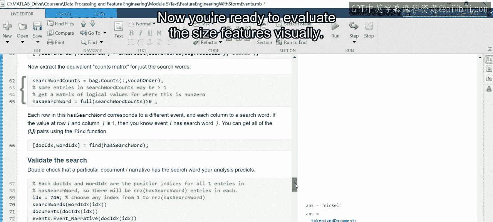

现在，可以开始对尺寸特征进行可视化评估了。

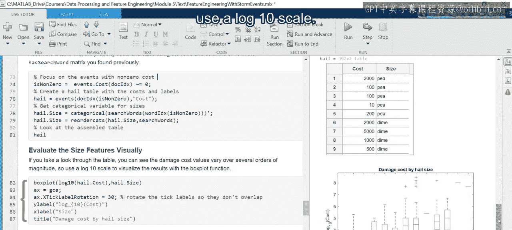

首先，组装一个包含不同事件损失成本和尺寸描述符的表格。你可以用箱线图来可视化这些数据。由于成本跨越了几个数量级，因此使用以10为底的对数刻度。

你可以看到一个清晰的趋势：随着尺寸增大，损失也在增加。但有些组只有少数几个数据点，而其他组的分布看起来非常相似。因此，将这些描述符分组为小、中、大类别将有助于简化分析。

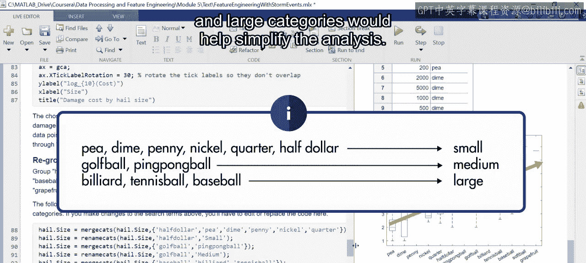

## 统计检验与特征优化

现在，可以通过在所有组内进行成对方差分析（ANOVA）测试来更严格地评估特征。

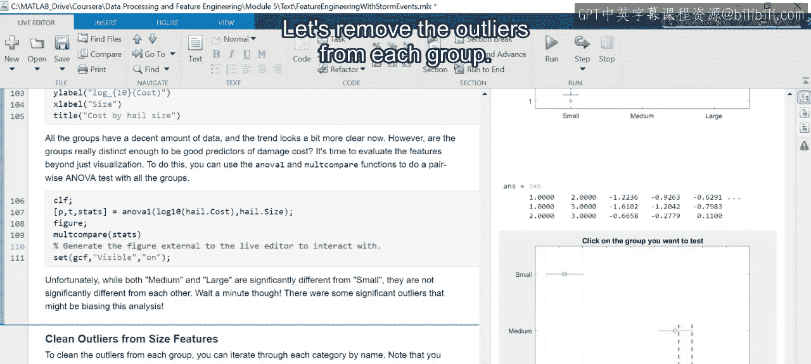

根据此分析，中等和大型类别与小型类别有显著差异，但彼此之间没有显著差异。但是，等等，可能存在异常值使分析产生偏差。

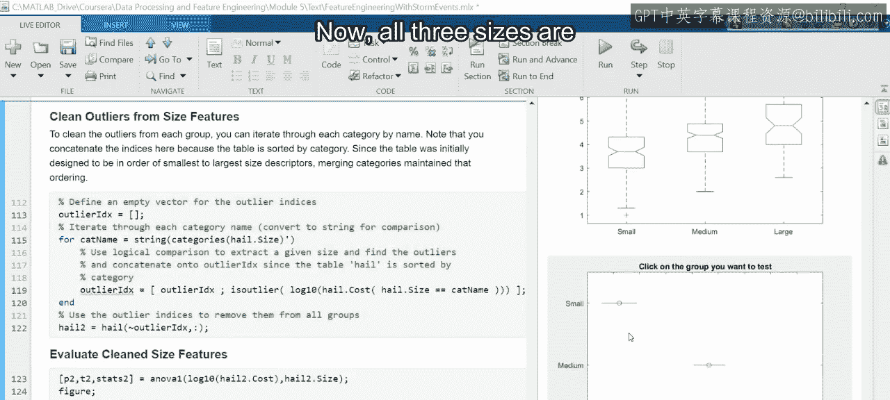

让我们从每组中移除异常值。

现在，所有三个尺寸类别都成为了损失成本的显著不同的预测因子。

## 课程总结

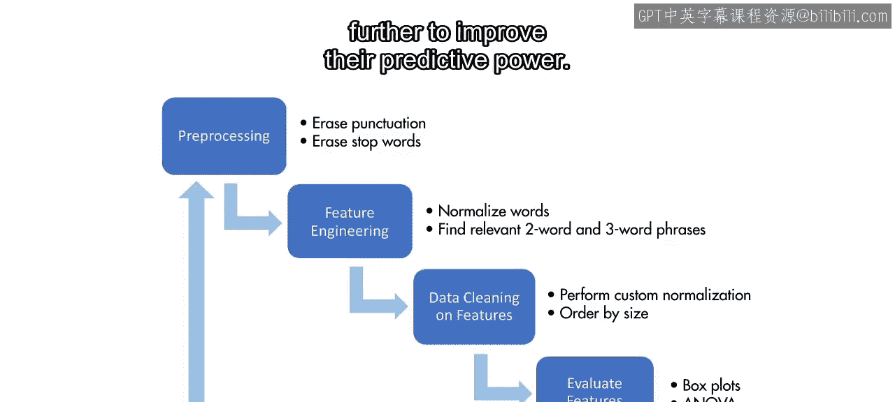

本节课中，我们一起学习了一个使用特征工程工作流来处理、探索、提取和评估新的、更复杂特征的例子。

我们对数据进行了预处理，以识别多词序列作为潜在的预测特征。然后，我们使用箱线图和方差分析测试等视觉和统计工具评估了这些特征，并进一步重组和清理了特征以提高其预测能力。

你可能已经对如何扩展本视频中的分析有了一些想法。例如，如何整合未使用参考物体提供的额外尺寸信息（例如“直径两英寸的冰雹”）？你可以使用这个脚本和可用的风暴数据来探索这种可能性以及更多其他方向。