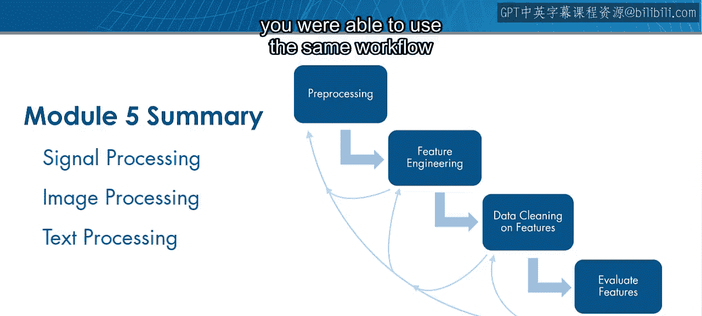
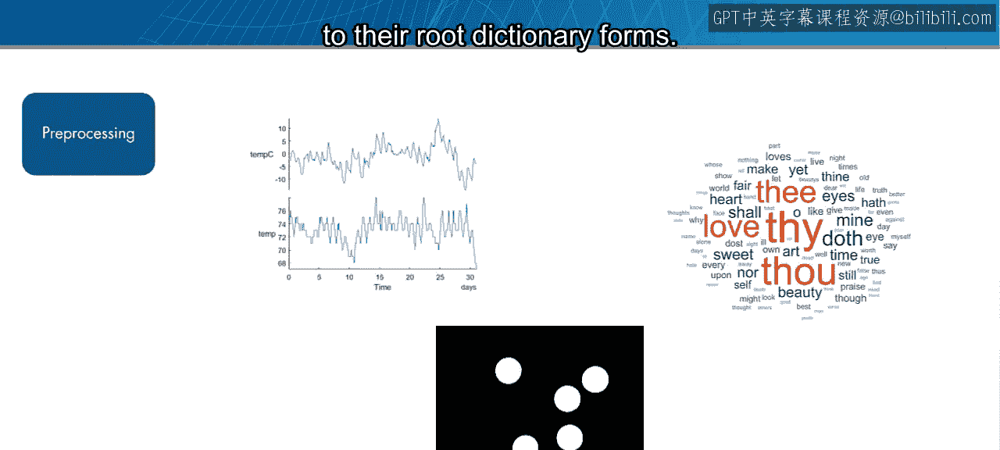
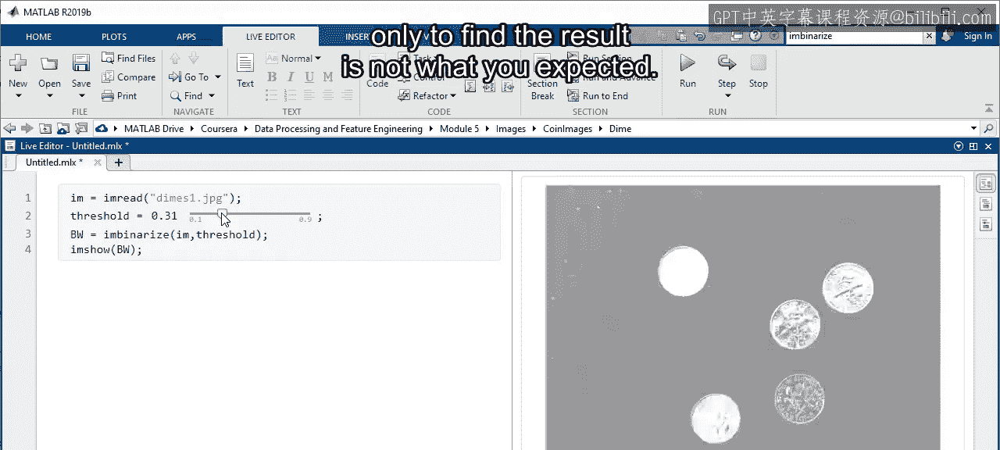
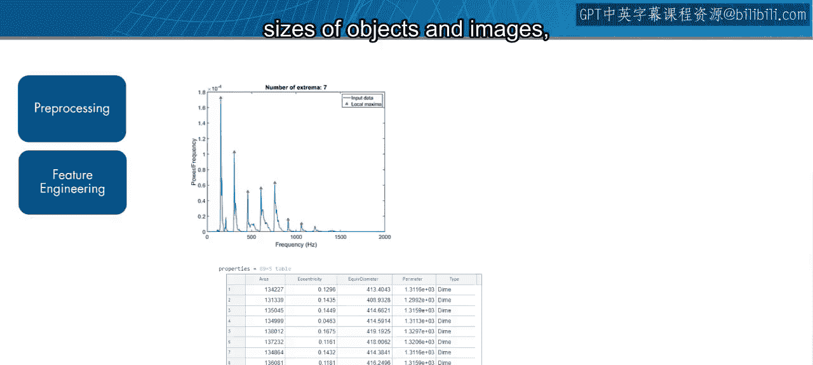
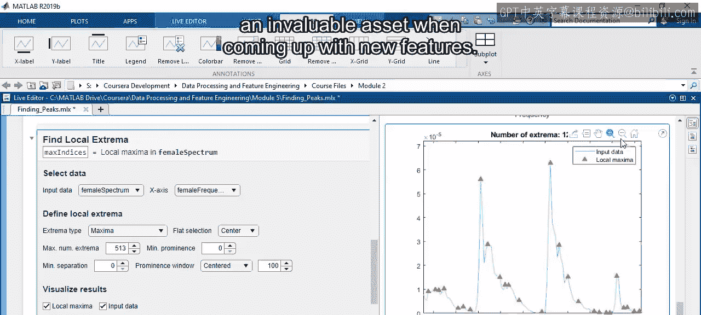
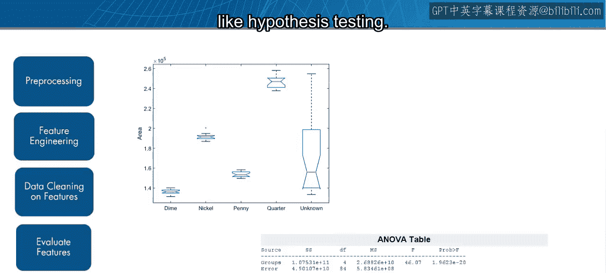
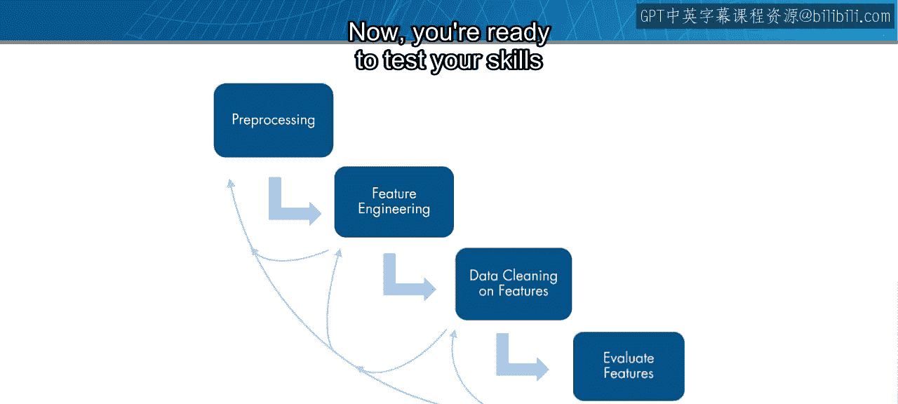
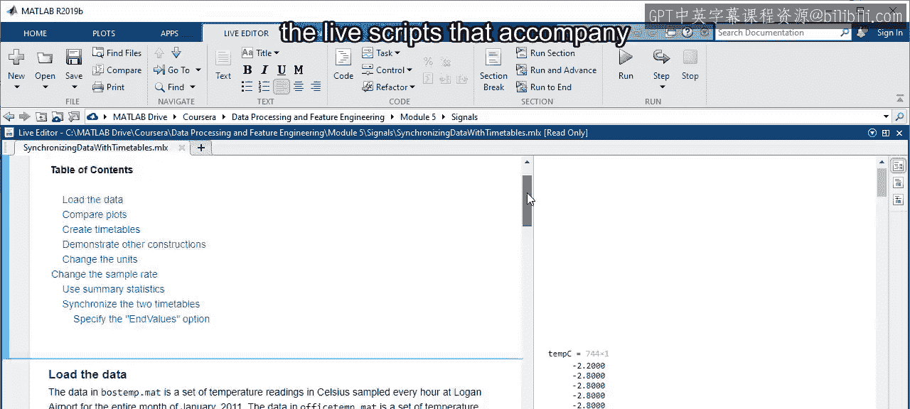

模块5：特定领域特征工程总结 🎯

在本节课中，我们将总结特定领域特征工程的核心工作流程与关键步骤。通过学习，你将掌握处理信号、图像和文本等不同数据类型的通用方法。

上一节我们介绍了特征工程的多种应用，本节中我们来看看贯穿不同数据类型的统一工作流程。尽管处理的数据类型各异，但你能够使用相同的工作流程来构建有用的特征。

每种方法都始于数据预处理。以下是针对不同数据类型的预处理示例：

*   **信号**：同步具有不同采样率的信号。
*   **图像**：通过应用阈值和形态学操作进行图像分割。
*   **文本**：移除停用词，然后将剩余词语规范化为其词根形式。

预处理是数据科学中较为困难且耗时的活动之一，尤其是在处理新数据时。你常常会尝试一系列步骤，却发现结果并不符合预期。

这时，交互式工具（如应用程序和实时编辑器任务）就派上了用场。你可以使用这些工具在单份数据上快速尝试不同方法，然后利用生成的代码在其余数据上测试该方法。

在完成预处理后，下一步是从数据中提取特征。以下是特征提取的示例：

*   **信号**：提取显著频率。
*   **图像**：计算图像中对象的大小。
*   **文本**：进行词频统计。

在新数据集中寻找有用特征可能是一项艰巨的任务，但请记住，特征工程既是一门科学，也是一门艺术。你在特定领域的专业知识是构思新特征的宝贵财富。

最后，你需要使用过滤技术（如假设检验）来清理和评估你的特征。

这个工作流程是一个通用过程，可以帮助你在几乎任何领域进行特征工程。请不要忘记，这是一个高度迭代的过程。你应该在每一步之后检查结果，并根据需要返回到之前的步骤。

现在，你已经准备好在一些新数据集上测试你的技能了。

首先，花几分钟时间回顾本模块视频附带的实时脚本。它们包含了将这些概念应用于新数据的额外细节和解释。

复习完成后，请完成测验。祝你好运。

本节课中我们一起学习了特定领域特征工程的完整工作流程，涵盖了从数据预处理、特征提取到特征清理与评估的关键步骤。记住这是一个迭代的过程，你的领域知识至关重要。现在，你可以尝试将这套方法应用到自己的项目中了。